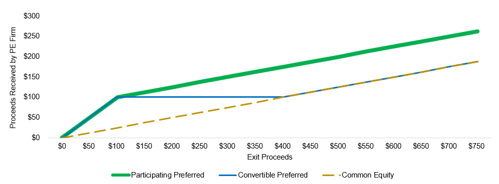

## Table of Contents

## What are Participating Convertible Preferred Shares?

Participating Convertible Preferred Shares are a type of stock that gives investors special rights. These shares can be turned into common stock at a set price, which is called conversion. They also give the investor the right to get their money back before common shareholders if the company is sold or goes out of business. This makes them more attractive to investors because they offer a way to potentially make more money and have less risk.

In addition to the conversion feature, these shares also have a "participation" right. This means that after investors get their initial investment back, they can also share in any extra money left over, along with common shareholders. This double benefit can make these shares very valuable, especially if the company does well. However, it can also make them more complex and sometimes less favorable for the company's founders and other common shareholders.

## How do Participating Convertible Preferred Shares differ from common shares?

Participating Convertible Preferred Shares are different from common shares in several ways. First, they can be turned into common shares at a set price, which is called conversion. This gives investors the choice to change their shares into common stock if they think it will be more valuable. Common shares don't have this option. Second, if the company is sold or goes out of business, people with Participating Convertible Preferred Shares get their money back before those with common shares. This means they have less risk because they are paid first.

Another big difference is that Participating Convertible Preferred Shares have a "participation" right. This means that after these investors get their initial investment back, they can also share in any extra money left over, along with common shareholders. Common shareholders only get what's left after everyone else is paid. This double benefit can make Participating Convertible Preferred Shares more attractive to investors but can also make them more complex and sometimes less favorable for the company's founders and other common shareholders who hold common stock.

## What are the key features of Participating Convertible Preferred Shares?

Participating Convertible Preferred Shares have a few important features that make them special. One key feature is that they can be turned into common shares at a set price. This is called conversion, and it gives investors the choice to change their shares if they think it will be more valuable. Another important feature is that these shares give investors priority if the company is sold or goes out of business. This means they get their money back before people with common shares, which makes the investment less risky.

Another key feature of Participating Convertible Preferred Shares is the "participation" right. This means that after investors get their initial investment back, they can also share in any extra money left over, along with common shareholders. This double benefit can make these shares very attractive to investors because they have the chance to make more money. However, these shares can also be more complex and might not be as good for the company's founders and other common shareholders who don't have these special rights.

## How does the conversion feature work in Participating Convertible Preferred Shares?

The conversion feature in Participating Convertible Preferred Shares lets investors turn their shares into common shares at a set price. This set price is called the conversion price. It's like having a special ticket that you can use whenever you want to swap your preferred shares for common shares. Investors might choose to convert their shares if they think the common shares will be worth more money in the future.

For example, if the conversion price is $10 and the company's common shares are now worth $15 each, it makes sense for the investor to convert. By converting, they can get more common shares than they would have if they kept their preferred shares. This gives investors a chance to make more money if the company does well. But, they need to think carefully about when to convert because it's a one-way ticket – once they convert, they can't change back to preferred shares.

## What is the participation feature in these shares and how does it benefit shareholders?

The participation feature in Participating Convertible Preferred Shares lets investors get more money if the company does well. After they get their initial investment back, they can also share in any extra money left over, just like common shareholders. This is called "participation" because they get to participate in the extra profits.

This feature benefits shareholders by giving them a chance to make more money. If the company is sold or goes out of business and there's money left after everyone gets paid, these shareholders get a second helping. This double benefit makes Participating Convertible Preferred Shares more attractive to investors because they can get their money back first and then share in any extra profits.

## Can you explain the liquidation preference associated with Participating Convertible Preferred Shares?

The liquidation preference in Participating Convertible Preferred Shares means that investors with these shares get their money back before people with common shares if the company is sold or goes out of business. This is a big advantage because it makes their investment less risky. If the company doesn't do well, these investors are more likely to get some of their money back before everyone else.

This preference can be set at different levels, like 1x or 2x the initial investment. A 1x preference means they get back exactly what they put in, while a 2x preference means they get back twice their investment before anyone else gets paid. This feature is important for investors because it protects their money and gives them a better chance of getting something back if things don't go as planned.

## What are the typical scenarios in which a company would issue Participating Convertible Preferred Shares?

A company might issue Participating Convertible Preferred Shares when it needs to raise money from investors but wants to offer something special to make the investment more attractive. These shares are often used by startups or growing companies that are looking for funding. By offering these shares, the company can attract investors who want the safety of getting their money back first if the company is sold or goes out of business, and also the chance to make more money if the company does well.

Another scenario is when a company is going through a round of funding and wants to give investors more reasons to invest. These shares can be a good choice because they offer both a way to convert into common shares if the company's value goes up, and a way to get extra money if the company is sold for a lot more than expected. This makes the investment more appealing and can help the company raise the money it needs to grow or keep going.

## How do Participating Convertible Preferred Shares impact the valuation of a company?

When a company issues Participating Convertible Preferred Shares, it can affect how much the company is worth. These shares give investors special rights, like getting their money back first if the company is sold or goes out of business, and also getting extra money if the company does really well. Because these shares are more attractive to investors, the company might be able to raise money at a higher price than if it just offered common shares. This can make the company's valuation go up because investors are willing to pay more for these special shares.

However, these shares can also make the company's valuation more complicated. The rights given to these shareholders, like getting their money back first and then sharing in extra profits, can make it harder to figure out how much the company is really worth. This is because the value of these shares depends on what might happen in the future, like if the company gets sold or goes out of business. So, while these shares can help raise money and potentially increase the company's valuation, they also add layers of complexity to how that valuation is calculated.

## What are the tax implications for investors holding Participating Convertible Preferred Shares?

When investors hold Participating Convertible Preferred Shares, they need to think about taxes. If they get dividends from these shares, they have to pay taxes on that money. The tax rate depends on whether the dividends are considered "qualified" or "non-qualified." Qualified dividends are usually taxed at a lower rate, while non-qualified dividends are taxed as regular income. Also, if the shares are converted into common shares, there might be tax consequences depending on the difference between the conversion price and the market value of the common shares at the time of conversion.

Another important tax issue is what happens when the company is sold or goes out of business. If investors get their money back first because of the liquidation preference, they might have to pay capital gains tax on that money. The tax rate for capital gains depends on how long they held the shares. If they held them for more than a year, it's a long-term capital gain, which is usually taxed at a lower rate. If they held them for less than a year, it's a short-term capital gain, which is taxed as regular income. The participation feature, where investors get extra money after getting their initial investment back, can also lead to more capital gains tax. So, investors need to think about all these tax issues when they decide to invest in Participating Convertible Preferred Shares.

## How do Participating Convertible Preferred Shares affect the rights of other shareholders?

When a company issues Participating Convertible Preferred Shares, it can change the rights of other shareholders, especially those with common shares. These preferred shareholders get to take their money back first if the company is sold or goes out of business. This means that common shareholders might get less money or nothing at all if there isn't enough left after the preferred shareholders are paid. This can make common shareholders feel like their investment is riskier because they are at the back of the line.

The participation feature of these shares can also affect other shareholders. After getting their money back, preferred shareholders can share in any extra money left over, just like common shareholders. This means that common shareholders might get less of the extra profits than they would have if there were no participating preferred shares. This can make it harder for the company to keep common shareholders happy and might make it more difficult to raise money from them in the future.

## What are the potential risks and downsides for investors in Participating Convertible Preferred Shares?

Investors in Participating Convertible Preferred Shares face some risks and downsides. One risk is that if the company doesn't do well, they might not get much more than their initial investment back. Even though they get paid before common shareholders, if the company goes out of business, there might not be enough money to go around. Another downside is that the conversion feature might not always be a good deal. If the company's value doesn't go up as expected, converting to common shares might not be worth it, and they could end up with shares that are worth less than what they paid for the preferred shares.

Also, these shares can be complex, and it's hard to understand all the rules and how they might affect the investment. The participation feature sounds good because it means extra money if the company does well, but it can also make things more complicated. Investors need to think about taxes too. If they get dividends or convert their shares, they might have to pay more in taxes than they expected. All these things together can make investing in Participating Convertible Preferred Shares a bit riskier and more confusing than other types of investments.

## How have Participating Convertible Preferred Shares been used in recent high-profile startup financings?

Participating Convertible Preferred Shares have been used in many big startup financings recently. For example, when a startup like Airbnb or Uber raises money, they often offer these shares to investors. These shares help the startup get the money they need to grow because they give investors special rights, like getting their money back first if the company is sold or goes out of business. This makes the investment less risky and more attractive to investors who might be willing to pay more for these shares.

In another case, when a company like SpaceX raises money, they might use Participating Convertible Preferred Shares to attract big investors. These investors get the chance to convert their shares into common shares if the company's value goes up a lot. They also get to share in any extra money if the company does really well. This double benefit can make these shares very appealing, even though they can be more complicated and might not be as good for the company's founders and other common shareholders.

## What are Convertible Preferred Shares and how do they work?

Convertible preferred shares represent a unique class of financial instruments, designed to incorporate features from both equity and debt securities. These shares provide investors with stable, fixed dividends, akin to those offered by traditional preferred stocks. However, they stand out due to their convertible nature, allowing holders the option to convert these shares into a predefined number of common shares under specific conditions.

This dual characteristic addresses two primary investor concerns: stability and growth potential. The fixed dividend component appeals to risk-averse investors seeking a steady income stream, as it assures returns regardless of the market's fluctuations. Meanwhile, the conversion feature offers growth-oriented investors an opportunity to benefit from the company's performance. Should the issuing company's stock price rise substantially, shareholders can convert their shares to common stock, potentially realizing capital gains over and above the fixed dividend.

Convertible preferred shares' flexibility serves as a strategic hedge against market [volatility](/wiki/volatility-trading-strategies). By retaining a fixed dividend, investors are partly insulated from potential downturns. Simultaneously, the conversion option allows them to capitalize on upward movements in the company's stock price. This balance of risk and reward can be particularly attractive in uncertain market conditions, making convertible preferred shares a versatile component in diversified investment portfolios.

In mathematical terms, the value of a convertible preferred share can be viewed as the sum of its inherent value as a preferred stock and the value of the option to convert into common shares. This can be expressed as:

$$
V = D \times \frac{1}{(1 + r)^t} + C
$$

where:
- $V$ is the value of the convertible preferred share,
- $D$ is the fixed dividend payment,
- $r$ is the discount rate reflecting the investor's required rate of return,
- $t$ represents the time period,
- $C$ is the value of the conversion option, usually determined based on factors such as the current stock price, conversion ratio, and stock volatility.

The strategic deployment of convertible preferred shares within a portfolio requires a nuanced understanding of these elements. Investors must evaluate the conversion ratio, market conditions, and potential stock price trajectory to maximize their financial rewards. Adaptive trading strategies, possibly leveraging algorithmic techniques, can further optimize the performance of convertible preferred share investments, enhancing portfolio outcomes through judicious timing and execution.

## References & Further Reading

- Tracy V. Maitland, William C. Tyson: "Convertible Securities: A Guide to Investment and Risk Management" provides a comprehensive examination of convertible securities, detailing the benefits and risks associated with these hybrid instruments. The authors offer a deep dive into the strategies investors can use to optimize returns, discussing how convertible securities fit within broader financial portfolios.

- Marcos Lopez de Prado: "Advances in Financial Machine Learning" explores cutting-edge techniques for applying machine learning in finance. This book offers insights into the use of advanced algorithms and data analysis to enhance decision-making in trading and investment strategies, particularly with complex instruments like convertible preferred shares.

- Ernest P. Chan: "Algorithmic Trading: Winning Strategies and Their Rationale" is an invaluable resource for understanding the practical applications of algorithmic trading. Chan outlines various systematic trading strategies, discussing their theoretical foundations and real-world execution. This book is particularly relevant for investors looking to leverage algorithmic techniques to trade preferred shares efficiently and effectively.

