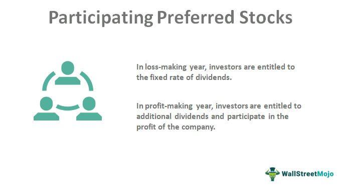

The financial sector offers a diverse array of instruments designed to address varying investment strategies and objectives. Notably, convertible preferred shares and preferred stock stand out as significant opportunities due to their distinctive features. Convertible preferred shares offer the combined benefits of fixed-income securities and equity participation, giving investors a stable dividend income while providing the option to convert into common shares, thus participating in company growth. Preferred stock, on the other hand, prioritizes dividend distributions and claims on assets during liquidation, offering a level of income stability that appeals to risk-averse investors.

The emergence of algorithmic trading has further refined how these instruments are managed and optimized. By leveraging sophisticated algorithms, trading operations now achieve enhanced precision, speed, and efficiency. This technological advancement not only reduces human error but also offers significant advantages in fast-moving financial markets. Consequently, the synergy between convertible preferred shares, participating shares, and algorithmic trading presents investors with strategic advantages.



This article aims to provide a thorough understanding of how these financial tools can be leveraged effectively. By examining the unique nature of convertible preferred shares and their place alongside participating shares within the context of algorithmic trading, investors can make informed decisions to optimize portfolio performance.

## Table of Contents

## Understanding Convertible Preferred Shares

Convertible preferred shares represent a unique class of financial instruments, designed to incorporate features from both equity and debt securities. These shares provide investors with stable, fixed dividends, akin to those offered by traditional preferred stocks. However, they stand out due to their convertible nature, allowing holders the option to convert these shares into a predefined number of common shares under specific conditions.

This dual characteristic addresses two primary investor concerns: stability and growth potential. The fixed dividend component appeals to risk-averse investors seeking a steady income stream, as it assures returns regardless of the market's fluctuations. Meanwhile, the conversion feature offers growth-oriented investors an opportunity to benefit from the company's performance. Should the issuing company's stock price rise substantially, shareholders can convert their shares to common stock, potentially realizing capital gains over and above the fixed dividend.

Convertible preferred shares' flexibility serves as a strategic hedge against market volatility. By retaining a fixed dividend, investors are partly insulated from potential downturns. Simultaneously, the conversion option allows them to capitalize on upward movements in the company's stock price. This balance of risk and reward can be particularly attractive in uncertain market conditions, making convertible preferred shares a versatile component in diversified investment portfolios.

In mathematical terms, the value of a convertible preferred share can be viewed as the sum of its inherent value as a preferred stock and the value of the option to convert into common shares. This can be expressed as:

$$
V = D \times \frac{1}{(1 + r)^t} + C
$$

where:
- $V$ is the value of the convertible preferred share,
- $D$ is the fixed dividend payment,
- $r$ is the discount rate reflecting the investor's required rate of return,
- $t$ represents the time period,
- $C$ is the value of the conversion option, usually determined based on factors such as the current stock price, conversion ratio, and stock volatility.

The strategic deployment of convertible preferred shares within a portfolio requires a nuanced understanding of these elements. Investors must evaluate the conversion ratio, market conditions, and potential stock price trajectory to maximize their financial rewards. Adaptive trading strategies, possibly leveraging algorithmic techniques, can further optimize the performance of convertible preferred share investments, enhancing portfolio outcomes through judicious timing and execution.

## Exploring Preferred and Participating Shares

Preferred shares are a type of equity that provides investors with preferential treatment regarding dividends and claims on assets during the company’s liquidation. This preferential status makes preferred shares a particularly attractive option for investors seeking stable income sources. Unlike common stockholders, preferred shareholders typically receive dividends before any dividends are distributed to common stockholders. These dividends are often fixed, contributing to the predictability and reliability of income streams for investors holding preferred shares.

Participating preferred shares further enhance the attractiveness of preferred shares by offering additional dividends that are contingent upon the company’s performance. After preferred shareholders receive their fixed dividend and common shareholders receive a specified amount, participating preferred shareholders may participate in excess dividends distributed to common shareholders. This feature allows investors to benefit from the company’s profitability beyond the fixed dividend, effectively aligning their interests with the company's overall financial success.

These financial instruments are of particular interest to venture capital investors, especially those involved in early-stage investments. Participating preferred shares provide a protective advantage to these investors, safeguarding their investments while allowing them to benefit from the company’s eventual growth and success. By receiving preferential treatment in both dividends and liquidation scenarios, venture capitalists can mitigate risk while holding equity that can appreciate substantially if the company performs well.

Integrating these investment types into a broader strategy can offer distinct advantages. For instance, investors can balance the desire for stability and income predictability with the potential for growth and enhanced returns. This characteristic enables a diversified approach to portfolio management, catering to various investor needs and market conditions.

## The Impact of Algorithmic Trading on Financial Instruments

Algorithmic trading employs sophisticated algorithms to automate the trading process and manage financial instruments, such as stocks and bonds, with high efficiency. This method utilizes advanced computational techniques to analyze vast datasets, identify trading opportunities, and execute trades at speeds beyond human capability, reducing the potential for human error in a high-pressure environment. In financial markets characterized by [volatility](/wiki/volatility-trading-strategies) and complexity, [algorithmic trading](/wiki/algorithmic-trading) has become a pivotal tool for many investors and institutions.

One of the primary advantages of algorithmic trading is its ability to enhance the precision and speed of transactions. By executing trades based on predefined criteria without emotional bias, this approach ensures that decisions are made swiftly and consistently. This is particularly beneficial in volatile markets where prices can fluctuate significantly within short time frames. Algorithms can react to changes almost instantly, capturing price improvements and minimizing market impact costs. 

The integration of algorithmic trading strategies can significantly improve the financial performance of convertible and preferred shares. Convertible preferred shares, which can be transformed into common shares, often present unique challenges in terms of optimal conversion timing and market positioning. Algorithmic trading can analyze market conditions and predict potential conversion benefits with greater accuracy, thereby optimizing the return on these investments. Similarly, preferred shares can benefit from the precise execution capabilities of algorithmic trading, ensuring that dividends are effectively managed and that the shares are bought or sold at favorable terms.

Furthermore, algorithmic trading reduces human error and the influence of emotional biases in trading decisions. By adhering strictly to mathematical models, and predefined strategies, it allows for clear, data-driven decision-making. This reduces the risk of rash, emotionally charged trades and allows investors to focus on strategic portfolio management.

Overall, algorithmic trading provides a critical advantage to investors dealing with convertible preferred shares and preferred stocks, bringing forth enhanced [liquidity](/wiki/liquidity-risk-premium), reduced transaction costs, and the ability to leverage complex, data-driven strategies that provide an edge in the competitive financial markets.

## Advantages of Algorithmic Trading in Modern Finance

Algorithmic trading has fundamentally reshaped the modern financial landscape by providing substantial advantages that enhance market efficiency and liquidity. By employing complex algorithms capable of processing vast amounts of market data, algorithmic trading can execute trades with remarkable speed and precision. This rapid processing ensures greater market liquidity as algorithms can quickly respond to buy and sell orders, thereby stabilizing prices and reducing volatility.

The execution of trades based on predefined criteria eliminates emotional biases that often influence human traders. Such biases, including fear and greed, can lead to irrational decision-making that distorts market pricing. Algorithms, in contrast, adhere strictly to logical frameworks, ensuring a disciplined execution of strategies that align with the investor’s objectives.

Advanced strategies, such as [arbitrage](/wiki/arbitrage), are particularly well-suited to algorithmic trading. Arbitrage exploits small and temporary discrepancies in the pricing of securities across different markets or platforms. Since these opportunities exist for very short periods, only automated systems can efficiently capture them. Algorithms can simultaneously analyze multiple markets, identify discrepancies, and execute trades within milliseconds, maximizing potential profits from arbitrage opportunities.

Moreover, algorithmic trading supports sophisticated techniques like [statistical arbitrage](/wiki/statistical-arbitrage), which involves identifying statistical patterns in historical data to predict future price movements. This method often utilizes methods from quantitative finance and can be expressed in formulas and mathematical models, enhancing its precision in spotting fleeting market inefficiencies.

In Python, one can implement a simple strategy to analyze arbitrage opportunities using libraries such as `pandas` for data analysis and `numpy` for numerical operations. Here is a basic example of how such an analysis might look:

```python
import pandas as pd
import numpy as np

# Example DataFrame for market prices
market_data = pd.DataFrame({
    'Market_A': [100.5, 101.0, 99.8, 102.2],
    'Market_B': [100.8, 100.9, 99.9, 102.5]
})

# Calculating the price difference
price_diff = market_data['Market_A'] - market_data['Market_B']

# Arbitrage opportunities where price difference is significant
arbitrage_opportunities = price_diff[abs(price_diff) > 0.5]

print("Arbitrage Opportunities:\n", arbitrage_opportunities)
```

This example, though simplified, demonstrates the foundation of creating automated trading strategies to identify arbitrage opportunities across different markets using real-time data.

By ensuring efficient trade execution, maintaining liquidity, and applying advanced strategies like arbitrage, algorithmic trading significantly enhances the performance of financial markets. As technology continues to advance, so too will the capabilities and influence of algorithmic trading within the global financial system.

## Practical Implications for Investors

Investors considering convertible preferred shares and preferred stock should carefully assess their risk appetite and investment goals. These instruments, characterized by their hybrid nature, offer potential benefits such as fixed dividends and conversion opportunities, but they also come with unique risks and considerations. The integration of algorithmic trading can significantly aid in optimizing these investments by providing tools for analyzing real-time market conditions and executing trades with high efficiency.

Algorithmic trading, driven by advanced software and quantitative models, enables investors to process vast amounts of market data swiftly, facilitating better decision-making. This technological advancement minimizes latency in trade execution and reduces potential human errors, which is particularly advantageous during times of market volatility. Investors can leverage algorithms to implement strategies that seek to capitalize on market inefficiencies, ensuring that trades align closely with their risk and return preferences.

When investing in convertible preferred shares and preferred stock, investors must also consider tax implications. Different jurisdictions have varying tax treatments for dividends and capital gains arising from converting shares into common stock. Understanding these nuances can significantly impact the net returns from such investments. Furthermore, diversification remains a fundamental principle in portfolio management. Including convertible and preferred shares within a broader investment strategy can provide a balance between income stability and growth potential, thereby enhancing overall portfolio resilience.

Technological advancements in algorithmic trading have propelled the accessibility of sophisticated trading strategies to a broader range of investors. High-frequency trading and [machine learning](/wiki/machine-learning) are at the forefront, allowing for adaptive strategies that adjust to changing market conditions. As technology continues to evolve, investors should remain informed about how these innovations can be integrated into their investment processes to optimize performance.

In summary, the integration of algorithmic trading and a comprehensive understanding of convertible preferred shares and preferred stock can provide investors with a strategic edge. This approach requires a thorough consideration of individual risk profiles, tax implications, diversification benefits, and the latest advancements in algorithmic trading strategies. By aligning these factors with their financial objectives, investors can enhance their portfolio's potential for income and growth.

## Conclusion

Convertible preferred shares and preferred stock are versatile financial tools that provide both stability and growth potential. These instruments offer fixed dividends similar to bonds while granting the holder an upside potential through conversion to common stock, thus serving dual purposes in a portfolio. The conversion feature allows investors to benefit from stock price appreciation, providing a hedge against market volatility. This structural characteristic makes convertible preferred shares especially appealing for investors looking to balance conservative and aggressive strategies.

Algorithmic trading has revolutionized these investments by enhancing precision, efficiency, and execution speed in financial markets. Algorithms can swiftly analyze vast datasets to inform trading decisions, reducing the emotional biases and errors prevalent in manual trading. Through predefined criteria, algorithmic systems can execute trades in milliseconds, optimizing price points and capitalizing on fleeting market opportunities.

For investors, understanding convertible preferred shares and integrating algorithmic trading techniques is crucial for optimizing portfolio performance. By leveraging algorithmic trading, investors can access advanced strategies such as arbitrage, which identifies and exploits small price discrepancies between securities. This sophistication allows for improved risk management and superior returns over the long term.

Overall, the marriage of these hybrid financial instruments with algorithmic trading provides a robust framework for enhancing portfolio resilience and achieving sustainable growth. Investors, by adopting these modern tools and strategies, are well-positioned to navigate the complexities of contemporary financial markets effectively.

## References & Further Reading

- Tracy V. Maitland, William C. Tyson: "Convertible Securities: A Guide to Investment and Risk Management" provides a comprehensive examination of convertible securities, detailing the benefits and risks associated with these hybrid instruments. The authors offer a deep dive into the strategies investors can use to optimize returns, discussing how convertible securities fit within broader financial portfolios.

- Marcos Lopez de Prado: "Advances in Financial Machine Learning" explores cutting-edge techniques for applying machine learning in finance. This book offers insights into the use of advanced algorithms and data analysis to enhance decision-making in trading and investment strategies, particularly with complex instruments like convertible preferred shares.

- Ernest P. Chan: "Algorithmic Trading: Winning Strategies and Their Rationale" is an invaluable resource for understanding the practical applications of algorithmic trading. Chan outlines various systematic trading strategies, discussing their theoretical foundations and real-world execution. This book is particularly relevant for investors looking to leverage algorithmic techniques to trade preferred shares efficiently and effectively.

