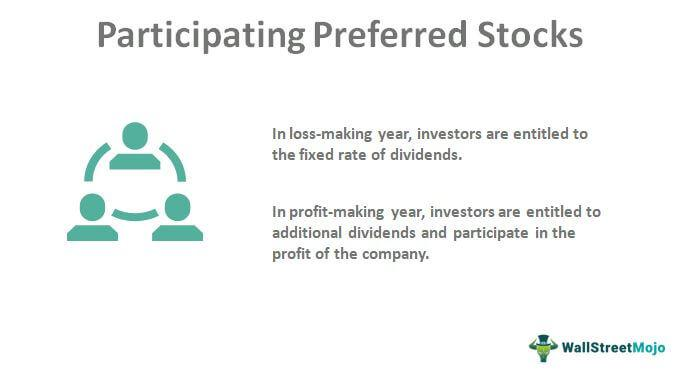

In the world of investing, understanding the different types of stocks is crucial for making informed decisions. Among the various classes of stocks, preferred shares stand out for their distinctive features and advantages over common stock. Preferred shares represent a class of ownership in a corporation, characterized by a higher claim on assets and earnings. These shares typically offer fixed dividends and lack voting rights, providing more stability in returns compared to common shares.

Participating preferred shares are a specialized form of preferred stock, offering investors both fixed dividends and the potential for additional dividends based on the company's performance. This combination provides an appealing investment opportunity, particularly in firms experiencing growth. The ability to participate in the excess profits or upon liquidation makes these shares attractive to investors seeking both fixed income and equity-like upside potential.



This article explores the intricacies of participating preferred shares, illustrating their application through real-world examples and examining their role in the evolving landscape of algorithmic trading. Understanding these elements equips investors with valuable insights to navigate complex investment decisions, balancing traditional approaches with technological advancements in the financial markets.

## Table of Contents

## Understanding Preferred Shares

Preferred shares represent a type of equity in a corporation, distinguished by their preferential treatment in terms of dividends and claims on assets. Unlike common shares, which may offer variable dividends based on the company’s earnings, preferred shares generally provide fixed dividends. This characteristic offers a predictable income stream for investors, a key reason they are often considered a hybrid between bonds and equities.

### Characteristics of Preferred Shares

#### Fixed Dividends

Preferred shareholders are entitled to receive dividends before any dividends are distributed to common shareholders. These dividends are usually expressed as a fixed percentage of the par value of the shares. For example, if a company issues preferred shares with a par value of $100 and a dividend rate of 5%, each share would yield a dividend of $5 annually.

#### Priority in Asset Distribution

In the event of liquidation, preferred shareholders have a higher claim on the company’s assets than common shareholders. However, they are subordinate to bondholders and other debt instruments. This preferential treatment in asset distribution provides an added layer of security for preferred shareholders.

#### Non-Voting Rights

Typically, preferred shares do not [carry](/wiki/carry-trading) voting rights. This means holders of preferred shares do not have a say in corporate governance matters, such as electing the board of directors. Nevertheless, some preferred shares may be convertible into a specified number of common shares, at the discretion of the shareholder, if certain conditions are met.

### Advantages of Preferred Shares

1. **Stable Income**: The fixed dividend feature provides a more stable and predictable income compared to common shares, which may fluctuate with the company’s performance.

2. **Priority Over Common Shares**: In bankruptcy situations, the higher claim on assets and earnings makes preferred shares less risky than common shares.

3. **Convertibility**: Some preferred shares offer the option to convert into common shares, allowing investors to benefit from potential capital appreciation.

### Limitations of Preferred Shares

1. **Limited Capital Gain Potential**: Due to the fixed nature of dividends, preferred shares typically offer limited potential for capital gains compared to common shares which can appreciate more significantly.

2. **Interest Rate Sensitivity**: Preferred shares react negatively to interest rate increases. As rates rise, the fixed dividends become less attractive, potentially lowering the market value of the shares.

3. **Lack of Voting Rights**: The absence of voting rights means preferred shareholders do not influence corporate policy or decision-making processes.

In summary, while preferred shares offer numerous benefits such as fixed dividends and asset priority, they come with limitations related to capital gain potential and lack of voting rights. Understanding these characteristics is crucial for investors looking to balance the advantages of stable income and security against the limitations of growth potential and corporate influence.

## What Are Participating Preferred Shares?

Participating preferred shares are a specific type of preferred stock that combines the benefits of fixed dividends with the potential for additional income. Unlike traditional preferred shares that only pay a fixed dividend, participating preferred shares allow investors to benefit further when a company experiences strong financial performance. This additional benefit arises from the capacity of these shares to earn extra dividends, contingent on certain corporate profitability milestones.

The primary characteristic of participating preferred shares is their dual dividend structure. Investors receive a predetermined dividend, akin to conventional preferred shares. However, in profitable years, these shareholders are entitled to an extra dividend that is usually linked to the dividends paid to common shareholders. For example, if a company declares a dividend for its common stockholders, participating preferred shareholders may receive a bonus dividend, calculated as a percentage of that common dividend.

A defining aspect of participating preferred shares is the liquidation preference. This specifies the order of payment during liquidation events. Holders of participating preferred shares have a preferential claim over common shareholders. In certain cases, they are entitled to retrieve the initial investment plus any unpaid fixed dividends before any residual assets are distributed. Moreover, these shareholders may receive an additional share in the proceeds, which aligns with the terms that mimic participation in common stockholder scenarios.

Participating preferred shares can be particularly advantageous in several scenarios:

1. **Rising Profitability**: During periods of increased company profits, participating preferred shares provide enhanced returns compared to non-participating preferred shares, making them attractive to investors seeking both stability and upside potential.

2. **Exit Events**: In the event of mergers, acquisitions, or company sales, participating preferred shareholders may benefit from not only their liquidation preferences but also a share in the excess proceeds distributed similarly to common shareholders.

3. **Risk Mitigation**: For investors looking to hedge against the volatility of common stocks while still having some equity upside, participating preferred shares present an appealing option. These shares offer the security of fixed-income returns with the potential for additional gains tied to the company’s success.

Overall, participating preferred shares represent a strategic financial instrument, providing investors a balance of fixed income and equity-like growth potential. This structure not only ensures a primary return via fixed dividends but also augments shareholder value through profit-sharing mechanisms, aligning shareholder interests more closely with company performance.

## Examples of Participating Preferred Shares

Participating preferred shares are a specialized class of equity securities that offer investors both a guaranteed fixed dividend and the potential for additional dividend earnings, contingent upon the performance of a company. This dual benefit structure makes them an attractive option for investors seeking both stability and potential growth.

### Dividend Calculations

The unique advantage of participating preferred shares lies in their dividend structure. In addition to receiving a fixed dividend, these shareholders may participate in excess profits. For example, suppose a company declares a common dividend that exceeds the fixed preferred dividend. In this scenario, participating preferred shareholders could receive additional dividends calculated as follows:

$$
\text{Extra Dividend} = (\text{Total Profit} - \text{Fixed Dividends}) \times \text{Participation Rate}
$$

Here, the participation rate is predetermined, typically specified in the investment terms. This structure aligns shareholder incentives with company performance, providing both stability and upside potential.

### Liquidation Outcomes

In a liquidation event, participating preferred shareholders typically have a superior claim on assets over common shareholders. They are first entitled to the return of their initial investment and any accrued but unpaid dividends. After satisfying these claims, they may also share in any remaining assets, similar to common shareholders. This dual recovery option enhances the perceived safety of these shares, particularly in riskier ventures.

### Case Studies

Several companies have issued participating preferred shares to fundraise effectively while aligning investor incentives with management goals. 

1. **Tech Startup Scenario**: Consider a technology startup that has issued participating preferred shares during its series B fundraising round. The terms stipulate a 7% fixed annual dividend and a 20% participation in any profits declared above this dividend. If the company exceeds financial expectations in a given year, the participating preferred shareholders benefit from the vibrant market conditions, receiving dividends beyond the fixed rate.

2. **Real Estate Investment Trust (REIT) Example**: A REIT may offer participating preferred shares as a means to attract capital for developing new projects. These shares might offer a fixed dividend of 5%, with additional participation rights linked to property appreciation or gains from sales. This structure is particularly appealing to investors who wish to benefit from the real estate market's upside while maintaining a stable income base.

In both examples, participating preferred shares serve as a viable fundraising strategy, allowing the issuing company to incentivize performance while providing investors with a robust investment vehicle. The blend of fixed returns and performance-based earnings makes these shares a strategic choice for diverse investment portfolios. 

Understanding these dynamics is crucial for investors evaluating participating preferred shares, aiding them in making informed decisions that align with their risk tolerance and investment goals.

## Participating Preferred Shares vs Non-Participating

Preferred shares are a significant component of corporate financing and investing, offering unique benefits and characteristics distinct from common shares. Within preferred shares, two principal types exist: participating and non-participating preferred shares. Understanding the nuances between these can significantly impact an investor’s decision-making process. 

**Participating Preferred Shares** provide shareholders with the standard fixed dividend expected of preferred shares plus the opportunity to receive additional dividends. These additional dividends are typically contingent on the performance of the company, making these shares appealing in profitable years. Moreover, in the event of a company's liquidation, participating preferred shareholders may receive their original investment back plus a share of any remaining proceeds distributed among common shareholders. This dual benefit can significantly enhance investor returns during profitable periods and protect capital during liquidation events. However, participating preferred shares often come with lower fixed dividend rates compared to non-participating preferred shares, balancing the potential for higher overall returns with a base level of guaranteed income.

In contrast, **Non-Participating Preferred Shares** offer only their fixed dividend, without the potential for additional dividends or increased payouts during surplus profit distributions. In liquidation scenarios, non-participating preferred shareholders have a claim on assets only up to the par value of their shares, usually without participating in the division of residual assets. The primary advantage of non-participating preferred shares lies in their predictability and typically higher fixed dividend yield, which can be attractive for investors prioritizing stable income over potential upside.

**Comparison**

- **Dividend Rights**: 
  - Participating preferred shares may receive both fixed and additional dividends, depending on company profits.
  - Non-participating preferred shares are limited to fixed dividends, providing stability but no upside potential.

- **Investor Returns**:
  - Participating shares can yield higher returns during profitable periods but may offer lower fixed dividends.
  - Non-participating shares generally ensure steady returns through higher base dividends, suitable for risk-averse investors.

Choosing between participating and non-participating preferred shares depends largely on an investor's risk tolerance and income requirements. Risk-seeking investors, who anticipate company growth and wish to share in its profits, might find participating shares compelling. Conversely, those seeking stable and predictable income streams might prefer non-participating shares due to their reliable dividend payouts. Ultimately, investors need to assess their financial goals and the specific terms offered by each type of share before making a decision.

## Algorithmic Trading of Preferred Shares

Algorithmic trading has significantly transformed the landscape of trading in financial markets, including the trading of preferred shares. These algorithms serve as automated strategies that employ mathematical models and complex computations to execute trades at high speeds and volumes, capitalizing on even minute price differences. Algorithms can process vast amounts of data faster than a human trader, making them well-suited for executing trades in the highly competitive market of preferred shares.

### Role of Technology in Trading Preferred Shares

Algorithmic trading employs various strategies, such as statistical [arbitrage](/wiki/arbitrage), [momentum](/wiki/momentum) trading, and [market making](/wiki/market-making), to optimize the buying and selling processes. Preferred shares, which often trade less frequently compared to common stocks, can benefit from these algorithms by creating more [liquidity](/wiki/liquidity-risk-premium) in the market. Algorithms can be designed to predict price movements based on historical data, news, and other market factors, thus providing better pricing strategies for preferred shares.

For example, a simple momentum trading algorithm for preferred shares could be coded in Python as follows:

```python
import pandas as pd

def momentum_trading(data, window=3):
    data['returns'] = data['Close'].pct_change()
    data['signal'] = 0
    data['signal'][window:] = data['returns'][window:].apply(lambda x: 1 if x > 0 else -1)

    # Execute trades
    data['positions'] = data['signal'].shift()
    return data

# Sample DataFrame `prices` would have a 'Close' column
momentum_trades = momentum_trading(prices)
```

### Pros and Cons of Algorithmic Trading

**Advantages:**

1. **Speed and Efficiency:** Algorithms execute trades more quickly and efficiently than human counterparts, handling large volumes of data and transactions without error.

2. **Reduced Transaction Costs:** Automated trades minimize manual intervention, thereby reducing the costs associated with trading desk operations.

3. **Increased Market Liquidity:** By rapidly buying and selling preferred shares, algorithms add liquidity to the market, which can lead to tighter spreads and more competitive pricing.

**Disadvantages:**

1. **Market Volatility:** The rapid execution of large orders can contribute to excessive market volatility, particularly if multiple algorithms react to the same signal.

2. **Systemic Risks:** An error in an algorithm could lead to significant trading disruptions, impacting not only the targeted securities but also the broader market.

3. **Regulatory Challenges:** Algorithmic trading is subject to stringent regulations to prevent market manipulation, requiring constant monitoring and compliance.

### Impact on Market Dynamics

Algorithmic trading can enhance market efficiency for preferred shares but also carries risks of exacerbating market fluctuations. By automating trading decisions, algorithms can sometimes lead to flash crashes or sudden spikes in prices, impacting other market participants.

In conclusion, while [algorithmic trading](/wiki/algorithmic-trading) offers several benefits for trading preferred shares, including improved liquidity and reduced transaction costs, it also presents challenges such as increased market [volatility](/wiki/volatility-trading-strategies) and regulatory scrutiny. Investors and traders should weigh these factors when incorporating algorithmic strategies into their portfolios.

## Conclusion

Participating preferred shares serve as a versatile tool within the modern investing landscape, offering a blend of fixed dividends and potential additional payouts based on a company's performance. Their unique structure can meet a range of investment objectives. By providing both stability through guaranteed returns and upside potential through profit-sharing, participating preferred shares appeal to investors seeking a combination of income and growth.

Understanding the distinctions between preferred shares, specifically the participating and non-participating types, is crucial for making well-informed investment choices. Each variant comes with its benefits and limitations, impacting factors such as dividend rights and liquidation preferences. Investors interested in maximizing returns while managing risk must be well-versed in the specifics of each option and align them with their financial goals.

The role of technology, particularly algorithmic trading, further complicates and enriches the trading of preferred shares. Algorithms can identify trading opportunities with precision, but they also introduce complexities related to market dynamics and volatility. As technology continues to influence financial markets, investors must weigh these factors when considering the inclusion of preferred shares in their portfolios.

In conclusion, acquiring a comprehensive understanding of participating preferred shares involves considering both their traditional attributes and the modern technological context in which they are traded. This informed approach will enable investors to leverage the full potential of these securities, balancing traditional investment strategies with technological advancements to optimize portfolio performance.

## References & Further Reading

[1]: Knight, R. (2019). ["Preferred Stock: Everything You Need to Know."](https://www.upcounsel.com/convertible-preferred-stock) Investopedia. 

[2]: Tuckwell, N. (2021). ["Participating Preferred Stock."](https://www.investopedia.com/terms/p/participatingpreferredstock.asp) Corporate Finance Institute.

[3]: "Algorithmic Trading in practice" by Irene Aldridge and Marco Avellaneda, published by Wiley Finance.

[4]: Fabozzi, F.J. & Drake, P.P. (2009). ["The Mathematics of Financial Modeling and Investment Management."](https://books.google.com/books/about/Finance.html?id=mUBsAwAAQBAJ) Wiley.

[5]: ["Quantitative Momentum: A Practitioner's Guide to Building a Momentum-Based Stock Selection System"](https://www.amazon.com/Quantitative-Momentum-Practitioners-Momentum-Based-Selection/dp/111923719X) by Wesley R. Gray and Jack R. Vogel.