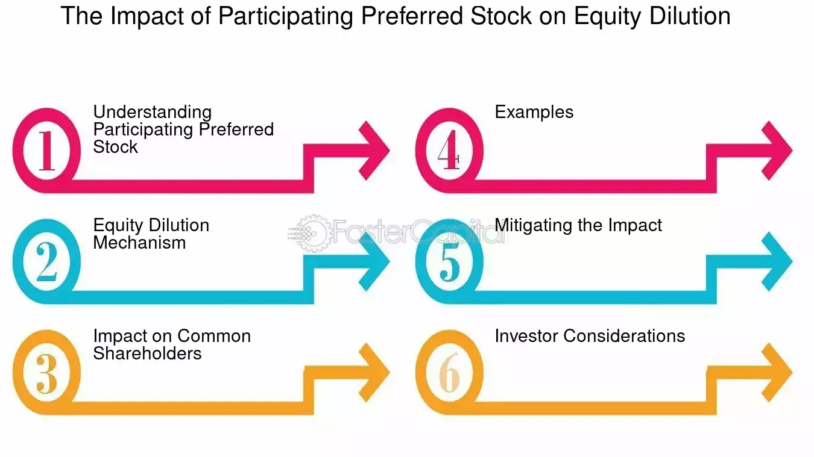

## Table of Contents

## What is participating preferred stock?

Participating preferred stock is a type of stock that gives its owners a special advantage. When a company is sold or goes out of business, people who own participating preferred stock get their money back first. They get a fixed amount of money before anyone else, including common stockholders. This fixed amount is usually the price they paid for the stock plus any promised dividends.

After getting their initial investment back, participating preferred stockholders also get to share in any extra money left over, just like common stockholders. This means they can get more money than what they originally put in. This is different from non-participating preferred stock, where owners only get their fixed amount and do not share in any extra profits. Participating preferred stock can be very attractive to investors because it offers both safety and the chance to earn more money.

## How does participating preferred stock differ from non-participating preferred stock?

Participating preferred stock and non-participating preferred stock are both types of preferred stock, but they work differently when a company is sold or goes out of business. With participating preferred stock, owners get their money back first, just like with non-participating preferred stock. They get a fixed amount, which is usually what they paid for the stock plus any promised dividends. But after getting their initial investment back, participating preferred stockholders also get to share in any extra money left over, just like common stockholders.

On the other hand, owners of non-participating preferred stock only get their fixed amount and do not share in any extra profits. This means that once they get their initial investment back, they don't get any more money, even if there is some left over. So, participating preferred stock can be more attractive to investors because it offers both safety and the chance to earn more money, while non-participating preferred stock provides safety but no additional upside potential.

## What are the key features of participating preferred stock?

Participating preferred stock is a type of stock that gives its owners a special advantage. When a company is sold or goes out of business, people who own this stock get their money back first. They get a fixed amount of money before anyone else, including common stockholders. This fixed amount is usually the price they paid for the stock plus any promised dividends.

After getting their initial investment back, participating preferred stockholders also get to share in any extra money left over, just like common stockholders. This means they can get more money than what they originally put in. This feature makes participating preferred stock very attractive to investors because it offers both safety and the chance to earn more money.

## How does the participation mechanism work in participating preferred stock?

When a company that has participating preferred stock gets sold or goes out of business, the owners of this stock get their money back first. They get a fixed amount, which is usually what they paid for the stock plus any dividends they were promised. This is like getting a safety net because they know they will get their initial investment back before anyone else, including common stockholders.

After they get their initial investment back, participating preferred stockholders also get to share in any extra money that's left over. This is different from regular preferred stock because they don't just stop at getting their fixed amount. They get to take part in the extra profits, just like common stockholders. This means they can make more money than what they originally put in, which makes participating preferred stock a good choice for investors who want both safety and the chance to earn more.

## What are the typical scenarios where participating preferred stock is used?

Participating preferred stock is often used in startup companies when they are looking for investors. Startups are risky, so investors want to protect their money. Participating preferred stock helps them do that because it gives them their money back first if the company is sold or goes out of business. It also lets them share in any extra profits, which can be a big draw for investors who want to take a chance on a new company but still want some safety.

Another scenario where participating preferred stock is used is in venture capital deals. Venture capitalists invest in companies that they think will grow a lot. They use participating preferred stock to get a good return on their investment. If the company does well and gets sold, they get their money back first and then get to share in the extra profits. This makes the investment less risky and more appealing to venture capitalists.

## Can you explain the liquidation preference in the context of participating preferred stock?

Liquidation preference is a key feature of participating preferred stock. It means that when a company is sold or goes out of business, the owners of participating preferred stock get their money back before anyone else. This money is a fixed amount, usually what they paid for the stock plus any dividends they were promised. This is like a safety net because it makes sure they get their initial investment back first, before common stockholders get anything.

After getting their initial investment back, participating preferred stockholders also get to share in any extra money that's left over. This is different from regular preferred stock because they don't just stop at getting their fixed amount. They get to take part in the extra profits, just like common stockholders. This means they can make more money than what they originally put in, which makes participating preferred stock a good choice for investors who want both safety and the chance to earn more.

## How does participating preferred stock affect the returns of common stockholders?

Participating preferred stock can lower the returns for common stockholders. When a company is sold or goes out of business, the owners of participating preferred stock get their money back first. This means they get a fixed amount before common stockholders get anything. This fixed amount is usually what they paid for the stock plus any dividends they were promised. Because the participating preferred stockholders get paid first, there might be less money left over for common stockholders.

After getting their initial investment back, participating preferred stockholders also get to share in any extra money that's left over. This means they get to take part in the profits, just like common stockholders. So, not only do they get their money back first, but they also get a piece of the extra profits. This can leave even less money for common stockholders, making their returns smaller than they would be if there were no participating preferred stock.

## What are the advantages of issuing participating preferred stock for a company?

Issuing participating preferred stock can help a company attract investors, especially when it's a startup or a company looking for venture capital. Investors like participating preferred stock because it gives them a safety net. If the company is sold or goes out of business, they get their money back before anyone else. This makes the investment less risky, which can be a big draw for people who want to invest in a new or growing company but are worried about losing their money.

Another advantage for the company is that participating preferred stock can also make the investment more appealing by offering investors the chance to earn more money. After getting their initial investment back, investors can share in any extra profits, just like common stockholders. This can make the stock more attractive and help the company raise the money it needs to grow and succeed.

## What are the potential drawbacks for investors in participating preferred stock?

One potential drawback for investors in participating preferred stock is that it might be hard to find buyers for the stock if they want to sell it. Not everyone wants to buy this kind of stock because it can be complicated and not everyone understands it. This means that if an investor wants to sell their participating preferred stock, they might have to wait a long time or accept a lower price than they hoped for.

Another issue is that participating preferred stock can sometimes have a lower dividend than other types of preferred stock. Investors might get less money in dividends because the company is using the money to grow instead of paying it out. This can be a problem for investors who are looking for a steady income from their investments.

## How is participating preferred stock valued, and what factors influence its valuation?

Participating preferred stock is valued by looking at how much money it might make for the investor. This includes the fixed amount they get back first, which is usually what they paid for the stock plus any dividends they were promised. It also includes any extra money they might get if the company does well and gets sold. To figure out the value, investors look at how likely it is that the company will be sold and how much money might be left over after everyone gets their initial investment back.

Several things can affect the value of participating preferred stock. One big thing is how well the company is doing. If the company is growing and making more money, the stock might be worth more because there's a better chance of getting a big payout when the company is sold. Another thing is how much risk there is. If the company is very risky, the stock might be worth less because there's a bigger chance that the company won't do well and the investor won't get much money back. Also, the overall market and how much people want to buy this kind of stock can change its value. If a lot of people want to buy it, the price might go up, but if not many people want it, the price might go down.

## Can you provide a case study or real-world example of a company using participating preferred stock?

When Uber was just starting out, it used participating preferred stock to attract investors. Uber was a new company and it needed money to grow. Investors were worried about losing their money because starting a new company is risky. So, Uber offered them participating preferred stock. This meant that if Uber did well and got sold, the investors would get their money back first. They would get what they paid for the stock plus any dividends they were promised. After that, they would also get to share in any extra money left over, just like common stockholders. This made the investment less risky and more appealing, so Uber was able to raise the money it needed.

One of the investors in Uber's early days was a venture capital firm called Benchmark. They invested in Uber when it was still a small company. They got participating preferred stock, which meant they were first in line to get their money back if Uber got sold. When Uber did get sold to a bigger company, Benchmark got their money back first. They got what they paid for the stock plus any dividends. After that, they also got to share in the extra profits, which made their investment very successful. This shows how participating preferred stock can help both the company and the investors.

## What are the legal and regulatory considerations when issuing participating preferred stock?

When a company wants to issue participating preferred stock, it has to follow certain legal and regulatory rules. These rules can be different depending on where the company is and what kind of company it is. For example, in the United States, the Securities and Exchange Commission (SEC) has rules that companies need to follow when they issue new stock. The company has to make sure it follows these rules and also any rules from the state where it is based. This might include things like filing paperwork, giving information to investors, and making sure the stock is offered fairly.

Another thing to think about is the company's own rules, like its articles of incorporation and bylaws. These documents might say what kind of stock the company can issue and how it can do it. The company has to make sure that issuing participating preferred stock fits with these rules. If it doesn't, the company might need to change its rules first. Also, the company should think about how issuing this kind of stock might affect things like taxes and the rights of other stockholders. It's a good idea for the company to talk to lawyers and other experts to make sure everything is done right.

## What are examples of participating preferred shares?

Participating preferred shares are a specialized class of equity securities that offer investors both a guaranteed fixed dividend and the potential for additional dividend earnings, contingent upon the performance of a company. This dual benefit structure makes them an attractive option for investors seeking both stability and potential growth.

### Dividend Calculations

The unique advantage of participating preferred shares lies in their dividend structure. In addition to receiving a fixed dividend, these shareholders may participate in excess profits. For example, suppose a company declares a common dividend that exceeds the fixed preferred dividend. In this scenario, participating preferred shareholders could receive additional dividends calculated as follows:

$$
\text{Extra Dividend} = (\text{Total Profit} - \text{Fixed Dividends}) \times \text{Participation Rate}
$$

Here, the participation rate is predetermined, typically specified in the investment terms. This structure aligns shareholder incentives with company performance, providing both stability and upside potential.

### Liquidation Outcomes

In a liquidation event, participating preferred shareholders typically have a superior claim on assets over common shareholders. They are first entitled to the return of their initial investment and any accrued but unpaid dividends. After satisfying these claims, they may also share in any remaining assets, similar to common shareholders. This dual recovery option enhances the perceived safety of these shares, particularly in riskier ventures.

### Case Studies

Several companies have issued participating preferred shares to fundraise effectively while aligning investor incentives with management goals. 

1. **Tech Startup Scenario**: Consider a technology startup that has issued participating preferred shares during its series B fundraising round. The terms stipulate a 7% fixed annual dividend and a 20% participation in any profits declared above this dividend. If the company exceeds financial expectations in a given year, the participating preferred shareholders benefit from the vibrant market conditions, receiving dividends beyond the fixed rate.

2. **Real Estate Investment Trust (REIT) Example**: A REIT may offer participating preferred shares as a means to attract capital for developing new projects. These shares might offer a fixed dividend of 5%, with additional participation rights linked to property appreciation or gains from sales. This structure is particularly appealing to investors who wish to benefit from the real estate market's upside while maintaining a stable income base.

In both examples, participating preferred shares serve as a viable fundraising strategy, allowing the issuing company to incentivize performance while providing investors with a robust investment vehicle. The blend of fixed returns and performance-based earnings makes these shares a strategic choice for diverse investment portfolios. 

Understanding these dynamics is crucial for investors evaluating participating preferred shares, aiding them in making informed decisions that align with their risk tolerance and investment goals.

## References & Further Reading

[1]: Knight, R. (2019). ["Preferred Stock: Everything You Need to Know."](https://www.upcounsel.com/convertible-preferred-stock) Investopedia. 

[2]: Tuckwell, N. (2021). ["Participating Preferred Stock."](https://www.investopedia.com/terms/p/participatingpreferredstock.asp) Corporate Finance Institute.

[3]: "Algorithmic Trading in practice" by Irene Aldridge and Marco Avellaneda, published by Wiley Finance.

[4]: Fabozzi, F.J. & Drake, P.P. (2009). ["The Mathematics of Financial Modeling and Investment Management."](https://books.google.com/books/about/Finance.html?id=mUBsAwAAQBAJ) Wiley.

[5]: ["Quantitative Momentum: A Practitioner's Guide to Building a Momentum-Based Stock Selection System"](https://www.amazon.com/Quantitative-Momentum-Practitioners-Momentum-Based-Selection/dp/111923719X) by Wesley R. Gray and Jack R. Vogel.