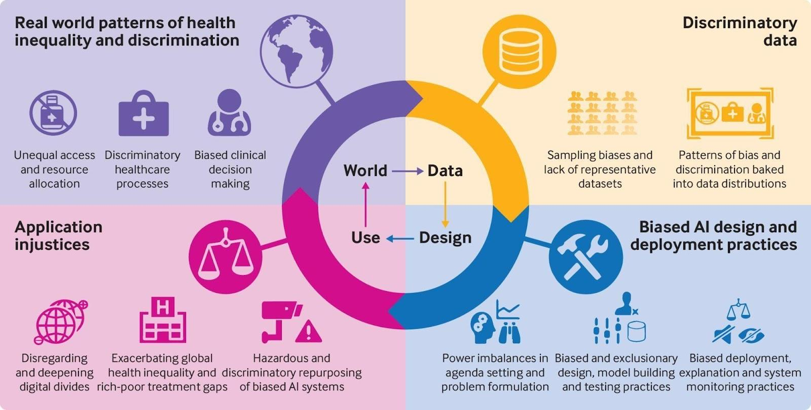

## Table of Contents

## What is participation bias in the context of machine learning?

Participation bias in machine learning happens when certain groups of people are more likely to take part in a study or provide data than others. This can make the data collected not truly represent everyone it should. For example, if a survey about smartphone usage is only done online, people without internet access won't be included. This means the results might only show the habits of people who use the internet, not everyone who uses smartphones.

This kind of bias can lead to problems in machine learning models. If a model is trained on data that doesn't include all types of people, it might not work well for everyone. For instance, a health app that predicts diseases might not work as well for groups that were not well-represented in the training data. To reduce participation bias, researchers need to make sure their data collection methods reach all kinds of people, not just those who are easy to include.

## How does participation bias affect the outcomes of machine learning models?

Participation bias can make machine learning models less accurate and fair. When the data used to train a model doesn't include everyone it should, the model might only learn about certain groups of people. For example, if a model is trained to predict job performance but only uses data from people who work in offices, it might not work well for people who work outside or in factories. This can lead to wrong predictions for those groups, making the model less useful for everyone.

To fix this problem, it's important to collect data from a wide range of people. If a model is supposed to help everyone, the data it's trained on should include everyone too. For instance, if a health app is meant for all ages, the data should come from young people, old people, and everyone in between. By making sure the data is more representative, we can build models that work better for all kinds of people, not just a few.

## What are common sources of participation bias in data collection?

Participation bias often comes from how data is collected. For example, if a survey is only done online, people without internet access won't be able to take part. This means the data will only show the views of people who use the internet, not everyone. Another common source is when people choose to take part in a study. Some people might be more interested or have more time, so they are more likely to join in. This can make the data lean towards the views of those who are more eager to participate.

Another source of participation bias is when the way data is collected makes some people feel left out. For example, if a health study is only done in big cities, people in rural areas won't be included. This can make the data miss important information about people who live differently. Also, if the language used in a survey is hard to understand, people who are not fluent in that language might not take part. This can make the data less useful for everyone.

To reduce participation bias, it's important to think about who might be left out and try to include them. This might mean using different ways to collect data, like phone calls or in-person visits, to reach more people. It also helps to make surveys and studies easy to understand and welcoming to everyone, so more people feel comfortable taking part.

## Can you provide examples of participation bias in real-world machine learning applications?

One example of participation bias in real-world [machine learning](/wiki/machine-learning) applications is in the development of facial recognition technology. Many of these systems are trained on datasets that predominantly feature images of lighter-skinned individuals, often collected from sources like social media or public databases that may not represent the full diversity of the global population. As a result, these models perform much better on recognizing faces of lighter-skinned individuals than those with darker skin tones. This bias can lead to higher error rates and misidentifications for people of color, which can have serious consequences in applications like security and law enforcement.

Another example can be seen in healthcare applications, such as predictive models for disease risk. If these models are trained on data primarily from urban hospitals, they might not accurately predict health outcomes for people living in rural areas, where healthcare access and lifestyle factors can be very different. For instance, a model predicting diabetes risk might be less accurate for rural populations if it's based on data from urban patients who have different dietary habits and access to healthcare services. This can lead to misdiagnosis or delayed treatment for those not well-represented in the training data, highlighting the importance of including diverse data sources to improve model accuracy and fairness.

## How can participation bias lead to unfair or biased predictions?

Participation bias can make machine learning models unfair because they learn from data that doesn't include everyone. If a model is trained on data from just a few types of people, it might not work well for others. For example, if a model predicts how well someone will do at a job but only uses data from people who work in offices, it might not be fair to people who work outside or in factories. This can lead to wrong predictions for those groups, making the model less useful and fair for everyone.

To fix this problem, it's important to collect data from a wide range of people. If a model is supposed to help everyone, the data it's trained on should include everyone too. For instance, if a health app is meant for all ages, the data should come from young people, old people, and everyone in between. By making sure the data is more representative, we can build models that work better for all kinds of people, not just a few. This way, the predictions from the model will be fairer and more accurate for everyone.

## What are the ethical implications of participation bias in machine learning?

Participation bias in machine learning can lead to unfair treatment of certain groups of people. When models are trained on data that doesn't include everyone, they might make wrong predictions for those who were left out. For example, if a model predicting job performance only uses data from office workers, it might not work well for people who work in factories or outside. This can lead to decisions that seem unfair because they don't consider everyone's situation. It's important to make sure data collection includes all kinds of people so the models can be fair to everyone.

Ethically, participation bias raises concerns about equality and justice. If a health app only works well for people from urban areas because it was trained on their data, it's not fair to people in rural areas who might need the app just as much. This can lead to a lack of trust in technology and can harm people who are already facing challenges. To address these ethical issues, it's crucial to actively work on including diverse groups in data collection. This way, machine learning can help everyone equally, and technology can be a tool for fairness instead of bias.

## How can data scientists detect participation bias in their datasets?

Data scientists can detect participation bias by looking at who is included in their datasets and who is not. They can do this by comparing the characteristics of the people in their data to the characteristics of the whole group they want to study. For example, if they are studying smartphone usage across the country, they might check if their data includes enough people from different age groups, income levels, and regions. If certain groups are missing or underrepresented, this could be a sign of participation bias.

To get a clearer picture, data scientists can use statistical methods to see if their data matches the real-world population. They might use tools like demographic analysis or cross-tabulations to see if the data is skewed towards certain groups. For instance, they can compare the percentage of different groups in their dataset to the known percentages in the population. If there's a big difference, this suggests participation bias. By carefully examining their data in this way, data scientists can spot and address participation bias before it affects their machine learning models.

## What strategies can be used to mitigate participation bias during data collection?

To reduce participation bias during data collection, data scientists can use different methods to make sure all kinds of people are included. One way is to use multiple ways to collect data, like surveys, phone calls, and in-person visits. This can help reach people who might not have internet access or who are harder to include. Another strategy is to offer the survey or study in different languages and make it easy to understand. This can help more people feel comfortable taking part. Data scientists can also go to different places, like rural areas and cities, to make sure they get data from everyone.

Another important strategy is to work with community groups and local organizations to help collect data. These groups can help reach people who might not usually take part in studies. Offering incentives, like small gifts or money, can also encourage more people to join in. It's also helpful to explain why the study is important and how it can help people. By being open and clear, more people might be willing to share their information. By using these strategies, data scientists can collect data that better represents everyone and helps build fairer machine learning models.

## Are there specific machine learning algorithms that are more susceptible to participation bias?

Participation bias can affect all machine learning algorithms because it's a problem with the data, not the algorithms themselves. But some types of algorithms might show the effects of participation bias more clearly. For example, algorithms that make decisions based on groups of people, like clustering or classification algorithms, can be more sensitive to participation bias. If the data doesn't include everyone, these algorithms might group people wrongly or make wrong predictions for those who were left out.

Algorithms that use decision trees or random forests might also be more affected by participation bias. These algorithms split the data into different groups based on what they learn from the training data. If the training data is biased and doesn't include everyone, the splits might not work well for people who were left out. This can lead to decisions that seem unfair because they don't consider everyone's situation. To fix this, it's important to make sure the data used to train these models includes all kinds of people, so the algorithms can make fair and accurate predictions for everyone.

## How can machine learning models be adjusted post-training to account for participation bias?

After a machine learning model is trained, data scientists can use different methods to fix participation bias. One way is to use a technique called reweighting. This means giving more importance to the data from groups that were not well-represented in the training data. By doing this, the model can learn more about these groups and make better predictions for them. Another method is to use fairness constraints. These are rules that make sure the model treats everyone fairly, even if the data was biased. For example, a model might be told to predict outcomes in a way that doesn't favor one group over another.

Another approach is to use post-processing techniques. This means changing the model's predictions after they are made to make them fairer. For example, if a model predicts job performance and it's found to be biased against people who work outside, the predictions can be adjusted to be more fair for this group. Data scientists can also collect more data from underrepresented groups and retrain the model with this new data. This can help the model learn more about these groups and make better predictions for everyone. By using these methods, machine learning models can be made fairer and more accurate, even if the original data had participation bias.

## What role does data preprocessing play in reducing participation bias?

Data preprocessing is a key step in reducing participation bias because it helps make the data more balanced and fair before it's used to train a machine learning model. During preprocessing, data scientists can look at the data to see if certain groups of people are missing or underrepresented. They can then use techniques like [data augmentation](/wiki/data-augmentation) to add more data from these groups or use weighting methods to give more importance to the data from underrepresented groups. By doing this, the data becomes more representative of everyone, which helps the model learn about all kinds of people and make fairer predictions.

Another way preprocessing helps is by cleaning the data and fixing any errors or missing information. If some groups are more likely to have missing data, this can also cause participation bias. By filling in missing data or correcting errors, data scientists can make sure the data is complete and accurate for all groups. This can lead to better and fairer machine learning models because the data used to train them is more balanced. In the end, good data preprocessing can help reduce participation bias and make technology work better for everyone.

## How can ongoing monitoring and evaluation help manage participation bias in deployed machine learning systems?

Ongoing monitoring and evaluation are crucial for managing participation bias in machine learning systems after they are deployed. By regularly checking how well the model is working for different groups of people, data scientists can spot any unfairness or bias that might have been missed during the initial training. For example, if a model is meant to predict health risks but starts performing poorly for people in rural areas, this could be a sign of participation bias. Monitoring can involve looking at the model's predictions and comparing them to real-world outcomes to see if certain groups are being treated unfairly.

Once participation bias is detected, data scientists can take steps to fix it. They might collect more data from underrepresented groups and retrain the model, or they might adjust the model's predictions to make them fairer. By keeping an eye on the model's performance and making changes as needed, data scientists can help ensure that the machine learning system works well for everyone. This ongoing process helps build trust in the technology and makes sure it's helpful and fair to all users.