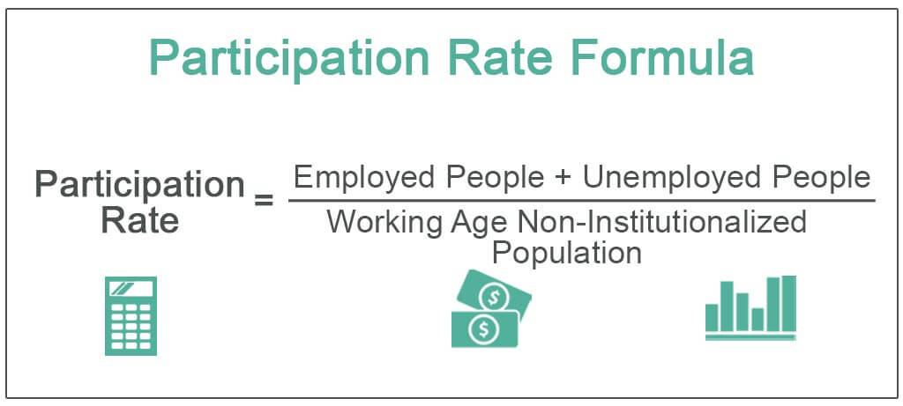

In the modern financial landscape, understanding the interplay between labor market metrics such as the participation rate and unemployment rate is essential. These metrics serve as crucial indicators of economic well-being and labor market dynamics. The participation rate, defined as the percentage of the working-age population that is either employed or actively seeking employment, offers insights into the labor availability and potential economic productivity. On the other hand, the unemployment rate, which measures the proportion of the labor force that is jobless yet actively seeking work, provides a focused view of joblessness and economic vigor.

Together, these metrics paint a comprehensive picture of the job market, contributing to a better understanding of workforce engagement and economic health. Higher participation rates typically suggest greater economic engagement and potential for growth, whereas lower unemployment rates are often indicative of a healthy labor market with ample job opportunities.



In addition to assessing economic conditions, these metrics play a pivotal role in algorithmic trading. Algorithmic trading systems utilize data from these labor market metrics to inform their trading strategies and decisions. By analyzing fluctuations in participation and unemployment rates, these systems can identify economic trends and make rapid, data-driven trading decisions aimed at maximizing profitability.

The interaction between labor market metrics and algorithmic trading exemplifies their broader influence on the economic and financial environments. As stakeholders gain a deeper understanding of these elements, they are better equipped to navigate economic developments and adjust their strategies accordingly.

## Table of Contents

## Understanding Labor Market Metrics

Labor market metrics such as the participation rate and the unemployment rate are critical indicators of economic health. The participation rate represents the percentage of the working-age population that is either employed or actively seeking work. This metric provides insights into the availability of labor and potential economic output. It reflects societal engagement in the workforce, which can be influenced by multiple factors including economic conditions, educational attainment, and cultural norms. A higher participation rate suggests a robust and active labor market, whereas a declining rate can indicate discouragement among job seekers or demographic shifts.

The unemployment rate, in contrast, measures the proportion of the labor force that is not currently employed but is actively seeking employment. This metric provides a focused view of the job market's ability to provide employment opportunities to job seekers. The formula for calculating the unemployment rate is given by:

$$
\text{Unemployment Rate} = \left( \frac{\text{Number of Unemployed}}{\text{Labor Force}} \right) \times 100
$$

Where the labor force comprises both employed and unemployed individuals actively seeking employment. This measure helps identify underutilization in the labor market and can reflect the cyclical and structural health of the economy.

Both metrics are vital for understanding economic performance and for informing policy decisions. Central banks and governments rely on these indicators for setting interest rates, crafting fiscal policies, and planning economic stimuli. Investors and businesses utilize these metrics to gauge economic trends and to make informed investment and strategic decisions.

By analyzing trends in the participation and unemployment rates, economists can discern shifts in labor market dynamics. For instance, a simultaneous drop in both the unemployment rate and the participation rate may suggest that discouraged workers are leaving the labor force rather than finding jobs. Conversely, an increasing participation rate alongside a stable unemployment rate could indicate new job opportunities are attracting more individuals to the labor market.

In summary, while the participation rate sheds light on the labor force's engagement level, the unemployment rate offers a detailed view of the employment landscape. Together, these metrics provide a comprehensive picture of labor market conditions that can greatly influence economic planning and market strategies.

## Participation Rate: Key Influencers

Several factors significantly influence the labor force participation rate, with demographic changes, economic policies, and technological advancements being some of the most influential. Demographic shifts, especially the aging population, have a profound impact on labor force participation. The retirement of the baby boomer generation has resulted in a substantial number of individuals exiting the workforce, thereby reducing the participation rate. As baby boomers, born between 1946 and 1964, reach retirement age, their withdrawal from the labor market creates a noticeable dip in workforce figures. This trend is expected to continue impacting labor supply metrics for the next few decades.

Economic policies also play a pivotal role in determining the participation rate. Policies that promote education and skill development can increase labor market entry, as they enhance the employability of individuals. Conversely, economic reforms aimed at fiscal austerity might lead to reduced job opportunities, discouraging active labor force participation. Government incentives, such as child care subsidies and tax credits, can encourage higher participation rates by alleviating some of the financial burdens faced by families, thereby making it easier for parents, particularly women, to enter and remain in the workforce.

Technological advancements pose both challenges and opportunities for labor force participation. Automation and [artificial intelligence](/wiki/ai-artificial-intelligence) have transformed job markets, often displacing workers in certain sectors while creating new opportunities in others. For instance, technological disruptions can lead to decreased demand for labor in industries reliant on routine tasks, subsequently affecting participation rates negatively. However, these advancements also lead to the creation of new industries and job roles requiring specialized skills, which can attract greater workforce participation if the education and training systems are aligned with these changes.

Understanding these factors is vital for policymakers and economic planners to form a comprehensive view of labor market conditions. Proactive strategies that address the challenges posed by these key influencers can help maintain or even boost the labor force participation rate, contributing to a healthy and robust economy. Hence, continuous monitoring and adaptation are crucial in managing the dynamic nature of the labor force participation driven by these multifaceted influences.

## Unemployment Rate: A Closer Look

The unemployment rate is a critical indicator of an economy's health, providing a focused lens through which to evaluate economic cycles and labor market conditions. It diverges from raw employment figures by specifically quantifying the percentage of the labor force that remains jobless but is actively seeking work. This distinction allows for a more nuanced understanding of labor dynamics and economic trends.

The unemployment rate can be dissected to reveal patterns of joblessness across various sectors, offering insights that are vital for economists and policymakers. By examining these patterns, analysts can differentiate between structural and cyclical unemployment. Structural unemployment arises from fundamental shifts in an economy, such as technological advances or changes in consumer demand, which may render certain skills obsolete. Cyclical unemployment, however, is tied to the ebb and flow of economic cycles, often increasing during recessions when aggregate demand declines.

Mathematically, the unemployment rate is expressed as:

$$
\text{Unemployment Rate} = \left( \frac{\text{Number of Unemployed Persons}}{\text{Total Labor Force}} \right) \times 100
$$

This formula provides a straightforward metric for evaluating labor market slackness or tightness. High unemployment rates might indicate economic distress, requiring intervention through policies aimed at stimulating job creation or re-skilling the workforce. Conversely, persistently low unemployment can signal an overheating economy, potentially necessitating measures to curb inflation.

Understanding the unemployment rate also entails recognizing its implications across different demographic and geographic segments. For instance, youth and minorities often experience higher unemployment rates, reflecting disparities that may require targeted policy responses. Sector-specific analysis can reveal industries more susceptible to cyclical downturns versus those insulated from such effects, informing strategic economic planning and investment.

Examining these patterns enables stakeholders to align economic strategies with prevailing labor market conditions, thereby fostering a more resilient and dynamic economic environment. Through this lens, the unemployment rate acts not merely as a statistical figure but as a pivotal tool for shaping economic policy and anticipating future economic phases.

## Algorithmic Trading and Labor Market Metrics

Algorithmic trading has transformed the financial landscape by integrating various economic indicators, including labor market metrics, into sophisticated trading algorithms. The participation rate and unemployment rate, two critical labor market metrics, serve as valuable inputs for these systems.

Algorithmic trading systems leverage employment data to swiftly analyze market conditions and execute trades based on informed decisions. These systems utilize a combination of [machine learning](/wiki/machine-learning) algorithms and statistical models to predict market movements. For example, changes in the unemployment rate may signal shifts in consumer spending and economic growth, which algorithms can detect and respond to accordingly.

One of the primary advantages of incorporating labor market data into trading algorithms is the enhancement of predictive capabilities. By continuously monitoring fluctuations in participation and unemployment rates, these systems can better anticipate market trends and adjust trading strategies in real time. Machine learning models, such as linear regression or neural networks, can be employed to identify patterns in the data and improve the accuracy of predictions. A simple linear regression model might be expressed as:

$$
y = \beta_0 + \beta_1 \cdot X + \epsilon
$$

where $y$ is the predicted market response, $\beta_0$ is the intercept, $\beta_1$ is the coefficient for the labor market metric $X$ (e.g., unemployment rate), and $\epsilon$ is the error term.

Moreover, the integration of labor market data into trading algorithms enhances market response times by allowing for automated decision-making processes. Algorithms can execute orders with speed and precision, minimizing the lag between data input and action. This automation is crucial in high-frequency trading environments, where milliseconds can make a significant difference in profitability.

Consider the following example of a Python snippet that processes employment data for trading decisions:

```python
import pandas as pd
from sklearn.linear_model import LinearRegression
from datetime import datetime

# Load labor market data
data = pd.read_csv('labor_market_data.csv')
data['Date'] = pd.to_datetime(data['Date'])
data.set_index('Date', inplace=True)

# Define predictors and target
X = data[['UnemploymentRate', 'ParticipationRate']]
y = data['MarketIndex']

# Train a linear regression model
model = LinearRegression().fit(X, y)

# Make a prediction
today = datetime.today()
current_metrics = [[5.4, 62.7]]  # Example current unemployment and participation rates
predicted_market_response = model.predict(current_metrics)

print(f"Predicted Market Index for {today.strftime('%Y-%m-%d')}: {predicted_market_response[0]}")
```

This code example illustrates how a linear regression model can be used to predict market responses based on current labor market metrics. By continuously updating with new data, the algorithm can adapt to changing economic conditions swiftly.

The fusion of labor market metrics with [algorithmic trading](/wiki/algorithmic-trading) not only enhances trading efficiency but also contributes valuable insights for investors and policymakers. As technological advancements continue, the reliance on data-driven decisions in financial markets is expected to grow, making the understanding and application of labor market metrics in algorithmic trading increasingly vital.

## Interconnections and Economic Impact

Examining the synergy between participation and unemployment rates alongside algorithmic trading reveals significant insights into economic strategies. The interplay of these factors allows economists and traders to anticipate market conditions more accurately and make informed decisions.

Participation and unemployment rates serve as key indicators of labor market health, influencing economic policies and forecasting. The participation rate reflects the active portion of the working-age population, while the unemployment rate provides a snapshot of joblessness within the labor force. By analyzing these metrics together, stakeholders can identify underlying trends in workforce engagement and labor market slack, which are crucial for understanding economic cycles and structural shifts.

Algorithmic trading leverages these metrics by incorporating labor market data into trading algorithms. These algorithms can process vast amounts of employment-related data swiftly, enabling traders to respond to market changes in real time. For instance, an unexpected drop in the unemployment rate may signal economic growth, prompting algorithms to adjust trading strategies accordingly. This integration enhances predictive capabilities, allowing for more accurate market forecasts and timely investment decisions.

The impact of labor market metrics on financial market behavior is extensive. Changes in participation and unemployment rates can affect everything from consumer spending to investor confidence, influencing stock prices and bond yields. Furthermore, central banks and policymakers monitor these metrics closely when considering [interest rate](/wiki/interest-rate-trading-strategies) adjustments and economic stimulus measures. For example, a rising unemployment rate might prompt a central bank to lower interest rates to stimulate job creation and economic activity.

In summary, understanding the interconnections between participation and unemployment rates and their integration into algorithmic trading provides a comprehensive view of economic health. This synergy informs economic forecasting, guides investment strategies, and impacts policy decisions, underscoring the importance of these metrics in shaping the broader financial landscape.

## Conclusion

The participation rate, unemployment rate, and algorithmic trading are crucial elements in the landscape of modern economics. Their interplay provides a nuanced understanding of market conditions that is vital for stakeholders ranging from policymakers to investors. By analyzing these metrics together, it becomes possible to foresee shifts in economic indicators and make informed decisions. This ability to anticipate allows for more agile adjustments in both policy-making and investment strategies, fostering a more resilient economic environment.

Continuous research and dialogue are essential for fully harnessing the insights offered by these components. As the dynamics of labor markets and financial sectors evolve, developing a deeper understanding of their interconnections becomes increasingly important. This ongoing exploration will not only aid in better anticipation of market conditions but also contribute to more effective economic forecasting and planning. By engaging in robust discussions and expanding the existing body of knowledge, stakeholders can better navigate the complexities of future economic landscapes and enhance their strategic responses to emerging challenges.

## References & Further Reading

- **Investopedia Guides on Participation and Unemployment Rate Differences**: These guides provide detailed explanations on the differences and relationships between participation and unemployment rates, which are crucial for understanding labor market dynamics. For a comprehensive overview, refer to Investopedia's entries on labor economics, which elucidate how these metrics are calculated and their economic implications.

- **Papers and Academic Articles on Algorithmic Trading and Economic Forecasting**: A wealth of academic literature explores the integration of labor market metrics into algorithmic trading and economic forecasting. Notable papers include studies published in journals such as the "Journal of Financial Economics" and "Quantitative Finance." These works often include empirical analysis on how labor market fluctuations influence trading algorithms and market predictions.

- **Books on Machine Learning Applications in Financial Markets**: Several authoritative books provide insights into the use of machine learning for financial market analysis, particularly in algorithmic trading. Some recommended titles are "Advances in Financial Machine Learning" by Marcos López de Prado and "Machine Learning for Asset Managers" by A. Dasgupta. These books discuss advanced techniques for leveraging labor market data and other economic indicators to enhance trading strategies and predictive models.

