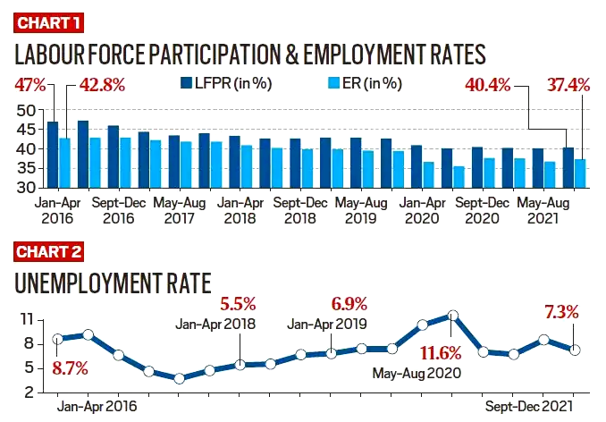

## Table of Contents

## What is the participation rate?

The participation rate is the percentage of people who are either working or actively looking for work out of the total working-age population. It shows how many people are involved in the job market. If the participation rate is high, it means more people are working or trying to find a job. If it's low, fewer people are part of the workforce.

This rate is important because it helps us understand the health of an economy. A high participation rate can mean the economy is doing well, with lots of job opportunities. A low rate might mean people are discouraged about finding work, or they might have other reasons for not working, like going back to school or retiring early. Economists use this information to make decisions and plan for the future.

## What is the unemployment rate?

The unemployment rate is the percentage of people who are out of work but are actively looking for a job. It shows how many people want to work but can't find a job. If the unemployment rate is high, it means more people are looking for work but can't find it. If it's low, it means most people who want to work have jobs.

This rate is important because it helps us understand how well the economy is doing. When the unemployment rate is low, it usually means the economy is strong and there are lots of job opportunities. When it's high, it can mean the economy is struggling, and people are having a hard time finding work. Governments and businesses use this information to make decisions about policies and investments.

## How are the participation rate and unemployment rate calculated?

The participation rate is calculated by dividing the number of people who are either working or actively looking for work by the total working-age population, then multiplying by 100 to get a percentage. The working-age population usually includes people between the ages of 16 and 64. For example, if there are 100 million people in the working-age population and 75 million of them are either working or looking for work, the participation rate would be 75%.

The unemployment rate is calculated by dividing the number of people who are out of work but actively looking for a job by the total labor force, then multiplying by 100 to get a percentage. The labor force includes everyone who is either working or actively looking for work. For example, if there are 75 million people in the labor force and 5 million of them are out of work but looking for a job, the unemployment rate would be about 6.7%.

## Why are these rates important economic indicators?

The participation rate and unemployment rate are important because they help us see how well the economy is doing. The participation rate shows how many people are working or trying to find a job. If a lot of people are involved in the job market, it usually means the economy is strong and there are many job opportunities. If fewer people are working or looking for work, it might mean they are discouraged or have other reasons for not working, like going back to school or retiring early.

The unemployment rate tells us how many people want to work but can't find a job. A low unemployment rate means most people who want to work have jobs, which is a good sign for the economy. A high unemployment rate means more people are struggling to find work, which can be a sign that the economy is not doing well. Governments and businesses use these rates to make decisions about policies and investments to help improve the economy.

## How do the participation rate and unemployment rate relate to each other?

The participation rate and unemployment rate are related but show different things about the job market. The participation rate tells us how many people are working or trying to find a job out of everyone who could be working. It includes people who have jobs and those looking for jobs. The unemployment rate, on the other hand, only looks at people who are out of work but still looking for a job. It's a part of the participation rate because these unemployed people are included in the group of people who are trying to find work.

These two rates together give us a fuller picture of the economy. If the participation rate is high and the unemployment rate is low, it means a lot of people are working or trying to find work, and most of those looking for jobs can find them. This is a sign of a strong economy. But if the participation rate is low and the unemployment rate is high, it might mean that many people have given up looking for work because they think it's too hard to find a job. This can be a sign of a struggling economy. By looking at both rates, we can understand more about how people are doing in the job market and make better decisions to help improve things.

## Can a high participation rate affect the unemployment rate?

Yes, a high participation rate can affect the unemployment rate. When more people are working or looking for work, it means the participation rate is high. If a lot of these people are looking for jobs but can't find them, the unemployment rate goes up. This is because the unemployment rate only counts people who are out of work but still trying to find a job. So, if more people are trying to find work, and they can't, the unemployment rate will be higher.

But, it's not always that simple. Sometimes, a high participation rate can lead to a lower unemployment rate if there are enough jobs for everyone who wants to work. If the economy is doing well and there are lots of job opportunities, more people might join the workforce and find jobs easily. This means the participation rate goes up, but the unemployment rate goes down because most people who want to work can find a job. So, the relationship between the participation rate and the unemployment rate depends on how many jobs are available.

## What trends have been observed in participation and unemployment rates over the past decade?

Over the past decade, the participation rate in many countries has been slowly going down. This means fewer people are working or looking for work. One reason for this is that more people are retiring, especially as the baby boomer generation gets older. Another reason is that more young people are staying in school longer before they start working. Also, sometimes people get discouraged and stop looking for work if they can't find a job for a long time. These changes can make the participation rate go down even if the economy is doing okay.

The unemployment rate has had ups and downs over the past decade. After the big financial crisis around 2008, many countries had high unemployment rates because it was hard to find jobs. But as the economy got better, the unemployment rate started to go down in many places. By the late 2010s, many countries had low unemployment rates, which meant most people who wanted to work could find a job. But then, in 2020, the COVID-19 pandemic caused the unemployment rate to go up again because many businesses had to close and people lost their jobs. Since then, the unemployment rate has been slowly going down as more people get back to work.

## How do demographic factors influence participation and unemployment rates?

Demographic factors like age, gender, and education can change the participation and unemployment rates a lot. For example, older people might retire and stop working, which can make the participation rate go down. Young people might stay in school longer before they start looking for jobs, which also makes the participation rate lower. Women might work less if they have to take care of their family, and this can affect the participation rate too. Education also matters because people with more education usually have an easier time finding jobs, so they might be more likely to look for work and keep the participation rate higher.

Unemployment rates can also be influenced by demographic factors. For example, young people often have a harder time finding jobs because they don't have as much experience. This can make the unemployment rate higher for younger age groups. Women might face more challenges in the job market and have higher unemployment rates in some places. People with less education might struggle more to find work, which can also push up the unemployment rate. So, when we look at the unemployment rate, it's important to think about how different groups of people might be doing differently in the job market.

## What impact do government policies have on these rates?

Government policies can have a big impact on the participation and unemployment rates. For example, if the government makes it easier for people to get unemployment benefits, some people might stop looking for work because they can get money without working. This can make the participation rate go down because fewer people are trying to find jobs. On the other hand, if the government starts programs to help people find jobs or learn new skills, more people might start looking for work, which can make the participation rate go up.

Government policies can also affect the unemployment rate. If the government creates more jobs by spending money on things like building roads or schools, more people can find work, and the unemployment rate can go down. But if the government raises taxes or makes it harder for businesses to hire people, companies might not want to create new jobs, and the unemployment rate could go up. So, the choices the government makes can really change how many people are working or looking for work.

## How do participation and unemployment rates vary across different countries?

Participation and unemployment rates can be very different from one country to another. In some countries, like Sweden and Iceland, the participation rate is high because a lot of people work or look for work. These countries often have good support for working parents, so more women can join the workforce. But in other countries, like Italy or Greece, the participation rate might be lower because people retire earlier or have a harder time finding jobs. The reasons for these differences can include things like the age of the population, how easy it is to get a job, and what the culture thinks about working.

Unemployment rates also vary a lot across countries. For example, countries like Germany and Japan often have low unemployment rates because their economies are strong and there are lots of jobs. But in places like South Africa or Spain, the unemployment rate can be very high, especially for young people who have a hard time finding work. Government policies, how well the economy is doing, and how easy it is to start a business can all affect the unemployment rate. So, looking at these rates in different countries can tell us a lot about what life is like for people there.

## What advanced statistical methods can be used to analyze the relationship between participation and unemployment rates?

To understand how participation and unemployment rates are connected, we can use something called regression analysis. This is a way to see how one thing, like the unemployment rate, might affect another thing, like the participation rate. We can use a simple kind of regression, called linear regression, to look at how these rates change together. But sometimes, the relationship is more complicated, so we might use other types of regression, like logistic regression, to see if there are certain conditions under which the participation rate changes a lot when the unemployment rate goes up or down.

Another useful method is time series analysis. This helps us see how these rates change over time and if there are patterns. For example, we can use something called ARIMA (AutoRegressive Integrated Moving Average) models to predict future participation and unemployment rates based on past data. This can be really helpful for making plans and understanding how things like economic cycles or big events, like a financial crisis or a global health emergency, affect these rates. By using these advanced methods, we can get a clearer picture of how participation and unemployment rates work together and what might happen in the future.

## How can predictive models be developed to forecast future trends in participation and unemployment rates?

Predictive models for participation and unemployment rates can be made using something called time series analysis. This method looks at past data to find patterns and then uses those patterns to guess what might happen next. For example, we can use an ARIMA model to look at how these rates have changed over time and then predict what they might be in the future. This can help governments and businesses plan better because they can see what might be coming and get ready for it. The key is to use a lot of past data and make sure the model is good at finding the right patterns.

Another way to make predictive models is by using regression analysis. This method helps us see how different things, like the economy or government policies, might change the participation and unemployment rates. We can use linear regression to see if there is a simple, straight-line relationship between these rates and other factors. If the relationship is more complicated, we might use other types of regression, like logistic regression, to understand it better. By using these models, we can figure out how changes in the economy or new policies might affect these rates in the future, and make smarter decisions.

## What are the key aspects of understanding labor market metrics?

Labor market metrics such as the participation rate and the unemployment rate are critical indicators of economic health. The participation rate represents the percentage of the working-age population that is either employed or actively seeking work. This metric provides insights into the availability of labor and potential economic output. It reflects societal engagement in the workforce, which can be influenced by multiple factors including economic conditions, educational attainment, and cultural norms. A higher participation rate suggests a robust and active labor market, whereas a declining rate can indicate discouragement among job seekers or demographic shifts.

The unemployment rate, in contrast, measures the proportion of the labor force that is not currently employed but is actively seeking employment. This metric provides a focused view of the job market's ability to provide employment opportunities to job seekers. The formula for calculating the unemployment rate is given by:

$$
\text{Unemployment Rate} = \left( \frac{\text{Number of Unemployed}}{\text{Labor Force}} \right) \times 100
$$

Where the labor force comprises both employed and unemployed individuals actively seeking employment. This measure helps identify underutilization in the labor market and can reflect the cyclical and structural health of the economy.

Both metrics are vital for understanding economic performance and for informing policy decisions. Central banks and governments rely on these indicators for setting interest rates, crafting fiscal policies, and planning economic stimuli. Investors and businesses utilize these metrics to gauge economic trends and to make informed investment and strategic decisions.

By analyzing trends in the participation and unemployment rates, economists can discern shifts in labor market dynamics. For instance, a simultaneous drop in both the unemployment rate and the participation rate may suggest that discouraged workers are leaving the labor force rather than finding jobs. Conversely, an increasing participation rate alongside a stable unemployment rate could indicate new job opportunities are attracting more individuals to the labor market.

In summary, while the participation rate sheds light on the labor force's engagement level, the unemployment rate offers a detailed view of the employment landscape. Together, these metrics provide a comprehensive picture of labor market conditions that can greatly influence economic planning and market strategies.

## What is the Unemployment Rate: A Closer Look?

The unemployment rate is a critical indicator of an economy's health, providing a focused lens through which to evaluate economic cycles and labor market conditions. It diverges from raw employment figures by specifically quantifying the percentage of the labor force that remains jobless but is actively seeking work. This distinction allows for a more nuanced understanding of labor dynamics and economic trends.

The unemployment rate can be dissected to reveal patterns of joblessness across various sectors, offering insights that are vital for economists and policymakers. By examining these patterns, analysts can differentiate between structural and cyclical unemployment. Structural unemployment arises from fundamental shifts in an economy, such as technological advances or changes in consumer demand, which may render certain skills obsolete. Cyclical unemployment, however, is tied to the ebb and flow of economic cycles, often increasing during recessions when aggregate demand declines.

Mathematically, the unemployment rate is expressed as:

$$
\text{Unemployment Rate} = \left( \frac{\text{Number of Unemployed Persons}}{\text{Total Labor Force}} \right) \times 100
$$

This formula provides a straightforward metric for evaluating labor market slackness or tightness. High unemployment rates might indicate economic distress, requiring intervention through policies aimed at stimulating job creation or re-skilling the workforce. Conversely, persistently low unemployment can signal an overheating economy, potentially necessitating measures to curb inflation.

Understanding the unemployment rate also entails recognizing its implications across different demographic and geographic segments. For instance, youth and minorities often experience higher unemployment rates, reflecting disparities that may require targeted policy responses. Sector-specific analysis can reveal industries more susceptible to cyclical downturns versus those insulated from such effects, informing strategic economic planning and investment.

Examining these patterns enables stakeholders to align economic strategies with prevailing labor market conditions, thereby fostering a more resilient and dynamic economic environment. Through this lens, the unemployment rate acts not merely as a statistical figure but as a pivotal tool for shaping economic policy and anticipating future economic phases.

## How do Algorithmic Trading and Labor Market Metrics relate to each other?

Algorithmic trading has transformed the financial landscape by integrating various economic indicators, including labor market metrics, into sophisticated trading algorithms. The participation rate and unemployment rate, two critical labor market metrics, serve as valuable inputs for these systems.

Algorithmic trading systems leverage employment data to swiftly analyze market conditions and execute trades based on informed decisions. These systems utilize a combination of [machine learning](/wiki/machine-learning) algorithms and statistical models to predict market movements. For example, changes in the unemployment rate may signal shifts in consumer spending and economic growth, which algorithms can detect and respond to accordingly.

One of the primary advantages of incorporating labor market data into trading algorithms is the enhancement of predictive capabilities. By continuously monitoring fluctuations in participation and unemployment rates, these systems can better anticipate market trends and adjust trading strategies in real time. Machine learning models, such as linear regression or neural networks, can be employed to identify patterns in the data and improve the accuracy of predictions. A simple linear regression model might be expressed as:

$$
y = \beta_0 + \beta_1 \cdot X + \epsilon
$$

where $y$ is the predicted market response, $\beta_0$ is the intercept, $\beta_1$ is the coefficient for the labor market metric $X$ (e.g., unemployment rate), and $\epsilon$ is the error term.

Moreover, the integration of labor market data into trading algorithms enhances market response times by allowing for automated decision-making processes. Algorithms can execute orders with speed and precision, minimizing the lag between data input and action. This automation is crucial in high-frequency trading environments, where milliseconds can make a significant difference in profitability.

Consider the following example of a Python snippet that processes employment data for trading decisions:

```python
import pandas as pd
from sklearn.linear_model import LinearRegression
from datetime import datetime

# Load labor market data
data = pd.read_csv('labor_market_data.csv')
data['Date'] = pd.to_datetime(data['Date'])
data.set_index('Date', inplace=True)

# Define predictors and target
X = data[['UnemploymentRate', 'ParticipationRate']]
y = data['MarketIndex']

# Train a linear regression model
model = LinearRegression().fit(X, y)

# Make a prediction
today = datetime.today()
current_metrics = [[5.4, 62.7]]  # Example current unemployment and participation rates
predicted_market_response = model.predict(current_metrics)

print(f"Predicted Market Index for {today.strftime('%Y-%m-%d')}: {predicted_market_response[0]}")
```

This code example illustrates how a linear regression model can be used to predict market responses based on current labor market metrics. By continuously updating with new data, the algorithm can adapt to changing economic conditions swiftly.

The fusion of labor market metrics with [algorithmic trading](/wiki/algorithmic-trading) not only enhances trading efficiency but also contributes valuable insights for investors and policymakers. As technological advancements continue, the reliance on data-driven decisions in financial markets is expected to grow, making the understanding and application of labor market metrics in algorithmic trading increasingly vital.

## References & Further Reading

- **Investopedia Guides on Participation and Unemployment Rate Differences**: These guides provide detailed explanations on the differences and relationships between participation and unemployment rates, which are crucial for understanding labor market dynamics. For a comprehensive overview, refer to Investopedia's entries on labor economics, which elucidate how these metrics are calculated and their economic implications.

- **Papers and Academic Articles on Algorithmic Trading and Economic Forecasting**: A wealth of academic literature explores the integration of labor market metrics into algorithmic trading and economic forecasting. Notable papers include studies published in journals such as the "Journal of Financial Economics" and "Quantitative Finance." These works often include empirical analysis on how labor market fluctuations influence trading algorithms and market predictions.

- **Books on Machine Learning Applications in Financial Markets**: Several authoritative books provide insights into the use of machine learning for financial market analysis, particularly in algorithmic trading. Some recommended titles are "Advances in Financial Machine Learning" by Marcos López de Prado and "Machine Learning for Asset Managers" by A. Dasgupta. These books discuss advanced techniques for leveraging labor market data and other economic indicators to enhance trading strategies and predictive models.

