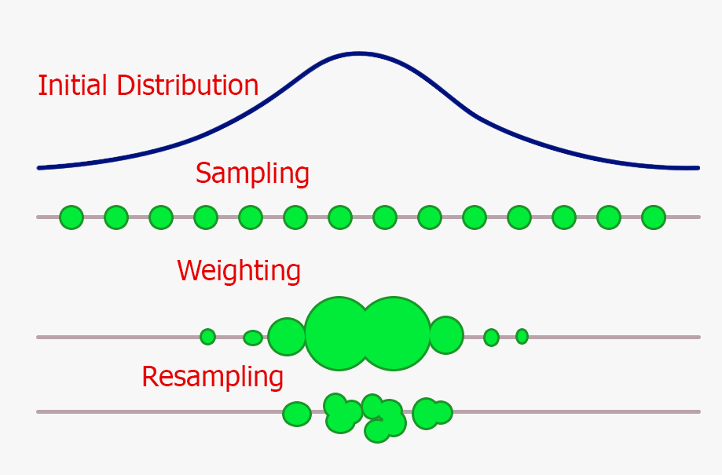

## Table of Contents

## What is a particle filter?

A particle filter is a way to track things that move around, like a car or a person, using a computer. It works by imagining many tiny copies, or "particles," of what you're tracking. Each particle guesses where the thing might be and how it might be moving. As new information comes in, like from a camera or a sensor, the computer looks at all the particles and decides which guesses are most likely to be right. It then makes new particles based on the best guesses, so the filter keeps getting better at tracking.

Particle filters are really helpful because they can handle situations where things move in unpredictable ways. For example, if a car suddenly turns or speeds up, the particle filter can still keep track of it. This makes them useful in many areas, like helping self-driving cars navigate, tracking animals in the wild, or even in video games to make characters move more realistically. By constantly updating and refining the particles, the filter stays accurate even when things get tricky.

## How does a particle filter work?

A particle filter works by using a bunch of tiny guesses, called particles, to track something that's moving. Imagine you're trying to follow a car. You start by spreading out many particles around where you think the car might be. Each particle has its own idea about where the car is and how fast it's going. When you get new information, like from a camera or a sensor, you check how well each particle's guess matches up with what you see. The particles that guessed right get to stick around, and the ones that were way off get tossed out.

Then, you make new particles based on the good guesses. You might add a little randomness to the new particles, so they can account for sudden changes in the car's movement, like a quick turn or a speed change. By constantly updating and refining these particles, the particle filter gets better at predicting where the car will be next. This way, even if the car does something unexpected, the filter can still keep up and give you a good idea of where it is.

## What are the main components of a particle filter?

A particle filter has three main parts: particles, a way to predict, and a way to update. Particles are small guesses about where something is and how it's moving. Imagine you're trying to follow a bird. Each particle is like a tiny bird that thinks it knows where the real bird is flying. The prediction part uses math to guess where each particle will be next, kind of like trying to guess where the bird will fly based on how it's been flying so far. 

The update part is what makes the particle filter smart. When you see the bird again, you compare what you see with where all the particles guessed it would be. Particles that guessed right get to stay, and the ones that were wrong get tossed out. Then, you make new particles based on the good guesses, adding a bit of randomness to account for surprises, like if the bird suddenly changes direction. By constantly predicting and updating, the particle filter keeps getting better at tracking the bird.

## What are the applications of particle filters?

Particle filters are used in many different areas where we need to keep track of things that move around. One big use is in self-driving cars. These cars use particle filters to figure out where they are on the road and where other cars, bikes, or people are moving. This helps the car make safe decisions about when to turn, stop, or speed up. Another use is in tracking animals in the wild. Scientists put trackers on animals and use particle filters to follow where they go, which helps learn about their habits and how to protect them better.

Particle filters are also used in video games to make characters move in a more realistic way. When you play a game, the characters need to move smoothly and react to what you do. Particle filters help the game guess where the characters will be next, so they can move naturally. Besides games, particle filters are used in robotics. Robots use them to navigate around a room or a factory, avoiding obstacles and getting to where they need to go. By using particle filters, robots can keep track of their position even if they bump into something or if the lights go out.

In addition to these, particle filters are used in weather forecasting to predict how storms or other weather patterns will move. Meteorologists use them to make better guesses about where a storm will go next, which helps in warning people and preparing for bad weather. Particle filters are also used in finance to predict how stock prices might change. By using lots of small guesses, they can help investors make better decisions about buying or selling stocks. Overall, particle filters are a powerful tool for tracking and predicting movement in many different fields.

## How is a particle filter different from a Kalman filter?

A particle filter and a Kalman filter are both used to track things that move, but they work in different ways. A Kalman filter is like a smart guesser that uses math to predict where something will be next. It works best when things move in a predictable way, like a plane flying smoothly. The Kalman filter uses equations to update its guess every time it gets new information. If the thing it's tracking suddenly changes direction or speed, the Kalman filter can have a hard time keeping up.

On the other hand, a particle filter is like a bunch of tiny guessers working together. Instead of one big guess, it uses many small guesses called particles. Each particle tries to predict where the thing might be and how it's moving. When new information comes in, the particle filter checks which particles guessed right and keeps those, tossing out the wrong ones. This makes the particle filter really good at tracking things that move in unpredictable ways, like a car in traffic or a bird flying around. By using many small guesses, the particle filter can handle surprises better than the Kalman filter.

## What is the role of resampling in particle filters?

Resampling is a key part of how particle filters work. It's like giving a fresh start to the particles that made good guesses. Imagine you're trying to track a soccer ball on the field. You have a bunch of particles guessing where the ball is. When you see where the ball really is, you check which particles guessed right. Resampling means you keep the good guesses and throw away the bad ones. Then, you make new particles based on the good guesses, so you have a new set of particles that are more likely to be right.

This process helps the particle filter stay accurate over time. Without resampling, the particles might spread out too much and lose track of the ball. By resampling, you focus on the particles that are doing well, which makes the filter better at predicting where the ball will go next. It's like [picking](/wiki/asset-class-picking) the best players for your team and giving them a chance to keep playing, while the others sit out. This way, the particle filter can keep up with the ball even if it moves in unexpected ways.

## How do you initialize particles in a particle filter?

When you start using a particle filter, you need to spread out a bunch of tiny guesses, called particles, around where you think the thing you're tracking might be. Imagine you're trying to find your friend in a crowded park. You don't know exactly where they are, but you have a rough idea. So, you scatter the particles all over that area. Each particle is like a little copy of your friend, guessing where they might be standing.

After you spread out the particles, you give each one a starting guess about how your friend might be moving. This could be based on what you know about your friend, like if they usually walk slowly or if they're likely to be moving towards the ice cream stand. By starting with these guesses, the particle filter can begin tracking your friend right away. As you get new information, like seeing your friend wave from across the park, the particles will update and get better at finding them.

## What are the common challenges faced when implementing particle filters?

One of the biggest challenges when using particle filters is making sure you have enough particles to get good guesses. If you don't have enough, the filter might lose track of what you're following, like a car that suddenly turns. But if you have too many particles, it can make your computer work too hard and slow things down. Finding the right number of particles is a bit like Goldilocks trying to find the perfect porridge - not too hot, not too cold, but just right.

Another challenge is dealing with noise, which is like static on a radio that can mess up your guesses. When the information you get from cameras or sensors is not perfect, it can make the particles spread out too much, making it hard to keep track of things. You need to find a way to balance the noise so the particle filter stays accurate. It's like trying to hear a friend's voice at a noisy party - you have to focus on what's important and ignore the background chatter.

## How can the performance of a particle filter be evaluated?

To check how well a particle filter is doing, you can look at how close its guesses are to where the thing really is. Imagine you're playing hide and seek and trying to find your friend. If the particle filter keeps guessing spots that are close to where your friend is hiding, it's doing a good job. You can measure this by seeing how far off the guesses are on average. The smaller the average distance, the better the filter is at tracking.

Another way to see if the particle filter is working well is by checking how quickly it can find the right spot after something unexpected happens. If your friend suddenly moves to a new hiding spot, a good particle filter will quickly update its guesses to find them again. You can test this by making the thing you're tracking do something surprising and then seeing how fast the filter catches up. If it can keep up with sudden changes, it's a sign that the particle filter is performing well.

## What advanced techniques can be used to improve the efficiency of particle filters?

One way to make particle filters work better and faster is by using something called adaptive resampling. This means the particle filter can change how many particles it uses based on how hard it is to track the thing. If the thing is moving in a simple way, like a car driving straight, the filter can use fewer particles. But if the thing does something tricky, like a car making sharp turns, the filter can add more particles to keep up. This helps the filter stay accurate without using too much computer power.

Another technique is called importance sampling. This is like focusing on the particles that are doing a good job guessing where the thing is. Instead of treating all particles the same, the filter pays more attention to the ones that are close to the right spot. This makes the filter better at tracking without needing as many particles. By using these advanced tricks, particle filters can work more efficiently and track things even when they move in unexpected ways.

## How do particle filters handle non-linear and non-Gaussian systems?

Particle filters are really good at dealing with things that don't move in straight lines or in ways that are hard to predict. Imagine you're trying to follow a bird flying around. The bird doesn't fly in a straight line; it might swoop down, then up, and suddenly change direction. A particle filter can handle this because it uses lots of tiny guesses, called particles, to track the bird. Each particle tries to guess where the bird might be next, and when the bird does something unexpected, the filter can still keep up by focusing on the particles that guessed right.

The other tricky thing particle filters can handle is when the guesses don't follow a normal pattern, which is called non-Gaussian. Think of it like trying to guess where a soccer ball will go after it bounces off a player's foot. The ball's path can be really hard to predict because it doesn't follow a simple, smooth curve. Particle filters are great at this because they don't assume the guesses have to follow a certain pattern. Instead, they use lots of different guesses and keep updating them based on what they see, so they can track the ball even when its movement is all over the place.

## What are some recent developments in particle filter algorithms?

One recent development in particle filter algorithms is the use of [machine learning](/wiki/machine-learning) to make them smarter. Imagine you're trying to track a car that keeps changing its route. By using machine learning, the particle filter can learn from past data to make better guesses about where the car might go next. This makes the filter more accurate and able to handle tricky situations better. For example, if the car often turns left at a certain intersection, the filter can use this information to focus its guesses in that direction.

Another development is the use of parallel computing to make particle filters faster. Think of it like having many friends help you search for a lost toy. Instead of one person looking, lots of people can search at the same time, which makes the search quicker. In computers, this means using multiple processors to update and resample the particles all at once. This way, the particle filter can keep up with fast-moving objects without slowing down, making it useful for things like tracking drones in real-time.

## What are the applications in high-frequency trading?

In the fast-paced world of high-frequency trading ([HFT](/wiki/high-frequency-trading-strategies)), the application of particle filters is crucial for predicting rapid price changes. These filters are adept at updating beliefs about market states as new information becomes available, which is essential in environments where split-second decisions can determine the profitability of trading operations.

Particle filters operate by estimating the latent variables of a financial system that are not directly observable. In the context of HFT, these latent variables can include components such as intrinsic market values or the actions of other market participants. By representing the probability distribution of these hidden states, particle filters allow for an adaptive response to market dynamics.

An HFT algorithm leveraging particle filters typically begins by initializing a set of particles that represent possible states of the market. As new price data arrives, these particles are propagated through a prediction step, akin to the equation:

$$
x_t^i = f(x_{t-1}^i) + w_t^i
$$

where $x_t^i$ represents the state of particle $i$ at time $t$, $f$ is a function representing the process model, and $w_t^i$ is a noise component.

Subsequently, a measurement update step occurs, where each particle is assigned a weight based on the likelihood of observing the current market data given the particle's state. This is mathematically expressed as:

$$
w_t^i = p(y_t \mid x_t^i)
$$

where $w_t^i$ is the weight of particle $i$ at time $t$ and $p(y_t \mid x_t^i)$ is the probability of observing the market data $y_t$ given the state $x_t^i$.

The next phase involves resampling, where particles with higher weights are more likely to be replicated, while those with lower weights are discarded. This step helps in focusing computational resources on the more probable states and preventing degeneracy, a common issue where many particles have negligible weight.

This sequential updating mechanism enables high-frequency trading systems to make swift buy or sell decisions based on freshly incorporated data. For instance, a particle filter can quickly identify a shift in market sentiment, allowing an automated trading system to adjust its position before a significant price change occurs.

As a result, particle filters enhance the adaptability and speed of trading strategies, fostering improved market responsiveness and potentially increasing profitability. The ability to process vast streams of data in real-time makes particle filters indispensable in modern HFT strategies, where timing and precision are paramount.

## References & Further Reading

[1]: Doucet, A., de Freitas, N., & Gordon, N. J. (2001). ["Sequential Monte Carlo Methods in Practice."](https://link.springer.com/book/10.1007/978-1-4757-3437-9) Springer.

[2]: Kantas, N., Doucet, A., Singh, S. S., & Maciejowski, J. M. (2009). ["An Overview of Sequential Monte Carlo Methods for Parameter Estimation in General State-Space Models."](https://www.sciencedirect.com/science/article/pii/S1474667016387432) Journal of the Royal Statistical Society: Series A (Statistics in Society).

[3]: ["Particle Filter for Non-Gaussian and Non-linear State Estimation"](https://ieeexplore.ieee.org/abstract/document/9720091) by M.S. Arulampalam, N. Gordon, M. Orton, & B. Ristic.

[4]: Lopez de Prado, M. (2018). ["Advances in Financial Machine Learning."](https://books.google.com/books/about/Advances_in_Financial_Machine_Learning.html?id=oU9KDwAAQBAJ) Wiley.

[5]: Doucet, A., Gordon, N. J., & Krishnamurthy, V. (2001). ["Particle Filters for State and Parameter Estimation in Time Series."](https://www.scirp.org/reference/referencespapers?referenceid=44310) IEEE Transactions on Signal Processing.

[6]: Arulampalam, M. S., Maskell, S., Gordon, N., & Clapp, T. (2002). ["A Tutorial on Particle Filters for Online Nonlinear/Non-Gaussian Bayesian Tracking."](https://people.eecs.berkeley.edu/~pabbeel/cs287-fa12/optreadings/Arulampalam_etal_2002.pdf) IEEE Transactions on Signal Processing.