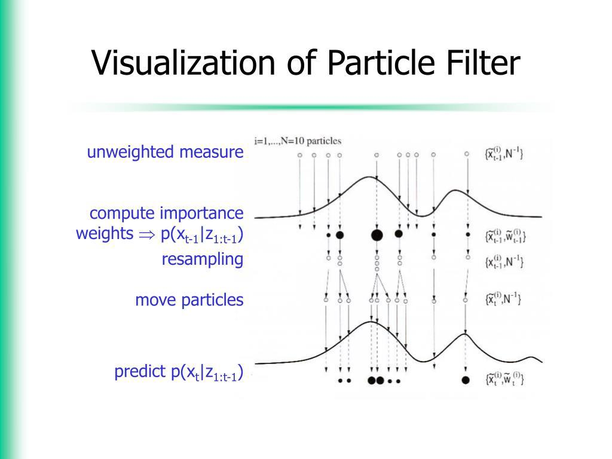

Algorithmic trading continues to evolve as financial markets become increasingly complex, demanding innovative solutions for effective management and decision-making. One such innovative technique is the particle filter, commonly referred to as Sequential Monte Carlo methods. This advanced statistical approach is gaining traction as a valuable tool in high-frequency trading (HFT) and quantitative finance sectors.

Particle filters are designed to estimate the state of a system over time, particularly in cases where the system displays nonlinear behavior and its states are not directly observable. They employ a series of particles, or samples, that represent possible states of the system, updating these particles as new information becomes available. This process enables traders to make informed decisions based on real-time data, substantially improving the speed and accuracy of trading operations.



In the context of HFT, where trades are executed in fractions of a second, the ability to process large volumes of data rapidly is crucial. Particle filters thrive in this environment, providing a robust framework for predicting rapid price movements and aiding in the formulation of effective trading strategies. By continuously updating beliefs about market states, these filters allow algorithms to execute timely buy or sell decisions, potentially increasing profitability.

This article examines how particle filters can be effectively employed to refine algorithmic trading strategies, offering insights into their application within high-frequency trading and beyond. Their capacity for managing and adapting to dynamic market conditions underscores their growing importance in the toolkit of quantitative traders seeking to navigate the intricate landscape of modern financial markets.

## Table of Contents

## Understanding Particle Filters

Particle filters are a Bayesian inference technique employed to estimate the state of a system sequentially over time, particularly in systems with non-linear dynamics and unobservable states. At their core, particle filters aim to approximate a posterior distribution of the state by using a set of random samples, often referred to as particles. Each particle represents a possible state of the system, and its importance is weighted according to how well it explains the observed data.

The process begins with initializing a set of particles and assigning them equal weights. As new data becomes available, the particles are propagated through a model of the system dynamics, and their weights are updated based on the likelihood of the observed data given the particle's state. This is achieved through a sequence of prediction and update steps, which are iteratively performed throughout the analysis.

The utility of particle filters in non-linear systems arises because they do not rely on linear approximations, unlike methods such as the Kalman filter. Additionally, particle filters are capable of handling non-Gaussian noise, which is prevalent in many real-world scenarios.

In high-frequency trading ([HFT](/wiki/high-frequency-trading-strategies)), particle filters are valuable for estimating unobservable variables that can influence trading decisions, such as intrinsic asset values or market sentiment. These unobservable states are indirectly inferred from observable data, such as price movements or trading volumes, using a model. For example, in environments characterized by rapid and frequent trading, effective real-time estimation of intrinsic values enables more informed trading decisions.

Moreover, particle filters can aid in discerning the potential actions of other traders by assimilating data related to order flows and price changes. By updating beliefs about the current state of the market with each new piece of information, trading models can adjust strategies dynamically, thereby potentially improving trading performance.

Given their flexibility and powerful inference capabilities, particle filters have become a crucial component in developing adaptive [algorithmic trading](/wiki/algorithmic-trading) models that are attuned to the fast-changing conditions typical of financial markets.

## Application in High-Frequency Trading

In the fast-paced world of high-frequency trading (HFT), the application of particle filters is crucial for predicting rapid price changes. These filters are adept at updating beliefs about market states as new information becomes available, which is essential in environments where split-second decisions can determine the profitability of trading operations.

Particle filters operate by estimating the latent variables of a financial system that are not directly observable. In the context of HFT, these latent variables can include components such as intrinsic market values or the actions of other market participants. By representing the probability distribution of these hidden states, particle filters allow for an adaptive response to market dynamics.

An HFT algorithm leveraging particle filters typically begins by initializing a set of particles that represent possible states of the market. As new price data arrives, these particles are propagated through a prediction step, akin to the equation:

$$
x_t^i = f(x_{t-1}^i) + w_t^i
$$

where $x_t^i$ represents the state of particle $i$ at time $t$, $f$ is a function representing the process model, and $w_t^i$ is a noise component.

Subsequently, a measurement update step occurs, where each particle is assigned a weight based on the likelihood of observing the current market data given the particle's state. This is mathematically expressed as:

$$
w_t^i = p(y_t \mid x_t^i)
$$

where $w_t^i$ is the weight of particle $i$ at time $t$ and $p(y_t \mid x_t^i)$ is the probability of observing the market data $y_t$ given the state $x_t^i$.

The next phase involves resampling, where particles with higher weights are more likely to be replicated, while those with lower weights are discarded. This step helps in focusing computational resources on the more probable states and preventing degeneracy, a common issue where many particles have negligible weight.

This sequential updating mechanism enables high-frequency trading systems to make swift buy or sell decisions based on freshly incorporated data. For instance, a particle filter can quickly identify a shift in market sentiment, allowing an automated trading system to adjust its position before a significant price change occurs.

As a result, particle filters enhance the adaptability and speed of trading strategies, fostering improved market responsiveness and potentially increasing profitability. The ability to process vast streams of data in real-time makes particle filters indispensable in modern HFT strategies, where timing and precision are paramount.

## Modeling Market Dynamics

Particle filters are instrumental in modeling market dynamics due to their ability to represent the probability distribution of various market conditions in real time. This capability is crucial as financial markets are inherently non-linear and affected by non-Gaussian noise. Most traditional linear models struggle with these complexities, making particle filters an advantageous alternative.

The process begins with particle filters estimating the underlying state of a financial system by incorporating new information sequentially. This estimation involves a set of particles, each representing a potential state of the system. As new market data becomes available, the particle filter updates the weight of each particle according to its likelihood, effectively narrowing down the possible states to those most consistent with the observed data.

One mathematical foundation for particle filters is the Bayesian framework, which allows for dynamic updates of probability distributions as new information emerges. In a standard implementation, the prediction step involves propagating each particle according to a model of market dynamics. These particles are then weighted based on the likelihood of the observed data given the predicted system state. The resampling step follows, focusing on redistributing particles to place more emphasis on areas of higher probability.

The non-linear aspects and non-Gaussian noise in financial data can be addressed effectively by particle filters due to their flexibility in representing complex probabilistic distributions. Unlike traditional methods that may assume linear relationships and Gaussian [statistics](/wiki/bayesian-statistics), particle filters can model intricate dependencies and skewed distributions often seen in trading data.

For instance, imagine a market where prices follow a stochastic [volatility](/wiki/volatility-trading-strategies) model, a common scenario with clear non-linear characteristics and non-Gaussian distributions. Particle filters can accurately capture such systems by adapting to the observed variability in market prices, leading to more accurate predictions of future price movements.

In summary, the real-time adaptive nature of particle filters, when applied to the intricacies of financial markets, offers a robust tool for handling unpredictability and complex statistical properties, outperforming traditional linear models in these contexts.

## Risk Management with Particle Filters

Particle filters offer significant advantages in risk management by providing robust methods for simulating various market scenarios. By representing the probabilistic nature of market states, particle filters can estimate risk measures more dynamically compared to static models. This capability allows for a comprehensive exploration of potential future states of the market, accounting for the inherent uncertainty and volatility present in financial environments.

One of the primary applications of particle filters in risk management is in stress testing. Stress testing involves simulating extreme market conditions to evaluate the resilience and stability of trading strategies or financial portfolios. By incorporating particle filters, traders can generate a multitude of scenarios, including those that might be considered low probability but high impact. This simulation approach helps identify vulnerabilities and potential losses that could occur under adverse conditions.

In addition to stress testing, particle filters aid in the continuous assessment of evolving market risks. As they filter through sequential data, these methods update risk estimates in real-time, providing timely insights into changes in market sentiment or volatility. For instance, the variance of the estimated state distribution can serve as a measure of market risk, reflecting the degree of uncertainty in the predictions.

Moreover, the adaptability of particle filters makes them suitable for non-linear and non-Gaussian market dynamics, which traditional risk models might not handle effectively. The flexibility to incorporate complex factors such as shifts in policy or external shocks enhances the capability of traders to prepare for and mitigate potential risks. This adaptability is crucial for high-frequency trading environments, where rapid changes in market data are the norm.

Overall, particle filters equip traders with sophisticated tools for risk management, enabling the simulation of a wide array of market conditions and the effective preparation for potential adverse scenarios. By continuously updating and refining risk measures, these filters support more resilient and informed trading strategies.

## Algorithmic Trading Strategies

Particle filtering significantly enhances predictive modeling in algorithmic trading strategies by allowing more accurate estimation of hidden states within financial markets. These filters efficiently update and revise probability distributions in real time as new market data becomes available. This adaptability is crucial in environments where market conditions fluctuate rapidly and unpredictably.

By utilizing particle filters, traders can better account for market volatilities and non-linearities, which are often present in financial markets. A typical approach involves simulating various trading strategies across a range of simulated market scenarios to evaluate their effectiveness. This process enables traders to optimize their strategies by identifying which methods are likely to yield better returns under specific conditions. For instance, a strategy that performs well during periods of high volatility might be fine-tuned to reduce risk or maximize gains.

Particle filtering facilitates the dynamic adjustment of trading strategies by constantly refining predictions and updating strategies as market conditions evolve. This aspect is particularly beneficial for implementing [machine learning](/wiki/machine-learning) and [artificial intelligence](/wiki/ai-artificial-intelligence) techniques in trading systems. With particle filtering, these systems can learn and adapt over time, improving their decision-making processes based on a vast array of simulated outcomes.

A practical example of implementing particle filters to optimize a trading strategy could involve a Monte Carlo simulation. This simulation evaluates a trading strategy by running numerous trial trades against historical market data, each time using slightly varying parameters. The results are then analyzed to determine the strategy's robustness and profitability. By incorporating particle filters into this process, one can better model the underlying uncertainties and enhance the predictive accuracy of the simulation outcomes.

Overall, particle filters provide a sophisticated framework for formulating and optimizing algorithmic trading strategies, empowering traders to navigate complex market dynamics with greater precision and confidence.

## Practical Implementation: A Particle Filter Coding Example

To illustrate the implementation of particle filters, we provide a simplified Python example simulating a one-dimensional random walk. This method provides insights into how particle filters work by estimating the state of a system that evolves over time with inherent randomness.

### Particle Filter Simulation

The particle filter approximates the posterior distribution of a state given noisy and indirect observations. Here, we simulate a scenario where the true state follows a one-dimensional random walk, and observations are subject to noise.

**Python Implementation Example:**

```python
import numpy as np
import matplotlib.pyplot as plt

np.random.seed(42)

# Parameters
num_particles = 1000
num_steps = 50
true_std = 1.0
obs_std = 1.0

# Generate true random walk states
true_states = np.cumsum(np.random.normal(0, true_std, num_steps))

# Generate noisy observations
observations = true_states + np.random.normal(0, obs_std, num_steps)

# Initialize particles and weights
particles = np.random.normal(0, true_std, num_particles)
weights = np.ones(num_particles) / num_particles

# Array to store estimated states
estimated_states = []

for t in range(num_steps):
    # Particle prediction step
    particles += np.random.normal(0, true_std, num_particles)

    # Measurement update step
    weights *= np.exp(-((particles - observations[t])**2) / (2 * obs_std**2))
    weights += 1.e-300  # Avoids divide by zero error
    weights /= sum(weights)  # Normalize weights

    # Resample particles based on weights
    indices = np.random.choice(range(num_particles), num_particles, p=weights)
    particles = particles[indices]
    weights.fill(1.0 / num_particles)

    # Estimate state
    estimated_state = np.mean(particles)
    estimated_states.append(estimated_state)

# Visualize results
plt.plot(true_states, label='True State')
plt.plot(observations, 'r.', label='Observations')
plt.plot(estimated_states, label='Estimated State', linestyle='--')
plt.legend()
plt.xlabel('Time Step')
plt.ylabel('State')
plt.title('Particle Filter Simulation of a 1D Random Walk')
plt.show()
```

### Explanation

1. **Initialization**: We begin by initializing a number of particles and assigning equal weights to each.
2. **Prediction Step**: Each particle is moved according to the model dynamics (here, a random walk).
3. **Update Step**: The weights of the particles are updated based on the likelihood of the observed measurements.
4. **Resampling**: To focus computational resources on promising areas, particles are resampled based on their weights.
5. **Estimation**: The estimated state is computed as the weighted mean of particle states.

### Practical Considerations

While this example illustrates basic concepts, real-world high-frequency trading (HFT) scenarios require more sophisticated and efficient implementations. Languages such as C++ might be favored over Python due to performance constraints. Additionally, models for HFT often incorporate more complex market dynamics and network latency considerations.

## Beyond High-Frequency Trading

Particle filters extend their utility beyond high-frequency trading, offering significant benefits in various trading and investment strategies. Their adaptability to model complex, time-varying systems renders them a valuable tool in several financial contexts.

In dynamic risk management, particle filters can be employed to simulate and assess diverse market scenarios. By representing the probability distribution of future market states, they allow risk managers to evaluate the likelihood and potential impact of various risks. This approach enables a more robust preparation against adverse market movements and enhances the understanding of potential outcomes under different assumptions.

Particle filters also offer advantages in option pricing, a field that often requires modeling the stochastic nature of underlying asset prices and volatility. Traditional models like Black-Scholes assume constant volatility, which is seldom the case in reality. Particle filters can accommodate varying volatilities and underlying asset behaviors, providing more accurate pricing by continuously updating predictions as new market data becomes available.

Economic indicator analysis is another domain where particle filters find application. The complexity and time-variance of economic data make it challenging to predict economic trends accurately. Traditional econometric models may struggle with non-linear issues and irregular fluctuations, whereas particle filters allow for the integration of new data in real-time, improving the forecasts of economic performance indicators. This capacity for adaptation and learning in real-time makes particle filters suited for understanding the dynamic interactions within an economy.

In essence, the flexibility and robustness of particle filters allow them to adapt to the intricate and ever-changing dynamics present in multiple facets of financial markets. They are not confined to a single application, making them indispensable tools in the sophisticated strategies employed by modern quantitative finance professionals.

## Advanced Variants of Particle Filters

Particle filters, fundamental in Bayesian inference, have evolved into several specialized variants to address specific challenges in dynamic systems. Among these, Adaptive, Auxiliary, and Unscented particle filters stand out, each offering unique benefits tailored for particular needs.

**Adaptive Particle Filters** adjust their parameters dynamically in response to the changing characteristics of the system they are estimating. This is particularly useful in financial markets where volatility can rapidly shift. By modifying parameters such as the number of particles or resampling thresholds, Adaptive particle filters maintain robustness and computational efficiency. They frequently use statistical measures like the effective sample size (ESS) to determine when adaptation is necessary.

**Auxiliary Particle Filters** are designed to improve the estimation process by incorporating additional information about the system. This type of filter uses a two-step process: prediction and weighting. In the prediction step, it uses a proposal distribution that is closer to the true posterior distribution, typically by including auxiliary variables or state estimates. This approach aims to reduce variance in the particle weights, enhancing accuracy and computational efficiency. The auxiliary variable often represents an estimate of the future state, giving these filters an edge in predicting system dynamics more accurately.

**Unscented Particle Filters** integrate the unscented Kalman filter (UKF) into the particle filter framework. This variant is particularly effective for highly non-linear systems. The UKF uses a deterministic sampling technique, known as the unscented transform, to calculate the mean and covariance of the state distribution without linearization errors. By embedding the UKF's capabilities within a particle filter, Unscented particle filters achieve a more accurate representation of non-linear transformations, thereby enhancing the filter's performance in complex environments.

The field continues to develop, presenting novel adaptations that tackle increasingly complicated systems. These advanced variants highlight the flexibility and scalability of particle filters, ensuring their applicability in a wide range of scenarios, from high-frequency trading to complex system modeling. With each evolution, particle filters become more adept at approximating posterior distributions, leading to better informed and more precise decision-making processes.

## Conclusion

Particle filtering represents a sophisticated approach in modern trading, offering significant advantages in both dynamic adaptation and risk management. By estimating the state of complex, non-linear systems over time, particle filters enhance the precision of predictive models. This capability is particularly valuable in high-frequency trading, where rapid decision-making based on fluctuating market conditions is essential.

Despite their complexity, particle filters can substantially enhance trading strategies when implemented correctly. These methods enable traders to update beliefs about market dynamics with each new piece of information, facilitating more informed decisions. This adaptability is crucial for maintaining a competitive edge in fast-paced trading environments, where traditional models may struggle to keep pace with the intricacies of real-time data.

Furthermore, particle filters are invaluable for risk management. Their ability to simulate a wide range of market scenarios allows traders to estimate risk measures and conduct thorough stress testing. This capability helps in preparing for extreme market conditions and mitigating potential risks effectively, thereby safeguarding trading portfolios.

As financial markets evolve, particle filters continue to prove indispensable in the toolkit of quantitative traders. Their flexibility in modeling complex, time-varying systems ensures they remain relevant across various financial domains, from high-frequency trading to broader investment strategies. The ongoing development of advanced variants, such as Adaptive and Unscented filters, underscores the potential for these techniques to tackle increasingly sophisticated challenges in algorithmic trading.

## References & Further Reading

[1]: Doucet, A., de Freitas, N., & Gordon, N. J. (2001). ["Sequential Monte Carlo Methods in Practice."](https://link.springer.com/book/10.1007/978-1-4757-3437-9) Springer.

[2]: Kantas, N., Doucet, A., Singh, S. S., & Maciejowski, J. M. (2009). ["An Overview of Sequential Monte Carlo Methods for Parameter Estimation in General State-Space Models."](https://www.sciencedirect.com/science/article/pii/S1474667016387432) Journal of the Royal Statistical Society: Series A (Statistics in Society).

[3]: ["Particle Filter for Non-Gaussian and Non-linear State Estimation"](https://ieeexplore.ieee.org/abstract/document/9720091) by M.S. Arulampalam, N. Gordon, M. Orton, & B. Ristic.

[4]: Lopez de Prado, M. (2018). ["Advances in Financial Machine Learning."](https://books.google.com/books/about/Advances_in_Financial_Machine_Learning.html?id=oU9KDwAAQBAJ) Wiley.

[5]: Doucet, A., Gordon, N. J., & Krishnamurthy, V. (2001). ["Particle Filters for State and Parameter Estimation in Time Series."](https://www.scirp.org/reference/referencespapers?referenceid=44310) IEEE Transactions on Signal Processing.

[6]: Arulampalam, M. S., Maskell, S., Gordon, N., & Clapp, T. (2002). ["A Tutorial on Particle Filters for Online Nonlinear/Non-Gaussian Bayesian Tracking."](https://people.eecs.berkeley.edu/~pabbeel/cs287-fa12/optreadings/Arulampalam_etal_2002.pdf) IEEE Transactions on Signal Processing.