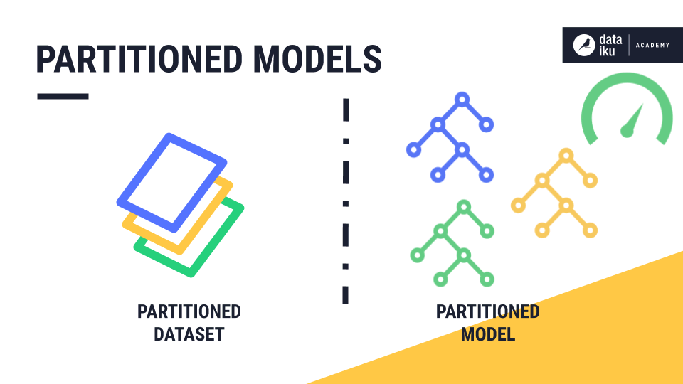

## Table of Contents

## What is a partitioning strategy in machine learning?

A partitioning strategy in machine learning is a method used to divide a dataset into different subsets for training, validation, and testing. This is important because it helps to evaluate how well a machine learning model will perform on new, unseen data. By splitting the data, we can train the model on one part, fine-tune it on another, and then test its performance on a completely separate part. This approach helps to prevent overfitting, where a model learns the training data too well, including its noise and outliers, and fails to generalize to new data.

Common partitioning strategies include the holdout method, k-fold cross-validation, and stratified sampling. In the holdout method, the dataset is split into two parts: one for training and one for testing. K-fold cross-validation involves dividing the dataset into k equal parts, or "folds." The model is trained on k-1 folds and tested on the remaining fold, and this process is repeated k times, with each fold serving as the test set once. Stratified sampling ensures that the proportion of each class in the dataset is maintained in each subset, which is particularly useful for imbalanced datasets where one class might be underrepresented.

## Why is data partitioning important in machine learning?

Data partitioning is important in machine learning because it helps us check if our model works well on new data. When we build a model, we want it to be good at guessing things it hasn't seen before. By splitting our data into different parts, we can train the model on some data, adjust it on other data, and then test it on a completely new set of data. This way, we can see how well the model will do in the real world, not just on the data we used to train it.

Another reason data partitioning is important is that it helps us avoid a problem called overfitting. Overfitting happens when a model learns too much from the training data, including the random errors and noise. If a model is overfit, it might do very well on the training data but poorly on new data. By using different parts of our data for training, validation, and testing, we can make sure our model is not just memorizing the training data but actually learning useful patterns that apply to new data too.

## What are the common types of data partitioning methods?

One common type of data partitioning method is the holdout method. In the holdout method, we take our whole dataset and split it into two parts: one for training the model and one for testing it. Usually, we use a bigger part of the data for training, like 70% or 80%, and a smaller part for testing, like 30% or 20%. This way, we can see how well our model works on new data it hasn't seen before.

Another method is k-fold cross-validation. In k-fold cross-validation, we divide our dataset into k equal parts, or "folds." We then train our model k times, each time using k-1 folds for training and the remaining fold for testing. For example, if we use 5-fold cross-validation, we train the model 5 times, each time leaving out a different fold for testing. This helps us get a better idea of how well our model works because it gets tested on all parts of the data.

The last common method is stratified sampling. Stratified sampling is useful when our data has different classes or categories, and we want to make sure each part of our data has the same mix of these classes. For example, if we have a dataset where 70% of the data is one class and 30% is another class, we want our training and testing sets to keep this 70-30 split. This helps make sure our model is trained and tested fairly, especially when some classes are more common than others.

## How does the train-test split work in partitioning data?

The train-test split is a simple way to divide your data into two parts: one for training your [machine learning](/wiki/machine-learning) model and the other for testing it. When you use the train-test split, you usually take a big part of your data, like 70% or 80%, to train your model. This part is called the training set. The smaller part, like 30% or 20%, is used to test how well your model works on new data it hasn't seen before. This smaller part is called the test set. By doing this, you can see if your model is good at guessing things it hasn't been trained on.

Using the train-test split helps you check if your model is overfitting. Overfitting happens when your model learns too much from the training data, including any mistakes or random stuff in it. If your model is overfit, it might do really well on the training data but badly on the test data. By keeping the test data separate, you can see if your model is just memorizing the training data or if it's actually learning useful patterns that work on new data too. This way, you can be more sure that your model will work well in real life.

## What is k-fold cross-validation and how does it improve model evaluation?

K-fold cross-validation is a method where we split our data into k equal parts, called "folds." We then train our model k times, each time using k-1 folds for training and the remaining fold for testing. For example, if we use 5-fold cross-validation, we train the model 5 times, each time leaving out a different fold for testing. This way, every piece of our data gets a chance to be in the test set.

Using k-fold cross-validation helps us get a better idea of how well our model works because it gets tested on all parts of the data. If we just use a simple train-test split, our results might depend a lot on which part of the data we chose for testing. But with k-fold cross-validation, we average the results from all k tests, so our evaluation is more reliable. This method helps us make sure our model isn't just good on one part of the data but works well across the whole dataset.

## Can you explain the concept of stratified sampling in data partitioning?

Stratified sampling is a way to split your data into different parts while making sure each part has the same mix of different types of data. Imagine you have a dataset where 70% of the data is one type and 30% is another type. When you use stratified sampling, you make sure that both your training and testing sets keep this 70-30 split. This is really helpful when you want your model to learn from all types of data fairly, especially if some types are more common than others.

Using stratified sampling helps make sure your model is trained and tested in a way that reflects the real world. If you didn't use stratified sampling, you might end up with a training set that has too much of one type of data and not enough of another. This could make your model good at guessing one type but bad at guessing the other. By keeping the same mix in both your training and testing sets, you can be more sure that your model will work well on new data it hasn't seen before.

## How does time series data affect partitioning strategies?

When you're working with time series data, which is data that changes over time, the way you split your data into training, validation, and testing sets needs to be different from other types of data. With time series data, you can't just mix up all the data and split it randomly. That's because the order of the data matters. For example, if you're predicting stock prices, you need to train your model on past data and test it on future data. So, you usually split the data in a way that keeps the time order, like using the earlier data for training and the later data for testing.

One common way to split time series data is to use a time-based split. You might decide to use the first 80% of your data for training and the last 20% for testing. This way, your model learns from the past and gets tested on the future. Another method is time series cross-validation, which is a bit like k-fold cross-validation but for time series. You train your model on a certain amount of past data and test it on a bit of future data, then you move the split forward in time and do it again. This helps you see how well your model works as time goes on.

## What are the challenges of imbalanced datasets in partitioning, and how can they be addressed?

Imbalanced datasets can make it hard to split data into training and testing sets because one type of data might be much more common than the others. If you split the data randomly, the training and testing sets might not have the same mix of data types. This can make your model good at guessing the common type but bad at guessing the rare types. For example, if you're trying to predict if a credit card transaction is fraud, and only 1% of transactions are fraud, your model might learn to always guess "not fraud" because that's what it sees most often.

To fix this problem, you can use a method called stratified sampling. Stratified sampling makes sure that the training and testing sets keep the same mix of data types as the whole dataset. If your dataset has 1% fraud and 99% not fraud, your training and testing sets will have the same 1% and 99% split. This helps your model learn from all types of data fairly. Another way to help with imbalanced datasets is to use techniques like oversampling the rare type or undersampling the common type. Oversampling means adding more copies of the rare type to the training set, while undersampling means removing some of the common type. Both methods can help your model learn better from the rare type of data.

## How do you determine the optimal size for training, validation, and test sets?

Choosing the right sizes for your training, validation, and test sets depends on how much data you have and what you're trying to do with your model. A common rule is to use about 60-80% of your data for training, 10-20% for validation, and 10-30% for testing. This split helps your model learn well from the training data, adjust to make it better using the validation data, and then check how well it works on new data with the test set. If you have a lot of data, you can use a bigger part for training because your model can learn more from it. But if you don't have much data, you might need to use a smaller part for training to make sure you have enough left for validation and testing.

Sometimes, you might need to change these sizes based on your specific problem. For example, if your dataset is imbalanced, meaning some types of data are much more common than others, you might want to use stratified sampling to make sure your sets have the same mix of data types. Also, if you're working with time series data, you might need to use a time-based split where you use earlier data for training and later data for testing. The key is to find a balance that lets your model learn well from the training data and still perform well on new, unseen data in the test set.

## What advanced techniques exist for data partitioning in large-scale machine learning?

In large-scale machine learning, advanced techniques for data partitioning are needed to handle big datasets efficiently. One such technique is distributed data partitioning, where data is split across multiple machines or nodes in a cluster. This allows for parallel processing, speeding up the training and testing of models. For example, in a distributed system, you might use a method called "data sharding" to divide the dataset into smaller chunks, or shards, that can be processed independently. This not only helps with managing large volumes of data but also makes it easier to scale your model training as your data grows.

Another advanced technique is online learning, where data is partitioned into a stream that is processed in real-time. Instead of having a fixed training set, validation set, and test set, the model continuously learns from new data as it comes in. This is particularly useful for applications where data is constantly being generated, like in recommendation systems or fraud detection. Online learning allows models to adapt quickly to new patterns and trends, making them more responsive to changes in the data. By using these advanced partitioning strategies, large-scale machine learning can become more efficient and effective.

## How can you implement data partitioning in popular machine learning libraries like scikit-learn or TensorFlow?

In scikit-learn, you can easily implement data partitioning using the `train_test_split` function. This function lets you split your data into training and testing sets with just a few lines of code. For example, if you have your features in a variable called `X` and your labels in a variable called `y`, you can use `train_test_split` to split them into training and testing sets. You can also set the size of the test set, like 20% of the data, and use a random state to make sure you get the same split every time you run your code. Here's how you can do it:

```python
from sklearn.model_selection import train_test_split

X_train, X_test, y_train, y_test = train_test_split(X, y, test_size=0.2, random_state=42)
```

In TensorFlow, you can use the `tf.data.Dataset` API to partition your data. This API is great for handling large datasets and can be used to split your data into training, validation, and testing sets. You can start by loading your data into a `tf.data.Dataset` object, then use methods like `take` and `skip` to create subsets of your data. For example, if you want to use 80% of your data for training and 20% for testing, you can calculate the sizes of these sets and split the data accordingly. Here's a simple way to do this in TensorFlow:

```python
import tensorflow as tf

# Assume 'dataset' is your tf.data.Dataset
dataset_size = len(list(dataset))
train_size = int(0.8 * dataset_size)
test_size = dataset_size - train_size

train_dataset = dataset.take(train_size)
test_dataset = dataset.skip(train_size)
```

## What are the latest research trends in data partitioning strategies for improving machine learning model performance?

Recent research in data partitioning strategies focuses a lot on handling big data and making machine learning models work better. One big trend is using smart ways to split data that can change and adapt as the model learns. This is called "adaptive partitioning." Researchers are finding that by changing how the data is split based on what the model is learning, the model can get better results. For example, if the model is having a hard time with certain types of data, the partitioning strategy might give it more of that type to learn from. This can help the model do better on new data it hasn't seen before.

Another trend is using more advanced math to figure out the best way to split data. Researchers are using things like optimization algorithms to find the best split that makes the model perform the best. They might use formulas like $$ \text{minimize} \sum_{i=1}^{n} (y_i - \hat{y}_i)^2 $$ to find the split that makes the difference between what the model guesses and what's actually true as small as possible. This can be really helpful for making sure the model works well on all kinds of data, not just the data it was trained on. By using these new methods, researchers are trying to make machine learning models more accurate and reliable.

## References & Further Reading

[1]: Bishop, C. M. (2006). ["Pattern Recognition and Machine Learning"](https://www.cs.uoi.gr/~arly/courses/ml/tmp/Bishop_book.pdf). Springer.

[2]: Goodfellow, I., Bengio, Y., & Courville, A. (2016). ["Deep Learning"](https://www.deeplearningbook.org/). MIT Press.

[3]: Kohavi, R. (1995). ["A Study of Cross-Validation and Bootstrap for Accuracy Estimation and Model Selection."](https://dl.acm.org/doi/10.5555/1643031.1643047) In Proceedings of the 14th International Joint Conference on Artificial Intelligence.

[4]: Hastie, T., Tibshirani, R., & Friedman, J. (2009). ["The Elements of Statistical Learning: Data Mining, Inference, and Prediction"](https://link.springer.com/book/10.1007/978-0-387-84858-7). Springer.

[5]: Chollet, F. (2018). ["Deep Learning with Python"](https://www.amazon.com/Deep-Learning-Python-Francois-Chollet/dp/1617294438). Manning Publications.

[6]: Géron, A. (2019). ["Hands-On Machine Learning with Scikit-Learn, Keras, and TensorFlow, 2nd Edition."](https://www.academia.edu/43840124/Hands_On_Machine_Learning_with_Scikit_Learn_Keras_and_TensorFlow_SECOND_EDITION_Concepts_Tools_and_Techniques_to_Build_Intelligent_Systems) O'Reilly Media.

[7]: Xu, Y., Goodacre, R. (2018). ["On Splitting Training and Validation Set: A Comparative Study of Cross-Validation, Bootstrap and Systematic Sampling for Estimating the Generalization Performance of Supervised Learning."](https://pubmed.ncbi.nlm.nih.gov/30842888/) ChemRxiv.