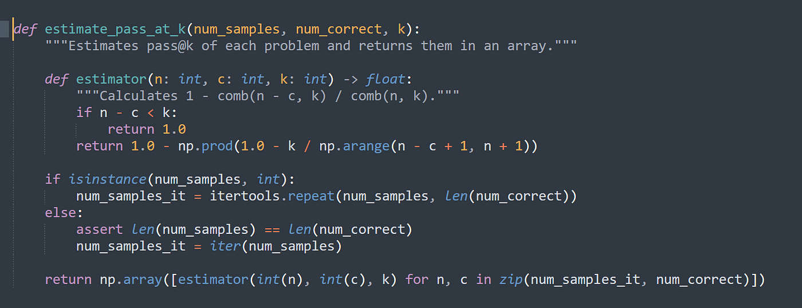

## Table of Contents

## What is Pass At K (Pass@K) in machine learning?

Pass At K, or Pass@K, is a metric used in machine learning to evaluate how well a model can rank items in a list. It measures the probability that at least one relevant item is included in the top K positions of the ranked list. For example, if you are searching for a specific item in a list of 100 items, Pass@K would tell you the chance that the item you want is among the top K results, like the top 5 or top 10.

This metric is particularly useful in scenarios like recommendation systems or search engines, where the goal is to present the most relevant items first. To calculate Pass@K, you look at each query or user request and check if any of the relevant items appear in the top K positions. If they do, it's a pass; if not, it's a fail. The final Pass@K score is the average of these pass/fail results across all queries.

## How does Pass@K differ from traditional accuracy metrics?

Pass@K is different from traditional accuracy metrics because it focuses on the ranking of items rather than just whether the prediction is correct or not. Traditional accuracy metrics, like overall accuracy or precision, measure how often the model's predictions are correct across all items. For example, accuracy might tell you that out of 100 predictions, 90 were correct. In contrast, Pass@K looks at whether at least one relevant item appears in the top K positions of a ranked list. This is important in situations where the order of results matters, like in search engines or recommendation systems, where users care more about seeing relevant items at the top of the list.

To illustrate, imagine you're using a search engine to find information on "machine learning." Traditional accuracy might tell you if the search engine correctly identifies relevant pages out of all the pages it knows about. However, Pass@K would tell you the probability that at least one relevant page is among the top 5 or top 10 results. This makes Pass@K more useful for evaluating how well a system can quickly show you what you're looking for, rather than just how often it's right overall.

## What are the key components needed to calculate Pass@K?

To calculate Pass@K, you need a list of items ranked by a model, and you need to know which of those items are relevant to the user's query. For each query, you check if any of the relevant items are in the top K positions of the ranked list. If at least one relevant item is in the top K, you count it as a pass. If none of the relevant items are in the top K, you count it as a fail. You do this for all your queries and then find the average of the pass results to get the Pass@K score.

The formula for Pass@K is simple. If you have N queries, and for each query, you check if there's at least one relevant item in the top K positions, you can calculate Pass@K like this: $$ \text{Pass@K} = \frac{\text{Number of queries with at least one relevant item in top K}}{\text{Total number of queries}} $$. This gives you a number between 0 and 1, where a higher number means the model is better at putting relevant items at the top of the list.

## Can you explain the formula for calculating Pass@K?

The formula for calculating Pass@K is straightforward. You need to know how many queries you have and how many of those queries have at least one relevant item in the top K positions of the ranked list. If you have a total of N queries, and for each query, you check if there's at least one relevant item in the top K positions, you can calculate Pass@K by dividing the number of queries with at least one relevant item in the top K by the total number of queries. The formula looks like this: $$ \text{Pass@K} = \frac{\text{Number of queries with at least one relevant item in top K}}{\text{Total number of queries}} $$. This gives you a number between 0 and 1, where a higher number means the model is better at putting relevant items at the top of the list.

For example, if you have 100 queries and 80 of those queries have at least one relevant item in the top K positions, then your Pass@K would be 0.80. This means that 80% of the time, the model was able to place at least one relevant item in the top K positions. This metric is really useful for understanding how well a model can rank items so that the most important ones are seen first by users.

## In what scenarios is Pass@K particularly useful?

Pass@K is particularly useful in scenarios where the order of results matters a lot, like in search engines and recommendation systems. Imagine you're searching for something online. You don't want to scroll through pages and pages of results to find what you need. You want the most relevant information right at the top. Pass@K helps measure how good a search engine or recommendation system is at doing just that. It tells you the chance that at least one thing you're looking for is among the top few results.

For example, if you're using a music app to find songs by your favorite artist, you want those songs to show up first. Pass@K can tell you how often the app gets it right and puts at least one of those songs in the top 5 or top 10 results. This metric is great for businesses too because it helps them see how well their systems are working at showing users what they want quickly. If Pass@K is high, it means users are more likely to find what they need without much effort, which makes for a better user experience.

## How do you interpret the results of Pass@K?

When you look at the results of Pass@K, you're seeing how good a system is at putting important things at the top of a list. If the Pass@K score is high, it means that most of the time, the system can find at least one thing you want in the first few spots. For example, if Pass@K is 0.80, it means that 80% of the time, there's at least one relevant item in the top K spots. This is great because it shows that the system is doing a good job at showing you what you need quickly.

On the other hand, if the Pass@K score is low, it means the system isn't doing so well at putting important things at the top. You might have to look through more results to find what you want. If Pass@K is 0.20, it means only 20% of the time does the system get it right and show you a relevant item in the top K spots. This tells you that the system might need some work to make it better at finding and showing you what you're looking for right away.

## What are the limitations of using Pass@K as a performance metric?

One limitation of using Pass@K as a performance metric is that it only cares about whether at least one relevant item is in the top K spots. It doesn't tell you how many relevant items are there or how well the rest of the list is ranked. For example, if you're looking for songs by a certain artist, Pass@K might be high if one song is in the top 5, but it won't tell you if the other four songs in the top 5 are also by that artist or if they're completely unrelated.

Another limitation is that Pass@K doesn't consider how important each relevant item is. Imagine you're searching for information on a topic, and the most important article is ranked 6th. If K is set to 5, Pass@K would say the search failed, even though the most important result is just one spot away. This can make Pass@K less useful in situations where the exact ranking of items matters a lot.

## How can Pass@K be implemented in a machine learning model evaluation?

To implement Pass@K in a machine learning model evaluation, you first need to have a list of items ranked by your model and a way to identify which items are relevant to the user's query. For each query, you go through the top K items in the ranked list and check if any of them are relevant. If at least one relevant item is found in the top K positions, you count that query as a pass. If no relevant items are in the top K, you count it as a fail. You do this for all your queries and then calculate the Pass@K score by dividing the number of queries that passed by the total number of queries. The formula for Pass@K is $$ \text{Pass@K} = \frac{\text{Number of queries with at least one relevant item in top K}}{\text{Total number of queries}} $$. This gives you a number between 0 and 1, where a higher number means the model is better at putting relevant items at the top of the list.

In practice, implementing Pass@K can be done using a simple loop in your programming language of choice. For example, in Python, you might use a loop to go through each query, check the top K items, and keep a count of how many queries pass the test. Here's a basic example of how you might implement it:

```python
def pass_at_k(predictions, relevant_items, k):
    pass_count = 0
    for query_predictions, query_relevant_items in zip(predictions, relevant_items):
        top_k_predictions = query_predictions[:k]
        if any(item in top_k_predictions for item in query_relevant_items):
            pass_count += 1
    return pass_count / len(predictions)

# Example usage
predictions = [[1, 2, 3, 4, 5], [6, 7, 8, 9, 10]]  # Predicted rankings for two queries
relevant_items = [[2, 4], [7, 9]]  # Relevant items for the two queries
k = 3  # We're interested in the top 3 items
pass_at_k_score = pass_at_k(predictions, relevant_items, k)
print(f"Pass@K score: {pass_at_k_score}")
```

This code calculates the Pass@K score for a set of predictions and relevant items, showing how you can evaluate your model's performance using this metric.

## What are some common pitfalls to avoid when using Pass@K?

When using Pass@K, one common pitfall to avoid is focusing too much on whether just one relevant item is in the top K spots. This can make you miss out on how well the rest of the list is ranked. For example, if you're searching for songs by your favorite artist, Pass@K might be high if one song is in the top 5, but it won't tell you if the other four songs are also by that artist or if they're completely different. This can lead to a false sense of how good your model really is at ranking items.

Another pitfall is not considering the importance of each relevant item. Imagine you're looking for information on a topic, and the most important article is ranked 6th. If K is set to 5, Pass@K would say the search failed, even though the most important result is just one spot away. This can make Pass@K less useful in situations where the exact ranking of items matters a lot. To avoid these issues, it's helpful to use Pass@K along with other metrics that look at different parts of your model's performance.

## How does Pass@K relate to other ranking metrics like Mean Average Precision?

Pass@K and Mean Average Precision (MAP) are both used to evaluate how well a model ranks items, but they focus on different things. Pass@K looks at whether at least one relevant item is in the top K spots of the list. It's like checking if you can find something important quickly. For example, if you're searching for a song, Pass@K tells you the chance that at least one of your favorite songs is in the top 5 or 10 results. The formula for Pass@K is $$ \text{Pass@K} = \frac{\text{Number of queries with at least one relevant item in top K}}{\text{Total number of queries}} $$. This gives you a number between 0 and 1, where a higher number means the model is good at putting relevant items at the top.

Mean Average Precision (MAP), on the other hand, looks at how well the model ranks all the relevant items across the whole list. It cares about the exact position of each relevant item and how many relevant items are in the list. MAP calculates the average precision at each point where a relevant item is found and then averages those values across all queries. This makes MAP more detailed than Pass@K because it considers the full ranking of items, not just the top K. Both metrics are useful, but Pass@K is simpler and focuses on quick access to relevant items, while MAP gives a more complete picture of the model's ranking performance.

## Can you provide an example of a real-world application where Pass@K was used effectively?

In a real-world application, Pass@K was used effectively by a popular music streaming service to improve its song recommendation system. The service wanted to make sure that when users searched for songs by their favorite artists, those songs appeared at the top of the search results. They used Pass@K to measure how often at least one song by the searched artist was in the top 5 results. By tracking this metric, the service was able to tweak their algorithms to increase the Pass@K score, which meant users were more likely to find what they were looking for quickly. This led to a better user experience and higher user satisfaction.

For example, if the service had 1000 searches for songs by different artists, and in 850 of those searches, at least one song by the searched artist was in the top 5 results, the Pass@K score would be $$ \text{Pass@K} = \frac{850}{1000} = 0.85 $$. This high score indicated that the recommendation system was doing a good job at placing relevant songs at the top of the list. As a result, users spent less time searching and more time enjoying their music, which helped the service stand out in a competitive market.

## What advanced techniques can be used to optimize models based on Pass@K?

To optimize models based on Pass@K, one advanced technique is to use learning to rank algorithms. These algorithms are designed to improve the order of items in a list so that the most relevant items are at the top. For example, you can use techniques like LambdaMART, which is a type of gradient boosting method. LambdaMART works by directly optimizing the ranking of items based on user feedback, which can help improve the Pass@K score. By training the model to focus on placing at least one relevant item in the top K positions, you can increase the chances that users find what they're looking for quickly.

Another technique is to use reinforcement learning, where the model learns from its actions and the feedback it receives. In this approach, the model is rewarded for placing relevant items in the top K spots. The reward could be based on the formula for Pass@K, $$ \text{Pass@K} = \frac{\text{Number of queries with at least one relevant item in top K}}{\text{Total number of queries}} $$. Over time, the model adjusts its ranking strategy to maximize this reward, which leads to a higher Pass@K score. This method is particularly useful in dynamic environments where user preferences might change, allowing the model to adapt and continue to perform well.