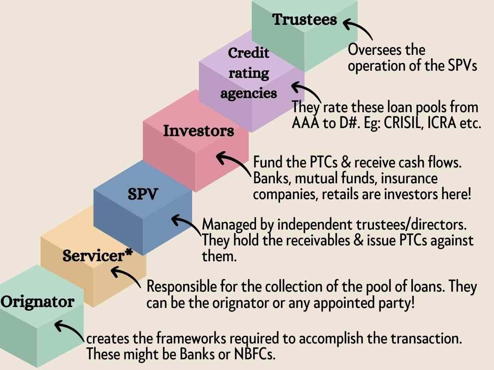

In the complex world of investment, understanding the various financial instruments is crucial for making informed decisions and achieving financial goals. Among the diverse array of investment options, pass-through certificates and algorithmic trading are two notable instruments that investors can explore to diversify their portfolios and potentially enhance returns.

Pass-through certificates are financial instruments that provide investors with an undivided interest in a pool of underlying assets, typically mortgages. These certificates are structured to pass the collected principal and interest payments from borrowers directly to the investors after deducting administrative fees. Often issued by government-sponsored entities like Ginnie Mae, pass-through certificates offer a steady income stream, making them appealing to investors seeking fixed-income opportunities.



On the other hand, algorithmic trading represents a modern, technology-driven approach to investment. It leverages complex algorithms executed by computers to facilitate rapid and efficient trading across financial markets. This method has revolutionized the trading landscape by improving market liquidity, reducing transaction costs, and enabling sophisticated trading strategies. However, the adoption of algorithmic trading also brings new challenges and risks, including potential for increased market volatility and susceptibility to system errors.

This article aims to unravel the mechanisms behind pass-through certificates and illustrate how algorithmic trading is reshaping financial markets. By examining their operational frameworks, associated risks, and potential benefits, investors will gain insights into utilizing these financial instruments effectively. Understanding these components is essential for navigating market complexities and leveraging these tools to meet investment objectives in an ever-evolving financial ecosystem.

## Table of Contents

## Understanding Pass-Through Certificates

Pass-through certificates are vital financial instruments that provide investors with an undivided interest in a pool of underlying mortgage loans. These certificates are typically issued by government-sponsored entities such as the Government National Mortgage Association (Ginnie Mae) and represent a common form of mortgage-backed security. Investors who hold pass-through certificates earn a steady income stream through periodic payments consisting of both interest and principal from the mortgages within the pool.

The structure of pass-through certificates involves pooling numerous individual home mortgages that share similar characteristics in terms of interest rates and maturities. The mortgage pool is then used to back the issuance of the certificate. Investors receive a proportional share of the cash flows generated by the pool. The payments made by homeowners on their loans, which include monthly interest and principal repayments, are 'passed through' to certificate holders after deducting servicing fees. This process creates a fixed-income investment opportunity akin to owning bonds.

From a risk and return perspective, pass-through certificates are appealing to investors seeking stable income streams. They provide diversification benefits as the cash flows stem from a large number of mortgage loans rather than depending on the repayment capability of a single borrower. Furthermore, since entities like Ginnie Mae guarantee the timely payment of principal and interest, these certificates [carry](/wiki/carry-trading) an implied government backing, thus reducing default risk.

However, it’s essential to note that while pass-through certificates can offer predictable income, they are subject to certain risks such as prepayment risk, which occurs when homeowners repay their mortgages earlier than expected. This can affect the timing of cash flows and alter the expected yield of the investment. Interest rate [volatility](/wiki/volatility-trading-strategies) also plays a significant role, impacting the attractiveness of pass-through certificates relative to other securities.

Overall, pass-through certificates represent a crucial component in the landscape of fixed-income securities, offering [liquidity](/wiki/liquidity-risk-premium) and a reliable income stream for investors who understand the underlying dynamics and risks associated with mortgage-backed securities.

## Investment Mechanism of Pass-Through Certificates

In the intricate landscape of financial instruments, pass-through certificates serve as a vital conduit for investors seeking fixed-income opportunities. These certificates are essentially securities that reflect an undivided interest in a pool of mortgages. When banks originate mortgages, they often prefer not to retain them on their balance sheets due to capital constraints and risk management practices. Instead, banks sell these mortgages to institutional investors who aggregate them into mortgage pools, subsequently issuing pass-through certificates. 

Investors purchasing these certificates are entitled to receive monthly payments that mirror the homeowner's mortgage repayments, comprising both interest and principal. This setup transforms the investment from one involving direct property interest to a more liquid form of mortgage-backed security (MBS).

The pass-through mechanism benefits banks by significantly improving liquidity. By converting illiquid mortgage loans into securities that can be sold to investors, banks are able to free up capital. This enhances their ability to extend further loans, thus supporting a continued cycle of lending and economic activity.

From an operational standpoint, the process begins with the bank, or originator, selling a bundle of mortgages to a specially created trust or conduit. This entity is often facilitated by a government-sponsored enterprise (GSE) like Freddie Mac or Fannie Mae, or agencies such as Ginnie Mae, which play a critical role in ensuring the pool's creditworthiness. The trust issues pass-through certificates to investors, entitling them to their share of the cash flows from the underlying mortgage pool.

Investors in pass-through certificates gain an advantageous position in the financial value chain by accessing the mortgage market without needing direct property management. Their income is directly linked to the performance of the homeowners' repayments. Consequently, these investments are sensitive to factors such as [interest rate](/wiki/interest-rate-trading-strategies) fluctuations and changes in borrower credit behavior. Nonetheless, they offer a way for investors to participate in the residential and commercial mortgage markets through a diversified and interest-bearing security. In summary, pass-through certificates embody a symbiotic mechanism where banks enhance liquidity and lending capacity, while investors gain access to steady income streams from the pooled mortgage payments.

## Algorithmic Trading and Its Impact on Investments

Algorithmic trading, an advanced method of executing trades utilizing complex mathematical models and high-speed computer systems, has significantly transformed the investment landscape. By leveraging computer algorithms, trades can be executed at speeds and frequencies far beyond human capabilities, thereby optimizing trading strategies and improving market efficiency. 

One major advantage of [algorithmic trading](/wiki/algorithmic-trading) is its ability to enhance market liquidity—ensuring that there is always a buyer or a seller in the market. This liquidity reduces price volatility, as trades are executed swiftly without causing large price swings. The algorithms can quickly analyze a vast amount of data, identifying patterns that inform decisions to buy or sell, which optimizes strategies by capturing minute price discrepancies.

However, algorithmic trading comes with certain risks. One primary concern is market manipulation. Algorithms can be designed to exploit the trading patterns of other market participants, potentially leading to unethical trading practices like spoofing—where orders are placed with the intention to cancel before execution to create fake demand or supply. This manipulation can distort market prices and erode investor confidence.

Additionally, algorithmic trading can lead to increased market volatility. The high speed of trade execution may cause rapid and wide fluctuations in prices, particularly in situations where multiple algorithms react simultaneously to the same market signal. A prime example is the "Flash Crash" of May 6, 2010, when the Dow Jones Industrial Average plummeted nearly 1,000 points within minutes, largely attributed to a single mutual fund's algorithm reacting unexpectedly in the market.

The growing impact of algorithmic trading has prompted regulatory bodies to introduce measures aimed at mitigating associated risks. For instance, the European Union’s Markets in Financial Instruments Directive II (MiFID II) and the U.S. Securities and Exchange Commission (SEC) have implemented rules requiring transparency in algorithmic orders and the ability to quickly suspend or halt trading if excessive volatility is detected. These regulations are designed to safeguard the integrity of financial markets and protect investors from the potential drawbacks of high-speed trading technologies.

In conclusion, while algorithmic trading offers substantial benefits in terms of efficiency and liquidity, it also necessitates a comprehensive understanding of the risks involved. Investors and regulatory bodies must continuously assess and adapt their strategies to ensure a balanced approach that harnesses the benefits while minimizing systemic risks within the financial markets.

## Risk Assessment in Pass-Through Securities

Pass-through securities, while offering predictable income streams, come with their own set of risks that investors need to carefully evaluate. Among these are borrower default, prepayment, and interest rate fluctuations, each of which can significantly impact investment outcomes.

### Borrower Default Risk
This risk arises when homeowners, whose mortgages are pooled into pass-through securities, fail to meet their payment obligations. When defaults occur, the anticipated cash flows to investors may be disrupted. The severity of this impact can vary depending on the credit quality of the borrowers within the mortgage pool. Investors can mitigate default risk by investing in securities backed by high-quality mortgage pools, often indicated by high credit ratings. Additionally, government-backed pass-through securities, such as those issued by Ginnie Mae, provide an implicit guarantee against default, although they generally offer lower yields compared to non-guaranteed securities due to this added safeguard.

### Prepayment Risk
Prepayment risk is associated with the possibility that borrowers will repay their mortgages earlier than expected, particularly in a declining interest rate environment where refinancing becomes attractive. Early repayments lead to a reinvestment risk for investors, as they may have to reinvest the returned principal at lower prevailing interest rates. This risk can be modeled and analyzed using tools like the PSA prepayment model, which helps investors understand expected prepayment speeds under different interest rate scenarios.

For instance, consider the Python code snippet below that calculates the impact of varying prepayment speeds on yield:

```python
def prepayment_yield(initial_yield, prepayment_rate, market_rate):
    adjusted_yield = initial_yield * (1 - prepayment_rate) + market_rate * prepayment_rate
    return adjusted_yield

initial_yield = 0.05  # 5% initial yield
prepayment_rate = 0.20  # 20% prepayment
market_rate = 0.03  # 3% market rate

adjusted_yield = prepayment_yield(initial_yield, prepayment_rate, market_rate)
print(f"Adjusted Yield: {adjusted_yield*100:.2f}%")
```

### Interest Rate Fluctuations
Interest rate changes impact the value of pass-through securities. As interest rates rise, the value of these fixed-income investments tends to decline, and vice versa. This sensitivity to interest rate changes is often measured by duration and convexity. Investors need to ensure that the duration of their investments aligns with their risk tolerance and investment horizon. To mitigate interest rate risk, diversification across different maturities and hedging strategies using financial derivatives can be employed.

In conclusion, while pass-through securities provide opportunities for predictable income, understanding and managing associated risks is vital. Employing strategies to address these risks, such as focusing on high-quality pools, considering prepayment impacts, and managing interest rate exposure, can help investors align their pass-through security investments with their overall financial objectives.

## Algorithmic Trading: Risks and Challenges

Algorithmic trading offers significant advantages in terms of speed and efficiency but is also fraught with considerable systemic risks. These risks were starkly displayed during the Flash Crash of May 6, 2010, when major U.S. equity indices plummeted rapidly within minutes, only to recover shortly thereafter. The causes of the Flash Crash were linked to high-speed algorithmic trading and the amplification of rapid sell orders by computer algorithms, which led to a liquidity vacuum and extreme price volatility. This event highlighted vulnerabilities in the market’s infrastructure where algorithms, designed to protect against losses, instead exacerbated the downturn by contributing to a self-reinforcing loop of selling.

The potential for market manipulation through algorithmic trading is another risk [factor](/wiki/factor-investing). Algorithmic systems, designed for efficiency, can be subject to misuse or faulty configurations. For instance, algorithms could be programmed to execute specific order patterns that might influence stock prices artificially, a practice known as spoofing. Such tactics undermine market integrity and can have severe consequences for the reliability of financial systems.

Regulatory bodies have responded to these challenges with an array of measures aimed at mitigating risks associated with algorithmic trading. Post-Flash Crash, regulatory reforms were implemented to protect investors and stabilize financial markets. The Securities and Exchange Commission (SEC), for instance, introduced new rules and modifications, such as circuit breakers, that allow for trading halts in response to rapid price movements in specific stock prices. These circuit breakers create a pause in trading, facilitating a period for investigation and stabilization.

Additional rules include the implementation of pre-trade risk controls and post-trade surveillance mechanisms to monitor trading activity more effectively. These controls ensure that algorithms comply with regulatory standards designed to prevent unfair trading practices. Furthermore, enhanced reporting requirements ensure greater transparency, enabling regulators to identify and address potential threats swiftly.

International collaborations and the establishment of global standards function as further deterrents to systemic risk, promoting a healthier trading ecosystem. Exchanges and trading platforms are also mandated to conduct regular audits of their algorithmic trading systems, ensuring resilience against potential disruptions.

In summary, while algorithmic trading stands as a pillar in modern financial markets due to its efficiency and speed, its inherent risks require vigilant regulatory oversight and robust risk management practices to safeguard market stability and integrity.

## Strategies for Mitigating Investment Risks

Diversification and thorough research are paramount in managing investment risks associated with pass-through securities and algorithmic trading. Diversification involves spreading investments across different asset classes to reduce exposure to any single entity or market event. For example, investors might consider allocating their portfolio into various fixed-income securities and equities to ensure that the performance of pass-through securities does not overly dictate overall portfolio returns.

Thorough research provides a foundational understanding of the underlying assets and market trends. Investors should analyze historical data, credit ratings, and economic indicators to assess the stability and potential returns of pass-through certificates. For algorithmic trading, understanding the algorithms and models is critical. Evaluating their past performance through [backtesting](/wiki/backtesting) and simulating various market conditions can illuminate potential weaknesses and opportunities for enhancement. Python, with libraries such as NumPy and pandas, can be a powerful tool for such analyses, as illustrated below:

```python
import pandas as pd
import numpy as np

# Example calculation for portfolio diversification
returns = pd.DataFrame({
    'PassThrough': np.random.normal(0.05, 0.02, 100),
    'Equities': np.random.normal(0.07, 0.03, 100)
})

# Calculate the portfolio's expected return and volatility
portfolio_weights = np.array([0.6, 0.4])
expected_return = np.sum(returns.mean() * portfolio_weights)
portfolio_variance = np.dot(portfolio_weights.T, np.dot(returns.cov(), portfolio_weights))
portfolio_volatility = np.sqrt(portfolio_variance)

print(f"Expected Portfolio Return: {expected_return:.2%}")
print(f"Portfolio Volatility: {portfolio_volatility:.2%}")
```

Adaptability is another crucial component in mitigating risks. Financial markets are highly dynamic, and investors must be prepared to adjust their strategies in response to changes. This includes re-evaluating their asset allocation or modifying algorithmic strategies to account for new market data or regulatory changes. Employing advanced risk management tools, such as real-time analytics, scenario analysis, and stress testing, further shields investors from unforeseen market shifts.

Investors should blend diversification, detailed research, adaptability, and advanced tool use. This holistic approach not only safeguards against immediate risks but also positions investors to capitalize on emerging market trends, leading to optimized investment outcomes.

## Conclusion

Investing in financial instruments like pass-through certificates and engaging in algorithmic trading demands a thorough understanding and vigilant risk management strategies. Pass-through certificates offer a fixed-income opportunity by providing investors with a share of payments from a pool of mortgages. However, they are susceptible to risks such as borrower defaults, prepayments, and fluctuations in interest rates. Recognizing these risks is crucial for investors to align potential returns with their financial goals.

Algorithmic trading represents a modern approach to executing trades, providing speed and efficiency. While this method can enhance market liquidity and optimize trading strategies, it also introduces risks, including market manipulation and increased volatility. Historical events, such as the Flash Crash, have highlighted these vulnerabilities, prompting regulatory changes and the need for robust risk management practices.

By comprehending the underlying mechanisms and associated risks of these financial instruments, investors can strategically navigate the complexities of modern financial markets. Staying informed and adopting dynamic strategies tailored to individual risk appetites and investment objectives are vital for achieving desired outcomes. This proactive approach ensures that investors remain agile, capable of adjusting to market shifts and leveraging opportunities effectively.

## References & Further Reading

[1]: Fabozzi, F. J., Bhattacharya, A. K., & Berliner, W. S. (2010). ["Mortgage-Backed Securities: Products, Structuring, and Analytical Techniques"](https://www.semanticscholar.org/paper/Mortgage-Backed-Securities%3A-Products%2C-Structuring%2C-Fabozzi-Bhattacharya/079a00b3778cd64b681de9581e75890513f35f01). Oxford University Press.

[2]: Lopez de Prado, M. (2018). ["Advances in Financial Machine Learning"](https://www.amazon.com/Advances-Financial-Machine-Learning-Marcos/dp/1119482089). Wiley.

[3]: Johnson, A., & Hazelhurst, S. (2018). ["Algorithmic Trading and the Flash Crash,"](https://www.sciencedirect.com/science/article/pii/S2214845013000082) Studies in Microeconomics, 6(1), 84-122.

[4]: Gyntelberg, J., & Mamatzakis, E. (2017). ["Algorithmic trading in global financial markets."](https://scholar.google.com/citations?user=YSgQvgcAAAAJ) BIS Papers, No 60.

[5]: Chance, D. M., & Hemler, M. L. (1993). ["The performance of professional market timing systems in the stock market."](https://www.scirp.org/reference/referencespapers?referenceid=2481382) Financial Analysts Journal, 49(4), 16-28.

[6]: Aronson, D. R. (2007). ["Evidence-Based Technical Analysis: Applying the Scientific Method and Statistical Inference to Trading Signals"](https://onlinelibrary.wiley.com/doi/book/10.1002/9781118268315). Wiley.