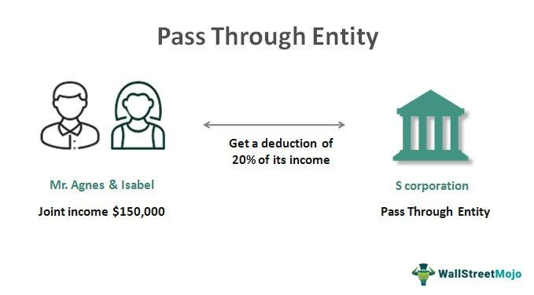

Financial mechanisms are integral components of the global economy, shaping the flow of capital and enhancing market efficiency. Among these mechanisms, pass-through rates play a pivotal role in determining the net interest return to investors in securitized assets such as mortgage-backed securities (MBS). These financial instruments package home loans into securities sold to investors, fundamentally altering the dynamics of mortgage lending by providing liquidity and stability.

The concept of pass-through rates is essential for investors aiming to understand how returns are generated from MBS. These rates reflect the net interest paid to investors after accounting for management and guarantee fees deducted by entities such as Fannie Mae and Freddie Mac. An understanding of pass-through rates equips investors with the tools they need to make informed decisions, projecting returns while considering the influence of economic variables such as fixed versus variable mortgage rates.



This article aims to provide a comprehensive overview of pass-through rates, focusing on asset-backed securities, particularly MBS. The discussion extends to the application of pass-through rates in algorithmic trading systems, where sophisticated algorithms automate investment strategies, enhancing market efficiency but also introducing new risks. Through algorithmic trading, investors can optimize their portfolios in real-time, reacting swiftly to economic shifts. However, this approach necessitates robust risk management strategies to mitigate potential downsides such as market manipulation and systemic risks.

In addition, the article will explore economic examples illustrating the effects of economic conditions on pass-through rates by examining the operations of Fannie Mae and Freddie Mac. Understanding how these entities influence liquidity and affordability in the housing market is crucial for investors using pass-through securities as part of their strategy.

Finally, potential risks in utilizing financial mechanisms like pass-through rates and algorithmic trading will be scrutinized, alongside effective risk management practices. By implementing advanced risk management tools and continuously adapting to evolving market conditions, investors can navigate the complexities of modern financial markets with greater assurance.

Through a detailed exploration of these topics, investors will gain deeper insights into the strategic use of pass-through rates within algorithmic trading, learning to leverage these financial mechanisms effectively while managing inherent risks.

## Table of Contents

## Understanding Pass-Through Rates

Pass-through rates represent the net [interest rate](/wiki/interest-rate-trading-strategies) provided to investors after accounting for the fees associated with a securitized asset. In the context of mortgage-backed securities (MBS) and similar financial instruments, these rates are pivotal in determining the investor's returns. Generally, a pass-through rate accounts for deductions such as management fees and guarantee fees, which results in it being consistently lower than the interest rate on the individual underlying securities of the MBS.

The understanding of pass-through rate composition is crucial for investors aiming to project potential returns effectively. The rate is essentially derived from the gross interest rate of the securitized mortgages less the servicing fee, management fee, and any additional guarantee fees. For example, if the gross interest rate on the mortgage is 3.5%, and the sum of the fees is 0.5%, the pass-through rate would be 3.0%.

Mathematically, the pass-through rate ($R_{pt}$) can be expressed as:

$$
R_{pt} = R_{gross} - (F_{serv} + F_{man} + F_{guar})
$$

where:
- $R_{gross}$ is the gross interest rate of the original mortgage.
- $F_{serv}$, $F_{man}$, and $F_{guar}$ represent the servicing, management, and guarantee fees, respectively.

The dynamics of pass-through rates are influenced by various factors, including the nature of the mortgage interest rates (fixed or variable) and prevailing economic conditions. Influences such as interest rate fluctuations, inflation, and economic growth can all affect these rates, as they alter the expected cash flows from the underlying mortgages and the associated risk perceptions by investors.

A distinction between fixed and variable mortgage rates is essential as well. Fixed-rate mortgages result in consistent pass-through rates until maturity, providing stable expected returns. In contrast, variable-rate mortgages lead pass-through rates to fluctuate reflecting broader interest rate changes, adding a layer of complexity to return projections for investors.

Understanding these concepts and how they interact with broader economic conditions allows investors to anticipate changes in pass-through rates and adjust their strategies accordingly. This knowledge is instrumental in optimizing investment portfolios and achieving desired financial outcomes amidst varying market conditions.

## Economic Examples: Pass-Through Rates in Practice

Fannie Mae (Federal National Mortgage Association) and Freddie Mac (Federal Home Loan Mortgage Corporation) are pivotal entities in the United States housing finance system. Their operations significantly influence mortgage [liquidity](/wiki/liquidity-risk-premium), stability, and affordability. Both institutions operate primarily by purchasing mortgages from primary lenders and then pooling them into mortgage-backed securities (MBS). These securities are subsequently sold to investors, with the promise of pass-through rates reflecting the mortgage payments, minus servicing and guarantee fees.

### The Role of Fannie Mae and Freddie Mac

Fannie Mae and Freddie Mac play a crucial role by providing liquidity to the housing market. By purchasing mortgages from lenders, they enable these lenders to relinquish their existing liabilities and extend further credit to homebuyers. This process of securitization involves converting illiquid mortgage loans into more liquid, tradeable securities. As a result, the housing market benefits from greater stability and affordability, as lenders are more willing to provide loans due to the reduced risk from offloading them to these government-sponsored enterprises (GSEs).

### Pass-Through Rates and Economic Conditions

Pass-through rates are the net rates of return investors receive from MBS, after accounting for fees. These rates are influenced by various factors, including the broader economic environment and monetary policy. During periods of economic stability, interest rates tend to be predictable, which in turn stabilizes pass-through rates. Conversely, during economic downturns or volatile cycles, interest rate fluctuations can cause significant variability in pass-through rates.

For instance, during the 2008 financial crisis, turmoil in the housing market led to wider spreads in mortgage rates. As a result, pass-through rates also exhibited increased [volatility](/wiki/volatility-trading-strategies), impacting investor returns. Such conditions necessitated adjustments in investor strategies, with a focus on risk management and careful assessment of economic signals. The variability in pass-through rates during these periods provided insights into mortgage prepayment risks and credit risks associated with MBS investments.

### Fluctuations During Economic Cycles

Economic cycles play a substantial role in the performance of mortgage-backed securities. In expansionary phases, with stable or rising interest rates and low default risks, pass-through rates typically present more predictable outcomes. However, during contractionary phases, when economic conditions deteriorate, the risk of defaults increases, potentially leading to lower than expected returns on MBS with pass-through rates.

Investors typically leverage historical data and forecasts to refine strategies during such cycles. By analyzing trends from past economic periods, such as the credit expansion of the early 2000s followed by the subsequent housing market collapse, investors can better anticipate changes in MBS valuations and associated pass-through rates. This historical perspective aids in devising more nuanced strategies that consider both macroeconomic indicators and specific mortgage market conditions.

In summary, understanding the operation of Fannie Mae and Freddie Mac, along with the influence of economic conditions on pass-through rates, is essential for investors in mortgage-backed securities. By acknowledging these factors and utilizing economic data, investors can effectively manage risk and optimize their portfolios during varying economic cycles.

## Algorithmic Trading and Pass-Through Rates

Algorithmic trading employs sophisticated computer algorithms to execute high-speed trading strategies across financial markets. This technology has revolutionized the way trading is conducted, offering significant improvements in market efficiency through the rapid execution of large volumes of trades. However, [algorithmic trading](/wiki/algorithmic-trading) also introduces unique risks such as market manipulation and systemic financial risks, highlighting the necessity for stringent risk management practices.

One critical application of algorithmic trading is the integration of pass-through rates, particularly within the sphere of asset-backed securities (ABS). Pass-through rates, which represent the net interest rate returned to investors after fees, can be effectively managed through automated systems to streamline the selection and management of securities like mortgage-backed securities (MBS). In these systems, algorithms make decisions based on current pass-through rates, adjusting portfolios dynamically to optimize returns and manage risk exposure.

The Flash Crash of 2010 serves as a prominent example of the risks associated with algorithmic trading. On May 6, 2010, the U.S. stock market saw a rapid and severe drop in asset prices, followed by an equally fast recovery. This incident was linked to the use of algorithmic trading strategies that contributed to the sudden volatility, underscoring the potential for such systems to introduce unintended effects in real-time trading environments.

To mitigate these risks, best practices for algorithmic trading systems must be implemented. These include robust algorithm design with built-in safeguards to prevent erratic behavior, comprehensive testing under various market conditions, and the inclusion of risk management protocols to address potential systemic impacts. Moreover, regulatory oversight and transparency in algorithmic trading practices can further help in minimizing the risks of market manipulation and systemic crises.

In Python, simulation and [backtesting](/wiki/backtesting) libraries such as `Backtrader` or `Zipline` can be utilized to develop and test trading algorithms including those that incorporate pass-through rates. This allows traders to simulate algorithmic strategies under historical market data, aiding in the identification and correction of vulnerabilities before deployment in live markets. 

For instance, a basic implementation using Python could involve setting up a strategy to evaluate the performance of an MBS portfolio, automatically rebalancing based on changes in pass-through rates:
```python
from backtrader import Cerebro, SignalStrategy

class PassThroughRebalancer(SignalStrategy):
    def next(self):
        # Custom logic for pass-through rate evaluation
        pass_through_rate = self.datas[0].close[0]  # Example: using closing price as proxy
        if pass_through_rate < 2.5:   # Example condition
            self.sell()    # Adjust the portfolio to mitigate risk
        elif pass_through_rate > 3.0: # Another condition
            self.buy()     # Adjust the portfolio to increase exposure

# Initialize the backtesting engine
cerebro = Cerebro()
cerebro.addstrategy(PassThroughRebalancer)
datafeed = ...  # Load appropriate data
cerebro.adddata(datafeed)
cerebro.run()
```

Implementing such strategies requires careful consideration of risk factors and adherence to evolving regulatory standards to sustainably harness the advantages of algorithmic trading.

## Mitigating Risks in Financial Investments

Comprehensive risk management is a cornerstone for financial investments in pass-through securities and algorithmic trading. To mitigate the inherent risks associated with these financial mechanisms, investors must employ multifaceted strategies focusing on diversification and thorough research. Diversification serves as the bedrock of risk mitigation. By spreading investments across various asset types and sectors, investors can reduce the impact of a poor performance in any single area. For instance, diversifying a portfolio to include a mix of high-grade and sub-prime mortgage-backed securities (MBS) can balance potential volatility with stability, adjusting exposure to economic shifts.

Research is equally critical, requiring investors to continuously analyze market trends, economic indicators, and financial statements. Advanced data analytics tools offer powerful insights, allowing for real-time assessments and strategic adjustments. The use of [machine learning](/wiki/machine-learning) models, such as those implemented in Python, can identify patterns and predict market movements, enhancing decision-making processes. An example of employing machine learning for risk assessment in Python could involve using regression analysis to forecast securities' performance:

```python
import pandas as pd
from sklearn.model_selection import train_test_split
from sklearn.linear_model import LinearRegression

# Example dataset: Assume a DataFrame 'data' with columns 'economic_indicator', 'interest_rate', and 'security_return'
data = pd.read_csv('financial_data.csv')

X = data[['economic_indicator', 'interest_rate']]
y = data['security_return']

X_train, X_test, y_train, y_test = train_test_split(X, y, test_size=0.2, random_state=42)

model = LinearRegression()
model.fit(X_train, y_train)

predictions = model.predict(X_test)
```

Adapting to evolving market conditions is essential. Investors should employ dynamic risk management tools that can anticipate and respond to market fluctuations. Techniques such as stress testing and scenario analysis can prepare portfolios for adverse economic changes. Stress testing provides a way to simulate how portfolios will perform under extreme conditions, ensuring readiness for unexpected financial disruptions.

Continuous learning and adaptability are vital. Investors must keep abreast of new financial products, regulatory changes, and technological advances in trading systems. This constantly evolving knowledge base helps investors adjust strategies for optimal outcomes. Subscribing to financial journals, attending industry conferences, and participating in professional networks can significantly enhance an investor's ability to adapt.

Implementing these strategies can facilitate stable and favorable investment outcomes. A disciplined approach to diversification, supported by data-driven research and flexible adaptation to market changes, ensures a robust risk management framework. This proactive stance enables investors not only to safeguard their portfolios but also to capitalize on growth opportunities in volatile markets. By adopting these practices, investors can enhance their decision-making capabilities and navigate the complexities of the financial landscape effectively.

## Conclusion

Pass-through rates, economic conditions, and algorithmic trading collectively shape the investing landscape, offering both prospects for profit and potential pitfalls. Investors who grasp these concepts can make well-informed decisions, ensuring they capitalize on financial mechanisms to their advantage. By understanding how pass-through rates influence returns from securitized assets, such as mortgage-backed securities, investors gain insight into the underlying dynamics of yield calculations.

Economic conditions exert significant influence over pass-through rates and trading strategies. For example, shifts in interest rates or housing market stability can affect the returns on mortgage-backed securities. By analyzing historical data and understanding these trends, investors can anticipate market movements, adjusting their portfolios accordingly to optimize performance.

Algorithmic trading utilizes automated strategies to execute large volumes of trades with precision, allowing for the optimal timing of buy and sell orders. While this increases market efficiency, it necessitates robust risk management to mitigate potential downsides, such as market volatility. Employing algorithms that incorporate safeguards against excessive leverage and high-frequency trading errors is crucial in maintaining stability.

A comprehensive approach to risk management, encompassing diversification and continuous market analysis, is essential in reducing investment vulnerability. As market conditions evolve, investors must remain adaptable, updating strategies to reflect new economic information and technological advancements. By adopting a mindset of continuous learning and leveraging advanced risk management tools, investors can confidently navigate the complexities of modern financial markets.

In conclusion, the successful integration of pass-through rates, sound understanding of economic conditions, and strategic deployment of algorithmic trading are key to minimizing risks and enhancing investment performance. By being informed and strategically agile, investors can secure stable and favorable outcomes for their portfolios.

## References & Further Reading

For those interested in expanding their understanding of pass-through rates and their role in algorithmic trading, here are some recommended readings and resources:

- **Principles of Risk Management and Insurance** by George E. Rejda and Michael McNamara offers a foundational perspective on risk management practices crucial for investors dealing with mortgage-backed securities and algorithmic trading.

- **Advances in Financial Machine Learning** by Marcos Lopez de Prado provides cutting-edge insights into the integration of machine learning within financial markets, including algorithmic trading strategies. This book is particularly valuable for understanding how automated systems can be engineered and managed to optimize performance and mitigate risks.

- For further exploration of mortgage-backed securities, resources such as "The Handbook of Mortgage-Backed Securities" edited by Frank J. Fabozzi are invaluable. This text covers the operation and economic significance of mortgage-backed securities, offering detailed analysis suitable for both beginners and advanced investors.

- To stay updated with quantitative trading strategies, consider exploring "Quantitative Trading: How to Build Your Own Algorithmic Trading Business" by Ernie Chan. The book guides readers through the process of developing algorithmic trading systems, providing practical advice and tested strategies.

These readings are complemented by academic journals and papers available through platforms such as JSTOR and the SSRN, which provide peer-reviewed articles on the latest developments in finance, risk management, and algorithmic trading. Additionally, online courses on platforms like Coursera or edX offer structured learning paths to deepen your understanding of financial mechanisms and data-driven investment strategies.

By engaging with these resources, investors and financial professionals can enhance their knowledge and improve their approach to leveraging pass-through rates and algorithmic trading for optimized investment outcomes.

