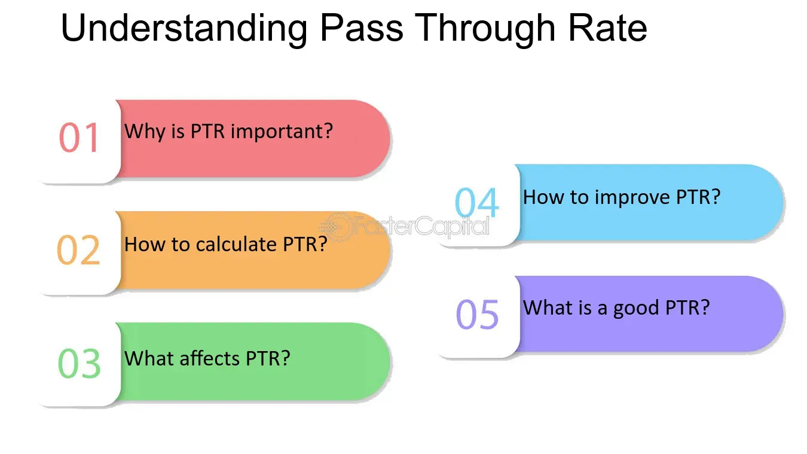

## Table of Contents

## What is a pass-through rate?

A pass-through rate is a measure used in finance and investing to show how much of the income from an investment is passed on to the investors. For example, in a real estate investment trust (REIT), the pass-through rate would show how much of the rent collected from properties is given to the people who invested in the REIT. This rate is important because it helps investors understand how much money they can expect to receive from their investment.

The pass-through rate can also be used in other types of investments, like mutual funds or exchange-traded funds (ETFs). In these cases, the rate shows how much of the fund's earnings, like dividends or interest, are passed on to the investors. A high pass-through rate is usually seen as a good thing because it means more of the investment's earnings are being shared with the investors. However, it's always important to look at other factors too, like the risks and costs of the investment.

## How does the pass-through rate mechanism work?

The pass-through rate mechanism is a way to share the money earned from an investment with the people who invested in it. Imagine you own a part of a big shopping center through a real estate investment trust (REIT). The shopping center makes money from the rent that stores pay. The pass-through rate tells you how much of that rent money the REIT gives back to you and the other investors. If the pass-through rate is high, it means you get a bigger share of the rent money.

For example, if the shopping center collects $100 in rent and the pass-through rate is 90%, the REIT would give $90 back to the investors. The other $10 might be used to cover the costs of running the REIT or kept as profit by the people who manage it. This rate helps investors know what to expect from their investment. A high pass-through rate can make an investment more attractive because it means more money comes back to the investors. But it's also important to think about other things, like how risky the investment is and what fees you might have to pay.

## Why is the pass-through rate important in financial markets?

The pass-through rate is important in financial markets because it helps investors know how much money they will get back from their investments. When you invest in something like a real estate investment trust (REIT) or a mutual fund, the pass-through rate shows you what part of the money the investment makes is given back to you. If the rate is high, it means you get more of the money, which can make the investment more appealing. This rate is a key piece of information that helps you decide if an investment is worth it.

Understanding the pass-through rate also helps you compare different investments. For example, if you are choosing between two REITs, one with a pass-through rate of 80% and another with a rate of 90%, you might lean towards the one with the 90% rate because it gives you more money back. But, it's also important to look at other things like how risky the investment is and what fees you might have to pay. The pass-through rate is just one part of the puzzle, but it's a very useful part that helps you make smarter investment choices.

## Can you provide a simple example of a pass-through rate in action?

Imagine you invest in a company that owns a bunch of apartments. This company is called a Real Estate Investment Trust, or REIT for short. The apartments collect rent from the people living in them. The REIT decides to give 85% of the rent money back to the people who invested in it. This 85% is the pass-through rate.

So, if the apartments collect $100,000 in rent each month, the REIT would give $85,000 back to the investors. The other $15,000 might be used to pay for things like managing the apartments or keeping some money for the company. This pass-through rate helps you know how much money you can expect to get from your investment in the REIT.

## What are the different types of pass-through rates?

There are a few different types of pass-through rates that you might come across in investing. One type is the dividend pass-through rate, which is used in things like mutual funds or ETFs. This rate shows how much of the money the fund makes from dividends on the stocks it owns gets passed on to the people who invested in the fund. Another type is the interest pass-through rate, which is used for investments that make money from interest, like bonds. This rate tells you how much of the interest money is given back to the investors.

Another important type of pass-through rate is the rental income pass-through rate, which is often used in real estate investment trusts (REITs). This rate shows how much of the rent money collected from properties is passed on to the investors. Each type of pass-through rate helps investors understand how much money they can expect to get from their investment. Knowing these different types can help you make better choices about where to put your money.

## How do pass-through rates affect interest rates?

Pass-through rates can affect interest rates because they show how much money from an investment gets passed on to the people who invested in it. When pass-through rates are high, it means investors get more money back from things like interest on bonds or dividends from stocks. This can make these investments more attractive, which might push up the demand for them. When more people want to buy these investments, the price can go up, and this can lead to lower interest rates because the cost of borrowing money goes down.

On the other hand, if pass-through rates are low, it means investors get less money back. This can make the investments less appealing, so fewer people might want to buy them. When fewer people want to buy, the price can go down, and this can lead to higher interest rates because the cost of borrowing money goes up. So, pass-through rates play a big role in how interest rates move in the market, affecting how much it costs to borrow money.

## What role do pass-through rates play in monetary policy?

Pass-through rates are important for monetary policy because they help show how changes in interest rates affect the economy. When a central bank, like the Federal Reserve, changes its interest rates, it wants to influence things like borrowing and spending. If pass-through rates are high, it means that more of the interest money from investments gets passed on to people. This can make investments more attractive, leading to more spending and borrowing, which is what the central bank might want if it's trying to boost the economy.

On the other hand, if pass-through rates are low, less money gets passed on to investors. This can make investments less appealing, which might slow down spending and borrowing. Central banks keep an eye on pass-through rates to see how well their interest rate changes are working. If pass-through rates are not helping to move money around the way they want, the central bank might need to adjust its policies to get the economy moving in the right direction.

## How can pass-through rates be measured and analyzed?

Pass-through rates can be measured by looking at how much money from an investment gets given back to the people who invested in it. For example, if a real estate investment trust (REIT) collects rent from properties, you can figure out the pass-through rate by dividing the amount of rent money given back to investors by the total rent collected. If a REIT collects $100 and gives $85 back to investors, the pass-through rate is 85%. This number helps investors know how much money they can expect to get from their investment.

To analyze pass-through rates, you can compare them over time or across different investments. If you see that the pass-through rate for a REIT goes up from 80% to 85%, it might mean the REIT is doing a better job of sharing its money with investors. You can also compare the pass-through rates of different investments to see which one gives back more money. For example, if one REIT has a pass-through rate of 85% and another has a rate of 90%, the one with the 90% rate might be a better choice if all other things are equal. But remember, it's important to look at other factors too, like how risky the investment is and what fees you might have to pay.

## What factors influence the effectiveness of pass-through rates?

The effectiveness of pass-through rates can be influenced by many things. One big [factor](/wiki/factor-investing) is how well the investment is doing. If the investment, like a real estate investment trust (REIT), is making a lot of money from rent, it can pass on more money to investors, making the pass-through rate higher. Another factor is the costs of running the investment. If it costs a lot to manage the investment, there might be less money left to give back to investors, which can lower the pass-through rate. Also, the rules and laws about how much money has to be passed on can affect the rate. Some investments have to give back a certain amount of their earnings to investors, which can make the pass-through rate higher.

Another thing that can influence pass-through rates is how the people running the investment decide to use the money. If they choose to keep more money for themselves or to spend it on growing the investment, the pass-through rate might go down. The economy can also play a role. If the economy is doing well, investments might make more money, which can lead to higher pass-through rates. But if the economy is struggling, the pass-through rate might go down because there's less money to share. All these factors together decide how effective the pass-through rate is and how much money investors can expect to get back from their investments.

## How do pass-through rates vary across different economies?

Pass-through rates can be different in different countries because each country has its own rules and ways of doing things. For example, in some countries, the government might make laws that say investments like real estate investment trusts (REITs) have to give back a lot of their money to investors. This would make the pass-through rate higher in those countries. In other places, the rules might let investments keep more money for themselves, which would make the pass-through rate lower.

The economy of a country also affects pass-through rates. If a country's economy is doing well, investments might make more money, so they can pass on more to investors, making the pass-through rate higher. But if the economy is not doing so well, investments might not make as much money, so the pass-through rate could be lower. This means that pass-through rates can change a lot depending on where you are and how the economy is doing in that place.

## What are the challenges in implementing effective pass-through rates?

One challenge in making pass-through rates work well is figuring out the right balance between giving money to investors and keeping some for the business. If an investment like a real estate investment trust (REIT) gives too much money back to investors, it might not have enough left to take care of the properties or to grow the business. But if it keeps too much money, investors might not be happy because they're not getting enough back. Finding the right balance can be hard and depends a lot on the rules of the country and how well the investment is doing.

Another challenge is dealing with changes in the economy. When the economy is doing well, investments might make more money, so they can give more back to investors. But when the economy is not doing so well, there might be less money to share, which can make pass-through rates lower. This can be tricky for the people running the investment because they have to keep investors happy while also making sure the business can keep going no matter what the economy is doing. It's a bit like trying to keep a boat steady in changing waves.

## Can you discuss a case study where pass-through rates significantly impacted an economy?

In the United States, pass-through rates had a big impact on the economy during the housing boom in the early 2000s. Real estate investment trusts (REITs) were very popular because they had high pass-through rates. This meant that people who invested in REITs got a lot of money back from the rent collected on properties. Because of these high pass-through rates, more people wanted to invest in REITs, which helped push up the prices of real estate. This made the economy grow because people were spending more money on homes and other things.

But when the housing market crashed in 2008, the pass-through rates dropped because REITs were not making as much money from rent. This meant that investors got less money back, and many of them lost a lot of money. The lower pass-through rates made people less interested in investing in real estate, which hurt the economy. It took a long time for the economy to recover because people were more careful about where they put their money. This case shows how important pass-through rates can be for the economy and how changes in them can have big effects.

## What are Pass-Through Rates and How Can We Understand Them?

Pass-through rates represent the net [interest rate](/wiki/interest-rate-trading-strategies) provided to investors after accounting for the fees associated with a securitized asset. In the context of mortgage-backed securities (MBS) and similar financial instruments, these rates are pivotal in determining the investor's returns. Generally, a pass-through rate accounts for deductions such as management fees and guarantee fees, which results in it being consistently lower than the interest rate on the individual underlying securities of the MBS.

The understanding of pass-through rate composition is crucial for investors aiming to project potential returns effectively. The rate is essentially derived from the gross interest rate of the securitized mortgages less the servicing fee, management fee, and any additional guarantee fees. For example, if the gross interest rate on the mortgage is 3.5%, and the sum of the fees is 0.5%, the pass-through rate would be 3.0%.

Mathematically, the pass-through rate ($R_{pt}$) can be expressed as:

$$
R_{pt} = R_{gross} - (F_{serv} + F_{man} + F_{guar})
$$

where:
- $R_{gross}$ is the gross interest rate of the original mortgage.
- $F_{serv}$, $F_{man}$, and $F_{guar}$ represent the servicing, management, and guarantee fees, respectively.

The dynamics of pass-through rates are influenced by various factors, including the nature of the mortgage interest rates (fixed or variable) and prevailing economic conditions. Influences such as interest rate fluctuations, inflation, and economic growth can all affect these rates, as they alter the expected cash flows from the underlying mortgages and the associated risk perceptions by investors.

A distinction between fixed and variable mortgage rates is essential as well. Fixed-rate mortgages result in consistent pass-through rates until maturity, providing stable expected returns. In contrast, variable-rate mortgages lead pass-through rates to fluctuate reflecting broader interest rate changes, adding a layer of complexity to return projections for investors.

Understanding these concepts and how they interact with broader economic conditions allows investors to anticipate changes in pass-through rates and adjust their strategies accordingly. This knowledge is instrumental in optimizing investment portfolios and achieving desired financial outcomes amidst varying market conditions.

## References & Further Reading

For those interested in expanding their understanding of pass-through rates and their role in [algorithmic trading](/wiki/algorithmic-trading), here are some recommended readings and resources:

- **Principles of Risk Management and Insurance** by George E. Rejda and Michael McNamara offers a foundational perspective on risk management practices crucial for investors dealing with mortgage-backed securities and algorithmic trading.

- **Advances in Financial Machine Learning** by Marcos Lopez de Prado provides cutting-edge insights into the integration of machine learning within financial markets, including algorithmic trading strategies. This book is particularly valuable for understanding how automated systems can be engineered and managed to optimize performance and mitigate risks.

- For further exploration of mortgage-backed securities, resources such as "The Handbook of Mortgage-Backed Securities" edited by Frank J. Fabozzi are invaluable. This text covers the operation and economic significance of mortgage-backed securities, offering detailed analysis suitable for both beginners and advanced investors.

- To stay updated with quantitative trading strategies, consider exploring "Quantitative Trading: How to Build Your Own Algorithmic Trading Business" by Ernie Chan. The book guides readers through the process of developing algorithmic trading systems, providing practical advice and tested strategies.

These readings are complemented by academic journals and papers available through platforms such as JSTOR and the SSRN, which provide peer-reviewed articles on the latest developments in finance, risk management, and algorithmic trading. Additionally, online courses on platforms like Coursera or edX offer structured learning paths to deepen your understanding of financial mechanisms and data-driven investment strategies.

By engaging with these resources, investors and financial professionals can enhance their knowledge and improve their approach to leveraging pass-through rates and algorithmic trading for optimized investment outcomes.

