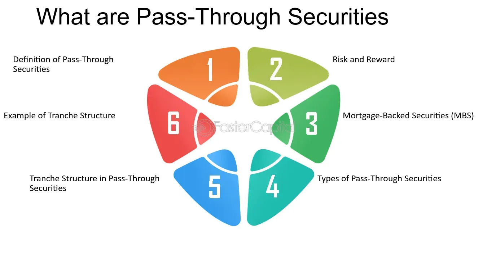

## Table of Contents

## What are pass-through securities?

Pass-through securities are a type of investment where the payments from a pool of loans, like mortgages, are passed directly to investors. Imagine a group of people who have taken out home loans. Instead of the bank keeping all the monthly payments, they bundle these loans together and sell shares of this bundle to investors. The money that borrowers pay on their loans, including both interest and principal, gets passed through to these investors.

This type of security is common in the mortgage market, where they are known as mortgage-backed securities (MBS). When homeowners make their monthly mortgage payments, that money goes into a pool. The pool then distributes the payments to the investors who own the MBS. This system helps banks free up money to lend to more people, while giving investors a chance to earn money from home loans without having to buy a house themselves.

## How do pass-through securities work?

Pass-through securities work by taking a bunch of loans, like home loans, and putting them together into a big pool. This pool is then divided into pieces, and these pieces are sold to investors. When people who took out the loans make their monthly payments, that money goes into the pool. The money in the pool is then passed on to the investors who bought the pieces of the pool. This way, investors get a share of the payments that borrowers make on their loans.

For example, if you have a mortgage-backed security (MBS), which is a type of pass-through security, you're getting payments from a bunch of home loans. Every month, homeowners pay their mortgages, and that money goes into the MBS pool. The pool then sends out payments to all the investors who own parts of the MBS. This system helps banks because they can sell the loans they made and get money to make new loans. It also helps investors because they can earn money from home loans without having to buy a house.

## What are the different types of pass-through securities?

Pass-through securities come in different types, mainly based on what kind of loans they are made from. The most common type is mortgage-backed securities (MBS). These are made from home loans. When homeowners pay their mortgages, the money goes into a pool and then gets passed on to investors who own pieces of the MBS. Another type is asset-backed securities (ABS). These are similar, but instead of home loans, they are made from other types of loans like car loans or credit card debt. When people pay back these loans, the money goes into a pool and then gets passed on to the investors.

There are also collateralized mortgage obligations (CMOs), which are a bit more complicated. CMOs are also made from home loans, but they divide the payments into different parts, called tranches. Each tranche has its own risk and return, so investors can pick the one that fits what they want. This makes CMOs different from regular MBS because they offer more choices to investors. Even though they are more complex, CMOs still work on the same basic idea of passing through payments from loans to investors.

## Who are the typical issuers of pass-through securities?

The main issuers of pass-through securities are big banks and government-sponsored enterprises (GSEs). Banks create these securities to free up money so they can make more loans. They take a bunch of loans, like home loans, and put them together into a pool. Then, they sell pieces of this pool to investors. This way, the bank gets money back right away and can use it to lend to more people.

Government-sponsored enterprises, like Fannie Mae and Freddie Mac, also issue pass-through securities. These organizations buy home loans from banks and then turn them into securities. They do this to help make sure there's enough money for people to buy homes. When they sell these securities, the money they get helps them buy more loans from banks, which keeps the housing market moving.

## What are the benefits of investing in pass-through securities?

Investing in pass-through securities can be a good way to earn money. When you buy these securities, you get payments from a bunch of loans, like home loans or car loans. This means you can earn money without having to buy a house or a car yourself. Plus, because the payments come from a lot of different loans, it can be safer than putting all your money into just one loan. If one person can't pay their loan, you still get money from all the other loans in the pool.

Another benefit is that pass-through securities can give you a steady income. Every month, when people pay their loans, you get a part of that money. This can be really helpful if you're looking for a regular way to earn money. Also, these securities can be bought and sold easily, so you can change your investments if you need to. This makes them a flexible choice for many investors.

## What are the risks associated with pass-through securities?

Investing in pass-through securities can come with some risks. One big risk is that people who took out the loans might not be able to pay them back. If a lot of people can't pay, then the money coming into the pool will go down, and investors might not get as much money as they expected. This is called default risk. Also, the value of these securities can change a lot because of interest rates. If interest rates go up, the value of the securities can go down, which means investors might lose money if they need to sell them.

Another risk is called prepayment risk. This happens when people pay off their loans earlier than expected, like when they sell their house or refinance their mortgage. If a lot of loans get paid off early, the money coming into the pool can change, and investors might not get the steady income they were hoping for. These risks can make pass-through securities a bit tricky to invest in, so it's important to understand them before putting your money in.

## How does prepayment risk affect pass-through securities?

Prepayment risk is when people pay off their loans earlier than expected. This can happen a lot with home loans if people decide to sell their house or get a new loan with a better [interest rate](/wiki/interest-rate-trading-strategies). When this happens, the money that was supposed to come into the pool of pass-through securities changes. Instead of getting regular payments over a long time, investors might get a big chunk of money all at once. This can be a problem because investors were counting on a steady income from these securities.

This risk can make pass-through securities less predictable. If a lot of loans get paid off early, the total amount of money coming into the pool can drop. This means investors might not get as much money as they thought they would. It can also make it hard for investors to plan their finances because they don't know when they'll get their money. So, prepayment risk is something investors need to think about carefully when they're looking at pass-through securities.

## What is the impact of interest rate changes on pass-through securities?

Interest rate changes can have a big effect on pass-through securities. When interest rates go up, the value of these securities usually goes down. This happens because new loans will have higher interest rates, making the old loans in the pool less attractive. Investors might sell their pass-through securities to buy new ones with better rates, which can cause the price of the old securities to drop. On the other hand, if interest rates go down, the value of pass-through securities can go up because the old loans in the pool now have better rates than new loans.

Another way interest rate changes affect pass-through securities is through prepayment risk. When interest rates fall, people might want to refinance their loans to get a lower rate. If a lot of people do this, they'll pay off their old loans early, and the money coming into the pool will change. This can be a problem for investors who were expecting a steady stream of income from these securities. So, changes in interest rates can make pass-through securities less predictable and can impact both their value and the payments investors receive.

## How can credit risk influence the performance of pass-through securities?

Credit risk is the chance that people who borrowed money won't be able to pay it back. When a lot of people can't pay their loans, it can hurt pass-through securities. These securities are made from a bunch of loans, like home loans. If many borrowers stop paying, the money going into the pool that investors get their payments from goes down. This means investors might not get as much money as they expected, and the value of the securities can drop. So, credit risk can make pass-through securities less safe and less valuable.

Investors need to think about credit risk when they're looking at pass-through securities. If the loans in the pool are from people who are more likely to not pay back their loans, the securities can be riskier. This can make investors want to sell the securities, which can lower their price. But if the loans are from people who are more likely to pay back their loans, the securities can be seen as safer. So, understanding the credit risk of the loans in the pool is really important for investors to know how well their pass-through securities might do.

## What are some strategies to mitigate risks in pass-through securities?

One way to lower the risks in pass-through securities is to look at the credit quality of the loans in the pool. If the loans are from people who are likely to pay back their loans, the securities can be safer. Investors can check the credit scores and payment history of the borrowers to see how risky the loans are. Also, diversifying your investments can help. Instead of putting all your money into one type of pass-through security, you can spread it out across different types of securities. This way, if one type does badly, you still have money in other types that might do better.

Another strategy is to pay attention to interest rates. Since changes in interest rates can affect the value and payments of pass-through securities, it's a good idea to keep an eye on what's happening with rates. If you think rates are going to go up, you might want to sell your securities before they lose value. Also, understanding prepayment risk can help. If interest rates fall, a lot of people might pay off their loans early, which can change the money coming into the pool. Knowing this, you can choose securities that are less likely to be affected by early payments. By being aware of these risks and taking steps to manage them, investors can make smarter choices about pass-through securities.

## How do pass-through securities fit into a diversified investment portfolio?

Pass-through securities can be a good part of a diversified investment portfolio because they offer a way to earn money from loans without having to buy things like houses or cars yourself. When you invest in these securities, you get payments from a bunch of different loans. This can help spread out your risk because you're not relying on just one loan. If one person can't pay their loan, you still get money from all the other loans in the pool. This makes pass-through securities a bit safer than putting all your money into one loan.

Also, pass-through securities can give you a steady income. Every month, when people pay their loans, you get a part of that money. This can be really helpful if you're looking for a regular way to earn money. But, it's important to mix these securities with other types of investments, like stocks and bonds. This way, if something goes wrong with your pass-through securities, like interest rates changing or people not paying their loans, you still have other investments that might do well. So, including pass-through securities in your portfolio can help you earn money in different ways and manage your risks better.

## What advanced analytical tools are used to assess the risks of pass-through securities?

To assess the risks of pass-through securities, investors use advanced analytical tools like cash flow models. These models help predict how much money will come into the pool from the loans. They look at things like how likely people are to pay back their loans and how interest rates might change. By using these models, investors can see if the securities will give them the money they expect and if they are a good investment.

Another tool is stress testing. This means checking how the securities would do if something bad happened, like a lot of people not paying their loans or interest rates going up a lot. Stress testing helps investors understand how risky the securities are and if they can handle tough times. By using these tools, investors can make better choices about which pass-through securities to buy and how to manage their risks.

## References & Further Reading

[1]: ["Principles of Risk Management and Insurance"](https://www.pearson.com/en-us/subject-catalog/p/principles-of-risk-management-and-insurance/P200000006028/9780135641293) by George E. Rejda and Michael McNamara

[2]: ["Advances in Financial Machine Learning"](https://www.amazon.com/Advances-Financial-Machine-Learning-Marcos/dp/1119482089) by Marcos Lopez de Prado

[3]: ["Mortgage-Backed Securities: Products, Structuring, and Analytical Techniques"](https://www.wiley.com/en-us/Mortgage+Backed+Securities%3A+Products%2C+Structuring%2C+and+Analytical+Techniques-p-9781118044711) by Frank J. Fabozzi, Anand K. Bhattacharya, and William S. Berliner

[4]: ["Quantitative Trading: How to Build Your Own Algorithmic Trading Business"](https://www.amazon.com/Quantitative-Trading-Build-Algorithmic-Business/dp/1119800064) by Ernest P. Chan

[5]: ["Flash Boys: A Wall Street Revolt"](https://en.wikipedia.org/wiki/Flash_Boys) by Michael Lewis

[6]: ["Machine Learning for Algorithmic Trading"](https://github.com/PacktPublishing/Machine-Learning-for-Algorithmic-Trading-Second-Edition) by Stefan Jansen

[7]: ["Understanding Modern Banking Leveraged Finance: A Critical Perspective"](https://www.amazon.com/Understanding-Modern-Banking-Leveraged-Finance/dp/1119542043) by David P. Stowell

[8]: Kirilenko, A. A., Kyle, A. S., Samadi, M., & Tuzun, T. (2017). ["The Flash Crash: The Impact of High Frequency Trading on an Electronic Market."](https://onlinelibrary.wiley.com/doi/abs/10.1111/jofi.12498) The Review of Financial Studies, 30(7), 2220–2253.