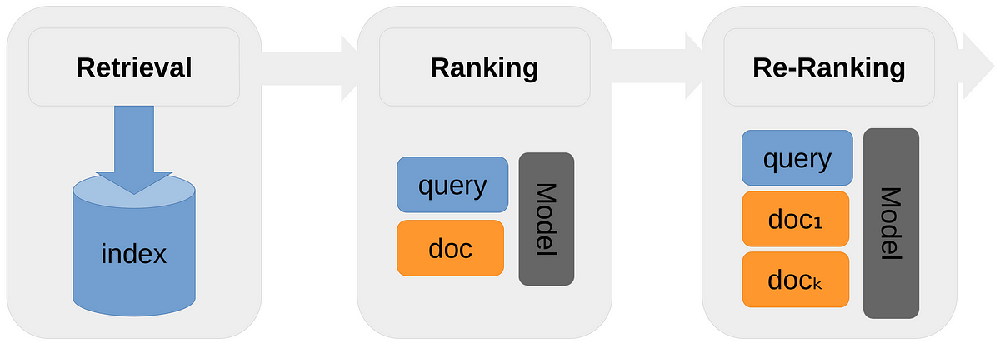

## Table of Contents

## What is a Passage Re-Ranking Model in machine learning?

A Passage Re-Ranking Model in machine learning is a tool used to improve the accuracy of search results. When you search for something online, the first step is usually to find a list of possible answers or passages. This initial list is created by a model called a retriever. However, the retriever might not always get the order right. That's where the Passage Re-Ranking Model comes in. It takes the list from the retriever and rearranges it, so the most relevant passages are at the top. This makes it easier for you to find the information you need quickly.

The way a Passage Re-Ranking Model works is by using another type of model, often called a ranker. The ranker looks at each passage in the list and scores them based on how well they match your search query. It might look at things like the words used, the context, and even the structure of the passage. After scoring all the passages, the ranker then sorts them from highest to lowest score. This new order is much more likely to put the most helpful passages at the top, improving your search experience.

## How does Passage Re-Ranking differ from traditional retrieval methods?

Passage Re-Ranking differs from traditional retrieval methods mainly in how they approach finding and ordering relevant information. Traditional retrieval methods, like those used in early search engines, rely on a single step to find and rank documents or passages. They use algorithms that look at keywords and other simple metrics to decide which results are most relevant to your search. These methods can be fast but might not always put the best results at the top because they don't consider deeper context or more complex relationships between words.

On the other hand, Passage Re-Ranking uses a two-step process. First, a retriever finds an initial set of passages that might be relevant to your query. This step is similar to traditional methods but is just the beginning. Then, a separate model, called a ranker, comes in to re-order these passages. The ranker uses more sophisticated techniques, like [machine learning](/wiki/machine-learning) models, to score and sort the passages based on how well they match your search. This second step makes Passage Re-Ranking much better at finding the most relevant information, even if it takes a bit longer.

## What are the key components of a Passage Re-Ranking Model?

The first key component of a Passage Re-Ranking Model is the retriever. The retriever's job is to quickly find a list of passages that might be relevant to your search query. It uses simple methods to match your keywords with passages in a database. This step is important because it narrows down the huge amount of information to a smaller set that the next component can work with.

The second key component is the ranker. The ranker takes the list of passages from the retriever and scores each one based on how well it matches your search. It uses more advanced techniques, like machine learning models, to understand the context and meaning of the passages. After scoring all the passages, the ranker sorts them so that the most relevant ones are at the top. This makes it easier for you to find the information you need quickly and accurately.

## Can you explain the basic workflow of a Passage Re-Ranking Model like TILDEv2?

TILDEv2 is a type of Passage Re-Ranking Model that helps make search results better. When you search for something, TILDEv2 first uses a retriever to find a list of passages that might be related to your search. The retriever looks at your keywords and quickly matches them with passages in a big database. This step is important because it narrows down the huge amount of information to a smaller set that the next step can work with.

After the retriever finds the initial list, TILDEv2 uses a ranker to sort these passages. The ranker is like a smart judge that looks at each passage and gives it a score based on how well it matches your search. It uses machine learning to understand the context and meaning of the passages. Once all the passages are scored, the ranker puts them in order from highest to lowest score. This way, the most relevant passages are at the top of your search results, making it easier for you to find what you need quickly and accurately.

## What datasets are commonly used to train Passage Re-Ranking Models?

Passage Re-Ranking Models are often trained using datasets like MS MARCO and TREC. MS MARCO, which stands for Microsoft Machine Reading Comprehension, is a large dataset that includes real search queries from the Bing search engine along with relevant passages from web pages. This dataset is great for training because it reflects actual user searches and the kind of information they are looking for. TREC, or Text REtrieval Conference, provides datasets that are used in information retrieval competitions. These datasets include different types of queries and documents, helping models learn to rank passages in various contexts.

Another commonly used dataset is the Natural Questions dataset from Google. This dataset contains questions that real users have asked on the Google search engine, along with the passages from Wikipedia that answer those questions. Using this dataset helps Passage Re-Ranking Models understand how to find and rank answers to natural, everyday questions. Together, these datasets provide a wide range of examples that help train models to be more accurate and useful in real-world search scenarios.

## How do Passage Re-Ranking Models improve search relevance?

Passage Re-Ranking Models improve search relevance by using a two-step process. First, a retriever quickly finds a list of passages that might be related to your search query. This step is like casting a wide net to gather as many potentially useful passages as possible. However, the retriever might not always get the order right, so the second step comes in. A ranker then looks at each passage and gives it a score based on how well it matches your search. The ranker uses smart machine learning techniques to understand the context and meaning of the passages, making sure that the most relevant ones get the highest scores.

After scoring all the passages, the ranker sorts them so that the most relevant ones are at the top of your search results. This makes it much easier for you to find the information you need quickly and accurately. By using this two-step process, Passage Re-Ranking Models can provide better search results than traditional methods, which only use one step to find and rank passages. The extra step of re-ranking helps to fine-tune the order of the results, putting the most helpful passages right where you can see them first.

## What are the main challenges faced when implementing Passage Re-Ranking Models?

One of the main challenges when implementing Passage Re-Ranking Models is the computational cost. These models use a two-step process where first a retriever finds a list of passages, and then a ranker sorts them. Both steps, especially the ranking part, can be slow and require a lot of computing power. This means that if you want to use these models for real-time searches, you need strong computers and clever ways to make the process faster.

Another challenge is making sure the models work well with different kinds of searches. People can ask questions in many different ways, and the model needs to understand and rank passages correctly no matter how the question is asked. This can be hard because the model has to learn from lots of different examples and still get it right when faced with new types of questions. If the model only learns from one type of data, it might not do well with other types of searches.

## How does TILDEv2 specifically enhance passage re-ranking performance?

TILDEv2 enhances passage re-ranking performance by using a smart way to understand and compare search queries and passages. It uses something called "dense retrieval," which means it looks at the meaning of words and their context, not just the words themselves. This helps TILDEv2 find passages that are really relevant to your search, even if they don't use the exact same words as your query. By focusing on the meaning, TILDEv2 can make sure the passages at the top of your search results are the most helpful ones.

Another way TILDEv2 improves performance is by using a special method to score and rank passages. It uses a machine learning model that can learn from lots of examples to get better at figuring out which passages are the best matches for your search. This means that over time, TILDEv2 can become more accurate and give you even better search results. By combining smart retrieval with advanced ranking, TILDEv2 makes it easier and faster for you to find the information you need.

## What metrics are used to evaluate the effectiveness of Passage Re-Ranking Models?

To evaluate how well Passage Re-Ranking Models work, people often use a metric called Mean Reciprocal Rank (MRR). MRR measures how high up the first correct answer appears in the list of search results. If the right answer is at the top, the MRR score is high, which means the model did a good job. If the right answer is lower down, the MRR score is lower, showing the model needs to improve. This metric is helpful because it focuses on how quickly someone can find the information they need.

Another important metric is Normalized Discounted Cumulative Gain (NDCG). NDCG looks at how relevant all the passages in the search results are, not just the first one. It gives higher scores to results where the most relevant passages are at the top and lower scores if less relevant passages are higher up. This helps show how well the model ranks all the passages, not just the first one. Both MRR and NDCG are useful for understanding how effective a Passage Re-Ranking Model is at improving search results.

## How can Passage Re-Ranking Models be integrated into existing search systems?

Passage Re-Ranking Models can be integrated into existing search systems by adding a second step to the search process. In the first step, the existing search system, which might use traditional retrieval methods, finds a list of passages that match the user's query. Then, the Passage Re-Ranking Model takes over. It uses a retriever to quickly gather an initial set of passages and then applies a ranker to sort these passages based on their relevance. This ranker uses machine learning to understand the context and meaning of the passages, ensuring that the most relevant ones are at the top of the search results.

Integrating these models can be done in a way that doesn't disrupt the existing system. The Passage Re-Ranking Model can work in the background, re-ranking the passages after the initial search results are generated. This means users won't notice any change in how they search, but they will see better, more relevant results. To make this integration smooth, the system needs to be fast enough to handle the extra step of re-ranking without slowing down the search experience.

## What are some advanced techniques used in Passage Re-Ranking to handle large-scale data?

One advanced technique used in Passage Re-Ranking to handle large-scale data is called "approximate nearest neighbor search." This method helps speed up the process of finding and ranking passages by quickly identifying passages that are similar to the search query. Instead of comparing the query to every single passage, which can take a long time, approximate nearest neighbor search uses shortcuts to find passages that are close enough. This makes the re-ranking process much faster, allowing the model to handle huge amounts of data without slowing down the search experience.

Another technique is "parallel processing," where the work of re-ranking is split up among many computers or processors. By doing this, the model can score and sort passages at the same time, instead of one after the other. This means that even with a lot of data, the re-ranking can be done quickly. Both of these techniques help Passage Re-Ranking Models work well with large-scale data, making search results more relevant and faster to find.

## What future developments are anticipated in the field of Passage Re-Ranking Models?

In the future, Passage Re-Ranking Models are expected to become even better at understanding the meaning of searches and passages. They might use more advanced machine learning techniques, like [deep learning](/wiki/deep-learning), to get smarter about how they rank passages. This could mean that the models will be able to understand not just the words in a search, but also the context and the user's intent. As a result, search results could become more accurate and helpful, making it easier for people to find exactly what they need.

Another big development could be in how these models handle large amounts of data. With more data being created every day, Passage Re-Ranking Models will need to be faster and more efficient. Techniques like approximate nearest neighbor search and parallel processing might become even more important. Also, new ways of storing and accessing data could help these models work better with huge datasets, making search results quicker and more relevant.