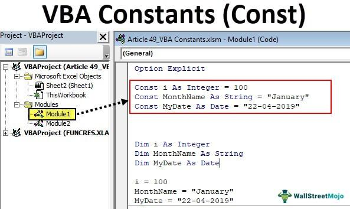

In algorithmic trading, choosing appropriate programming techniques is critical in determining the efficiency, speed, and dependability of trading algorithms. C++ stands out as a preferred language for implementing high-frequency trading systems, largely due to its superior performance and fine-grained control over system resources. In this context, one vital optimization method for improving C++ applications involves the technique of passing data to functions, particularly by utilizing 'pass by const reference.'

By understanding the concept of passing by const reference, developers can effectively optimize algorithmic trading software. This technique enables functions to access data directly without creating copies, leading to major improvements in speed and resource utilization. Optimizing data handling is especially crucial in high-frequency trading, where milliseconds can make a difference in capturing fleeting market opportunities. Thus, passing by const reference not only enhances performance but also ensures data integrity, making it an indispensable tool in the toolkit of developers aiming to build robust trading systems.



## Table of Contents

## Understanding Pass by Reference and Pass by Const Reference

In C++, passing by reference is a method that enables functions to access the actual memory address of a variable, rather than creating a copy of the variable's data. This technique is advantageous in scenarios where performance is critical, as it avoids the overhead associated with copying large data structures. When you pass a variable by reference, any modifications made to the parameter inside the function will affect the original argument, since they both reference the same memory location.

While passing by reference can boost performance, it introduces a risk: the original data can be inadvertently modified within a function, potentially leading to bugs. To mitigate this risk, C++ provides the option to pass by const reference. By declaring a reference as const, you effectively create a read-only view of the data. This ensures that the function accessing the data cannot alter its contents, preserving data integrity while still enjoying the performance benefits of reference passing.

In algorithmic trading, where operations often involve large data structures such as vectors or matrices, the advantages of passing by const reference become significant. Quantitative finance algorithms frequently perform complex calculations on these structures, emphasizing the necessity for efficient data handling to maintain high-speed execution. For example, consider a function that processes historical price data stored in a vector to compute financial indicators. Using pass by const reference, the function can access the vector without creating an expensive copy, leading to reduced computational load and faster execution times.

The syntax for declaring a function parameter as a const reference in C++ is straightforward. For instance, if you have a function that calculates the sum of elements in a vector, you might define it as follows:

```cpp
#include <vector>

double calculateSum(const std::vector<double>& data) {
    double sum = 0.0;
    for (const double& value : data) {
        sum += value;
    }
    return sum;
}
```

In this example, `data` is the vector passed by const reference, and the const qualifier ensures that operations within the function do not alter the input data. By embracing this approach, developers can construct efficient and reliable trading algorithms, harnessing the full performance potential of C++.

## Why Use Pass by Const Reference in Algorithmic Trading?

Algorithmic trading relies on complex calculations and large datasets to make split-second decisions in financial markets. Efficient handling of this data is vital to process real-time market information effectively. When large objects, such as market tick data or extensive historical price records, are passed by value to functions within these trading algorithms, performance bottlenecks can arise due to the time-intensive copying operations required. This inefficiency becomes a significant concern in high-frequency trading systems, where even the slightest delays can result in missed trading opportunities.

Passing data by const reference in C++ offers a solution to these performance challenges. By passing a reference to the data, rather than a complete copy, the system avoids the overhead associated with copying large datasets. At the same time, the 'const' qualifier ensures that the data being referenced cannot be modified, preserving the integrity of the original data—an essential consideration when dealing with sensitive financial information.

For example, in a high-frequency trading system tasked with calculating various technical indicators from streaming market data, functions that compute moving averages, Bollinger bands, or other metrics can benefit from const reference parameters. These functions might look like:

```cpp
double calculateMovingAverage(const std::vector<double>& priceData, int windowSize) {
    double sum = 0.0;
    for (int i = 0; i < windowSize; ++i) {
        sum += priceData[i];
    }
    return sum / windowSize;
}
```

In this code snippet, `priceData` is passed as a const reference. This method ensures that the large dataset does not need to be copied, substantially improving the function's execution speed. In a high-frequency trading environment, the ability to quickly execute such mathematical operations using minimal resources can mean keeping pace with the market's rapid movements, maximizing the opportunity for profitable trades.

Therefore, using pass by const reference aligns with the imperative of high-frequency [algorithmic trading](/wiki/algorithmic-trading): maintaining maximum computational efficiency while ensuring data integrity. This approach not only enhances performance but also supports the swift execution of trading strategies critical for capitalizing on fleeting market conditions.

## Practical Example in Algorithmic Trading

In algorithmic trading, efficiently processing large datasets is crucial for real-time decision-making. A common task involves calculating technical indicators like moving averages, which can be computationally intensive if not handled correctly. Utilizing the 'pass by const reference' technique in C++ can significantly optimize this process, particularly for large data structures such as vectors.

Consider a scenario where you need to compute a simple moving average (SMA) of stock prices stored in a vector. The SMA is calculated by summing a subset of data points from the vector and then dividing by the number of points. For example, given a vector `prices` containing daily closing prices, the formula for the SMA over `n` days is:

$$
\text{SMA}_t = \frac{1}{n} \sum_{i=t-n+1}^{t} \text{prices}[i]
$$

To efficiently compute this indicator without adding unnecessary computational overhead, the function responsible for the calculation should accept the price vector by const reference. This prevents the function from making a copy of the entire dataset, conserving both time and memory resources. Below is an example in C++:

```cpp
#include <vector>
#include <iostream>

// Function to calculate the simple moving average
double calculateSMA(const std::vector<double>& prices, int n, int t) {
    double sum = 0.0;
    for (int i = t - n + 1; i <= t; ++i) {
        sum += prices[i];
    }
    return sum / n;
}

int main() {
    std::vector<double> prices = {100.0, 102.0, 105.0, 107.0, 110.0, 115.0};
    int period = 3;
    int endIndex = 5;
    double sma = calculateSMA(prices, period, endIndex);
    std::cout << "Simple Moving Average: " << sma << std::endl;
    return 0;
}
```

In this code, the `calculateSMA` function receives `prices` as a const reference, which ensures that the vector is not copied unnecessarily. This results in a reduced computational load, allowing the algorithmic trading system to maintain high performance and quickly adapt to fast-changing market data. 

Passing by const reference not only maximizes performance by minimizing memory usage but also maintains data integrity. The const qualifier ensures that the function does not alter the original data, which is critical for maintaining the accuracy of subsequent financial analyses. Adopting such practices can be indispensable for developers aiming to optimize trading algorithms for enhanced execution in competitive financial environments.

## Advanced Considerations and Potential Pitfalls

While the pass by const reference optimization is a valuable technique in C++, it is essential to recognize situations where it might not offer the best performance benefits. One critical scenario involves dealing with built-in data types and small structs. In these cases, passing data by value can occasionally be more efficient due to the overhead associated with dereferencing pointers or references. This is particularly true in situations where the size of the data is smaller than or equal to the size of a pointer, as the cost of copying is minimal.

Consider the following C++ example that demonstrates passing a small struct by value and by const reference:

```cpp
struct SmallStruct {
    int a;
    int b;
};

void processByValue(SmallStruct s) {
    // Operations on small struct
}

void processByConstReference(const SmallStruct& s) {
    // Operations on small struct
}

int main() {
    SmallStruct s{1, 2};
    processByValue(s);         // Passing by value
    processByConstReference(s); // Passing by const reference
}
```

In scenarios involving small data structures like `SmallStruct`, the performance difference between passing by value and by reference is negligible, and sometimes passing by value is preferred for its simplicity and avoidance of aliasing.

Another advanced consideration is the impact of multithreading on data consistency. In algorithmic trading, multithreading is often employed to handle multiple data streams and computations simultaneously. When using pass by const reference in a multithreaded context, developers must ensure that concurrent access to shared data structures does not lead to data races or undefined behavior. Careful synchronization, possibly through mutexes or other concurrency control mechanisms, is essential to maintain data integrity.

Here is a simple demonstration in Python using threading to illustrate potential pitfalls:

```python
import threading

data_lock = threading.Lock()
shared_data = {'price': 100.0, 'volume': 50}

def update_price(new_price):
    with data_lock:
        shared_data['price'] = new_price

def calculate_moving_average():
    with data_lock:
        # Read shared_data safely
        return shared_data['price'] * 0.1 + shared_data.get('previous_average', 90) * 0.9

thread1 = threading.Thread(target=update_price, args=(105.0,))
thread2 = threading.Thread(target=calculate_moving_average)

thread1.start()
thread2.start()

thread1.join()
thread2.join()
```

In the code above, the use of `data_lock` ensures that updates to `shared_data` are synchronized, preventing race conditions. When integrating const references in C++ multithreaded environments, implementing similar synchronization tools is crucial for data accuracy and program stability.

By understanding these considerations, developers can effectively optimize their use of pass by const reference in algorithmic trading applications, balancing performance gains with the appropriate use of system resources and thread safety.

## Conclusion

Pass by const reference is a valuable technique in optimizing C++ applications for algorithmic trading due to its performance benefits and code clarity. By passing data as a const reference, developers can reduce memory overhead significantly, which is crucial when dealing with large datasets typical in trading applications. This method eliminates the need for unnecessary copying of data, allowing functions to access original data directly without duplication. This not only speeds up execution but also enforces const-correctness, making it clear within the code which data is immutable.

Understanding when and how to apply pass by const reference becomes indispensable for developers in high-frequency trading environments. In these settings, even minor inefficiencies can lead to missing profitable opportunities, as trading strategies often rely on processing data as swiftly as possible. By optimizing data handling through pass by const reference, developers can ensure that trading algorithms operate at peak efficiency, maintaining data integrity while benefiting from the improved performance. Adept use of this technique is essential in achieving robust and efficient high-frequency trading systems.

## References & Further Reading

[1]: Meyers, S. (2005). ["Effective C++: 55 Specific Ways to Improve Your Programs and Designs."](https://ptgmedia.pearsoncmg.com/images/9780321334879/samplepages/0321334876.pdf) Addison-Wesley Professional.

[2]: Stroustrup, B. (2013). ["The C++ Programming Language."](https://stroustrup.com/4th.html) Addison-Wesley Professional.

[3]: Josuttis, N. M. (2012). ["The C++ Standard Library: A Tutorial and Reference."](https://dl.acm.org/doi/10.5555/2544010) Addison-Wesley Professional.

[4]: "High-Frequency Trading: A Practical Guide to Algorithmic Strategies and Trading Systems" by Irene Aldridge. ["High-Frequency Trading"](https://www.amazon.com/High-Frequency-Trading-Practical-Algorithmic-Strategies/dp/1118343506)

[5]: Joshi, M. S. (2003). ["C++ Design Patterns and Derivatives Pricing."](https://assets.cambridge.org/97805217/21622/frontmatter/9780521721622_frontmatter.pdf) Cambridge University Press.