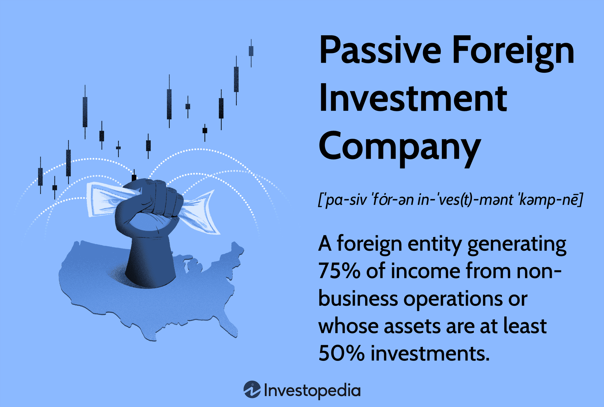

In today's globalized economy, U.S. investors are increasingly seeking to capitalize on foreign markets, drawn by the potential for diversification and higher returns. As these investors venture into international waters, understanding the tax implications inherent in foreign investments becomes paramount. One area of significant concern involves Passive Foreign Investment Companies (PFICs), which pose intricate tax challenges due to their unique structure and treatment by the Internal Revenue Service (IRS).

A PFIC is defined as a foreign corporation where 75% or more of its income is passive, or at least 50% of its assets produce passive income. This classification often includes foreign mutual funds and other investment vehicles primarily generating income through dividends, interest, and capital gains. PFICs are subject to stringent tax regulations aimed at preventing U.S. investors from deferring or avoiding U.S. tax on foreign income.



The advent of algorithmic trading has further complicated the landscape of PFIC taxation. Algorithmic trading, characterized by the use of computer algorithms to execute trades at high speed and frequency, has transformed investment strategies worldwide. While it offers the potential for optimizing investment portfolios, it also amplifies the complexity of PFIC compliance. Investors utilizing algorithmic strategies need to ensure that their rapid trading activities do not inadvertently trigger adverse tax consequences under PFIC rules.

This article focuses on the complexities of PFICs, specifically the taxation and regulatory challenges faced by investors. Detailed insights into tax strategies, such as the process of filing IRS Form 8621 and the implications of the Qualified Electing Fund election, will be discussed. Additionally, the impact of legislative changes, including the 2017 Tax Cuts and Jobs Act, on PFIC regulations will be explored. By providing a comprehensive guide for investors, this article aims to help navigate the intricate and often daunting terrain of foreign investments subjected to PFIC guidelines, ensuring compliance while optimizing investment returns.

## Table of Contents

## Understanding PFICs

A Passive Foreign Investment Company (PFIC) is defined under U.S. tax law as a foreign corporation meeting one of two criteria concerning its income or asset composition. Specifically, a corporation is classified as a PFIC if 75% or more of its gross income is derived from passive activities, such as dividends, interest, rents, or royalties. Alternatively, a corporation is considered a PFIC if at least 50% of its assets are investments that primarily produce passive income.

PFICs often take the form of foreign mutual funds or entities primarily [earning](/wiki/earning-announcement) income from investments rather than active business operations. This classification aligns with the Internal Revenue Service's (IRS) goal to mitigate tax avoidance by U.S. persons investing in foreign corporations that accumulate income without distributing it as taxable dividends.

The rules governing PFICs are intricate and designed to prevent U.S. investors from sidestepping domestic income tax obligations by leveraging foreign-based investment vehicles. For instance, gains realized by a PFIC from the sale of its investments could potentially remain untaxed at the shareholder level under foreign tax laws if not subject to U.S. PFIC rules. To address this, the IRS enforces strict compliance measures to identify and tax such investments appropriately.

A significant aspect of PFIC legislation is its function as a tool to close tax loopholes that might otherwise allow U.S. individuals to defer or evade taxation on foreign-derived income. By identifying and regulating holdings in PFICs, the IRS aims to ensure that foreign investments do not serve as unintended shelters for untaxed income. This regulatory framework obliges investors to maintain transparency in their foreign holdings, uphold accurate reporting standards, and adhere to the tax obligations set forth in U.S. tax law.

Investors, therefore, need to rigorously evaluate their foreign investment portfolios to ascertain potential PFIC classifications and the corresponding tax implications. Notably, the tax treatment of PFICs can lead to adverse tax consequences if not properly managed, underscoring the importance for investors to be diligent in auditing their foreign investments for PFIC status and ensuring compliance with IRS requirements.

## How PFICs Work

Passive Foreign Investment Companies (PFICs) are governed by a set of intricate tax regulations established by the Internal Revenue Service (IRS) to promote tax fairness and ensure compliance with U.S. tax law. These regulations, codified in Sections 1291 through 1298 of the U.S. Internal Revenue Code, set forth specific guidelines regarding the taxation of PFIC investments.

For U.S. investors, adherence to these guidelines necessitates stringent record-keeping of all transactions associated with their PFIC investments. This record-keeping requirement is critical because accurate documentation is essential for calculating tax liabilities and ensuring compliance with IRS regulations. The IRS has implemented these measures to mitigate risks associated with tax avoidance, commonly exploited through investments in foreign-based corporations.

The complexities of PFIC taxation arise from its distinct treatment of income and gains, including excess distributions and the application of interest charges on deferred taxes. Under Section 1291, excess distributions from a PFIC—those exceeding 125% of the average distributions received in the three preceding years—are subject to a unique tax and interest computation, reflecting the deferral of tax on undistributed income. This computation aims to neutralize any tax advantages that might otherwise be gained by deferring U.S. tax liability through foreign investments.

In addition, Sections 1292 and 1293 focus on alternative tax treatment paths, such as the Qualified Electing Fund (QEF) election and the Mark-to-Market method, each offering different implications for how income is reported and taxed. These provisions are designed to provide investors with options to manage their PFIC-related tax obligations more effectively.

Ultimately, these regulations were developed to eliminate loopholes that historically enabled U.S. investors to minimize or avoid U.S. taxation through strategic investments in foreign entities, ensuring that income from such entities is appropriately taxed when received by U.S. taxpayers.

## PFIC Taxation Strategies

Investors in Passive Foreign Investment Companies (PFICs) must adhere to specific tax reporting requirements to ensure compliance with U.S. tax laws. One of the primary obligations for PFIC investors is the filing of IRS Form 8621. This form is used to report various financial activities, including distributions, gains, and any income derived from PFIC investments.

The completion of Form 8621 is often complex due to the intricate nature of PFIC taxation rules. As a result, many investors find it necessary to enlist the assistance of a tax professional to ensure accurate and correct filing. This is crucial, as errors or omissions on this form can lead to significant financial penalties and increased scrutiny from tax authorities.

One taxation strategy available to PFIC investors is the Qualified Electing Fund (QEF) election. By making this election, investors may be able to treat their share of the PFIC's income as ordinary income, which can be more advantageous from a tax perspective compared to other default taxation methods like the excess distribution regime. This election allows the investor to recognize their share of the PFIC’s earnings on a current basis, potentially resulting in less overall tax liability.

Additionally, for investors who hold PFIC shares acquired before 1997, there are certain tax exemptions that can be leveraged. The Taxpayer Relief Act of 1997 provided some transitional rules that can benefit these investors, including the potential to avoid punitive interest charges on excess distributions and gain recognition. Understanding these exemptions is vital for investors seeking to minimize their tax liabilities and optimize their foreign investment strategies.

Overall, navigating PFIC taxation strategies requires a thorough understanding of the applicable tax rules and the potential benefits of elections and exemptions. Investors are advised to seek professional tax guidance to effectively manage their PFIC investments within the framework of U.S. tax law.

## Impact of Algorithmic Trading on Foreign Investments

Algorithmic trading, leveraging advanced mathematical models and high-speed computation, has significantly transformed global investment strategies, including the handling of foreign investments. This highly efficient trading method is appealing for its ability to optimize portfolios and execute trades with precision. However, it also introduces additional layers of complexity, particularly concerning compliance with Passive Foreign Investment Company (PFIC) regulations for U.S. investors.

#### Optimization and Complexity

Algorithmic trading is designed to optimize investment portfolios by executing trades based on predefined criteria, which can involve trading at speeds and volumes beyond human capability. This optimization can potentially enhance returns but also triggers intricate compliance challenges within the PFIC framework. PFIC regulations require careful tracking of income and transactions, an aspect that can become cumbersome with rapid and frequent trading activities typical in algorithmic strategies.

#### Alignment with PFIC Regulations

To ensure compliance, investors employing algorithmic strategies must meticulously align their trading logic with PFIC rules. This alignment is critical because the investments and returns categorized by algorithm-driven trades must be accurately reported and classified per IRS guidelines. The complexity arises when attempting to categorize income as either passive or active, where algorithms often blur this distinction unintentionally.

The rapid execution by algorithms could inadvertently increase exposure to PFIC taxation if not properly managed. Here is a simplified representation of how investors might need to model their decision-making processes in Python:

```python
class TradingStrategy:
    def __init__(self, trading_volume, expected_return):
        self.trading_volume = trading_volume
        self.expected_return = expected_return

    def evaluate_pfic_compliance(self):
        if self.trading_volume > threshold_limit:
            return "Potential PFIC risk: Review required"
        if self.expected_return < passive_income_threshold:
            return "Income may be passive: Check classifications"

        return "PFIC Status: Compliant"

# Example usage in assessing risk
strategy = TradingStrategy(trading_volume=2000, expected_return=0.08)
print(strategy.evaluate_pfic_compliance())
```

This hypothetical model would help investors simulate and evaluate their trading strategies against PFIC risk parameters, ensuring that their algorithmic activities adhere to necessary legal obligations.

#### Unexpected Tax Obligations

The dynamic nature of [algorithmic trading](/wiki/algorithmic-trading) can lead to rapid and unexpected shifts in the status of investments, thereby impacting potential tax liabilities. Such unexpected transitions often require an after-the-fact analysis to rectify compliance issues. Therefore, the emphasis on real-time monitoring and adjustment to trading algorithms is crucial for minimizing unforeseen liabilities.

Algorithmic trading has undeniably revolutionized how investors navigate foreign markets, yet it demands heightened vigilance and strategic adjustments to align with the complexities of PFIC regulations. As this technology continues to evolve, so too will the tax strategies necessary to manage its implications.

## PFICs and the Tax Cuts and Jobs Act

The Tax Cuts and Jobs Act (TCJA) of 2017 brought significant modifications to various aspects of the U.S. tax system, including notable changes to the regulations governing Passive Foreign Investment Companies (PFICs). Among the numerous updates, the Act specifically impacted the classification criteria for insurance companies within the PFIC framework.

Under prior regulations, many insurance companies risked classification as PFICs, a designation that brings about stringent tax implications and complexities. The TCJA introduced exemptions for certain insurance businesses. The primary criteria for exemption include having active insurance operations that meet particular thresholds. Notably, insurance companies must demonstrate that their active business operations constitute a significant portion of their overall activities to avoid PFIC status.

The changes introduced by the TCJA can be seen as an effort to distinguish between businesses that genuinely engage in insurance activities and those that might exploit PFIC status as a tax shelter. The legislation stipulates that insurance companies must fulfill an active insurance business test, which assesses the extent to which an insurance company is engaged in genuine risk-bearing activities. This is crucial in preventing the unwarranted classification of genuine insurance firms as PFICs and helps ensure that the PFIC rules target passive income-generating activities more precisely.

In understanding the impacts of the TCJA, investors and businesses must be acutely aware of these revisions to make well-informed decisions regarding foreign investments. Given the intricate nature of tax laws and the substantial modifications under the TCJA, stakeholders should perform thorough evaluations and seek expert advice to navigate these changes effectively. These adjustments have considerable implications for investment strategies, emphasizing the need to recognize the characteristics that distinguish exempt insurance companies from those that do not qualify for the exemption.

## Avoiding PFIC Status and Taxation

Investors seeking to circumvent Passive Foreign Investment Company (PFIC) status can consider alternative investment vehicles, such as domestic mutual funds and Exchange-Traded Funds (ETFs) that hold foreign assets. This strategy provides U.S. investors with an effective means to harness international market opportunities while avoiding the intricate tax implications associated with PFICs. By opting for funds domiciled in the United States, investors benefit from a structured environment that is regulated in accordance with domestic tax laws, thereby eliminating the need to navigate the complexities of PFIC taxation.

Domestic funds designed to invest in foreign markets offer U.S. investors a myriad of advantages beyond tax simplicity. These funds are subjected to U.S. regulatory oversight, which can provide an additional layer of security and transparency. They are obligated to adhere to standardized reporting requirements that align with the Internal Revenue Service (IRS) regulations, thus facilitating easier tax reporting for investors.

To illustrate the efficacy of this approach, consider a hypothetical scenario where an investor aims to gain exposure to international equities. Instead of directly investing in a foreign-domiciled mutual fund that risks being classified as a PFIC, the investor can choose a U.S.-based mutual fund that specializes in international markets. Such a fund would handle all foreign investments internally and report them in compliance with U.S. tax regulations, obviating the investor's need to file complex forms like IRS Form 8621 associated with PFIC reporting.

Moreover, understanding these investment alternatives is crucial for efficiently planning a foreign investment strategy. It empowers investors to achieve their international investment goals while minimizing unwanted tax liabilities. In addition to foreign asset holding domestic mutual funds and ETFs, investors should stay informed about other financial instruments and derivative products that might offer exposure to foreign markets without triggering PFIC status. This strategic approach not only aids in optimizing portfolio performance but also ensures seamless tax compliance, ultimately contributing to a more robust and resilient investment strategy.

## Conclusion

PFIC taxation remains one of the most complex challenges for U.S. investors engaging in foreign markets. As global financial landscapes evolve, particularly with the rise of algorithmic trading, investors must maintain heightened vigilance regarding their tax obligations. Algorithmic trading, while offering efficiencies and optimizations, increases the frequency and complexity of transactions, often resulting in unexpected tax scenarios under PFIC regulations. 

Investors need to stay informed about PFIC rules and implement effective tax strategies to optimize their investment returns and ensure compliance. The IRS’s intricate frameworks governing PFICs necessitate a deep understanding and a strategic approach to managing holdings that could otherwise result in punitive taxation. Utilizing mechanisms such as the Qualified Electing Fund (QEF) election or leveraging exceptions for shares acquired before specific dates can provide more favorable tax outcomes.

Given these complexities, consulting with tax professionals is highly recommended. These experts can offer tailored advice that aligns with specific investment portfolios and compliance requirements, assisting investors in navigating the intricate PFIC taxation landscape. This collaboration is crucial in aligning investment actions with the rigorous demands of the U.S. tax code, particularly as trading strategies grow in sophistication.

## References & Further Reading

[1]: ["PFICs: A Guide for Investors"](https://www.myexpattaxes.com/expat-tax-tips/investing/understanding-pfics-guide-us-expats/) - Internal Revenue Service

[2]: ["Taxation of U.S. Persons Holding Interests in Passive Foreign Investment Companies (PFICs)"](https://www.thetaxadviser.com/issues/2011/oct/clinic-story-04.html) by American Institute of CPAs

[3]: Gleckman, H. (2015). ["How the Tax Code Makes It Hard to Invest Overseas"](https://siepr.stanford.edu/publications/policy-brief/how-do-tax-policies-affect-individuals-and-businesses) - Tax Policy Center

[4]: ["Algorithmic Trading: A Practitioner's Guide"](https://www.amazon.com/Algorithmic-Trading-Practitioners-Jeffrey-Bacidore/dp/0578715236) by Jeffrey Bacidore

[5]: ["Tax Cuts and Jobs Act: Implications for International Businesses"](https://www.irs.gov/newsroom/tax-cuts-and-jobs-act-a-comparison-for-large-businesses-and-international-taxpayers) - Journal of Accountancy

[6]: ["International Taxation and Algorithmic Trading"](https://publications.aaahq.org/accounting-review/article/99/6/421/12688/The-Effect-of-Algorithmic-Trading-on-Management) - Thomson Reuters

[7]: ["An Overview of Algorithmic Trading"](https://medium.com/@Algonauts_Advisory/algorithmic-trading-an-overview-and-its-impact-on-markets-a6d573ed9700) - Reuters