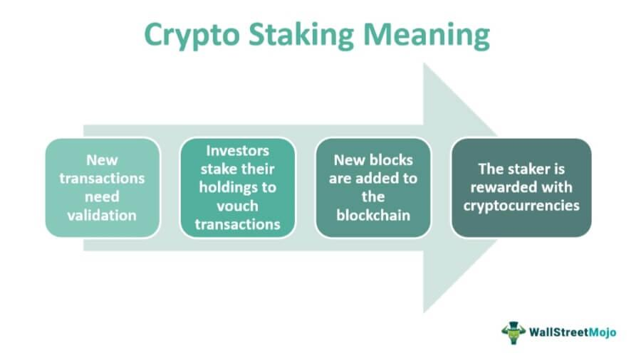

Cryptocurrency, often referred to as digital or virtual currency, has emerged as a transformative force in the financial sector. Unlike traditional currencies regulated by governments and financial institutions, cryptocurrencies rely on decentralized technology, primarily blockchain, to record and verify transactions. This decentralized nature not only ensures transparency and security but also empowers users with unprecedented control over their financial assets. As cryptocurrencies like Bitcoin and Ethereum continue to gain acceptance, they are redefining traditional finance paradigms, providing new avenues for investment, trade, and wealth accumulation.

One of the evolving aspects of cryptocurrency is its potential for generating passive income. Passive income, in this context, refers to earnings derived from activities that require minimal effort or direct involvement from the investor, once the initial setup is complete. Cryptocurrency offers several mechanisms for passive income generation, including staking, yield farming, and lending. These methods allow investors to earn returns on their holdings without actively managing them on a day-to-day basis, thus making the crypto space attractive to both novice and seasoned investors looking for steady income streams.



Algorithmic trading, or algo trading, represents another critical evolution in the cryptocurrency market. This form of trading uses computer algorithms to execute trades at optimal speeds and prices, leveraging historical data and advanced mathematical models. By employing automated strategies, backtesting, and execution protocols, algo trading minimizes human intervention, therefore reducing emotional biases in trading decisions. In the fast-paced realm of cryptocurrencies, where markets are open 24/7, algo trading provides a competitive advantage by ensuring rapid response to market conditions.

The combination of passive income strategies with algorithmic trading is capturing increasing attention within the crypto community. Investors are keen to harness the efficiency and reliability of automated systems to enhance their passive income portfolios. The synergy between these two strategies promises enhanced returns, as algorithms can optimize passive income mechanisms by automatically reallocating resources and executing trades based on real-time market analysis.

The purpose of this article is to explore the intersection of cryptocurrency algo trading and passive income generation. By examining the methodologies, tools, and strategies involved, this piece aims to provide readers with a comprehensive understanding of how these dual approaches can effectively complement one another. Whether new to cryptocurrency or seeking to deepen their understanding, readers will gain valuable insights into optimizing their investment strategies within this dynamic financial landscape.

## Table of Contents

## Understanding Cryptocurrency Passive Income

Passive income refers to earnings that are derived from investments that require little to no active management. In the context of financial investments, passive income is an appealing strategy as it potentially allows investors to earn money without constant oversight, providing an avenue to generate wealth over time.

In the [cryptocurrency](/wiki/cryptocurrency) space, several methods offer the opportunity to earn passive income. Staking is one such method; it involves participating in the proof-of-stake (PoS) mechanisms of certain cryptocurrencies. Investors lock up a certain amount of cryptocurrency in a wallet to support the network's security and operations. In return, they receive rewards in the form of additional tokens. For example, Ethereum 2.0 and Cardano are popular networks where staking is utilized.

Yield farming is another strategy predominantly used in decentralized finance (DeFi) platforms. It involves providing [liquidity](/wiki/liquidity-risk-premium) to decentralized exchanges (DEXs) by depositing cryptocurrencies into liquidity pools. Users are rewarded with interest or additional tokens. Yield farming can be complex, often requiring users to navigate various platforms and pools to maximize returns. Protocols like Uniswap, Aave, and Compound offer robust environments for yield farming.

Crypto lending platforms also provide a means to earn passive income. Investors can lend their digital assets to borrowers in exchange for interest payments. Platforms such as BlockFi, Celsius, and Nexo facilitate crypto loans and offer interest rates that are generally higher than traditional financial institutions.

These passive income strategies come with notable advantages compared to direct trading or simply holding cryptocurrencies. First, they can offer more predictable and stable returns, reducing the impact of sharp market fluctuations that are common in crypto trading. Additionally, these methods can be engaged without requiring constant market monitoring, making them accessible to investors who may lack the time or expertise for active trading.

However, [earning](/wiki/earning-announcement) passive income through cryptocurrency is not without risks. Market [volatility](/wiki/volatility-trading-strategies) presents a significant challenge, as the value of the staked or lent assets can fluctuate, potentially negating the returns from staking or interest. Smart contract vulnerabilities and platform security are also crucial considerations, as hacks or breaches can lead to significant financial losses. Furthermore, regulatory uncertainties add layers of risk and complexity to these investment strategies.

Popular platforms for generating passive income in the crypto ecosystem include Binance, which offers staking and lending services, and Coinbase, which allows staking for certain cryptocurrencies directly from user accounts. Ethereum, Cardano, and Solana are among the top cryptocurrencies widely used for staking due to their robust PoS mechanisms. For yield farming and lending, platforms like Aave and Uniswap are frequently utilized due to their comprehensive DeFi ecosystems. These platforms, among others, provide the technological and financial infrastructure necessary for investors to harness the potential of crypto-based passive income streams.

 to Algorithmic Trading in Cryptocurrency

Algorithmic trading, often referred to as algo trading, is the process of using computer programs and algorithms to execute trades in financial markets, including the cryptocurrency market. These algorithms are designed to execute orders based on predetermined conditions, allowing traders to automate their trading activities.

In cryptocurrency markets, [algorithmic trading](/wiki/algorithmic-trading) is of particular importance due to the unique characteristics of these markets, which operate 24/7 and exhibit high volatility. Crypto trading algorithms are composed of several key components:

1. **Automated Strategies**: At the core of any trading algorithm is an automated strategy. This is a set of rules or conditions that dictate when a trade should be executed. For example, a simple moving average-based strategy may buy a cryptocurrency when its short-term moving average crosses above its long-term moving average.

```python
# Example Python code for a simple moving average crossover strategy
def moving_average(prices, window):
    return sum(prices[-window:]) / window

short_window = 5
long_window = 20

def trade_signal(prices):
    short_ma = moving_average(prices, short_window)
    long_ma = moving_average(prices, long_window)
    if short_ma > long_ma:
        return "Buy"
    elif short_ma < long_ma:
        return "Sell"
    else:
        return "Hold"
```

2. **Backtesting**: This is the process of testing a trading strategy using historical market data to evaluate its effectiveness. Backtesting allows traders to assess how their algorithm would have performed in the past, providing insights into potential profitability and risk.

3. **Execution**: Automated execution ensures that trades are carried out quickly and accurately, often eliminating human error and delay. Execution algorithms are designed to find the best possible price and minimize the market impact of large trades, making them essential for high-frequency trading.

The benefits of algo trading in cryptocurrency markets include:

- **Speed**: Algorithms can execute trades in milliseconds, significantly faster than human traders, which is crucial in fast-moving crypto markets.
- **Efficiency**: Algo trading can process vast amounts of data from various market sources, identifying trading opportunities that would be impossible for humans to spot.
- **Emotion-Free Execution**: Algorithms follow their predefined rules without emotional interference, reducing the chances of irrational trading decisions caused by fear or greed.

However, algo trading also comes with complexities and requires a certain level of technical proficiency. Developing and maintaining an effective trading algorithm involves understanding programming, mathematical modeling, and data analysis. Moreover, ensuring the robustness of an algorithm in a highly volatile and unpredictable market like cryptocurrency can be challenging.

The availability of algo trading facilities has increased with the growth of cryptocurrency exchanges offering such services. Many exchanges now provide APIs (Application Programming Interfaces) that allow traders to connect their algorithms directly to the exchange for seamless order execution. Additionally, various platforms offer tools and libraries to assist in developing, [backtesting](/wiki/backtesting), and deploying trading algorithms, making algo trading more accessible to a wider audience.

## Combining Algo Trading with Passive Income Strategies

Integrating algorithmic trading with passive income strategies represents a sophisticated advancement in the digital finance ecosystem. At its core, this integration leverages the efficiency and decisiveness of algorithmic trading to enhance passive income generation methods such as staking, yield farming, and automated lending. 

Algorithms are often developed for optimal passive income generation by identifying profitable opportunities across blockchain networks and executing trades or staking automatically. For instance, an algorithm could be programmed to automatically place funds in liquidity pools with the best return ratios or to constantly rebalance a portfolio to maintain a set distribution of assets, based on market performance. This ensures that the capital is always working to generate yields without requiring constant manual intervention. 

Blockchain technology and smart contracts are fundamental to this automation. Smart contracts, which are self-executing contracts with the terms of the agreement directly written into code, allow for automated execution of transactions when predefined conditions are met. This capability is pivotal in passive income strategies as it facilitates trustless transactions, drastically reducing the need for intermediaries and enabling decentralized finance (DeFi) protocols to operate smoothly. 

Trading bots and Application Programming Interfaces (APIs) play crucial roles in executing these automated strategies. Trading bots are programmed to follow specific rules and execute trades at high volumes and speed, which can be advantageous in volatile markets. Through APIs, these bots can interact with exchanges to gather data, execute trades, and manage portfolios automatically. For example, a Python-based trading bot could use an API to execute a strategy designed for [arbitrage](/wiki/arbitrage) across multiple exchanges, seeking out price discrepancies for profit.

Here's a simplified Python code snippet illustrating the structure of a basic algorithm that could assist in optimizing yield farming:

```python
def check_yield_rates():
    # Fetch current yield rates from multiple platforms
    rates = fetch_from_api('yield_rate_api')
    return rates

def optimize_yield_farming(rates):
    # Identify the platform with the highest yield
    best_platform = max(rates, key=rates.get)
    return best_platform

def main():
    rates = check_yield_rates()
    platform_to_invest = optimize_yield_farming(rates)
    execute_investment(platform_to_invest)
```

Continuous monitoring and optimization are key to ensuring the sustainability of these algorithmic strategies. Market conditions, yield rates, and asset prices fluctuate, sometimes unpredictably, necessitating regular updates and refinements of the algorithms. Without this constant adaptation, an initially profitable strategy may become obsolete, or worse, result in financial losses.

In conclusion, combining algo trading with passive income strategies harnesses the power of automation and data-driven decision-making to maximize earnings in the cryptocurrency market. However, the dynamic nature of crypto markets also underscores the importance of maintaining vigilant oversight and proactive adjustments to strategies to safeguard investments and optimize returns.

## Potential Risks and Challenges

Cryptocurrency algorithmic trading for passive income offers significant opportunities but also comes with notable risks and challenges. One major risk is market volatility, a characteristic feature of the cryptocurrency ecosystem. The decentralized and often speculative nature of cryptocurrencies can lead to rapid price fluctuations, which can significantly impact algorithmic trading strategies that are not designed to handle such volatility. For example, a sudden market dip could trigger sell orders at a loss, eroding potential profits.

Technical failures are another concern. These can include software bugs, hardware malfunctions, or connectivity issues that disrupt trading operations. Algo trading systems rely heavily on real-time data and continuous operation, so any interruption can lead to missed opportunities or unintended trades. It is crucial for traders to develop robust systems with redundancies and fallback mechanisms to mitigate these risks.

Regulatory and security concerns also pose substantial risks. The legal landscape for cryptocurrencies is evolving, with different countries implementing a variety of regulatory frameworks. Algorithmic traders need to ensure compliance with relevant laws to avoid legal repercussions. Additionally, the security of trading platforms and algorithms is critical, as cyberattacks and hacking attempts are prevalent in the crypto space. Employing strong cybersecurity measures and keeping software updated are essential strategies to protect investments.

Forecasting returns in cryptocurrency algo trading is inherently challenging due to market unpredictability. Effective risk management strategies, such as setting stop-loss orders and using volatility indicators, can help in mitigating potential losses. Diversification is another effective strategy to manage risk. By spreading investments across different cryptocurrencies and trading strategies, traders can reduce the impact of any single asset's poor performance on their overall portfolio.

Algorithm updates are crucial for maintaining the viability and effectiveness of trading systems. As market conditions change, algorithms need to be tested and adjusted to align with current trends and data patterns. This involves ongoing monitoring, backtesting with historical data, and occasionally incorporating [machine learning](/wiki/machine-learning) techniques to enhance predictive capabilities.

Ultimately, thorough research and due diligence are vital before embarking on cryptocurrency investments, particularly those involving algorithmic trading for passive income. Understanding the technology, market dynamics, and legal implications can help investors devise better strategies and make informed decisions. Engaging with community forums, following trusted news sources, and consulting with financial experts can provide additional insights into potential risks and help in developing a resilient trading approach.

## Success Stories and Case Studies

Several individuals and organizations have successfully leveraged cryptocurrency algorithmic trading to generate passive income. These success stories highlight not only the potential for financial gain but also the importance of strategy, technology, and risk management.

One prominent example is the case of a medium-sized trading firm that implemented a high-frequency trading algorithm on the Binance exchange. The firm utilized advanced machine learning techniques to develop a trading strategy that capitalized on market inefficiencies and arbitrage opportunities. By employing a robust risk management system, they minimized their exposure to sudden market downturns, thereby ensuring a consistent stream of income. The key factors contributing to their success included a well-researched strategy, a scalable technology infrastructure, and a disciplined approach to risk management.

Another individual success story involves a solo trader who developed an algorithmic strategy focusing on yield farming and automated [market making](/wiki/market-making) using decentralized finance (DeFi) protocols. By utilizing smart contracts and blockchain technology, the trader created an automated system that adjusted to different yield farming opportunities, effectively optimizing returns based on real-time data. The trader achieved sustainability through constant monitoring and updating of algorithms to adapt to changing market conditions, thus ensuring consistent passive income.

The scalability of these approaches largely depends on the adaptability of the technology infrastructure and the volatility of the cryptocurrency market. Both cases demonstrate that algorithms designed with flexibility and scalability in mind can withstand varying market conditions. However, sustainability remains a challenge, primarily due to the unpredictable nature of the crypto market. Mitigation strategies such as diversification, hedging, and regular evaluations of the trading ecosystem are essential.

From these success stories, several best practices emerge. Firstly, thorough research and continuous learning are crucial, as the cryptocurrency landscape is dynamic and rapidly evolving. Secondly, maintaining a balance between automation and human oversight is vital to ensure that automated systems are functioning correctly and adapting to new information. Thirdly, the integration of robust risk management practices, including setting stop-loss orders and diversifying investments, can significantly improve the chances of long-term success.

Looking to the future, trends such as the increasing sophistication of [artificial intelligence](/wiki/ai-artificial-intelligence) in trading algorithms and the expansion of DeFi platforms suggest that opportunities for generating passive income through cryptocurrency algo trading will continue to grow. Moreover, the development of more sophisticated risk management tools will likely increase the accessibility and appeal of these strategies to a broader range of investors.

## Conclusion

Cryptocurrency algorithmic trading presents a promising avenue for generating passive income by leveraging the dynamic nature of digital markets with automated strategies. This approach offers compelling opportunities alongside notable challenges. On one hand, the advantages include high-speed transactions and emotion-free decision-making, which can efficiently exploit market inefficiencies. On the other hand, participants must navigate inherent risks, such as market volatility and technical errors, which demand rigorous planning and continuous monitoring.

For those considering algorithmic trading as a means to earn passive income, it is crucial to evaluate personal risk tolerance and align investment strategies with financial goals. Investors must remain cognizant of the rapid technological changes and shifting market conditions that characterize the cryptocurrency landscape. Staying informed about advancements in trading technologies and regulatory updates is essential to maintaining a competitive edge and ensuring security.

Aspiring crypto investors are encouraged to engage with various educational resources and consider seeking professional advice to deepen their understanding of this intricate field. By cultivating a comprehensive knowledge base, individuals can better position themselves to capitalize on the potential benefits while managing the accompanying risks associated with cryptocurrency algo trading for passive income.

## References & Further Reading

[1]: Bergstra, J., Bardenet, R., Bengio, Y., & Kégl, B. (2011). ["Algorithms for Hyper-Parameter Optimization."](https://papers.nips.cc/paper/4443-algorithms-for-hyper-parameter-optimization) Advances in Neural Information Processing Systems 24.

[2]: ["Advances in Financial Machine Learning"](https://www.amazon.com/Advances-Financial-Machine-Learning-Marcos/dp/1119482089) by Marcos Lopez de Prado

[3]: ["Evidence-Based Technical Analysis: Applying the Scientific Method and Statistical Inference to Trading Signals"](https://www.amazon.com/Evidence-Based-Technical-Analysis-Scientific-Statistical/dp/0470008741) by David Aronson

[4]: ["Machine Learning for Algorithmic Trading"](https://github.com/PacktPublishing/Machine-Learning-for-Algorithmic-Trading-Second-Edition) by Stefan Jansen

[5]: ["Quantitative Trading: How to Build Your Own Algorithmic Trading Business"](https://books.google.com/books/about/Quantitative_Trading.html?id=j70yEAAAQBAJ) by Ernest P. Chan