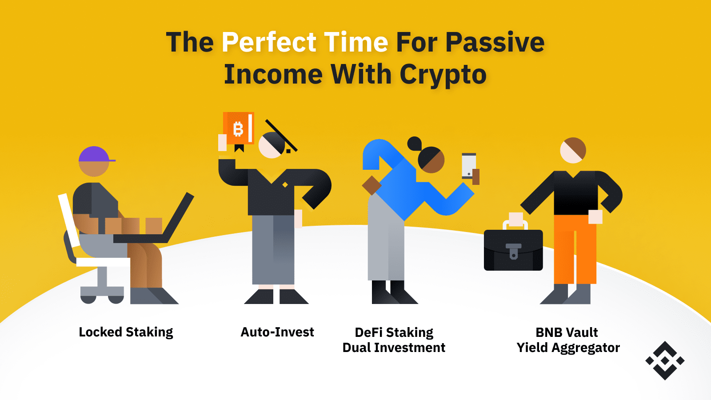

## Table of Contents

## What is passive income and how does it relate to cryptocurrency?

Passive income is money you earn without having to work actively for it. This can come from things like rental properties, dividends from stocks, or interest from savings accounts. The idea is that once you set it up, it keeps earning money for you with little extra effort. This can help you build wealth over time because you're making money even when you're not working.

Cryptocurrency can be a way to earn passive income too. One way is through something called staking, where you hold certain cryptocurrencies in a wallet to support the operations of a blockchain network. In return, you get rewarded with more cryptocurrency. Another way is by lending your cryptocurrency to others on special platforms and earning interest on it. Just like other forms of passive income, these methods can help you earn money without daily effort, but they also come with risks because the value of cryptocurrencies can go up and down a lot.

## What are the most common cryptocurrencies used for generating passive income?

The most common cryptocurrencies used for generating passive income are Bitcoin, Ethereum, and stablecoins like USDT and USDC. Bitcoin, the first and most well-known cryptocurrency, can be used to earn passive income through lending platforms where you lend your Bitcoin to others and earn interest. Ethereum, on the other hand, allows you to earn passive income through staking, where you hold your Ethereum in a wallet to support the Ethereum network and get rewarded with more Ethereum.

Stablecoins like USDT and USDC are also popular for passive income because they are tied to the value of the US dollar, making them less risky than other cryptocurrencies. You can lend these stablecoins on various platforms and earn a steady [interest rate](/wiki/interest-rate-trading-strategies). These methods can help you earn money without much daily effort, but remember that the crypto world can be unpredictable, so it's important to do your research and understand the risks involved.

## How can staking cryptocurrencies generate passive income?

Staking cryptocurrencies can generate passive income by letting you earn more coins just for holding them. Some cryptocurrencies use a system called "proof of stake" to keep their network running. When you stake your coins, you help this system work by locking up your coins in a special wallet. In return, the network gives you more coins as a reward. It's like getting interest from a bank, but instead of money, you get more of the [cryptocurrency](/wiki/cryptocurrency) you're staking.

This way of [earning](/wiki/earning-announcement) passive income is pretty easy once you set it up. You don't need to do much after you start staking, so it's a good way to make money without working a lot. But, it's important to know that the value of cryptocurrencies can go up and down a lot. So, while staking can give you extra coins, the total value of what you earn might change. Always do some research and think about the risks before you start staking your cryptocurrencies.

## What is yield farming and how can it be used to earn passive income?

Yield farming is a way to earn passive income with cryptocurrencies by lending them out on special platforms called decentralized finance (DeFi) platforms. When you put your cryptocurrencies into these platforms, they use them to help others make trades or loans. In return, you get a share of the fees or interest that the platform earns. It's kind of like planting seeds and waiting for them to grow, but instead of plants, you're growing your money.

This method can be a good way to earn extra money without much work once you set it up. But, it's important to know that yield farming can be risky. The value of cryptocurrencies can go up and down a lot, and sometimes the platforms might not be safe. So, it's a good idea to do some research and understand the risks before you start yield farming.

## Can you explain the concept of liquidity pools and their role in passive income?

Liquidity pools are like big pots of money that people put together on special platforms called decentralized exchanges. These pools help make it easier for people to trade cryptocurrencies without needing a middleman like a bank. When you add your money to a [liquidity](/wiki/liquidity-risk-premium) pool, you're helping the platform work smoothly by making sure there's always enough money for people to trade. In return, you get a share of the fees that the platform earns from all the trades that happen.

This way of earning money is called passive income because once you put your money into the pool, you don't have to do much else. The platform does the work, and you get paid just for having your money in the pool. But, it's important to know that putting your money in liquidity pools can be risky. The value of cryptocurrencies can go up and down a lot, and sometimes the platforms might not be safe. So, it's a good idea to do some research and understand the risks before you start using liquidity pools to earn passive income.

## What are the risks associated with earning passive income through cryptocurrency?

Earning passive income through cryptocurrency can be exciting, but it also comes with some big risks. One of the main risks is that the value of cryptocurrencies can change a lot. One day your crypto might be worth a lot, and the next day it could be worth much less. This means that even if you're earning extra coins through staking, lending, or yield farming, the total value of what you earn might go down. Another risk is that the platforms you use for these activities might not be safe. Sometimes, these platforms can get hacked, and you could lose all the money you put in.

Another thing to think about is that the rules for cryptocurrencies can change. Governments around the world are still figuring out how to handle crypto, and new laws could make it harder to earn passive income this way. Also, some methods like yield farming and liquidity pools can be pretty complicated. If you don't understand them well, you might make mistakes that cost you money. So, it's really important to do a lot of research and be careful before you start trying to earn passive income with cryptocurrency.

## How do decentralized finance (DeFi) platforms facilitate passive income strategies?

Decentralized finance (DeFi) platforms help people earn passive income by letting them use their cryptocurrencies in different ways. One way is through lending, where you can lend your crypto to others on the platform and earn interest on it. It's like putting money in a bank, but instead of a bank, you're using a special online platform. Another way is through yield farming, where you put your crypto into a "liquidity pool" that helps the platform work better. In return, you get a share of the fees that the platform earns from all the trades that happen.

Staking is another way DeFi platforms help with passive income. When you stake your crypto, you're helping the platform's network run smoothly, and you get rewarded with more crypto for doing this. It's like getting interest from a bank, but instead of money, you get more of the cryptocurrency you're staking. All these methods can help you earn money without much daily effort, but it's important to know that using DeFi platforms can be risky. The value of cryptocurrencies can go up and down a lot, and sometimes the platforms might not be safe. So, it's a good idea to do some research and understand the risks before you start using DeFi platforms to earn passive income.

## What is the difference between fixed and variable interest rates in crypto lending?

In crypto lending, fixed interest rates mean that the amount of interest you earn stays the same over the whole time you lend your crypto. It's like agreeing to get a certain amount of money every month, no matter what happens in the crypto world. This can be good if you want to know exactly how much you'll earn, and it helps you plan your money better. But, if the value of the crypto goes up a lot, you might miss out on earning more interest.

Variable interest rates in crypto lending change over time. They go up or down based on how much people want to borrow and how much crypto is available to lend. This means you could earn more interest if the demand for borrowing goes up, but you could also earn less if it goes down. It's a bit riskier because you don't know exactly how much you'll earn, but it can also be more exciting because you might get a bigger reward if things go well.

## How can one optimize their passive income strategy using crypto masternodes?

Crypto masternodes are special servers that help run certain cryptocurrencies. When you set up a masternode, you're helping the network work better by doing things like processing transactions or voting on changes. In return, you get paid in the cryptocurrency you're supporting. This can be a good way to earn passive income because once your masternode is set up, it keeps earning money for you without much extra work. But, setting up a masternode can be expensive because you need to lock up a lot of the cryptocurrency to start one. So, it's important to think about the costs and make sure you understand how it all works before you start.

To optimize your passive income strategy with masternodes, you should look for cryptocurrencies that offer good rewards for running a masternode. Some cryptocurrencies pay more than others, so doing some research can help you find the best ones. Also, think about how stable the cryptocurrency is. If it's too risky and the value goes up and down a lot, it might not be the best choice for earning steady passive income. Keeping an eye on the network's health and updates can also help you make sure your masternode keeps running smoothly and earning you money.

## What are some advanced strategies for maximizing returns from passive crypto income?

One advanced strategy for maximizing returns from passive crypto income is to diversify your investments across different cryptocurrencies and platforms. Instead of putting all your money into one type of crypto or one platform, you can spread it out. This way, if one crypto or platform doesn't do well, you still have others that might be doing better. You can use a mix of staking, lending, yield farming, and masternodes to earn from different sources. This can help you get more money overall because you're not relying on just one thing.

Another strategy is to keep an eye on the market and be ready to move your money around. The crypto world changes a lot, and what works today might not work tomorrow. By staying updated on new platforms, cryptocurrencies, and trends, you can switch your money to where it will earn the most. For example, if you see that a new DeFi platform is offering high interest rates for lending, you might want to move some of your crypto there. Also, using tools like automated trading bots can help you make these moves without having to watch the market all the time. This way, you can keep your passive income growing even when you're not actively managing it.

## How does tax on passive income from cryptocurrency work, and what should be considered?

When you earn passive income from cryptocurrency, like through staking, lending, or yield farming, you need to think about taxes. In many places, the money you make from these activities is seen as income, and you have to pay taxes on it. The rules can be different depending on where you live, so it's important to check the tax laws in your country. For example, in the United States, the IRS treats crypto earnings as taxable income, and you need to report it on your tax return. If you don't report your crypto earnings, you could get in trouble with the tax authorities.

Another thing to consider is that if you earn crypto and then sell it later, you might have to pay capital gains tax. This is a tax on the profit you make from selling something that has gone up in value. The amount of tax you pay can depend on how long you held the crypto before selling it. Keeping good records of all your crypto transactions is really important because it helps you figure out how much tax you owe. It's a good idea to talk to a tax professional who knows about cryptocurrency to make sure you're doing everything right and not missing any important details.

## What future trends might impact passive income strategies in the cryptocurrency space?

In the future, new technologies like layer-2 solutions and more efficient blockchains could make earning passive income from cryptocurrencies easier and cheaper. Layer-2 solutions help make transactions faster and less expensive, which could make things like staking and yield farming more attractive. Also, as more people start using cryptocurrencies, there might be more ways to earn passive income. New platforms and projects could come up with different ways to reward people for helping their networks run smoothly, like through new types of lending or staking programs.

Another big trend that could change passive income strategies is how governments around the world start to regulate cryptocurrencies. If rules become clearer and more friendly, it might be easier and safer to earn passive income. But if rules get stricter, it could make some ways of earning passive income harder or even impossible. It's also important to keep an eye on how stablecoins and central bank digital currencies (CBDCs) grow. These could offer new ways to earn passive income that are less risky than other cryptocurrencies. Keeping up with these trends can help you adjust your strategies and keep earning money in the changing world of crypto.

## References & Further Reading

[1]: Bergstra, J., Bardenet, R., Bengio, Y., & Kégl, B. (2011). ["Algorithms for Hyper-Parameter Optimization."](https://papers.nips.cc/paper/4443-algorithms-for-hyper-parameter-optimization) Advances in Neural Information Processing Systems 24.

[2]: ["Advances in Financial Machine Learning"](https://www.amazon.com/Advances-Financial-Machine-Learning-Marcos/dp/1119482089) by Marcos Lopez de Prado

[3]: ["Evidence-Based Technical Analysis: Applying the Scientific Method and Statistical Inference to Trading Signals"](https://www.amazon.com/Evidence-Based-Technical-Analysis-Scientific-Statistical/dp/0470008741) by David Aronson

[4]: ["Machine Learning for Algorithmic Trading"](https://github.com/PacktPublishing/Machine-Learning-for-Algorithmic-Trading-Second-Edition) by Stefan Jansen

[5]: ["Quantitative Trading: How to Build Your Own Algorithmic Trading Business"](https://books.google.com/books/about/Quantitative_Trading.html?id=j70yEAAAQBAJ) by Ernest P. Chan