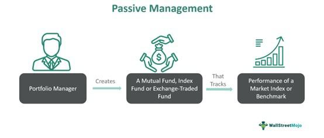

Investment strategies play a critical role in the financial landscape, guiding how investors manage their resources to achieve desired financial outcomes. In today's complex financial markets, there is a significant convergence of passive management, asset management, and algorithmic trading, shaping robust investment strategies. Understanding these concepts is essential for both novice and seasoned investors, as each approach offers distinct benefits and caters to different investment objectives and risk tolerances.

Passive management is an investment strategy focused on replicating the performance of market indices, such as the S&P 500, rather than trying to outperform them. It contrasts with active management, which involves frequent buying and selling of securities aiming to beat market returns. The primary advantages of passive management include lower fees and reduced risk due to diversification since these funds seek to mirror a specific index. The Efficiency Market Hypothesis supports the logic behind passive investing, positing that it's difficult to consistently outperform the market through active strategies.



Asset management involves developing strategies to manage investments effectively on behalf of clients, with the main objective being to maximize returns while minimizing risks. This approach requires selecting a suitable mix of assets, such as stocks, bonds, commodities, and real estate, based on the investor's goals and risk tolerance. Asset management firms leverage technology and market insights to refine strategies and enhance performance, often incorporating passive management for its cost-effectiveness and potential for steady returns.

Algorithmic trading, often seen as the future of investment, utilizes computer algorithms to make trading decisions in financial markets. These algorithms enable faster and more efficient trade execution compared to human traders. Algorithmic trading can substantially enhance the efficiency and accuracy of index tracking, optimizing the benefits of passive management. As such, investors are increasingly turning to algorithmic solutions to handle large trade volumes, reduce transaction costs, and potentially improve returns.

This article starts with an introduction to passive management, then examines asset management strategies and the role of algorithmic trading. Each section details the benefits and potential limitations of these strategies, with contemporary examples from the industry illustrating their impact. By understanding these strategies, investors can make informed decisions that align with their financial goals, ultimately contributing to successful wealth accumulation.

## Table of Contents

## Understanding Passive Management

Passive management is an investment strategy centered on replicating the performance of specific market indices, such as the S&P 500. Unlike active management, which requires frequent buying and selling in an effort to outperform the market, passive management adopts a long-term investment horizon, leveraging the natural growth of the market.

The primary appeal of passive management lies in its cost-effectiveness and reduced risk. By aligning investments with broad market indices, passive funds incur lower management fees compared to actively managed funds. This reduction in fees stems from the fewer transactions and minimal research expenditures, as the fund's goal is not to identify and exploit market inefficiencies but merely to mirror the index it follows. Diversification is another advantage, as passive funds inherently diversify by investing in the wide array of securities constituting the chosen index, thereby spreading and mitigating risk.

A key theoretical foundation of passive management is the Efficient Market Hypothesis (EMH), which posits that financial markets are "informationally efficient." This means that all available information is already reflected in current stock prices, making it exceedingly challenging for investors to consistently achieve returns exceeding overall market performance through active stock selection. This hypothesis offers a strong rationale for passive management, as it suggests that efforts to surpass market returns are generally futile over the long term.

Despite criticisms that passive management merely achieves market average returns and is inherently reactive to market movements, it has demonstrated consistent long-term performance stability. This reliability makes it attractive to both individual and institutional investors who prioritize steady growth and lower costs over aggressive, often volatile, returns. Over the years, the increasing complexity of financial markets and a growing body of empirical research supporting passive strategies have contributed to their popularity.

In conclusion, passive management presents a viable investment strategy for those seeking a simplified, cost-efficient approach. By focusing on broad market trends rather than individual securities, passive management allows investors to participate in market growth while minimizing the pitfalls associated with active trading strategies.

## Exploring Asset Management Strategies

Asset management involves developing strategies to effectively manage investments on behalf of clients, focusing on balancing risk and reward to achieve desired financial outcomes. The primary goal is to maximize returns while minimizing risks, requiring a thoughtful selection of asset combinations. Typically, these strategies incorporate a diverse mix of stocks, bonds, commodities, and real estate—each asset class offering varying levels of risk and return potential suited to meet individual or institutional investment goals and risk tolerances.

### Strategic Asset Allocation

A key component in asset management is strategic asset allocation. This approach involves setting target allocations for various asset classes and periodically rebalancing the portfolio to maintain these targets over time. For instance, an investor may start with a mix of 60% equities, 30% bonds, and 10% real estate. The specific allocation depends on the investor's profile, desired returns, and risk aversion. Implementing this strategy aims to optimize returns based on the investor’s unique set of preferences and constraints.

### Passive Management Preference

Passive management is often a preferred strategy in asset management due to its cost-effectiveness and potential for reliable returns. Instead of attempting to outperform market indices, passive strategies aim to replicate the performance of these benchmarks. This is achieved through investment vehicles like index funds and exchange-traded funds (ETFs), which offer low-cost access to a diversified portfolio. The efficiency of passive management is supported by the Efficient Market Hypothesis, suggesting that markets are generally efficient and consistently outperforming them through active management is challenging.

### Leveraging Technology and Insights

Modern asset management strategies increasingly leverage technology and data-driven insights to enhance decision-making and refine performance. Advanced analytics, [artificial intelligence](/wiki/ai-artificial-intelligence), and [machine learning](/wiki/machine-learning) are employed to process vast amounts of financial data, uncovering patterns and trends that inform investment strategies. Some firms develop proprietary models to predict market behaviors and optimize asset allocation dynamically, thus gaining a competitive edge. 

For example, asset managers may use Python programming to run simulations and stress tests on their portfolios. Here's a simple example of using Python to calculate the expected return of a portfolio:

```python
import numpy as np

# Expected returns for each asset class
expected_returns = np.array([0.06, 0.03, 0.04])  # stocks, bonds, real estate

# Portfolio weights
weights = np.array([0.6, 0.3, 0.1])

# Calculate expected portfolio return
portfolio_return = np.dot(weights, expected_returns)
print(f"Expected Portfolio Return: {portfolio_return:.2%}")
```

This code snippet showcases a basic calculation, aiding managers in understanding potential returns based on current allocations. As technology continues to evolve, asset management strategies are becoming more integrated and sophisticated, enabling managers to better serve their clients by tailoring strategies to specific financial goals and market conditions.

## Algorithmic Trading: The Future of Investment

Algorithmic trading utilizes sophisticated computer algorithms to execute trading decisions in financial markets. These algorithms are designed to analyze market data, identify trading opportunities, and perform transactions at speeds and frequencies unachievable by human traders. This efficiency makes [algorithmic trading](/wiki/algorithmic-trading) a dominant force in modern financial markets.

At its core, algorithmic trading relies on predefined rules and strategies encoded into computer programs to [carry](/wiki/carry-trading) out trades. These may include statistical models, optimization techniques, and machine learning algorithms to predict market trends and optimize trading execution. The automation of trades reduces the time required for decision-making and enhances the precision of execution, which is essential in volatile market conditions.

One popular application of algorithmic trading is in passive management strategies, where it plays a crucial role in optimizing index tracking. By using advanced algorithms, traders can enhance the efficiency and accuracy of replication of market indices, achieving closer tracking of the benchmark with reduced tracking error. This is particularly valuable in index funds and exchange-traded funds (ETFs), where precision in tracking the underlying index is paramount.

Moreover, the automation provided by algorithmic trading systems, such as Algobot, helps eliminate much of the stress and manual processes traditionally associated with trading. These systems can adjust to market conditions in real-time, providing a level of responsiveness that would be difficult for human traders to achieve consistently.

Investors increasingly rely on algorithmic trading solutions to manage large volumes of trade, capitalize on small price discrepancies, and minimize transaction costs. By using algorithms, traders can exploit [arbitrage](/wiki/arbitrage) opportunities and hedge positions with minimal human intervention. This results in enhanced returns and reduced exposure to market inefficiencies.

As the landscape of financial markets continues to evolve, algorithmic trading stands at the forefront of innovation. Its capacity to integrate large data sets, compute complex algorithms rapidly, and execute trades with high precision positions it as a quintessential tool for contemporary and future investment strategies. The proliferation of algorithmic trading is likely to expand further as technology advances, offering investors sophisticated tools to navigate increasingly complex markets.

## Benefits and Limitations

Passive management strategies provide a notable advantage in cost savings and risk reduction primarily through diversification. By tracking the performance of a comprehensive market index, these strategies avoid the high transaction fees and active management expenses that can erode investment returns. The reduction in cost makes passive management particularly attractive for long-term investors seeking steady growth without the burden of constant oversight. Such strategies align with the Efficient Market Hypothesis, which posits that it is challenging to outperform the market consistently.

On the other hand, algorithmic trading leverages advanced computer algorithms to execute trades at high speed and efficiency. This capability allows investors to readily capitalize on market opportunities that may arise from transient price discrepancies. The algorithmic approach can optimize passive management by fine-tuning the tracking of indices with improved precision and reduced human error. These algorithms, when properly designed, can process vast amounts of data to enhance decision-making processes, ultimately aiming at cost reduction in transaction fees and improved market entry timing.

However, passive strategies inherently do not aim to outperform the market; instead, they replicate it. This means that during periods of strong market performance, these strategies can yield satisfactory returns, but they may also reflect market downturns. Similarly, while algorithmic trading offers significant advantages, it is not without risks. The reliance on technology introduces potential technical failures or glitches, which can lead to unexpected financial losses. Moreover, the reliance on predefined rules can restrict flexibility and responsiveness, particularly in volatile or rapidly changing market conditions where human intuition may otherwise prove beneficial.

For investors, understanding these benefits and limitations is crucial. Passive management and algorithmic trading each offer distinct advantages that, when combined strategically, can form a robust investment approach. Investors must weigh these advantages against potential limitations to devise an investment strategy that aligns with their financial objectives and risk tolerance. This thoughtful consideration will be fundamental in navigating the complexities of modern financial markets.

## Conclusion

Investors need to weigh both the advantages and challenges presented by passive management, asset management, and algorithmic trading. Each strategy offers distinct benefits that can be strategically leveraged according to specific investor objectives and prevailing market conditions. While passive management provides a cost-effective pathway for steady returns, it lacks the flexibility to outperform the market. Conversely, algorithmic trading introduces speed and efficiency, yet it carries technical risks and potential inflexibility due to its reliance on predefined rules.

As financial technology continues its rapid advancement, these investment strategies are likely to become more intertwined and sophisticated. This integration could enhance decision-making processes and optimize portfolio management, offering investors novel opportunities to navigate complex market environments. For those seeking consistent, cost-effective growth, integrating passive management with algorithmic solutions presents a promising trajectory. By automating many aspects of passive investing through algorithms, investors can maintain broad market exposure while capitalizing on market efficiencies.

Thoughtful planning and strategic investment are essential to harness the full potential of these strategies. Investors who balance these approaches effectively are well-positioned to achieve significant wealth accumulation and financial success. As markets evolve, continued review and adaptation of these strategies will remain crucial in aligning investments with financial goals and economic shifts.

## References & Further Reading

[1]: ["A Random Walk Down Wall Street: The Time-Tested Strategy for Successful Investing"](https://www.amazon.com/Random-Walk-Down-Wall-Street/dp/0393358380) by Burton G. Malkiel

[2]: ["The Little Book of Common Sense Investing: The Only Way to Guarantee Your Fair Share of Stock Market Returns"](https://www.amazon.com/Little-Book-Common-Sense-Investing/dp/1119404509) by John C. Bogle

[3]: Fama, E. F. (1970). ["Efficient Capital Markets: A Review of Theory and Empirical Work."](https://onlinelibrary.wiley.com/doi/abs/10.1111/j.1540-6261.1970.tb00518.x) The Journal of Finance.

[4]: ["Algorithmic Trading and DMA: An introduction to direct access trading strategies"](https://www.semanticscholar.org/paper/Algorithmic-trading-%26-DMA-%3A-an-introduction-to-Johnson/aa5de1ab883d5e23b6651faa7c1807586d688e4b) by Barry Johnson

[5]: ["Common Sense on Mutual Funds: New Imperatives for the Intelligent Investor"](https://www.amazon.com/Common-Sense-Mutual-Funds-Imperatives/dp/0471392286) by John C. Bogle