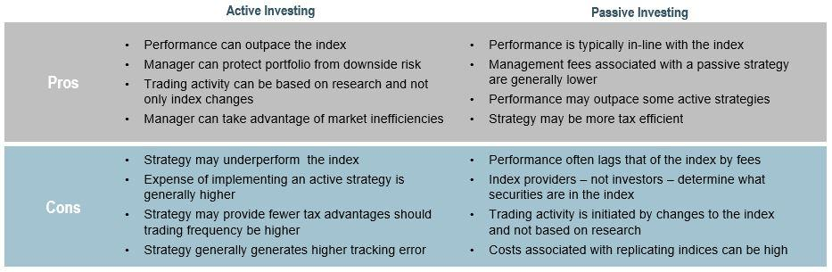

## Table of Contents

## What is passive investing?

Passive investing is a way of investing where you try to match the performance of a market index, like the S&P 500, instead of trying to beat it. Instead of picking individual stocks or timing the market, you invest in a fund that holds all the stocks in the index. This is often done through index funds or exchange-traded funds (ETFs). The main idea is to keep costs low and not to trade too much, which can save you money and time.

One big advantage of passive investing is that it's simple and usually cheaper than active investing. Because you're not paying someone to pick stocks for you, the fees are lower. Over time, these lower fees can make a big difference in your returns. Also, since you're not trying to beat the market, you don't have to worry about making the wrong moves and losing money. Many people find it less stressful and easier to stick with a long-term plan.

## What is active investing?

Active investing is when you try to do better than the market by picking specific stocks or timing when to buy and sell them. People who do active investing often look at a lot of information about companies, the economy, and the world to make their choices. They might buy stocks they think will go up a lot or sell stocks they think will go down. This kind of investing can be exciting but it takes a lot of work and can be risky.

The main difference between active and passive investing is that active investors believe they can beat the market. They are willing to pay higher fees for the chance to make more money. But, it's hard to do better than the market all the time, and many active investors don't end up making more money than if they had just invested in a simple index fund. Active investing can be fun for people who like to be involved and think they can make smart choices, but it's not for everyone because it can be stressful and time-consuming.

## How do passive and active investing differ in terms of strategy?

Passive investing and active investing have very different strategies. Passive investing is all about keeping things simple and low-cost. You pick a broad market index, like the S&P 500, and invest in a fund that tries to match its performance. You don't buy and sell a lot; you just hold onto your investment for a long time. This means you don't have to spend a lot of time watching the market or making decisions, and you save money on fees because the funds are cheaper to manage.

On the other hand, active investing is about trying to beat the market. People who do active investing spend a lot of time researching and making decisions about which stocks to buy and when to buy or sell them. They might look at company reports, news, and economic trends to find stocks they think will do better than the market. This means they trade more often and pay higher fees for the funds they use, because someone is actively managing the investments. Active investing can be exciting and rewarding if you make good choices, but it's also riskier and takes more time and effort.

## What are the typical costs associated with passive investing?

The costs of passive investing are usually lower than those of active investing. The main cost for passive investors is the expense ratio of the fund they choose. This is a small percentage of your investment that the fund charges each year to cover its costs. For example, a common expense ratio for an index fund or [ETF](/wiki/etf-trading-strategies) might be around 0.05% to 0.20%. This means if you have $10,000 invested, you might pay $5 to $20 a year in fees.

Another cost to think about is the cost of buying and selling the fund. If you're investing in an ETF, you might have to pay a small fee, called a commission, each time you buy or sell shares. But many brokers now offer commission-free ETFs, which can help keep your costs down. Overall, the total costs for passive investing are usually very low, which is one reason why many people like this way of investing.

## What are the typical costs associated with active investing?

Active investing usually costs more than passive investing. The biggest cost is the expense ratio, which is the fee the fund charges each year to pay for the people who manage the fund and do research. For active funds, this fee can be much higher, often between 0.5% to 1.5% or even more. So, if you have $10,000 invested, you could be paying $50 to $150 a year in fees, which is a lot more than what you'd pay for a passive fund.

Another cost to think about is trading fees. Active investors buy and sell stocks more often, and each time they do, they might have to pay a commission to their broker. These fees can add up quickly, especially if the investor is trading a lot. Also, active investing can lead to higher taxes because selling investments that have gone up in value can create capital gains, which you have to pay taxes on. All these costs together can eat into your returns, so it's important to think about them when you're choosing how to invest.

## Can you explain the concept of tracking error in passive investing?

Tracking error is a way to measure how well a passive investment, like an index fund or ETF, matches the performance of the market index it's supposed to follow. For example, if you have an S&P 500 index fund, the tracking error tells you how closely the fund's returns match the actual returns of the S&P 500. A smaller tracking error means the fund is doing a good job of copying the index, while a larger tracking error means it's not matching the index as well.

There are a few reasons why a passive fund might have a tracking error. Sometimes, the fund can't buy all the exact same stocks in the same amounts as the index because of costs or rules about what they can invest in. Also, the fund might have to keep some money in cash to pay for things like fees and taxes, which can make its performance different from the index. Even though passive funds aim to keep tracking error low, it's good to check this when you're [picking](/wiki/asset-class-picking) a fund to make sure it's doing what you expect.

## How does the potential for alpha generation compare between passive and active investing?

In passive investing, the potential for alpha generation, which means doing better than the market, is usually very low. Passive investors aim to match the market's performance, not beat it. They invest in funds that follow a market index, like the S&P 500. Because they're not trying to pick the best stocks or time the market, they don't expect to get alpha. The main goal is to keep costs low and get the same returns as the market, which can be a good and simple way to invest.

Active investing, on the other hand, is all about trying to generate alpha. Active investors believe they can pick stocks or time the market in a way that will give them better returns than the market average. They spend a lot of time researching and making decisions, hoping to find stocks that will do better than others. But it's hard to do this consistently, and many active investors end up not beating the market after you take away the higher fees they pay. So, while the potential for alpha is higher in active investing, it's also riskier and not guaranteed.

## What role does market efficiency play in choosing between passive and active investing?

Market efficiency is a big deal when you're deciding between passive and active investing. It means how well the prices of stocks show all the information that's out there. If a market is very efficient, it's hard for active investors to find stocks that are underpriced or overpriced because the prices already have all the information. In an efficient market, passive investing makes more sense because it's hard to beat the market, so you might as well just match it with a low-cost index fund.

But if a market is less efficient, there might be more chances for active investors to do better than the market. In these markets, some stocks might be priced wrong because not everyone knows all the information. Active investors can use their research to find these mistakes and make money from them. So, if you think the market you're looking at isn't very efficient, you might want to try active investing to see if you can find those hidden opportunities and beat the market.

## How do tax implications differ between passive and active investment strategies?

When it comes to taxes, passive investing usually has lower tax costs than active investing. Passive investors buy and hold their investments for a long time, which means they don't buy and sell a lot. When they do sell, they might have to pay capital gains tax, but if they hold their investments for more than a year, they can pay a lower long-term capital gains tax rate. Also, because passive funds trade less, they create fewer taxable events, which can help keep your tax bill down.

On the other hand, active investing can lead to higher taxes. Active investors trade more often, buying and selling stocks to try to beat the market. Each time they sell a stock that's gone up in value, they have to pay capital gains tax. If they hold the stock for less than a year, they pay a higher short-term capital gains tax rate, which is the same as their regular income tax rate. Plus, if the fund they're in is actively managed, it might sell stocks and pass those capital gains onto the investors, which means more taxes to pay. So, active investing can make your tax bill go up because of all the buying and selling.

## What are the long-term performance trends of passive versus active funds?

Over the long term, passive funds often do better than active funds. This is because passive funds have lower fees. When you pay less in fees, more of your money stays invested and can grow over time. Also, it's hard for active investors to beat the market all the time. Studies show that most active funds don't do better than the market after you take away the fees. So, even if an active fund does well for a while, the high fees can eat into the returns, making passive funds a better choice for many people.

Active funds can have some good years, but it's hard to keep beating the market year after year. Some active investors might do really well for a few years, but then they might not do as well later on. This up-and-down performance can be risky. On the other hand, passive funds are more steady because they just follow the market. They don't try to do better than the market, so you know what to expect. Over many years, this steady approach often leads to better results for passive funds compared to active funds.

## How does the level of investor involvement and required expertise vary between passive and active investing?

Passive investing is easy and doesn't need much time or special knowledge. You just pick a fund that follows a market index, like the S&P 500, and keep your money in it for a long time. You don't have to watch the market every day or make a lot of decisions about buying and selling stocks. This makes it good for people who don't want to spend a lot of time on their investments or who are new to investing. You can set it up and then mostly forget about it, which is why it's called "set it and forget it" investing.

Active investing takes more work and more know-how. You need to spend time looking at company reports, news, and other information to decide which stocks to buy and when to buy or sell them. It's like a full-time job because you have to keep up with the market and make a lot of decisions. This means you need to know a lot about investing and be good at picking stocks. It's better for people who like being involved and think they can do better than the market, but it can be hard and risky if you don't know what you're doing.

## What are some advanced strategies used in active investing to outperform the market?

Active investors use many different strategies to try to do better than the market. One common strategy is called "stock picking," where they look at a lot of information about companies to find ones they think will do really well. They might look at things like how much money a company makes, how fast it's growing, and who is running it. If they think a company will do better than others, they buy its stock and hope it goes up a lot. Another strategy is "sector rotation," where they move their money into different parts of the market that they think will do well at different times. For example, they might put more money into technology stocks if they think technology will do better than other parts of the market.

Another advanced strategy is "market timing," where active investors try to guess when the market will go up or down. They might sell their stocks if they think the market will go down and then buy them back when they think it will go up again. This can be very hard to do right, but if they guess correctly, they can make a lot of money. Some investors also use "short selling," where they borrow stocks they think will go down in value, sell them, and then buy them back later at a lower price to make a profit. These strategies take a lot of time and knowledge, and they can be risky, but active investors use them to try to beat the market.

## References & Further Reading

[1]: ["Common Sense on Mutual Funds: New Imperatives for the Intelligent Investor"](https://www.amazon.com/Common-Sense-Mutual-Funds-Imperatives/dp/0471392286) by John C. Bogle

[2]: Burton G. Malkiel. ["A Random Walk Down Wall Street: The Time-Tested Strategy for Successful Investing"](https://www.amazon.com/Random-Walk-Down-Wall-Street/dp/0393358380)

[3]: "Passive Investing and the Rise of Index Investing" by Vanguard Group. [Vanguard's Research](https://corporate.vanguard.com/content/corporatesite/us/en/corp/what-we-think/research-library.html)

[4]: ["Active Portfolio Management: A Quantitative Approach for Producing Superior Returns and Selecting Superior Money Managers"](https://resources.caih.jhu.edu/primo-explore/publication/_pdfs/Active_Portfolio_Management_A_Quantitative_Approach_For_Producing_Superior_Returns_And_Selecting_Superior_Returns.pdf) by Richard Grinold and Ronald Kahn

[5]: ["Algorithmic Trading: Winning Strategies and Their Rationale"](https://www.wiley.com/en-us/Algorithmic+Trading%3A+Winning+Strategies+and+Their+Rationale-p-9781118460146) by Ernest P. Chan