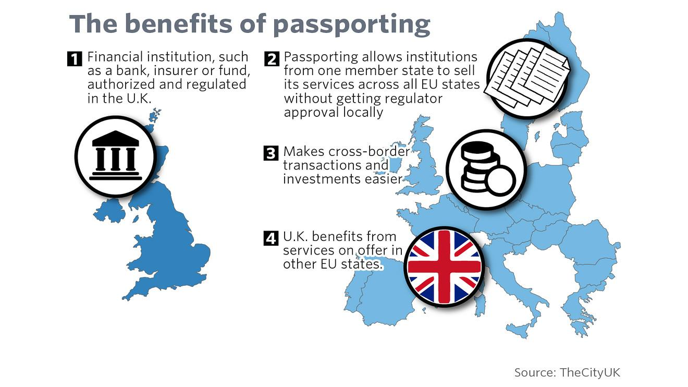

## Table of Contents

## What is passporting in financial services?

Passporting in financial services is a system that allows financial firms to operate across different countries within the European Economic Area (EEA) using a single authorization from their home country regulator. This means that a bank or investment firm, for example, can offer its services in another EEA country without needing to get a separate license from that country's financial authority. The idea behind passporting is to make it easier for financial businesses to work across borders, helping to create a single market for financial services in Europe.

The passporting system works because of mutual recognition between EEA countries. If a firm is authorized in one country, other countries trust that the home regulator has done a good job checking the firm's credentials and ongoing compliance. This trust allows the firm to 'passport' its services into other markets. However, firms still need to follow the rules of the countries they operate in, and the home regulator can be asked to take action if there are problems. Passporting has been important for the growth of financial services across Europe, but it has also raised concerns about regulatory oversight and financial stability.

## Which countries are part of the passporting regime?

The passporting regime includes countries in the European Economic Area (EEA). This means all countries in the European Union (EU) plus Iceland, Liechtenstein, and Norway. These countries have agreed to let financial firms from one country offer services in another without needing a new license.

The idea is to make it easier for banks and other financial companies to work across borders. So, if a bank is approved in one EEA country, it can use that approval to operate in any other EEA country. This helps create a single market for financial services in Europe.

## How does passporting benefit financial institutions?

Passporting makes life easier for financial institutions because it lets them work in different countries without needing a new license for each one. If a bank is approved in its home country, it can offer services in other countries in the European Economic Area (EEA) too. This saves time and money because the bank doesn't have to go through the licensing process over and over again. It's like having one key that opens many doors.

This system also helps financial institutions grow their business more easily. They can reach more customers and offer more services across borders without worrying about getting new approvals. This can lead to more profits and a bigger presence in the market. Overall, passporting makes it simpler for banks and other financial companies to expand and operate across Europe.

## What are the key requirements for a firm to use passporting?

To use passporting, a firm needs to be authorized by the financial regulator in its home country. This means the firm must meet all the rules and requirements set by that regulator. Once the firm gets this approval, it can start offering its services in other countries in the European Economic Area (EEA) without needing a new license from each country.

However, the firm still has to follow the local rules of the countries it operates in. This means understanding and complying with the laws and regulations of each country where it wants to provide services. The home country regulator will keep an eye on the firm to make sure it follows these rules, and other countries can ask the home regulator for help if there are any issues.

## Can you explain the difference between inbound and outbound passporting?

Inbound passporting is when a financial firm from another country comes into your country to offer services. For example, if a bank from France wants to offer banking services in Germany, it uses inbound passporting. The French bank doesn't need a new German license because it's already approved in France. It just has to follow German rules while it's working there.

Outbound passporting is the opposite. It's when a financial firm from your country goes to another country to offer services. For instance, if a bank from Spain wants to offer services in Italy, it uses outbound passporting. The Spanish bank uses its Spanish approval to work in Italy, but it still needs to follow Italian rules. Both inbound and outbound passporting make it easier for banks to work across borders without getting new licenses everywhere.

## What types of financial services can be passported?

Passporting lets many types of financial services work across borders in the European Economic Area (EEA). This includes banking services like taking deposits, making loans, and handling payments. Investment firms can also use passporting to offer services like managing investments, giving investment advice, and dealing in financial instruments. Insurance companies can passport their services too, which means they can sell insurance products in other EEA countries without needing a new license.

Other financial services that can be passported include operating a multilateral trading facility (MTF), which is a platform where people can trade securities. Also, firms that provide financial market infrastructure services, like central securities depositories, can use passporting. This system makes it easier for all these different types of financial businesses to reach more customers and grow their operations across Europe.

## How has Brexit affected passporting rights for UK firms?

Brexit has changed things a lot for UK firms wanting to use passporting. Before Brexit, UK firms could offer financial services across the European Economic Area (EEA) easily because the UK was part of the EU. But after Brexit, the UK is no longer part of the EU, so UK firms can't use passporting to work in EEA countries anymore. This means they need to find new ways to keep offering services in those places.

To keep working in the EEA, many UK firms have set up branches or subsidiaries in EU countries. This way, they can get a license from an EU country and then use passporting within the EEA from there. It's more work and more expensive, but it lets them keep serving their European customers. Some firms have also had to change their business plans because of these changes, which has been a big adjustment for them.

## What are the potential risks associated with passporting?

Passporting can make it easier for financial firms to work in different countries, but it also brings some risks. One big risk is that if a firm is doing something wrong or risky in its home country, it can spread those problems to other countries where it's operating. This is because the firm only needs to be approved in one place to work in many places. If the home country's regulator isn't watching closely enough, bad practices can slip through and affect the whole region.

Another risk is that different countries might have different rules and standards. A firm might be following the rules in its home country but not in another country where it's operating. This can lead to confusion and disagreements between countries about who should be in charge of making sure the firm is doing things right. If something goes wrong, it can be hard to figure out who should fix it and how. Overall, while passporting helps firms grow, it also needs careful watching to keep the financial system safe.

## How do regulatory bodies monitor and enforce passporting rules?

Regulatory bodies keep a close eye on firms using passporting to make sure they follow the rules. The main job falls to the home country's regulator, which is the one that gave the firm its original approval. This regulator checks that the firm is doing things right, both at home and in other countries where it's working. If another country sees a problem, it can tell the home regulator, which then has to look into it and take action if needed. This system relies on trust between countries, so they all need to work together to keep things running smoothly.

If a firm breaks the rules, the home regulator can step in and do things like give warnings, fines, or even take away the firm's license. This can stop the firm from working in any country where it's using passporting. Other countries can also ask the home regulator to do something if they see a problem. This way, even though the home regulator is in charge, all countries have a say in making sure firms follow the rules. It's a team effort to keep the financial system safe and fair for everyone.

## What steps should a financial institution take to prepare for passporting?

To prepare for passporting, a financial institution should first make sure it's fully compliant with the regulations of its home country. This means getting the right approvals and licenses from the home regulator. The institution should also understand the rules of the countries where it wants to offer services. They'll need to follow these rules even though they don't need a new license. It's a good idea to talk to lawyers and experts who know about these rules to make sure everything is set up correctly.

Once the institution is ready, it should tell its home regulator that it wants to use passporting. The home regulator will then let the regulators in the other countries know. The institution should also set up systems to keep track of its activities in all the countries it's working in. This helps make sure they're following the rules everywhere. It's important to keep good records and be ready to answer any questions from regulators. This way, the institution can use passporting smoothly and grow its business across borders.

## How does passporting impact consumer protection?

Passporting can make things easier for financial firms to work in different countries, but it also affects how safe consumers are. When a firm from one country uses passporting to offer services in another country, the main regulator watching over them is from their home country. This means that if something goes wrong, the people in the other country might have to rely on a foreign regulator to fix it. This can make it harder for consumers to know who to go to for help if they have a problem with the financial service.

On the other hand, passporting can also help protect consumers by making it easier for them to get financial services from different countries. Because firms can work across borders more easily, consumers might have more choices and better services. But it's important that the home country's regulator does a good job of making sure the firm follows the rules in all the countries it works in. This way, consumers can feel safer knowing that there's someone watching over the firms, even if it's from another country.

## What future changes might affect the passporting framework in the EU?

Changes in the future might affect how passporting works in the EU. One big thing that could change things is if the rules about how financial firms are watched and controlled get updated. If countries decide they want to be more careful about letting foreign firms work in their country, they might make the rules stricter. This could mean that firms have to do more to show they're safe and following the rules before they can use passporting. Also, if there are big problems with financial firms that use passporting, countries might want to change the system to make sure it doesn't happen again.

Another thing that could change passporting is if the EU decides to work more closely with other parts of the world. If the EU makes deals with other countries to let their financial firms work in the EU, the passporting system might need to change to include these new countries. This could make things more complicated but also open up more chances for firms to grow their business. Overall, any changes to the rules or new agreements with other countries could shape how passporting works in the future.

## References & Further Reading

[1]: Ferran, E. "The UK’s Withdrawal from the EU and Single Market Access under EU Financial Services Legislation." Journal of Financial Regulation, vol. 3, no. 1, 2017, pp. 40-50. 

[2]: Armour, J., Awrey, D., Davies, P. L., Enriques, L., Gordon, J. N., Mayer, C., & Payne, J. "Principles of Financial Regulation." Oxford University Press, 2016.

[3]: Zohlnhöfer, R., & Herweg, N. "Brexit: Causes and Consequences." Springer Nature Switzerland AG, 2020, [DOI:10.1007/978-3-030-28907-2](https://link.springer.com/book/10.1007/978-3-030-22225-3).

[4]: "Cross-Border Regulation and the Role of European Supervisory Authorities (ESAs)." European Banking Authority, European Securities and Markets Authority, and European Insurance and Occupational Pensions Authority report, 2020.

[5]: de Meijer, C. R. W., & Singh, A. "Impact of Brexit on Financial Services." Journal of Risk Management in Financial Institutions, vol. 10, no. 4, 2017, pp. 353-364.

[6]: Goodhart, C. "The Regulatory Response to the Financial Crisis." Edward Elgar Publishing, 2013. 

[7]: Middleton, K. "Algorithmic Trading and Regulation: A Thorough Examination of HFT and its Implications." Journal of Financial Services Research, vol. 49, no. 4, 2016, pp. 543–573.

[8]: European Securities and Markets Authority (ESMA). "Guidelines on transaction reporting, order record keeping, and clock synchronisation under MIFID II." ESMA, 2018. 

[9]: Bugeja, M., & Moloney, P. "The Legal Implications of Brexit for the Passporting Regime in the EU and the UK." European Company and Financial Law Review, vol. 14, no. 3, 2017, pp. 386-398.