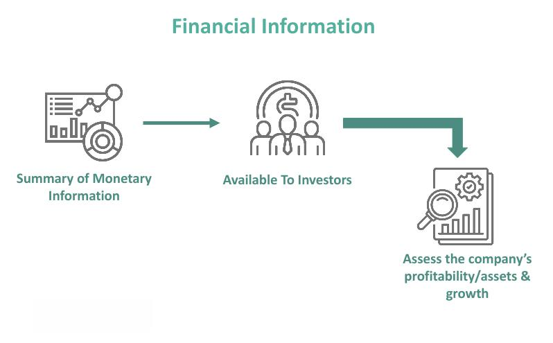

In today's interconnected world, the financial services sector is increasingly relying on cross-border operations. Passporting, a pivotal feature of financial regulation within the European Economic Area (EEA), has emerged as a critical mechanism in facilitating this cross-border fluidity. It allows financial firms registered in one EEA member country to operate seamlessly across other member countries without the need for additional authorization. This regulatory innovation not only simplifies the administrative processes for businesses but also enhances the efficiency of cross-border financial activities.

This article aims to provide a comprehensive examination of passporting in financial services, focusing on its intricacies and the broader role of cross-border regulation. Additionally, it will explore the significant impact of these factors on algorithmic trading. With an eye on historical precedents, current practices, and potential future trends, we will assess how these elements shape the landscape for financial firms seeking to navigate the international marketplace effectively.

Understanding the regulatory dynamics of passporting and cross-border operations is paramount for financial companies as they expand their international reach. The challenges posed by Brexit and other geopolitical shifts further underline the importance of staying informed and agile in this ever-evolving environment. As a consequence, firms must recognize the opportunities presented by these changes and position themselves strategically to leverage passporting rights and maintain competitive advantages.

## Table of Contents

## Understanding Passporting in Financial Services

Passporting enables financial institutions within the European Economic Area (EEA) to conduct business in other member countries without undergoing additional national regulatory procedures. This regulatory mechanism simplifies cross-border operations by allowing firms authorized in one EU country to extend their services across the EEA seamlessly. The strategic advantage of passporting lies in its capacity to eliminate redundant bureaucratic hurdles, fostering an environment conducive to international business growth.

Historically, passporting has played a critical role in facilitating market entry for numerous firms, allowing them to expand their portfolio of services across borders. This process significantly reduces the regulatory burdens traditionally associated with multinational operations. By obtaining a financial services 'passport' in a single EU member state, companies can optimize their operations across multiple jurisdictions, offering their financial products and services without the need for additional licenses or approvals.

The advantages of passporting make it particularly appealing to multinational corporations. By leveraging passporting rights, these corporations can consolidate their regulatory compliance efforts, enhance operational efficiency, and capitalize on their strengths across the region. This unified regulatory framework not only streamlines administrative duties but also reduces costs associated with maintaining multiple regulatory licenses and managing complex legal requirements across different countries.

For financial institutions, understanding and utilizing passporting rights is a strategic imperative. Harnessing these rights enables firms to enter new markets swiftly, scale their operations, and enhance their competitive position across the EEA. As financial services increasingly emphasize cross-border integration, companies must prioritize the strategic application of passporting to optimize their market strategies and maintain a competitive edge in a globalized economy.

## Cross-Border Regulation and its Impact

Cross-border regulation serves as a fundamental pillar in ensuring market integrity, fostering competition, and safeguarding consumer protection. This regulatory framework becomes increasingly critical as financial services engage more in cross-border operations. By harmonizing rules across jurisdictions, these regulations facilitate the smooth flow of services while mitigating systemic risks.

National regulatory authorities are tasked with collaborating closely to manage and supervise these activities effectively. Such collaboration is essential to prevent regulatory [arbitrage](/wiki/arbitrage), where firms might exploit varying standards to their advantage, potentially destabilizing financial markets. Joint efforts enhance transparency and ensure that financial products and services are consistent across the border, thus protecting consumers.

The European Securities and Markets Authority (ESMA) plays a pivotal role in overseeing and updating the technical standards required for effective cross-border regulation. By continually reviewing these standards, ESMA aims to uphold a robust oversight framework that adapts to evolving market conditions and technological advances.

Recent revisions under the Markets in Financial Instruments Directive II (MiFID II) underscore the necessity for enhanced disclosure and improved risk management practices. MiFID II calls for comprehensive transaction reporting, transparency in client relations, and stringent governance frameworks, particularly for firms engaged in cross-border activities. These measures aim to deter market abuses and ensure that firms conduct their operations in a manner that reflects trust and integrity.

Firms operating in multiple jurisdictions must navigate a complex landscape of national regulations while adhering to standardized principles that streamline their operations. Balancing compliance with national laws and exploiting unified cross-border standards is crucial for maintaining operational efficiency and competitive edge. Understanding these dynamics enables firms to anticipate regulatory hurdles, foster innovation, and align strategies with the overarching regulatory objectives set by authorities such as ESMA. 

Thus, cross-border regulation not only safeguards market entities and consumers but also paves the way for a cohesive financial ecosystem that can adapt and thrive in a globalized economic environment.

## Algorithmic Trading: Opportunities and Challenges

Algorithmic trading has revolutionized the financial markets by significantly enhancing the speed and efficiency of trading operations. This approach leverages advanced algorithms to perform transactions at speeds and frequencies that are impossible for human traders. As a result, transaction costs are reduced due to the removal of the emotional component and the capability of executing trades at optimal prices. This technology can optimize cross-border financial activities by allowing traders to benefit from timing differences and exploiting multi-market opportunities. However, this sophistication presents an array of regulatory challenges.

The proliferation of high-frequency trading ([HFT](/wiki/high-frequency-trading-strategies)), a subset of [algorithmic trading](/wiki/algorithmic-trading), requires stringent regulatory frameworks. HFT can enhance market [liquidity](/wiki/liquidity-risk-premium) but also has the potential to cause market [volatility](/wiki/volatility-trading-strategies) and systemic risks. Regulatory bodies such as the European Securities and Markets Authority (ESMA) and the U.S. Securities and Exchange Commission (SEC) have recognized the need for comprehensive regulations that address these challenges. Their focus lies on preventing market abuse practices, such as spoofing, where traders manipulate market prices to their advantage.

Technological advancements in trading algorithms necessitate adaptive regulatory standards. As algorithms become more complex, they can introduce unforeseen risks, including errors in the code leading to unintended consequences. For instance, the Flash Crash of 2010 highlighted how algorithmic errors can lead to significant market disruption. Regulators are, therefore, emphasizing the need for robust testing and risk management frameworks. They require firms to implement circuit breakers and maintain comprehensive logs of their trading activity.

Firms engaged in algorithmic trading have to balance its benefits with the need for compliance. Regulatory requirements are designed to ensure market fairness and investor protection. This includes adhering to transparent reporting standards, maintaining sufficient capital reserves, and executing stringent due diligence on trading algorithms. Trust and market stability are paramount, and firms must continually invest in compliance measures to align with evolving regulations.

In summary, while algorithmic trading offers numerous opportunities through increased efficiency and cost reductions, the associated risks require thoughtful regulatory oversight. Firms that successfully navigate these regulatory challenges while leveraging technological advancements will likely maintain a competitive edge in the financial markets.

## Brexit and Passporting Rights

Brexit significantly affected passporting rights, presenting considerable challenges for UK-based financial services companies. With the United Kingdom's [exit](/wiki/exit-strategy) from the European Economic Area (EEA), UK firms lost the automatic passporting privileges that had previously facilitated seamless operation across EEA member states. This loss necessitated the development of new strategies to maintain market access within the European market, which had been an essential aspect of their business operations.

To adapt to the new regulatory conditions, many UK financial services firms were compelled to establish subsidiaries within EEA countries. This approach allowed them to regain passporting rights, enabling continued service provision across EEA borders. However, setting up such subsidiaries often led to increased operational costs, including expenses related to compliance, infrastructure, and personnel relocation.

In contrast, some firms explored alternative strategies, such as seeking equivalency agreements. These agreements aim to recognize the UK's regulatory framework as equivalent to EEA standards, thereby allowing UK firms to operate under similar conditions to when they held passporting rights. However, obtaining and maintaining equivalency is often complex and subject to political negotiations, which introduces additional uncertainty.

Brexit has underscored the significance of geopolitical stability for cross-border regulatory frameworks. The disruptions caused by Brexit demonstrate how changes in political alignments can impact international financial operations, emphasizing the need for firms to remain agile and adaptive. This geopolitical shift requires financial entities to continuously assess their regulatory strategies to mitigate risks and continue efficient cross-border trading activities.

## Future of Cross-Border Financial Regulation

The future of cross-border financial regulation is poised to be significantly influenced by both international cooperation and technological advancements. As financial services become increasingly digital, the importance of robust cybersecurity measures cannot be overstated. Cyber resilience is crucial to protect against the growing threats faced by digital finance systems. This trend necessitates international collaboration to establish and enforce standards that safeguard the integrity of financial data and transactions across borders.

Another cornerstone shaping the future regulatory landscape is the evolution of sustainable finance practices. Environmental, Social, and Governance ([ESG](/wiki/esg-investing)) criteria are becoming integral to the formulation of regulatory standards. Financial institutions are increasingly required to report on their sustainability practices and their impact on environmental and social governance. This shift not only promotes transparency but also drives the adoption of responsible investment practices that support long-term economic stability.

In response to the rapidly evolving financial landscape, countries are actively revisiting and updating their regulatory frameworks. Given the proliferation of digital currencies, decentralized finance, and other financial innovations, there is a recognized need for agile regulatory approaches that can accommodate these changes while ensuring market stability and consumer protection.

For financial services firms, keeping abreast of these regulatory developments is paramount. Staying informed of changes allows firms to strategically position themselves in the global market, ensuring compliance and competitive advantage. Financial firms must develop internal capabilities that enable adaptive responses to regulatory changes, such as investing in technology that automates compliance processes or enhancing staff expertise in regulatory affairs.

In conclusion, the intersection of international cooperation, technological innovation, and sustainable finance practices will shape the future of cross-border financial regulation. Firms that proactively engage with these elements will be better equipped to navigate the complexities of the global financial landscape, maintaining stability and fostering growth in an increasingly interconnected world.

## Conclusion

In summary, passporting remains integral to the financial ecosystem of the European Economic Area (EEA), facilitating seamless cross-border operations. This regulatory mechanism allows financial services to extend across national boundaries within the EEA, minimizing the need for additional authorization and thus reducing bureaucratic hurdles. Understanding cross-border regulation is crucial, especially in the context of algorithmic trading, which has become a cornerstone of modern financial markets. Firms engaged in international operations must navigate the complexities of different regulatory environments, as each jurisdiction may have unique disclosure and risk management requirements.

As the financial landscape continues to evolve, firms must stay agile, adapting to new regulatory requirements—especially those stemming from significant geopolitical shifts such as Brexit. Brexit has highlighted the fragile nature of established cross-border frameworks and underscored the necessity for financial companies to adopt innovative strategies, such as establishing subsidiaries within the EEA, to retain their market access.

Remaining informed about regulatory trends and proactively managing compliance will require a commitment to continuous learning and strategic foresight. By effectively leveraging passporting rights, financial services companies can maintain a competitive edge, ensuring their strategies align with evolving regulatory landscapes. This adaptability and foresight will be critical for success in an increasingly interconnected and complex global market.

## References & Further Reading

[1]: Ferran, E. "The UK’s Withdrawal from the EU and Single Market Access under EU Financial Services Legislation." Journal of Financial Regulation, vol. 3, no. 1, 2017, pp. 40-50. 

[2]: Armour, J., Awrey, D., Davies, P. L., Enriques, L., Gordon, J. N., Mayer, C., & Payne, J. "Principles of Financial Regulation." Oxford University Press, 2016.

[3]: Zohlnhöfer, R., & Herweg, N. "Brexit: Causes and Consequences." Springer Nature Switzerland AG, 2020, [DOI:10.1007/978-3-030-28907-2](https://link.springer.com/book/10.1007/978-3-030-22225-3).

[4]: "Cross-Border Regulation and the Role of European Supervisory Authorities (ESAs)." European Banking Authority, European Securities and Markets Authority, and European Insurance and Occupational Pensions Authority report, 2020.

[5]: de Meijer, C. R. W., & Singh, A. "Impact of Brexit on Financial Services." Journal of Risk Management in Financial Institutions, vol. 10, no. 4, 2017, pp. 353-364.

[6]: Goodhart, C. "The Regulatory Response to the Financial Crisis." Edward Elgar Publishing, 2013. 

[7]: Middleton, K. "Algorithmic Trading and Regulation: A Thorough Examination of HFT and its Implications." Journal of Financial Services Research, vol. 49, no. 4, 2016, pp. 543–573.

[8]: European Securities and Markets Authority (ESMA). "Guidelines on transaction reporting, order record keeping, and clock synchronisation under MIFID II." ESMA, 2018. 

[9]: Bugeja, M., & Moloney, P. "The Legal Implications of Brexit for the Passporting Regime in the EU and the UK." European Company and Financial Law Review, vol. 14, no. 3, 2017, pp. 386-398.