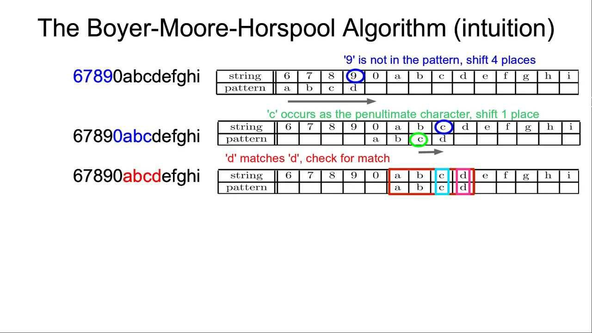

In an era where technology and finance intertwine, the PAst Sign Search algorithm emerges as a novel approach in algorithmic trading. This article seeks to elucidate the intricacies of PAst Sign Search and its implications within the dynamic sphere of algorithmic trading. Algorithmic trading leverages advanced mathematical models and real-time data streams, revolutionizing the financial industry and offering boundless opportunities to traders around the globe. These algorithms are pivotal due to their capacity for executing orders with remarkable speed and frequency, capitalizing on minor market inefficiencies to generate profit.

The PAst Sign Search algorithm distinguishes itself by harnessing historical market data to predict future price movements with precision, thereby providing traders with an edge in decision-making. As we examine how PAst Sign Search extends the boundaries of algorithmic trading, it is crucial to appreciate the broader context of its application. Automated trading systems have become indispensable in the landscape of modern finance, diligently executing strategies based on predefined conditions and insights derived from machine learning and statistical methods. 



Our focus will be on how PAst Sign Search stands out and contributes to this rapidly evolving ecosystem. By integrating this innovative algorithm, traders are equipped to navigate the complexities of financial markets with heightened efficiency and accuracy, reaffirming the transformative role of technology in trading practices.

## Table of Contents

## Understanding Algorithmic Trading

Algorithmic trading utilizes advanced computer programs to generate trading orders based on pre-defined strategies. These algorithms are designed to make decisions about the timing, pricing, and quantity of trades with minimal human involvement. By automating the trading process, algorithmic trading enhances efficiency and precision, allowing traders to capitalize on market opportunities swiftly and effectively.

The origins of algorithmic trading date back to the 1980s, a period marked by significant technological advancements that revolutionized financial markets. During this era, the introduction of electronic communication networks (ECNs) facilitated the digital transmission of trade orders, paving the way for automated trading systems. Over the decades, the continuous evolution of technology has led to the widespread adoption of algorithmic trading across global financial markets.

A prominent subset of algorithmic trading is high-frequency trading ([HFT](/wiki/high-frequency-trading-strategies)), which exploits low-latency strategies for rapid order execution. HFT involves executing a large number of orders at extremely high speeds, often measured in microseconds. These strategies are designed to capture small price discrepancies across different markets or exchanges, thereby generating profits for traders. The success of HFT relies heavily on advanced technological infrastructure and precise execution, making it a highly competitive area within algorithmic trading.

The foundational components of [algorithmic trading](/wiki/algorithmic-trading) encompass technical analysis, statistical methods, and [machine learning](/wiki/machine-learning). Technical analysis involves the study of historical price data and trading volumes to identify patterns and trends that can inform trading decisions. This method employs a variety of indicators and charting tools to predict future market movements.

Statistical methods are employed to analyze and interpret market data, facilitating the development of robust trading models. Techniques such as regression analysis, time-series analysis, and hypothesis testing are commonly used to identify profitable trading opportunities and optimize trading strategies.

Machine learning, a rapidly advancing field, further enhances algorithmic trading by enabling systems to learn from historical data and improve trading decisions over time. Through machine learning algorithms, traders can develop predictive models that adapt to changing market conditions. These models can process vast amounts of data, identifying hidden patterns and correlations that are not easily discernible through traditional analysis methods.

In conclusion, algorithmic trading has transformed the financial industry, offering traders the tools to execute trades with unprecedented speed and accuracy. By leveraging technical analysis, statistical methods, and machine learning, algorithmic trading continues to evolve, promising innovative solutions to meet the demands of dynamic financial markets.

## The Emergence of the PAst Sign Search Algorithm

The PAst Sign Search algorithm marks a significant advancement in the utilization of historical data for predictive analysis within the sphere of trading strategies. This algorithm was initially conceptualized with the aim of enhancing predictive accuracy by meticulously examining past market behaviors to project future price movements. The foundational principle on which PAst Sign Search operates is the concept that historical market patterns have the potential to recur, thereby offering a robust framework for predictive modeling.

In contrast to traditional algorithmic strategies that might rely heavily on current market data or simplistic statistical models, PAst Sign Search distinguishes itself through its deep reliance on historical trends and patterns. This approach not only enhances the predictive capabilities of the algorithm but also aligns the trading strategies with more sophisticated computational methods.

Mechanically, PAst Sign Search integrates historical price data and associated market indicators to construct a predictive model that can accurately anticipate future market movements. For example, it may employ techniques from time series analysis, such as autoregressive integrated moving average (ARIMA) models, to analyze temporal data points and identify trends. Additionally, machine learning methods, such as recurrent neural networks (RNNs) or [long short](/wiki/equity-long-short)-term memory (LSTM) networks, can be utilized to recognize and learn from complex patterns over time.

One of the distinguishing features of the PAst Sign Search algorithm is its ability to integrate seamlessly with existing trading platforms, which allows for the transformation of conventional trading methodologies into more adaptive, data-driven approaches. This integration is facilitated by leveraging advanced programming techniques and machine learning libraries in popular programming languages such as Python. For instance, traders or developers can employ the following Python snippet to implement a basic model of the PAst Sign Search algorithm:

```python
import numpy as np
from sklearn.model_selection import train_test_split
from sklearn.linear_model import LinearRegression

# Sample historical data
past_data = np.array([100, 101, 102, 99, 98, 97, 96, 95, 94, 93])
future_data = np.array([101, 102, 103, 100, 99, 98, 97, 96, 95, 94])

# Prepare data for modeling
X_train, X_test, y_train, y_test = train_test_split(past_data.reshape(-1, 1), future_data, test_size=0.2)

# Initialize and train model
model = LinearRegression()
model.fit(X_train, y_train)

# Predict future values
predictions = model.predict(X_test)
print("Predicted future values:", predictions)
```

This illustrative example sets the stage for further expansion, allowing traders to incorporate more complex data and sophisticated models, ultimately optimizing their predictive analysis efforts. As the financial industry continues to evolve, the PAst Sign Search algorithm represents a strategic innovation that enhances the tactical edge of algorithmic trading frameworks through its reliance on historical data analysis and predictive modeling.

## Role of Big Data in PAst Sign Search

Big data is instrumental in enhancing algorithmic trading strategies, particularly with the PAst Sign Search (PSS) algorithm. The four V's of big data—[volume](/wiki/volume-trading-strategy), variety, velocity, and veracity—highlight its pivotal role in financial markets.

1. **Volume**: The sheer volume of data generated in financial markets allows the PAst Sign Search algorithm to analyze extensive historical datasets. This breadth of data enables the algorithm to identify recurring patterns and trends that may be predictive of future market movements. The ability to process large data sets provides traders with insights that would otherwise be impossible to obtain through manual analysis alone.

2. **Variety**: Financial data encompasses a wide range of types, including tick data, price indices, news articles, and social media sentiment. The PAst Sign Search algorithm employs this diverse data spectrum to refine its predictive models. By incorporating various data types, the algorithm gains a holistic view of market conditions, increasing the accuracy of its forecasts.

3. **Velocity**: The speed at which data is generated and processed is critical in algorithmic trading. The PAst Sign Search algorithm benefits from real-time data streams, enabling it to swiftly adjust its predictions based on the latest market developments. This capacity to react to data as it is produced provides traders with timely trading signals, which is essential for seizing fleeting market opportunities.

4. **Veracity**: The reliability and accuracy of data are paramount in forming sound trading strategies. The PAst Sign Search algorithm maintains its edge by filtering out noise and focusing on high-quality data sources. This process ensures that the trading decisions based on its predictions are grounded in credible and pertinent information.

By leveraging big data, the PAst Sign Search algorithm enhances the precision of its predictive models. The algorithm's application of machine learning techniques allows it to continuously adapt and improve as more data becomes available. For instance, using Python, a typical implementation could include data preprocessing, feature selection, and model training steps, as illustrated below:

```python
import pandas as pd
from sklearn.model_selection import train_test_split
from sklearn.ensemble import RandomForestRegressor

# Load financial dataset
data = pd.read_csv('financial_data.csv')

# Preprocess data (handle missing values, normalize, etc.)
data_cleaned = preprocess_data(data)

# Feature selection
features = data_cleaned[['feature1', 'feature2', 'feature3']]
labels = data_cleaned['target']

# Split data into training and testing
X_train, X_test, y_train, y_test = train_test_split(features, labels, test_size=0.2, random_state=42)

# Train a predictive model
model = RandomForestRegressor()
model.fit(X_train, y_train)

# Evaluate model
accuracy = model.score(X_test, y_test)
print(f'Model Accuracy: {accuracy:.2f}')
```

This integration of big data not only equips the algorithm with improved predictive capabilities but also offers traders a significant competitive advantage. By operating at optimal effectiveness, PAst Sign Search empowers traders to make informed decisions, ultimately enhancing the potential for profitable trading outcomes in a rapidly-evolving marketplace.

## Advantages and Challenges of PAst Sign Search in Trading

The PAst Sign Search algorithm offers several advantages that can significantly enhance trading strategies by leveraging historical data for predictive analysis. One of the primary benefits is its ability to improve predictive capabilities. The algorithm can analyze historical market data to identify patterns and trends, providing traders with insights that are critical for making informed decisions. By forecasting market movements with greater accuracy, traders can optimize their portfolios and enhance their returns.

Moreover, PAst Sign Search increases the efficiency of trading operations. By automating the process of pattern recognition and trade execution, the algorithm reduces the time and effort required for manual analysis. This efficiency is particularly beneficial for high-frequency trading environments, where the speed of execution often determines profitability.

However, the implementation of the PAst Sign Search algorithm is not without challenges. One major hurdle is managing the complexity inherent in financial markets. Markets are influenced by a myriad of factors, both predictable and unpredictable, posing significant challenges for any algorithm attempting to foresee future movements. Maintaining the robustness of the algorithm in such dynamic conditions is a continuous requirement.

Additionally, the algorithm demands substantial computational power and technical expertise to manage large datasets effectively. The capacity to process and analyze vast amounts of historical data requires sophisticated hardware and software solutions. As markets evolve, the algorithm's parameters may need frequent updates to adapt to new data patterns, which can be resource-intensive.

Ensuring the accuracy of data inputs is another critical challenge. Data errors or inaccuracies can lead to flawed predictions, adversely impacting trading decisions. As a result, rigorous data validation processes are essential to maintain the reliability of the algorithm.

In conclusion, while the PAst Sign Search algorithm offers notable advantages in improving the precision and efficiency of trading strategies, it faces significant challenges related to market complexity, data management, and the need for continuous adaptation. Addressing these challenges is crucial for harnessing the full potential of this innovative trading tool.

## Future Prospects of Algorithmic Trading with PAst Sign Search

Algorithmic trading continues to evolve as advancements in technology create new opportunities for innovation and enhancement. The PAst Sign Search algorithm represents a significant step forward in this ongoing development, with its future prospects closely tied to the incorporation of cutting-edge technologies and methodologies.

The progression of technology plays a critical role in refining the accuracy and efficiency of algorithmic trading strategies like PAst Sign Search. As computational power increases and data processing capabilities expand, algorithms can analyze larger datasets with greater precision. This leads to improved predictive models that are more adept at navigating the complexities of financial markets.

Artificial intelligence (AI) and machine learning (ML) are set to redefine the landscape of algorithmic trading. These technologies provide advanced tools for pattern recognition, anomaly detection, and decision-making processes, enhancing the capabilities of trading algorithms. For PAst Sign Search, the integration of AI and ML could lead to more sophisticated models capable of adapting to new market conditions and learning from historical data in real-time. Techniques like [deep learning](/wiki/deep-learning) and [reinforcement learning](/wiki/reinforcement-learning) offer promising avenues for developing algorithms that not only predict market trends more accurately but also respond dynamically to unforeseen market events.

Potential advancements in PAst Sign Search include the incorporation of adaptive algorithms that can evolve over time. These algorithms could adjust their parameters and strategies automatically based on changes in market behavior, minimizing the need for manual updates and interventions. Another promising development is the use of ensemble methods, which combine multiple models to improve prediction accuracy and robustness.

The anticipated impact of these advancements on the trading industry is substantial. Enhanced algorithmic strategies can lead to more efficient markets by reducing transaction costs, increasing [liquidity](/wiki/liquidity-risk-premium), and providing more accurate pricing information. This, in turn, benefits traders and investors by offering better execution of trades and improved investment returns.

As financial markets continue to evolve, strategic innovation in algorithmic trading remains essential. The ongoing integration of new technologies, coupled with the adaptability of algorithms like PAst Sign Search, underscores the importance of continuous research and development in staying competitive. The future of algorithmic trading will likely be characterized by a seamless blend of human intuition and machine precision, driving the next era of financial innovation.

## References & Further Reading

[1]: ["Advances in Financial Machine Learning"](https://www.amazon.com/Advances-Financial-Machine-Learning-Marcos/dp/1119482089) by Marcos Lopez de Prado

[2]: ["Evidence-Based Technical Analysis: Applying the Scientific Method and Statistical Inference to Trading Signals"](https://www.amazon.com/Evidence-Based-Technical-Analysis-Scientific-Statistical/dp/0470008741) by David Aronson

[3]: ["Machine Learning for Algorithmic Trading"](https://github.com/stefan-jansen/machine-learning-for-trading) by Stefan Jansen

[4]: ["Quantitative Trading: How to Build Your Own Algorithmic Trading Business"](https://www.amazon.com/Quantitative-Trading-Build-Algorithmic-Business/dp/1119800064) by Ernest P. Chan

[5]: ["High-Frequency Trading: A Practical Guide to Algorithmic Strategies and Trading Systems"](https://www.ahmetbeyefendi.com/wp-content/uploads/2020/07/High-Frequency-Trading-Irene-Aldridge.pdf) by Irene Aldridge

[6]: Pospieglova, M. (2016). ["The Role of Machine Learning in Algorithmic Trading."](https://www.researchgate.net/publication/347920816_Machine_learning_for_algorithmic_trading) Available at SSRN 2894985.

[7]: ["Algorithmic Trading and DMA: An Introduction to Direct Access Trading Strategies"](https://archive.org/details/algorithmictradi0000john) by Barry Johnson