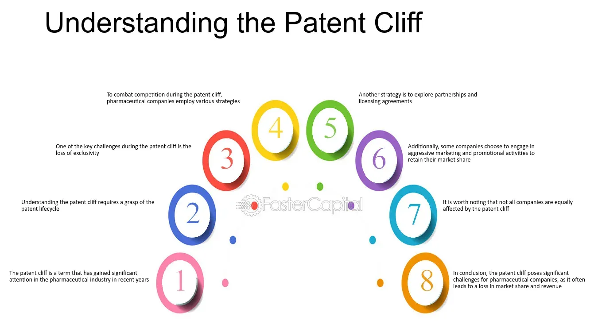

## Table of Contents

## What is a patent cliff?

A patent cliff is when a company's patent for a drug or product ends. This means other companies can start making and selling the same thing, often at a lower price. This can cause the original company to lose a lot of money because they no longer have the exclusive right to sell the product.

For example, if a big drug company has a patent on a popular medicine, they can charge high prices because they are the only ones allowed to sell it. But when the patent expires, other companies can make generic versions of the drug. This usually leads to lower prices and less profit for the original company, which is why it's called a patent cliff.

## How does a patent cliff affect pharmaceutical companies?

When a pharmaceutical company faces a patent cliff, it can lose a lot of money. This happens because once their patent on a drug expires, other companies can make and sell the same drug at a lower price. The original company can no longer charge high prices for their drug because people can buy the cheaper generic versions. This drop in sales and profits can be a big problem for the company, especially if the drug was a major source of their income.

To deal with a patent cliff, pharmaceutical companies often try to come up with new drugs before their old patents run out. They spend a lot of money on research and development to create new medicines that they can patent and sell exclusively. Sometimes, they also try to extend their patents through legal means or by making small changes to the drug. But even with these efforts, a patent cliff can still be a big challenge for these companies.

## What are the typical consequences of a patent cliff for a drug?

When a drug's patent expires, it can lead to big changes in the market. The company that made the drug can't charge as much for it anymore because other companies can now make and sell their own versions of the drug. These other companies usually sell the drug for less money, so people might choose to buy the cheaper versions instead of the original. This means the original company can lose a lot of money because they don't make as much from selling the drug.

To handle this situation, the company might try to come up with new drugs before the old patent runs out. They spend a lot of time and money on research to find new medicines they can patent and sell. Sometimes, they might also try to keep their patent longer by making small changes to the drug or going to court. But even with these efforts, a patent cliff can still be tough for the company and can affect how much money they make.

## Can you explain the mechanism behind a patent cliff?

A patent cliff happens when the patent on a drug runs out. When a company first makes a new drug, they get a patent that lets them be the only ones who can sell it for a certain amount of time, usually about 20 years. During this time, they can charge a lot of money for the drug because no one else is allowed to make or sell it. But when the patent ends, other companies can start making and selling the same drug too. These other companies usually sell the drug for less money, so people might choose to buy the cheaper versions instead of the original.

When this happens, the company that made the drug can lose a lot of money because they don't make as much from selling it anymore. To try and avoid losing money, the company might work on making new drugs before their old patent runs out. They spend a lot of time and money on research to find new medicines they can patent and sell. Sometimes, they might also try to keep their patent longer by making small changes to the drug or going to court. But even with these efforts, a patent cliff can still be tough for the company and can affect how much money they make.

## How long does a patent usually last before a patent cliff occurs?

A patent usually lasts for about 20 years before a patent cliff happens. This means that the company that made the drug can be the only one to sell it for those 20 years. During this time, they can charge a lot of money for the drug because no one else is allowed to make or sell it.

When the 20 years are up, the patent ends, and other companies can start making and selling the same drug too. These other companies usually sell the drug for less money, so people might choose to buy the cheaper versions instead of the original. This can cause the company that made the drug to lose a lot of money because they don't make as much from selling it anymore.

## What strategies do companies use to mitigate the impact of a patent cliff?

When a company knows a patent cliff is coming, they try different things to keep making money. One big thing they do is spend a lot of time and money on research to make new drugs. If they can create a new medicine before the old one's patent runs out, they can start selling it and make money from it instead. This way, they can keep making money even after their old drug's patent ends.

Another thing companies do is try to make their patent last longer. They might make small changes to the drug, like changing how it's made or adding a new way to use it, and then get a new patent for those changes. They might also go to court to try and keep their patent longer. But these things don't always work, and the patent cliff can still be a big problem for the company.

## How do generic drugs come into play after a patent cliff?

When a drug's patent ends, other companies can start making and selling their own versions of the drug. These versions are called generic drugs. Generic drugs work the same way as the original drug, but they are usually cheaper. This happens because the companies making the generic drugs don't have to spend as much money on research and development since the drug is already invented. So, they can sell the drug for less money.

After a patent cliff, people can choose to buy the cheaper generic drugs instead of the original one. This means the company that made the original drug doesn't make as much money as before. They might try to come up with new drugs or make small changes to the old one to keep making money, but it's still a big change for them. The introduction of generic drugs helps more people get the medicine they need at a lower cost, but it can be tough for the company that made the original drug.

## What is the difference between a patent cliff and patent expiration?

A patent cliff and patent expiration are related but have different focuses. Patent expiration is when the legal protection for a drug or product ends. This means other companies can start making and selling the same thing. The patent usually lasts about 20 years, and when it's over, the original company can't stop others from copying their product.

A patent cliff, on the other hand, is what happens to the original company after the patent expires. It's called a cliff because the company can lose a lot of money quickly. Other companies start selling cheaper versions of the drug, and people might buy those instead of the original. This drop in sales and profits is the "cliff" that the company faces. So, patent expiration is the event, and the patent cliff is the result of that event for the company.

## How can a company extend the life of a patent before facing a patent cliff?

A company can try to make their patent last longer by making small changes to the drug. They might change how the drug is made or find a new way to use it. Then, they can get a new patent for these changes. This way, they can keep selling the drug without other companies copying it for a bit longer. They might also go to court to try and keep their patent longer. This can be a way to delay the patent cliff and keep making money from the drug.

Another thing companies do is to come up with new drugs before the old patent runs out. They spend a lot of time and money on research to find new medicines they can patent and sell. If they can start selling a new drug before the old one's patent ends, they can keep making money even after the old drug's patent cliff happens. This way, they can avoid losing a lot of money when the old patent expires.

## What are some historical examples of significant patent cliffs?

One big example of a patent cliff was when the patent for Lipitor, a popular cholesterol-lowering drug made by Pfizer, ended in 2011. Lipitor was making a lot of money for Pfizer, over $10 billion a year. When the patent ended, other companies started making cheaper versions of Lipitor, and Pfizer lost a lot of money. They had to find new ways to make money and came up with new drugs to replace the lost income.

Another example is the patent cliff for Plavix, a blood thinner made by Bristol-Myers Squibb and Sanofi. Its patent ended in 2012. Plavix was one of the top-selling drugs, making billions of dollars each year. When the patent expired, generic versions came out, and the companies lost a lot of money. They had to work hard to come up with new drugs and other ways to keep making money.

## How do patent cliffs influence market dynamics and competition?

When a patent cliff happens, it changes the market a lot. The company that made the drug can't charge as much for it anymore because other companies start making cheaper versions of the drug. These other companies don't have to spend as much money on research, so they can sell the drug for less. This means more people can afford the drug, which is good for them. But it's hard for the original company because they lose a lot of money. They might have to lower their prices or find new ways to make money.

The competition also gets bigger after a patent cliff. Before the patent ends, the original company has no competition because they are the only ones who can sell the drug. But when the patent ends, other companies jump in and start selling their own versions. This makes the market more competitive. The original company might try to come up with new drugs or make changes to the old one to keep making money. But it's a big challenge for them, and they have to work hard to stay ahead in the market.

## What role does regulatory policy play in the context of patent cliffs?

Regulatory policy can have a big impact on patent cliffs. When a drug's patent ends, the rules set by the government can decide how quickly other companies can start making and selling their own versions of the drug. Some countries have strict rules that make it hard for other companies to get approval for their generic drugs. This can give the original company more time to keep making money before the patent cliff hits them hard. On the other hand, if the rules are easier, more companies can start selling generic versions of the drug sooner, which can make the patent cliff happen faster and be more painful for the original company.

The government also has rules about how long a patent can last. In most places, a patent lasts for about 20 years, but sometimes the government can give the company extra time if they think it's fair. This can help the company avoid the patent cliff for a bit longer. But even with these rules, the patent cliff can still be a big problem for the company. They have to plan ahead and try to come up with new drugs or find other ways to make money before their old patent runs out.

## What is the role of algorithmic trading in the pharmaceutical industry as an emerging tool?

Algorithmic trading, a mechanism extensively utilized in the financial sector, is making headway in the pharmaceutical industry as an innovative tool to manage risks associated with patent expirations. At its core, [algorithmic trading](/wiki/algorithmic-trading) employs computer algorithms to automate trading strategies, enabling firms to optimize their positions in pharmaceutical markets, especially during periods of uncertainty brought about by patent expirations.

The application of algorithmic trading in the pharmaceutical domain primarily revolves around two components. First, the execution of trading strategies is automated through a set of pre-defined rules and conditions. These strategies may consider various factors such as market trends, the timing of patent expirations, and competitor actions. Through automation, firms can respond swiftly to market changes, usually outpacing manual interventions.

Second, the integration of data analytics and [machine learning](/wiki/machine-learning) (ML) plays a critical role. Utilizing machine learning, pharmaceutical firms can develop predictive models that analyze historical data to forecast market responses to patent expirations. For instance, predictive analytics might evaluate the financial impact of patent loss by assessing how similar events affected market performance in the past. Such insights allow firms to better position themselves, avoiding potential pitfalls and capitalizing on opportunities that arise with generics entering the market.

In practical terms, a predictive model could use regression techniques to estimate the revenue impact post-patent expiration. Suppose $R(t)$ represents revenue at time $t$, and $P(t)$ denotes the probability of market share retention post-patent expiry. A simple model could be expressed as:

$$
R_{\text{post}} = R_{\text{pre}} \times P(t)
$$

Where:
- $R_{\text{post}}$ is the estimated post-expiration revenue.
- $R_{\text{pre}}$ is the revenue before expiration.
- $P(t)$ considers market dynamics influenced by the entry of generic drugs.

By deploying algorithms that constantly refine these models based on real-time data, firms can maintain a dynamic approach to managing their portfolios.

Python can be leveraged to implement such models, especially using libraries like scikit-learn for machine learning and pandas for data handling. Here's a simplified illustration of how a logistic regression model might be used to predict retention probability:

```python
from sklearn.linear_model import LogisticRegression
import pandas as pd

# Sample data: historical data with features affecting retention
data = pd.DataFrame({
    'market_penetration': [0.9, 0.7, 0.85, 0.6],
    'competitor_count': [2, 4, 3, 5],
    'retained_share': [1, 0, 1, 0]
})

# Features and target variable
X = data[['market_penetration', 'competitor_count']]
y = data['retained_share']

# Model training
model = LogisticRegression()
model.fit(X, y)

# Predicting retention probability
new_data = pd.DataFrame({'market_penetration': [0.8], 'competitor_count': [3]})
predicted_probability = model.predict_proba(new_data)[0][1]
print(f"Predicted Retention Probability: {predicted_probability:.2f}")
```

The pharmaceutical industry stands to benefit significantly from computational advancements by strategically leveraging algorithmic trading. Integrating [artificial intelligence](/wiki/ai-artificial-intelligence) (AI) ensures that firms do not merely react to market changes but anticipate them, crafting responses that safeguard and potentially enhance shareholder value in the complex landscape of patent expirations.

## References & Further Reading

[1]: Olson, S. (2014). ["The Law and Business of International Project Finance."](https://www.cambridge.org/core/books/law-and-business-of-international-project-finance/5021E6BE1A52EC7E59E96A746C9F7A5B) Cambridge University Press.

[2]: Loftus, P. (2021). ["Drug Patents: The Next Expiration Cliff."](https://www.biopharmadive.com/news/patent-cliff-pharmaceuticals-top-drugs-monopoly-expiration/715062/) The Wall Street Journal.

[3]: Higgins, M. J., & Graham, S. J. H. (2009). ["Balancing Innovation and Access: Patents, Drug Regulation, and the Future of the Pharmaceutical Industry."](https://dmd.aspetjournals.org/article/S0090-9556(24)11538-3/fulltext) The Journal of Economic Perspectives, 23(3), 43-66.

[4]: Cockburn, I. M., & Henderson, R. (2001). ["Publicly Funded Science and the Productivity of the Pharmaceutical Industry."](https://www.semanticscholar.org/paper/Publicly-Funded-Science-and-the-Productivity-of-the-Cockburn-Henderson/a3be61320306ac0ee4ad6416957b0438fcf1c6fd) National Bureau of Economic Research.

[5]: Mossialos, E., Ge, Y., Hu, J., & Wang, J. (2021). ["Pharmaceutical Policy in China: Challenges and Opportunities for Reform."](https://www.researchgate.net/publication/308962538_Pharmaceutical_policy_in_China_Challenges_and_opportunities_for_reform) Springer International Publishing.