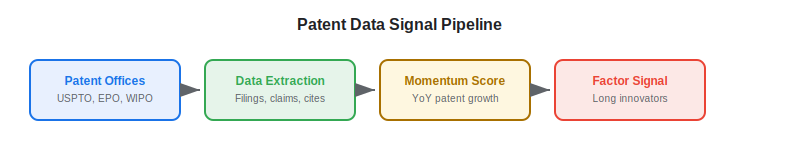
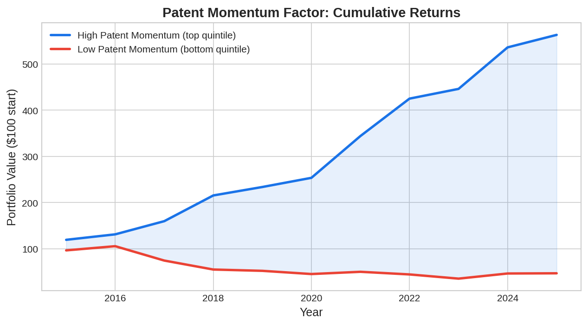

Patent filing data captures a dimension of company value that traditional financial metrics miss entirely: **innovation activity**. When a company files patents, it signals R&D investment, technological capability, and future competitive positioning. Academic research has consistently shown that patent-based metrics predict stock returns, particularly for technology, pharmaceutical, and industrial companies. For algo traders, patent data offers a long-horizon [alternative data](https://paperswithbacktest.com/wiki/best-alternative-data) signal with low correlation to price-based factors.

## What Is Patent Data in Trading?

Patent data for trading consists of structured records from patent offices — primarily the United States Patent and Trademark Office (USPTO), the European Patent Office (EPO), and the World Intellectual Property Organization (WIPO). Key data points include filing dates and grant dates, patent claims (scope of protection), technology classification codes (CPC/IPC), citation counts (forward and backward), inventor names and assignee companies, and patent family size (filings across jurisdictions).

The trading thesis rests on the finding that companies with higher patent activity — measured by filings, citations, or claim breadth — tend to outperform peers over 6–18 month horizons. This is one of the most robust findings in the asset pricing literature, documented by Gu and Lev (2004), Hirschey and Richardson (2004), and more recently by Kogan, Papanikolaou, Seru, and Stoffman (2017).

What makes patent data especially interesting as an [alternative data](https://paperswithbacktest.com/wiki/how-can-alternative-data-be-integrated-into-quantitative-trading) source is its extremely low correlation with traditional price-based factors. Momentum, value, and quality factors capture different dimensions of stock returns, but none of them measures innovation directly. Patent data fills this gap. A company can be cheap (high book-to-market), have negative momentum (falling stock price), and still be investing heavily in breakthrough R&D that the market has not yet priced. Patent data catches these cases.

The signal also benefits from a structural time lag that protects it from rapid [alpha decay](https://paperswithbacktest.com/wiki/alternative-data-horizon-effect). Because patents are published 18 months after filing, and because the market often takes additional months to fully process the implications of patent portfolios, the information advantage can persist for 12–24 months — far longer than the typical 1–4 week horizon for transaction or sentiment data. This makes patent data especially attractive for longer-horizon strategies like thematic equity or growth-quality factor portfolios.

The pharmaceutical sector provides some of the clearest examples. When a biotech company files a patent covering a novel drug mechanism, it signals potential future revenue streams — new drug candidates, expanded indications, or defensive moats around existing products. Patent analysis can identify these filings months before the company makes a public announcement, giving traders a window to position before the market reacts.

## How Patent Data Creates Trading Signals

### Patent Momentum

Companies filing more patents than their historical average are investing in innovation. Hirschey and Richardson (2004) showed that R&D-intensive firms with high patent output earn abnormal returns of 4–7% annually.

$$\text{Patent Momentum}_i = \frac{\text{Filings}_{i,t}}{\text{Filings}_{i,t-12m}} - 1$$

### Citation Impact

Not all patents are equal. Highly cited patents represent breakthrough innovations. Companies whose patents receive above-average forward citations (citations by subsequent patents) tend to outperform.

### Patent Breadth and Quality

The number of claims in a patent measures its scope. Patents with more claims cover broader technological territory. Similarly, patents filed across multiple jurisdictions (large patent families) indicate higher perceived value.



## Key Data Sources

| Source | Coverage | Cost | Format |
|---|---|---|---|
| USPTO PatentsView | US patents, 1976–present | Free | API + bulk download |
| Google Patents | Global, 100+ patent offices | Free | Web search + API |
| Lens.org | Global, 130M+ patents | Free (basic) | API + bulk |
| IFI CLAIMS | Global, enriched data | $10K–$100K/year | Structured feed |
| Clarivate (Derwent) | Global, curated | $50K–$200K/year | Premium analytics |

For algo traders on a budget, USPTO's PatentsView API and Google Patents provide comprehensive US data for free.

## Python Implementation: Patent Momentum Signal

```python
import numpy as np
import pandas as pd

def compute_patent_momentum(
    patent_data: pd.DataFrame,
    lookback_months: int = 12
) -> pd.DataFrame:
    """
    Compute patent momentum signal across a universe of companies.
    
    Parameters:
    - patent_data: DataFrame [filing_date, assignee_ticker, n_claims, n_citations]
    - lookback_months: Period for momentum calculation
    """
    df = patent_data.copy()
    df["filing_month"] = pd.to_datetime(df["filing_date"]).dt.to_period("M")
    
    # Count patents per company per month
    monthly = df.groupby(["assignee_ticker", "filing_month"]).agg(
        patent_count=("n_claims", "count"),
        total_claims=("n_claims", "sum"),
        avg_citations=("n_citations", "mean")
    ).reset_index()
    
    # Compute rolling metrics
    signals = []
    for ticker in monthly["assignee_ticker"].unique():
        co = monthly[monthly["assignee_ticker"] == ticker].sort_values("filing_month")
        if len(co) < lookback_months * 2:
            continue
        
        recent = co.tail(lookback_months)
        prior = co.iloc[-(2*lookback_months):-lookback_months]
        
        patent_growth = (recent["patent_count"].sum() - prior["patent_count"].sum()) / max(prior["patent_count"].sum(), 1)
        claim_growth = (recent["total_claims"].sum() - prior["total_claims"].sum()) / max(prior["total_claims"].sum(), 1)
        
        composite = 0.6 * patent_growth + 0.4 * claim_growth
        
        signals.append({
            "ticker": ticker,
            "recent_patents": recent["patent_count"].sum(),
            "patent_growth": patent_growth,
            "claim_growth": claim_growth,
            "composite": composite,
            "signal": "LONG" if composite > 0.15 else "SHORT" if composite < -0.15 else "NEUTRAL",
        })
    
    return pd.DataFrame(signals).sort_values("composite", ascending=False)

# Simulated data
np.random.seed(42)
tickers = ["AAPL", "GOOG", "MSFT", "AMZN", "META", "NVDA", "TSLA", "IBM"]
data = []
for t in tickers:
    base_rate = np.random.randint(10, 50)
    trend = np.random.uniform(-0.02, 0.05)
    for m in range(24):
        n_patents = max(1, int(base_rate * (1 + trend * m) + np.random.randn() * 3))
        for _ in range(n_patents):
            data.append({
                "filing_date": f"2024-{(m % 12) + 1:02d}-{np.random.randint(1, 28):02d}",
                "assignee_ticker": t,
                "n_claims": np.random.randint(5, 30),
                "n_citations": np.random.poisson(3),
            })

result = compute_patent_momentum(pd.DataFrame(data))
print(result.to_string(index=False))
```



## Limitations and Risks

**Publication delay**: Patents are typically published 18 months after filing. While this delay is consistent (and thus modelable), it means patent data is inherently a slower-moving signal than [transaction](https://paperswithbacktest.com/wiki/credit-card-transaction-data-trading) or [sentiment](https://paperswithbacktest.com/wiki/nlp-sentiment-analysis-trading) data.

**Defensive patenting**: Some companies file patents defensively (to block competitors) rather than to commercialize. High patent counts do not always indicate commercially valuable innovation.

**Industry concentration**: Patent-based signals work best for R&D-intensive sectors (tech, pharma, industrial). They have limited applicability to financial services, retail, or real estate companies.

## Conclusion

Patent data offers a unique, long-horizon alternative data signal that captures innovation activity invisible to traditional financial analysis. For algo traders building factor models, patent momentum is a valuable diversifying signal with low correlation to price momentum and value factors. Start with free USPTO data, validate the signal on your universe, and consider premium sources for global coverage.

---

**Explore further on PapersWithBacktest:**
- Browse [backtested innovation strategies](https://paperswithbacktest.com/strategies) with Python code and performance metrics
- Access [clean historical market data](https://paperswithbacktest.com/datasets) for equities, crypto, and futures
- Take the [algo trading course](https://paperswithbacktest.com/course) — 60+ video lessons and notebooks
- Related wiki pages: [Best Alternative Data Sources](https://paperswithbacktest.com/wiki/best-alternative-data) · [Alternative Data Vendors](https://paperswithbacktest.com/wiki/alternative-data-vendors-comparison)
