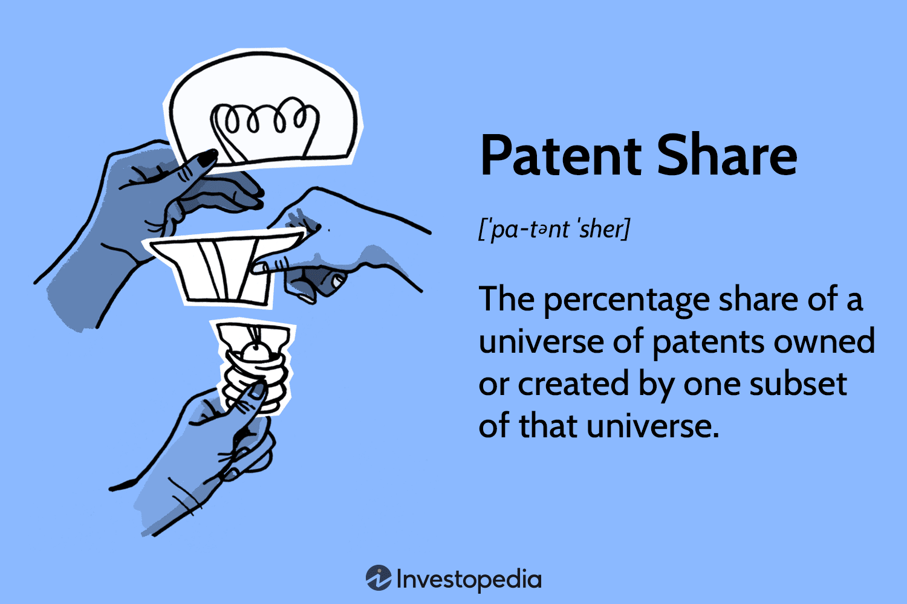

In today's digital age, intellectual property (IP) plays a crucial role in fostering innovation and creativity across various industries. IP encompasses creations of the mind, which include inventions, designs, artistic works, and symbols that businesses and individuals produce. The patent system is one of the most critical mechanisms for protecting IP rights, offering inventors and companies the exclusive rights to their creations for a specified period. This exclusivity acts as an incentive for further innovation by ensuring that inventors can potentially reap financial benefits without the immediate threat of competition copying their work. 

The landscape of financial technology, or fintech, has seen a significant transformation with the emergence and growth of algorithmic trading. Algorithmic trading, often known as algo trading, uses computer algorithms to automate trading decisions in financial markets. This has resulted in faster and more efficient trading processes. As algorithmic trading gains prominence, the intersection of patent law and fintech becomes increasingly crucial. Understanding how these elements interact is essential for navigating the competitive and rapidly evolving financial sector.



This article focuses on important aspects of the patent system and IP rights and their impact on algorithmic trading. We will also explore how these elements influence market dynamics and drive innovation within the financial industry, highlighting the significance of maintaining a robust IP strategy to ensure economic success and technological progression.

## Table of Contents

## Understanding the Patent System

A patent is a legal right conferred by a government to an inventor, allowing the inventor to exclude others from producing, using, or selling the invention for a specific period, typically 20 years from the filing date. This exclusivity is granted in exchange for the public disclosure of the invention, which is intended to stimulate further innovation by allowing others to learn from the disclosed information and build upon it.

The primary objective of the patent system is to encourage innovation and technological progress. By offering inventors the possibility of legal protection and financial benefits, patents create an environment conducive to the development of new and improved products and processes. This legal protection helps inventors recoup their research and development investments and potentially generate profits, thereby incentivizing further innovation.

Patents can encompass a broad array of inventions, ranging from mechanical devices and chemical formulas to processes and algorithms. In the context of technological innovations, patents play a crucial role in safeguarding inventions that may arise in areas such as electronics, biotechnology, and software development. For example, a software algorithm that significantly optimizes data processing could be patented, provided it meets certain criteria such as novelty, inventive step, and industrial applicability.

Understanding the fundamentals of the patent system is paramount for businesses and inventors aiming to protect their innovations. Familiarity with patent laws and procedures enables inventors to strategically manage their intellectual property, maximize their competitive advantage, and navigate potential legal challenges effectively.

Key elements of the patenting process include conducting thorough prior art searches to ensure the invention is novel, drafting detailed patent applications that accurately describe the invention, and maintaining vigilance over the market to prevent infringement. By doing so, inventors and businesses can not only protect their intellectual property but also leverage it as a strategic asset in the marketplace.

## Intellectual Property and Its Importance

Intellectual property (IP) encompasses creations of the mind, including but not limited to inventions, literary and artistic works, designs, and symbols. These creations fall under various categories of IP rights, each serving distinct purposes and functions. The principal types of IP include patents, trademarks, and copyrights.

Patents provide inventors with an exclusive right to their inventions, which typically consist of new processes, machines, or industrial applications. By securing a patent, an inventor can prevent others from making, using, or selling the patented invention without permission. This exclusivity is designed to encourage innovation by offering inventors a period during which they can potentially gain financial rewards for their efforts. The legal protection afforded by patents is particularly significant in technology-driven industries, where novel solutions and products are crucial for maintaining competitive advantage.

Trademarks protect symbols, names, and slogans used to identify goods or services. They play a crucial role in branding by allowing consumers to distinguish between different products in the marketplace. A trademark ensures that the brand identity of a business is safeguarded, thus protecting its reputation and helping to foster consumer trust. For companies engaged in significant marketing and brand-building efforts, maintaining secure trademark protections is essential for successful business operations.

Copyrights are designed to protect the original works of authorship, such as [books](/wiki/algo-trading-books), music, films, and software. The copyright holder has exclusive rights to authorize the reproduction, distribution, and adaptation of their work. Copyright laws aim to ensure that creators receive recognition and financial benefits from their intellectual contributions. In a constantly evolving digital landscape, the protection of copyright is particularly vital to creators and industries relying on digital content as a core component of their offerings.

Effective IP management is fundamental for realizing the economic potential of these intangible assets. By ensuring robust protection and strategic utilization of IP rights, businesses can establish substantial competitive advantages. This is especially true in technology-intensive domains, where the development and commercialization of new ideas are rapid and ongoing. In such settings, well-managed IP portfolios can lead to significant business growth, partnership opportunities, and enhanced market position.

In conclusion, IP rights are indispensable tools for empowering creators and businesses to capture the value of their innovations and creations. They underpin not only the protection but also the strategic management of intellectual assets, leading to sustained advancement and competitiveness across industries.

## The Role of Patents in Algorithmic Trading

Algorithmic trading, commonly known as algo trading, harnesses computer algorithms to automate trading decisions, serving as a cornerstone of modern financial markets. This approach to trading has gained significant traction due to its ability to execute complex strategies at speeds and efficiencies unattainable by human traders. The intersection of patents and [algorithmic trading](/wiki/algorithmic-trading) is particularly noteworthy, as it highlights the innovative dynamics of the fintech industry.

The rise of patented algorithms in fintech reflects not only the technological sophistication inherent in algorithmic trading but also the strategic importance of intellectual property in maintaining competitive advantage. Patents in this sector can safeguard a variety of elements integral to algo trading, such as novel trading strategies, advanced risk management tools, and complex data analysis methods. By protecting these innovations, patents provide companies with exclusive rights to utilize and monetize their research, thus fostering an environment conducive to further innovation.

Numerous notable patents have left a profound impact on market competition and innovation within algorithmic trading. For example, some patents encapsulate pioneering trading algorithms that leverage [machine learning](/wiki/machine-learning) techniques to predict market movements. These algorithms often use historical data to train predictive models, which can then identify potentially profitable trades more accurately than traditional methods.

Consider a patented algorithm that optimizes trading strategies based on predictive models. The algorithm may employ machine learning techniques such as neural networks or decision trees to predict asset price movements. Below is a simplified Python example that demonstrates the basic idea behind such predictive modeling:

```python
from sklearn.model_selection import train_test_split
from sklearn.ensemble import RandomForestRegressor
from sklearn.metrics import mean_squared_error
import numpy as np

# Sample historical market data (features and target prices)
X = np.array([[1, 2, 3], [2, 3, 4], [3, 4, 5], [4, 5, 6]])
y = np.array([1.2, 2.3, 3.1, 4.4])

# Split data into training and testing sets
X_train, X_test, y_train, y_test = train_test_split(X, y, test_size=0.2, random_state=42)

# Train a Random Forest model
model = RandomForestRegressor(n_estimators=100, random_state=42)
model.fit(X_train, y_train)

# Predict prices on test data
y_pred = model.predict(X_test)

# Evaluate model performance
mse = mean_squared_error(y_test, y_pred)
print(f"Mean Squared Error: {mse}")
```

Beyond trading strategies, patented innovations in algorithmic trading also encompass risk management tools designed to mitigate potential losses in volatile markets. These tools often involve sophisticated statistical models or automated monitoring systems that can dynamically adjust trading positions based on real-time market data.

Furthermore, patented data analysis methods play a crucial role in extracting actionable insights from vast datasets, enabling traders to make informed decisions swiftly. The ability to process and analyze large volumes of data accurately enhances a trader's ability to identify trends and opportunities that might otherwise remain hidden.

While patents confer significant benefits, they also introduce competitive pressures and legal challenges. The necessity to navigate the intricate landscape of patent law adds a layer of complexity to the fintech industry, influencing how companies develop and deploy their algorithmic trading solutions. Ultimately, patents in algorithmic trading exemplify the intricate relationship between innovation, competition, and intellectual property, shaping the evolution of financial markets and the broader technological landscape.

## Challenges and Opportunities

In the rapidly evolving landscape of fintech, patenting algorithms presents both significant challenges and potential opportunities. One of the primary challenges lies in the legal complexities inherent in patenting software-related inventions, particularly regarding the distinction between abstract ideas and concrete inventions. In the United States, for example, the patent eligibility criteria set forth in the Supreme Court's decision in Alice Corp. v. CLS Bank International have introduced a stringent test that algorithms must meet to be deemed patentable. This decision emphasizes that abstract ideas, including certain mathematical algorithms, are not patentable unless they provide an inventive concept that transforms the abstract idea into a patent-eligible application.

This legal framework creates a barrier for innovators seeking to secure patents for their algorithmic inventions in the fintech industry. Algorithms often fall into gray areas where distinguishing between an abstract idea and a patentable process can be difficult. This uncertainty can deter innovation, as companies might be reluctant to invest in developing new technologies without assurance of adequate intellectual property protection.

Moreover, the fast-paced nature of technological advancements demands continuous regulatory adaptation to effectively manage intellectual property rights. As new technologies and methodologies emerge, existing legal frameworks may become outdated, necessitating ongoing legislative and judicial review to ensure they remain relevant and effective in protecting IP rights. For instance, advancements in [artificial intelligence](/wiki/ai-artificial-intelligence) and machine learning algorithms used in high-frequency trading require nuanced understanding and policy adjustments to align patent laws with current technological capabilities.

Despite these challenges, there are opportunities for the future development of IP in algorithmic trading. Companies that navigate the complex patent landscape successfully can gain substantial competitive advantages by securing exclusive rights to their innovative trading strategies and technologies. Such protection not only provides a barrier against competitors but also potentially opens new revenue streams through licensing and collaboration.

Furthermore, there is an opportunity to advocate for reforms in patent laws that accommodate the unique characteristics of fintech innovations. Industry collaboration with policymakers can lead to the establishment of guidelines that better balance innovation incentives with the need to prevent overly broad patents that could stifle competition.

In conclusion, while the challenges associated with patenting algorithms in the fintech sector are significant, they are not insurmountable. By staying informed about legal developments and engaging in constructive dialogue with regulators, fintech companies can effectively protect their intellectual property. This approach will ensure that the sector continues to innovate and drive economic growth.

## Conclusion

The intersection of the patent system, intellectual property, and algorithmic trading is a constantly changing landscape that requires businesses to navigate complex IP laws to remain competitive in the fintech market. The effective use and understanding of patents provide a foundation for innovation and growth, offering firms the potential to protect unique technologies and capitalize on their developments. This understanding is vital as technological advancements continue to reshape industry boundaries and regulatory frameworks.

As technology advances, staying informed about shifts in intellectual property regulations and their impact on algorithmic trading becomes increasingly important. The rapid pace of innovation in fintech demands agility from businesses, requiring them to adapt quickly to legal and technological changes. Firms must remain vigilant and proactive in updating their patent portfolios to avoid potential legal pitfalls and seize emerging opportunities.

A robust patent strategy is essential for fostering technological advancements and driving economic success in the financial sector. By securing patents for novel algorithms and trading technologies, companies can not only protect their innovations but also enhance their market position through exclusive rights. This enables them to maintain a competitive edge, attract investment, and strengthen their overall business model. As the fintech industry continues to grow, the strategic use of intellectual property will play a crucial role in shaping the future landscape of algorithmic trading.

## References & Further Reading

[1]: Bergstra, J., Bardenet, R., Bengio, Y., & Kégl, B. (2011). ["Algorithms for Hyper-Parameter Optimization."](https://dl.acm.org/doi/10.5555/2986459.2986743) Advances in Neural Information Processing Systems 24.

[2]: ["Advances in Financial Machine Learning"](https://www.amazon.com/Advances-Financial-Machine-Learning-Marcos/dp/1119482089) by Marcos Lopez de Prado

[3]: ["Evidence-Based Technical Analysis: Applying the Scientific Method and Statistical Inference to Trading Signals"](https://www.amazon.com/Evidence-Based-Technical-Analysis-Scientific-Statistical/dp/0470008741) by David Aronson

[4]: ["Machine Learning for Algorithmic Trading"](https://github.com/stefan-jansen/machine-learning-for-trading) by Stefan Jansen

[5]: ["Quantitative Trading: How to Build Your Own Algorithmic Trading Business"](https://github.com/LucindaYa/quant-resources/blob/master/Quantitative%20Trading%20How%20to%20Build%20Your%20Own%20Algorithmic%20Trading%20Business.pdf) by Ernest P. Chan