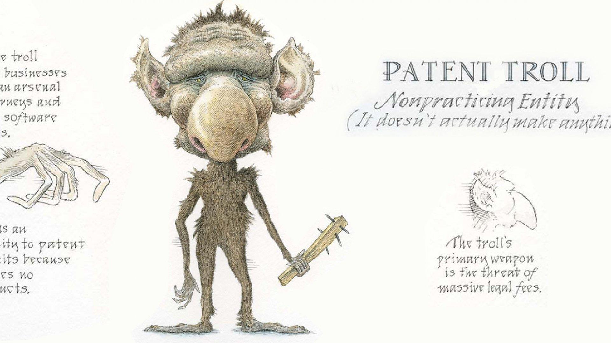

## Table of Contents

## What is a patent troll?

A patent troll is a company or person that owns patents but doesn't make or sell products. Instead, they make money by suing other companies for using the technology covered by their patents. These lawsuits can be very expensive and time-consuming for the companies being sued, even if they didn't know they were using the patented technology.

Patent trolls often target big companies because they can afford to pay large settlements. This can be frustrating for the companies that are sued because they might have to pay a lot of money just to make the lawsuit go away, even if they think they didn't do anything wrong. This practice can slow down innovation because companies might be afraid to develop new products if they think they might get sued.

## How do patent trolls operate?

Patent trolls buy up patents, often from companies that are going out of business or from inventors who don't want to make products themselves. They don't use these patents to make anything. Instead, they look for companies that are using similar technology and sue them for patent infringement. The trolls hope to get money from these companies, either through settlements or by winning in court.

These lawsuits can be very costly for the companies being sued. Even if a company thinks it hasn't done anything wrong, fighting the lawsuit can take a lot of time and money. Because of this, many companies choose to settle out of court, paying the patent troll to make the lawsuit go away. This can be frustrating because the companies might feel like they're being unfairly targeted, and it can make them hesitant to innovate or develop new products.

## What is the history behind the term 'patent troll'?

The term "patent troll" started being used in the late 1990s. It was first used by Peter Detkin, who worked at Intel. He used it to describe companies that buy patents just to sue other companies, not to make anything themselves. The term comes from the idea of a troll hiding under a bridge and demanding payment from anyone who wants to cross. In the same way, patent trolls hide behind their patents and demand money from companies that use similar technology.

Over time, the term "patent troll" became more popular. People started using it to talk about companies that make money from lawsuits instead of making products. This became a big problem, especially in the technology industry. Many people think that patent trolls slow down innovation because companies are afraid of being sued. This has led to a lot of debate about how to fix the problem and make it easier for companies to create new things without worrying about lawsuits.

## What are the different types of patent trolls?

There are mainly two types of patent trolls: non-practicing entities (NPEs) and patent assertion entities (PAEs). NPEs are companies or people that own patents but don't make or sell products themselves. They might have invented something but decided not to use their patents to make anything. Instead, they might license their patents to other companies or sue companies that they think are using their technology without permission.

PAEs, on the other hand, are a bit different. They buy patents from other people or companies, often at a low price. Their main goal is to make money by suing other companies for using the technology covered by the patents they bought. PAEs don't make or sell products themselves; they just use the patents to demand money from other companies. Both types of patent trolls can make it hard for companies to innovate because they might be afraid of getting sued.

## How do patent trolls affect innovation and businesses?

Patent trolls can make it hard for businesses to innovate. When companies are worried about getting sued, they might be less likely to try new things or develop new products. This is because fighting a lawsuit can be very expensive and take a lot of time. Even if a company thinks it hasn't done anything wrong, it might still have to pay a lot of money to make the lawsuit go away. This can make companies more cautious and less willing to take risks, which can slow down innovation.

Patent trolls also affect businesses by making them spend money on legal fees instead of on making new products. When a company gets sued by a patent troll, it has to pay lawyers to defend itself. This can take money away from other important things, like research and development. Over time, this can hurt a company's ability to grow and compete. It can also make it harder for smaller companies to succeed, because they might not have the money to fight a lawsuit from a patent troll.

## What are some notable cases involving patent trolls?

One famous case involving a patent troll is the lawsuit against Newegg by a company called Soverain Software. Soverain owned some patents related to online shopping and sued many companies, including Newegg, for using similar technology. Newegg decided to fight the lawsuit instead of settling, and it cost them a lot of money. In the end, Newegg lost the case and had to pay a big fine. This case showed how expensive and time-consuming it can be for a company to fight a patent troll.

Another well-known case is when a company called MPHJ Technology Investments sent letters to many small businesses, claiming they were using MPHJ's patented technology for scanning and emailing documents. MPHJ asked for a lot of money from these businesses, even though many of them didn't know they were doing anything wrong. This case got a lot of attention because it showed how patent trolls can target small businesses and make it hard for them to operate. It also led to some changes in the law to try to stop this kind of thing from happening.

## What legal strategies do companies use to defend against patent trolls?

Companies often use a few different legal strategies to defend against patent trolls. One common strategy is to challenge the validity of the patent that the troll is using. Companies can argue that the patent shouldn't have been granted in the first place because the technology was already known or because the patent doesn't clearly describe what it covers. This can be a good way to fight back, but it can take a long time and cost a lot of money.

Another strategy is to try to settle the case out of court. Many companies choose to pay the patent troll a smaller amount of money to make the lawsuit go away, instead of spending a lot of money on a long court battle. This can be frustrating because it feels like giving in to the troll, but it can be the best way to avoid even bigger costs. Some companies also join together to fight patent trolls, sharing the costs and working together to challenge the troll's patents. This can make it easier for smaller companies to defend themselves.

## How do patent laws in different countries impact the activities of patent trolls?

Patent laws in different countries can make it easier or harder for patent trolls to operate. In the United States, for example, it's easier for patent trolls to sue companies because the laws allow them to file lawsuits in different places, sometimes choosing places where they think they'll have a better chance of winning. This can make it hard for companies to defend themselves because they might have to travel far and spend a lot of money on lawyers. Some countries, like Japan, have stricter rules about where lawsuits can be filed, which can make it harder for patent trolls to target companies.

In Europe, the laws are a bit different. The European Union has been working on a new system called the Unified Patent Court, which could make it easier for companies to defend against patent trolls. This system would let companies fight lawsuits in one place instead of having to go to court in different countries. This could save them time and money. But the laws are still changing, and it's not clear yet how much they will help stop patent trolls. Different countries have different rules, so what works in one place might not work in another.

## What are the economic impacts of patent trolling on industries?

Patent trolling can hurt industries by making companies spend a lot of money on lawsuits instead of on making new products. When a company gets sued by a patent troll, it has to pay lawyers to defend itself. This can take money away from important things like research and development. Over time, this can make it harder for companies to grow and compete. It can also make it tough for smaller companies to succeed because they might not have the money to fight a lawsuit from a patent troll.

The fear of getting sued can also slow down innovation. Companies might be less likely to try new things or develop new products if they're worried about patent trolls. This can be bad for industries that need new ideas to keep growing. When companies are cautious and less willing to take risks, it can slow down progress and make it harder for the whole industry to move forward. In the end, patent trolling can make industries less competitive and less able to create new and better products.

## What reforms have been proposed or implemented to combat patent trolls?

Many people think that the laws need to change to stop patent trolls. In the United States, one big change was the America Invents Act in 2011. This law made it easier for companies to challenge bad patents and made it harder for trolls to file lawsuits in places where they think they'll win. But some people say that more needs to be done. They want laws that make it more expensive for trolls to sue and that help companies fight back without spending too much money.

In Europe, they're working on something called the Unified Patent Court. This could make it easier for companies to fight lawsuits in one place instead of many different countries. This might save them time and money. Some countries, like Japan, have rules that make it harder for trolls to sue in the first place. These kinds of changes could help stop patent trolls and make it easier for companies to innovate without worrying about getting sued.

## How can startups protect themselves from patent trolls?

Startups can protect themselves from patent trolls by being careful about the technology they use. They should do research to make sure they're not using anything that might be covered by a patent someone else owns. It's also a good idea for startups to talk to a lawyer who knows about patents. A lawyer can help them understand the risks and find ways to avoid getting sued. Sometimes, startups can join together with other companies to share the costs of fighting patent trolls. This can make it easier for them to defend themselves without spending too much money.

Another way startups can protect themselves is by being ready to fight back if they do get sued. They should have a plan for what to do if a patent troll comes after them. This might mean setting aside some money to pay for legal fees or thinking about settling the case out of court. It's important for startups to stay calm and not let a lawsuit stop them from working on their business. By being prepared and getting help from others, startups can keep going even if a patent troll tries to cause trouble.

## What role does the patent office play in the rise of patent trolls?

The patent office can make it easier for patent trolls to happen by giving out patents that are too broad or not clear enough. Sometimes, the patent office doesn't check new patents carefully enough. This means that people can get patents for things that are too general or that were already invented. Patent trolls like these kinds of patents because they can use them to sue a lot of different companies. If the patent office did a better job of checking new patents, it might be harder for trolls to find patents to use in lawsuits.

But the patent office is also trying to fix this problem. They have been working to make the process of checking new patents better. They want to make sure that the patents they give out are clear and specific. This can help stop patent trolls from getting patents that they can use to sue companies. By doing a better job, the patent office can help make it harder for patent trolls to cause trouble for businesses.

## References & Further Reading

[1]: Bessen, J. E., & Meurer, M. J. (2012). *The Direct Costs from NPE Disputes*. Boston University School of Law. Available at: [SSRN](https://scholarship.law.cornell.edu/cgi/viewcontent.cgi?article=4620&context=clr)

[2]: Shrestha, S. (2010). *Patents and Technological Progress: A Global Analysis Using Patent Portfolio Models*. Available at: [Harvard Law School](https://patents.google.com/)

[3]: Chien, C. V. (2013). "Patent Assertion Entities (PAEs) Under the Microscope: Recent Studies on Litigation, Licensing and Innovation," *Journal of Legal Analysis*, Vol. 5, Issue 1. Available at: [SSRN](https://academic.oup.com/jamiaopen/article/8/1/ooae149/7934945)

[4]: Feldman, R. (2014). "Patent Demands & Initial Public Offerings," *The Texas Law Review*. Available at: [Texas Law Review](https://www.law.berkeley.edu/files/Feldman_Robin_IPSC_paper_2014.pdf)

[5]: FTC Study: *Patent Assertion Entity Activity: An FTC Study (2016)*. Available at: [Federal Trade Commission](https://www.ftc.gov/reports/patent-assertion-entity-activity-ftc-study)