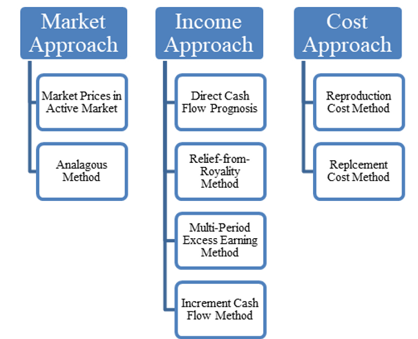

## Table of Contents

## What is a patent and why is it important?

A patent is a special right given by the government to an inventor. It lets the inventor stop others from making, using, or selling their invention for a certain time, usually about 20 years. This means the inventor can be the only one to make money from their invention during that time.

Patents are important because they encourage people to invent new things. If inventors know they can have control over their inventions and make money from them, they are more likely to spend time and money on creating new and useful things. This helps society because new inventions can improve our lives and help the economy grow.

## What are the basic methods used to evaluate the value of a patent?

One way to evaluate the value of a patent is by looking at its market potential. This means figuring out how much money the invention could make if it were sold or used in the market. People look at things like how big the market is, how much people would pay for the product, and if there are other similar products that might compete with it. If the patent covers a product that many people want and there's not much competition, it could be very valuable.

Another method is to consider the legal strength of the patent. This involves checking how well the patent is written and how likely it is to hold up in court if someone tries to challenge it. A strong patent that clearly describes the invention and has a broad scope of protection is usually more valuable. It's also important to see if the patent has been granted in important markets around the world, as this can increase its value.

Lastly, the value of a patent can be assessed by looking at its technological importance. This means evaluating how innovative the invention is and how much it improves on existing technology. If the patent covers a breakthrough that could change an industry or solve a big problem, it might be very valuable. Companies often pay a lot for patents that give them a competitive edge or help them develop new products.

## How does the cost approach to patent valuation work?

The cost approach to patent valuation looks at how much money was spent to create the patent. This includes all the costs like research and development, the time inventors spent working on the invention, and the fees paid to get the patent. The idea is that the value of the patent should be at least as much as what it cost to make it. If someone wants to buy the patent, they should be willing to pay at least the amount that was spent to create it.

However, this method has some problems. Just because a lot of money was spent on a patent doesn't mean it's worth that much. The patent might not be useful or might not make any money in the market. Also, the costs of creating a patent can be hard to figure out accurately. Sometimes, companies might not keep good records of all their expenses, or they might have spent more money than was really needed. So, while the cost approach can give a starting point for valuing a patent, it's not always the best way to know its true value.

## What is the income approach to patent valuation and how is it applied?

The income approach to patent valuation looks at how much money the patent could make in the future. It tries to guess how much income the patent will bring in over its life, usually 20 years. To do this, people look at things like how much the product could be sold for, how many people might buy it, and how long the product will be popular. They then use these guesses to figure out the total income the patent could make.

Once they have an idea of the future income, they need to figure out what that income is worth today. This is called discounting. They use a discount rate, which is kind of like an [interest rate](/wiki/interest-rate-trading-strategies), to turn future money into today's money. The reason for this is that money today is worth more than money in the future because you could invest it now and earn more. So, the income approach helps people see if the patent is worth the price by comparing the discounted future income to the cost of buying the patent.

## Can you explain the market approach to patent valuation?

The market approach to patent valuation looks at what similar patents have sold for in the past. It's like checking the price of a used car by seeing what other used cars like it sold for. If a patent is similar to another one that sold for a lot of money, then the patent might be worth about the same amount. This method helps people guess the value of a patent by comparing it to others that are already sold.

However, finding similar patents can be hard. Not all patents are the same, and the ones that have been sold might not be exactly like the one being valued. Also, the market can change over time, so what a patent sold for a year ago might not be what it would sell for today. Despite these challenges, the market approach gives a good starting point for understanding what a patent might be worth by looking at real sales data.

## What role do patent citations play in evaluating patent value?

Patent citations can show how important a patent is. When a new patent is filed, it often lists other patents that it builds on or is related to. If a patent has a lot of citations, it means other inventors think it's important and useful. This can make the patent more valuable because it shows that it has influenced other inventions.

However, the number of citations isn't the only thing to look at. Sometimes, a patent might be cited a lot because it's in a very popular area of technology, not because it's a great invention. Also, a patent with fewer citations might still be very valuable if it's a new and important idea. So, while citations can help show a patent's value, they should be used along with other ways of evaluating a patent, like looking at its market potential or how much money it could make.

## How do legal factors affect the valuation of a patent?

Legal factors can really change how much a patent is worth. One big thing is how strong the patent is legally. If the patent is written well and covers a lot of different ways the invention could be used, it's more valuable. This is because it's harder for other people to find ways around the patent or to challenge it in court. If a patent is weak and easy to get around, it won't be worth as much because it won't stop others from making similar products.

Another legal [factor](/wiki/factor-investing) is whether the patent has been granted in important countries. If a patent is only granted in one country, it might not be as valuable as one that's granted in many big markets around the world. For example, if a patent is granted in the United States, Europe, and China, it can protect the invention in a lot of places where people might want to buy it. This makes the patent more valuable because the owner can make money from it in more places.

## What are the differences between quantitative and qualitative methods in patent valuation?

Quantitative methods in patent valuation use numbers and math to figure out how much a patent is worth. These methods look at things like how much money the patent could make in the future, how much it cost to create the patent, or what similar patents have sold for in the past. For example, the income approach adds up all the money the patent might make and then uses a discount rate to figure out what that money is worth today. The cost approach looks at all the money spent to create the patent, and the market approach checks what other patents like it have sold for. These methods give a clear number for the value of the patent, which can be helpful when making business decisions.

Qualitative methods, on the other hand, look at things that are harder to measure with numbers. These methods consider the legal strength of the patent, how important the technology is, and how the patent fits into the overall market. For example, a patent might be valuable because it's very hard to get around legally, or because it's a big step forward in technology. Qualitative methods also look at things like how many other patents cite this one, which can show how influential it is. While these methods don't give a specific number for the patent's value, they help give a fuller picture of why a patent might be valuable.

## How can the technology life cycle influence patent valuation?

The technology life cycle can really change how much a patent is worth. It's like a map that shows where a technology is in its journey from being new to being old. When a technology is just starting out, it's in the early stages. Patents for new technology can be very valuable because they cover something that no one else has. Companies might pay a lot for these patents because they want to be the first to use the new technology and make money from it.

As the technology gets older and more common, the value of the patent can go down. This is because more people might have similar patents, so it's not as special anymore. Also, as the technology moves into the later stages of its life, it might not be as important or useful. Companies might not want to pay as much for patents on old technology because they're looking for the next big thing. So, understanding where a technology is in its life cycle can help figure out how much a patent is worth.

## What advanced econometric models are used in patent valuation?

Advanced econometric models used in patent valuation often include the hedonic pricing model and the real options model. The hedonic pricing model looks at different parts of a patent, like how broad its protection is or how much money it could make, and gives each part a value. By adding up these values, the model can guess how much the whole patent is worth. This model is helpful because it breaks down the patent into smaller pieces that are easier to understand and value.

The real options model treats a patent like a financial option, where the owner has the choice to use the patent or not. This model thinks about the future possibilities of the patent, like if it could be used in new ways or in different markets. It uses things like the chance of the patent making money and how long it will last to figure out its value. This model is good for patents that might be used in many different ways in the future, because it can show how much those possibilities are worth.

## How do international considerations impact patent valuation strategies?

International considerations can really change how much a patent is worth. If a patent is granted in many different countries, it can be more valuable. This is because the owner can make money from the invention in more places. For example, if a patent is granted in the United States, Europe, and China, it covers a lot of big markets where people might want to buy the product. But, getting a patent in different countries can be expensive and take a lot of time. So, companies need to think about if it's worth the cost and effort to get a patent in many places.

Also, laws about patents can be different in different countries. Some countries might have stricter rules about what can be patented or how long a patent lasts. This can affect how much a patent is worth in each place. For example, if a patent is strong and lasts a long time in one country but not in another, it might be more valuable in the first country. Companies need to understand these differences and plan their patent strategies carefully to make the most money from their inventions.

## What are the current trends and future directions in patent valuation methodologies?

Right now, people are using more data and computers to figure out how much a patent is worth. They're using big data and [machine learning](/wiki/machine-learning) to look at lots of information about patents, like how often they're cited, what they're about, and what similar patents have sold for. This helps them make better guesses about a patent's value. Also, more people are thinking about how a patent fits into the whole business plan of a company, not just how much money it could make by itself. This means looking at how the patent can help the company grow or stay ahead of others in the market.

In the future, we might see even more use of technology in patent valuation. Artificial intelligence and machine learning could become even better at figuring out the value of patents by looking at more and more data. Also, as the world gets more connected, companies might think even more about international markets when valuing patents. They'll need to understand how laws and markets in different countries can change a patent's value. Overall, patent valuation will keep getting more detailed and accurate as technology and global business keep changing.

## What are the traditional methods of patent valuation?

Traditional methods of patent valuation are essential tools for determining the financial worth of a patent. These methods include the Cost approach, Market approach, and Income approach. Each technique offers a unique perspective and set of metrics, making them useful in various scenarios depending on the patent's characteristics and the evaluator’s objectives.

The Cost approach focuses on the costs associated with creating and obtaining the patent. This method calculates the value of a patent based on the sum total of expenses involved in the research and development (R&D) process, legal fees, and other related costs. The rationale is that the cost incurred in developing a technology or invention is reflective of its value. While this approach offers a straightforward and objective measure, it does not account for the potential future earnings or the technological significance of the patent.

The Market approach estimates the patent's value through comparison with similar patents that have been sold, licensed, or exchanged in the market. This comparative technique involves analyzing data of past transactions to assess current market trends. The challenge with the Market approach lies in the availability and reliability of data pertaining to comparable patent transactions, as these are often confidential and not publicly disclosed. Despite this limitation, when data is available, it provides a real-world context and helps gauge how others in the industry value similar innovations.

The Income approach, widely used in financial valuation, estimates the present value of future economic benefits expected from the patent. This method involves forecasting the future income streams that the patent is likely to generate, such as licensing fees or cost savings, and discounting these cash flows back to their present value using an appropriate discount rate:

$$
V = \sum_{t=1}^{n} \frac{CF_t}{(1 + r)^t}
$$

where $V$ is the patent's value, $CF_t$ is the cash flow in year $t$, $n$ is the number of years the patent is expected to generate income, and $r$ is the discount rate. The Income approach closely aligns with the economic reality of patent valuation, as it takes into account the potential revenue a patent can bring to its owner. However, it requires assumptions about future market conditions and revenue streams, adding a degree of uncertainty to the valuation process.

Together, these traditional methods provide a comprehensive framework for evaluating patents, each offering insights that cater to different valuation needs and scenarios.

## References & Further Reading

[1]: ["The Economic Valuation of Patents: Methods and Applications"](https://www.elgaronline.com/abstract/9781848445482.xml) by the Organisation for Economic Co-operation and Development (OECD).

[2]: Davis, J. L., Hall, B. H., & Rosenblum, J. (2001). ["Have the Patent Office and Courts Systematically Overcompensated Patent Holders?"](https://pubmed.ncbi.nlm.nih.gov/11474727/) National Bureau of Economic Research Working Paper Series.

[3]: Lerner, J., & Seru, A. (2017). ["The Use and Misuse of Patent Data: Issues for Corporate Finance and Beyond."](https://www.nber.org/papers/w24053) Review of Financial Studies.

[4]: Gambardella, A., Harhoff, D., & Verspagen, B. (2008). ["The Value of European Patents: Evidence from a Survey of European Inventors"](https://www.academia.edu/67644481/The_value_of_European_patents) Research Policy Journal.

[5]: Lanjouw, J. O., & Schankerman, M. (2004). ["Patent Quality and Research Productivity: Measuring Innovation with Multiple Indicators"](https://academic.oup.com/ej/article-abstract/114/495/441/5085644) Review of Economics and Statistics.

[6]: Reitzig, M. (2003). ["What Determines Patent Value? Insights from the Semiconductor Industry."](https://www.sciencedirect.com/science/article/pii/S0048733301001937) Organization Science Journal.