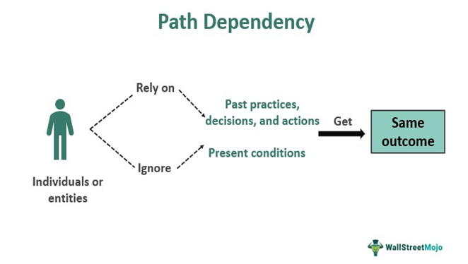

## Table of Contents

## What are path-dependent options?

Path-dependent options are financial instruments whose value depends not just on the final price of the underlying asset, but also on the path that the asset's price took over time. This means that the history of the price movements matters, not just where the price ends up. For example, if you have an option that pays out based on the average price of a stock over a period, the daily prices of the stock will affect the final payout, not just the price at the end of the period.

A common type of path-dependent option is the Asian option, which uses the average price of the underlying asset over a certain period to determine its value. Another example is a lookback option, which allows the holder to buy or sell the asset at its lowest or highest price during the option's life, regardless of the price at expiration. These options can be more complex to price and manage because they require tracking the price movements over time, but they can also offer unique benefits and risk management strategies for investors.

## How do path-dependent options differ from path-independent options?

Path-dependent options and path-independent options are different types of financial tools. Path-dependent options care about the journey of the price of the asset they're based on. This means that if you have a path-dependent option, it matters how the price of the asset moved up and down over time, not just where it ended up. For example, an Asian option, which is a type of path-dependent option, uses the average price of the asset over time to figure out its value.

On the other hand, path-independent options only care about where the price of the asset ends up at the end of the option's life. They don't pay attention to the ups and downs along the way. A simple example of a path-independent option is a European option, which can only be used at the end of its term, and its value depends only on the final price of the asset. Because path-independent options are simpler, they are usually easier to understand and price than path-dependent options.

## What are some common types of path-dependent options?

Path-dependent options are financial tools that look at how the price of an asset changes over time, not just where it ends up. One common type is the Asian option. With an Asian option, the value depends on the average price of the asset during a certain time. This can be helpful for people who want to reduce the risk of big price swings at the end of the option's life. Another type is the lookback option. A lookback option lets you buy or sell the asset at its lowest or highest price during the whole time you had the option, no matter what the price is when the option ends.

Barrier options are another kind of path-dependent option. These options only start working or stop working if the price of the asset hits a certain level, called a barrier. For example, a "knock-out" barrier option might become worthless if the price goes above or below the barrier, while a "knock-in" barrier option only starts to work if the price hits the barrier. Lastly, there are path-dependent options like cliquet options, which give you a series of smaller payouts based on how the asset's price moves at different times during the option's life. These options can be complex but offer unique ways to manage risk and earn returns.

## Can you explain how a barrier option works as a path-dependent option?

A barrier option is a type of path-dependent option because its value depends on whether the price of the underlying asset hits a certain level, called a barrier, during the life of the option. If the price touches this barrier, it can either activate the option or make it worthless, depending on the type of barrier option. For example, a "knock-out" barrier option becomes worthless if the price of the asset reaches the barrier. On the other hand, a "knock-in" barrier option only starts to work if the price hits the barrier.

This means that the history of the price movements matters a lot for barrier options. It's not just about where the price ends up at the end of the option's life, but whether it ever touched the barrier along the way. This makes barrier options more complex than regular options because you have to keep an eye on the price all the time, not just at the end. They can be useful for investors who want to take advantage of certain price levels or manage their risk in specific ways.

## What is an Asian option and how does its path dependency affect its valuation?

An Asian option is a type of path-dependent option where the value depends on the average price of the underlying asset over a certain period of time, not just the price at the end. This means that if you have an Asian option, you care about how the price of the asset moved up and down during the whole time you had the option. For example, if you have an Asian call option, you can buy the asset at a set price, but the payout will be based on the average price of the asset over the option's life, not just the price at the end.

The path dependency of an Asian option affects its valuation because it reduces the impact of big price swings at the end of the option's life. Since the value depends on the average price, a sudden jump or drop in the price right at the end won't change the value as much as it would with a regular option. This makes Asian options less risky and can make them cheaper than regular options. To figure out the value of an Asian option, you need to look at all the prices of the asset over time, not just the final price, which can make pricing these options more complicated but also more predictable.

## How does the path dependency of a lookback option influence its pricing?

A lookback option is a type of path-dependent option where the value depends on the highest or lowest price of the underlying asset during the whole time you have the option. For a lookback call option, you can buy the asset at the lowest price it reached during the option's life, no matter what the price is at the end. For a lookback put option, you can sell the asset at the highest price it reached. This means that the path the price takes over time is very important because it's not just about where the price ends up, but about all the ups and downs along the way.

Because lookback options let you use the best price that happened during the option's life, they are usually more expensive than regular options. The pricing of a lookback option has to take into account all the possible high and low prices that could happen over time. This makes the math more complicated because you need to think about every possible path the price could take, not just the final price. But this also means that lookback options can be very valuable for investors who want to make sure they get the best possible deal, even if the price moves a lot.

## What role does historical data play in the valuation of path-dependent options?

Historical data is really important for figuring out the value of path-dependent options. These options care about how the price of an asset moves over time, not just where it ends up. So, to find out how much a path-dependent option is worth, you need to look at the past prices of the asset. This helps you see how the price has moved up and down in the past, which can give you a good idea of what might happen in the future. For example, if you're trying to value an Asian option, you need to know the average price of the asset over time, which you can only get from historical data.

Using historical data can make the math for pricing path-dependent options more complicated, but it also makes it more accurate. When you look at past prices, you can use them to guess how likely certain price movements are in the future. This is important for options like lookback options, where the highest or lowest price during the option's life matters, or barrier options, where the price hitting a certain level can change the option's value. By studying historical data, you can make better predictions and come up with a fair price for the option.

## How do market conditions impact the effectiveness of path-dependent options?

Market conditions can really change how well path-dependent options work. These options depend on the price of an asset over time, so if the market is very up and down, it can make a big difference. For example, if you have an Asian option that pays out based on the average price of a stock, a market with a lot of ups and downs might make the average price more stable than the final price. This can be good if you want to avoid big risks from sudden price changes at the end. But, if the market is very calm and doesn't move much, the benefits of an Asian option might not be as clear.

On the other hand, lookback options and barrier options can be more tricky in different market conditions. A lookback option lets you buy or sell at the best price during the option's life, so in a market with big swings, these options can be very valuable because they let you take advantage of the highest or lowest prices. But, they can also be more expensive. Barrier options depend on the price hitting a certain level, so if the market is very volatile, it might be more likely to hit that level, making the option more risky or more valuable, depending on whether it's a knock-in or knock-out option. In a stable market, these options might not be as useful because the price might not move enough to hit the barrier.

## What are the key mathematical models used to price path-dependent options?

The main mathematical models used to price path-dependent options are the Monte Carlo simulation and the binomial model. A Monte Carlo simulation works by running many different scenarios of how the price of the asset might move over time. It takes into account all the ups and downs and then averages out the results to find the option's value. This method is really good for path-dependent options because it can handle the complex paths that prices can take. The binomial model, on the other hand, breaks down the time until the option expires into smaller steps. At each step, the price can go up or down, and the model calculates the option's value based on all the possible paths the price could take. This method can be a bit simpler to use than Monte Carlo but still works well for path-dependent options.

Another model that is sometimes used is the finite difference method. This model solves the equations that describe how the option's value changes over time by breaking down the problem into small pieces and solving it step by step. It's good for handling the complex math needed for path-dependent options. Each of these models has its own strengths and can be better suited for different types of path-dependent options. For example, Monte Carlo might be better for options like Asian options that depend on average prices, while the binomial model might be easier to use for lookback options that depend on the highest or lowest price. Choosing the right model depends on the specific option and the market conditions.

## How can Monte Carlo simulation be applied to value path-dependent options?

Monte Carlo simulation is a way to figure out the value of path-dependent options by running lots of different scenarios of how the price of the asset might move over time. It's like playing out many possible futures and seeing what happens to the option's value in each one. For path-dependent options, this is really helpful because these options care about the whole journey of the price, not just where it ends up. So, in a Monte Carlo simulation, you start with the current price of the asset and then use random numbers to guess how the price might change each day until the option expires. You do this over and over again, maybe thousands of times, to get a good idea of all the possible paths the price could take.

After running all these scenarios, you can then look at the results to see what the option would be worth in each case. By averaging out all these different outcomes, you get a good estimate of the option's value. This method is especially good for options like Asian options, which depend on the average price over time, or barrier options, which depend on the price hitting a certain level. Monte Carlo simulation can handle the complex math needed to figure out these values by looking at all the possible price paths, making it a powerful tool for pricing path-dependent options.

## What are the challenges in hedging path-dependent options?

Hedging path-dependent options can be tricky because their value depends on the whole path of the price, not just where it ends up. This means that you have to keep an eye on the price all the time, not just at the end. For example, if you're hedging an Asian option, you need to adjust your hedge based on the average price over time, which can be hard to predict and manage. It's different from hedging regular options, where you only need to worry about the price at the end. With path-dependent options, small changes in the price along the way can have a big impact on the final value, making it harder to set up a hedge that works well all the time.

Another challenge is that path-dependent options often need more complicated math to figure out their value and set up a hedge. Models like Monte Carlo simulation or binomial models are used to price these options, and they can be hard to use in real-time trading. You need to keep running these models to adjust your hedge as the price moves, which can be time-consuming and might not always give you perfect results. Plus, the cost of setting up and maintaining a hedge for path-dependent options can be higher because of the extra work and the need for more frequent adjustments. This makes hedging path-dependent options more complex and costly than hedging regular options.

## How do advanced numerical methods improve the accuracy of path-dependent option pricing?

Advanced numerical methods like Monte Carlo simulation, the binomial model, and the finite difference method help make the pricing of path-dependent options more accurate. These methods are good at handling the complex math needed for options that depend on the whole path of the price, not just the end. For example, Monte Carlo simulation runs many different scenarios of how the price might move over time. By looking at all these different paths and averaging the results, it gives a good estimate of the option's value. This is really helpful for options like Asian options, which depend on the average price, or lookback options, which depend on the highest or lowest price during the option's life.

These numerical methods also let you take into account more details about the market and the asset's price movements. For example, the binomial model breaks down the time until the option expires into small steps, letting you see how the price might go up or down at each step. The finite difference method solves the equations that describe how the option's value changes over time by breaking the problem into small pieces and solving it step by step. These methods can be more accurate than simpler models because they can handle the ups and downs of the price in a more detailed way. This makes them better at figuring out the true value of path-dependent options, which can be tricky to price because they depend on so many different factors.

## What are the applications and advantages?

Path-dependent options provide substantial advantages in financial strategies, mainly through their extensive use in hedging and risk management. One of their primary benefits is the ability to tailor payoff structures specifically to match distinct market outlooks or investment strategies. This customization becomes especially pertinent when investors need to hedge against certain price movements or capture specific market scenarios that conventional options cannot address.

For instance, in Asian options, where the payoff depends on the average price of the underlying asset over a period, investors can mitigate the [volatility](/wiki/volatility-trading-strategies) risk associated with sudden price shocks. This averaging feature helps stabilize the option’s payoff by reducing the influence of price extremes. In a mathematical context, an Asian call option’s payoff at maturity can be calculated as:

$$
\text{Payoff} = \max\left(\frac{1}{n} \sum_{i=1}^{n} S_i - K, 0\right)
$$

where $S_i$ represents the asset price at each observation point and $K$ is the strike price. This formula exhibits how the average can smooth out extreme variations in price, providing a hedging mechanism against volatility.

Lookback options are instrumental in capturing the most favorable price movements over the option's life. By tying the payoff to the highest or lowest asset price during this period, traders can ensure that they benefit from the best possible market conditions. For instance, in a lookback call option, the payoff could be calculated as:

$$
\text{Payoff} = \max(S_{\max} - K, 0)
$$

where $S_{\max}$ is the maximum observed asset price. This feature is particularly advantageous for hedging strategies that target specific price levels without the need to precisely time the market.

Barrier options, which are activated or deactivated when the underlying asset's price reaches a predetermined level, offer significant advantages in strategic financial planning. They provide a cost-effective alternative to standard options, as they are typically cheaper due to their conditional nature. Investors can use barrier options to implement sophisticated risk management strategies that kick in only under certain market conditions.

A case study example involves utilizing barrier options in dynamic hedging strategies. For example, knock-in barrier options can be embedded into portfolio strategies to activate protective puts only if the market experiences significant downturns, thus optimizing the cost versus protection balance.

Besides individual risk management applications, path-dependent options contribute to market efficiency by mitigating manipulation risks. By relying on price paths rather than single-day valuations, they reduce the incentive for market actors to engage in manipulative trades aimed at influencing asset prices at specific points, such as the options' expiration dates.

In conclusion, the unique features of path-dependent options, like their reliance on historical price paths, enable investors to align their strategies closely with their market expectations and investment goals. This adaptability not only enhances portfolio protection and return potential but also promotes a more robust financial market infrastructure by discouraging manipulative practices.

## References & Further Reading

[1]: Boyle, P. P., Evnine, J., & Gibbs, S. (1989). ["Numerical Evaluation of Multivariate Contingent Claims."](https://www.jstor.org/stable/2962049) Operations Research, 37(3), 419-431.

[2]: Curran, M. (1994). ["Valuing Asian and Portfolio Options by Conditioning on the Geometric Mean Price."](https://www.jstor.org/stable/2632947) Management Science, 40(12), 1705-1711. 

[3]: Wilmott, P., Howison, S., & Dewynne, J. (1995). ["The Mathematics of Financial Derivatives: A Student Introduction."](https://www.cambridge.org/core/books/mathematics-of-financial-derivatives/7121345D07C5BCE4FBEC91A8A7E6F267) Cambridge University Press.

[4]: Rubinstein, M., & Reiner, E. (1991). ["Breaking Down the Barriers."](https://www.academia.edu/16585738/Breaking_down_the_barriers) Risk, 4, 28-35.

[5]: Glasserman, P. (2004). ["Monte Carlo Methods in Financial Engineering."](https://archive.org/details/montecarlomethod0000glas) Springer.