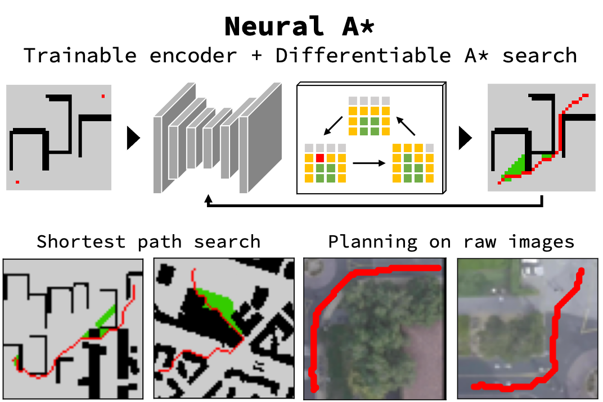

## Table of Contents

## What is path planning in the context of machine learning?

Path planning in machine learning is about finding the best way for a machine or robot to move from one place to another. It's like giving directions to a robot, telling it how to go from point A to point B while avoiding obstacles and following certain rules. In machine learning, path planning often uses algorithms that can learn from past experiences to make better decisions about which path to take. This means the robot can get better at finding the best route over time.

One common method used in path planning is reinforcement learning. In this approach, the robot learns by trying different paths and getting feedback on how well it did. If it chooses a good path, it gets a reward, and if it chooses a bad path, it might get a penalty. Over time, the robot learns to choose paths that lead to more rewards. This is similar to how a person might learn to drive a car better by practicing and getting feedback from an instructor.

Another important aspect of path planning is considering the environment. The robot needs to know about things like walls, other robots, or people that it should avoid. This information can be given to the robot through sensors or maps. By using this data, the robot can plan a path that is safe and efficient. Machine learning helps the robot to adapt to changes in the environment, making it more flexible and able to handle new situations.

## How does path planning differ from traditional navigation systems?

Path planning in [machine learning](/wiki/machine-learning) is different from traditional navigation systems because it uses smart algorithms that can learn and adapt over time. Traditional navigation systems, like GPS, usually give you a fixed route from one place to another. They don't change much even if the road conditions change. But with path planning, the machine or robot can learn from its past trips. It can try different paths and see which ones work best. If there's a new obstacle or a faster way, the robot can figure it out and choose a better route next time.

Another big difference is that path planning often deals with more complex environments. Traditional navigation systems are good for cars on roads, but path planning can be used for robots in all sorts of places, like warehouses or even underwater. These places might have lots of obstacles and tight spaces, so the robot needs to be smart about how it moves. Machine learning helps the robot understand these environments better and find the best way through them. This makes path planning more flexible and useful in many different situations.

## What are the basic algorithms used in path planning?

One basic algorithm used in path planning is the A* (A-star) algorithm. A* is like a smart way to find the shortest path from a start point to a goal point. It looks at all the possible paths but focuses more on the paths that seem to be heading in the right direction. A* uses something called a heuristic, which is a guess about how far it is to the goal. This helps A* to search faster by not wasting time on paths that are unlikely to be the best.

Another common algorithm is Dijkstra's algorithm. Dijkstra's is good at finding the shortest path in a graph, which is a way to represent places and paths between them. Unlike A*, Dijkstra's doesn't use a heuristic, so it checks all possible paths equally. This can make it slower than A*, but it's very reliable and works well when you don't have a good guess about the best direction to the goal. Both A* and Dijkstra's are used a lot in path planning because they are effective at finding good routes.

A third algorithm often used in path planning is the Rapidly-exploring Random Tree (RRT) algorithm. RRT is especially useful in environments with lots of obstacles because it builds a tree of possible paths by randomly exploring the space. This makes it good at finding a path quickly, even in complex environments. RRT can be improved with versions like RRT*, which can find even better paths over time by refining the tree. These algorithms help robots and machines navigate smartly and efficiently.

## Can you explain the concept of a cost function in path planning?

In path planning, a cost function is like a scoring system that helps decide which path is the best. It gives a number to each possible path, and the path with the lowest number is usually the one chosen. The cost can be based on things like how long the path is, how much time it takes, or how much energy it uses. For example, if a robot is trying to get from one room to another, the cost function might add up the distance it needs to travel and the number of turns it has to make. This helps the robot pick a path that is short and easy to follow.

The cost function can also include other factors, like avoiding obstacles or staying safe. For example, if there's a big box in the way, the cost function might make paths that go around the box more expensive. This encourages the robot to find a way around the obstacle. By using a cost function, path planning algorithms like A* or Dijkstra's can compare different paths and choose the one that is best according to the rules set by the cost function. This makes the robot's journey more efficient and safer.

## What role does machine learning play in enhancing path planning?

Machine learning helps make path planning better by letting robots and machines learn from what they do. Instead of always using the same old paths, machine learning lets them try different ways and see which ones work best. For example, if a robot is in a warehouse, it can learn which paths are faster or safer over time. This is done using methods like [reinforcement learning](/wiki/reinforcement-learning), where the robot gets rewards for choosing good paths and penalties for bad ones. As it keeps trying, it gets better at [picking](/wiki/asset-class-picking) the best route.

Another way machine learning helps is by understanding the environment better. Robots can use sensors to see where obstacles are and how things change. Machine learning helps the robot make sense of all this data and adapt its paths accordingly. If a new obstacle appears or an old one is removed, the robot can quickly learn about it and find a new way around. This makes path planning more flexible and useful in places that change a lot, like busy warehouses or city streets.

## How do reinforcement learning techniques apply to path planning?

Reinforcement learning helps robots and machines get better at path planning by letting them learn from their actions. Imagine a robot trying to find the best way through a maze. It tries different paths and gets rewards for choosing good ones and penalties for bad ones. Over time, it learns which paths lead to more rewards. This is like a game where the robot gets points for making good choices. The more it plays, the better it gets at finding the best route.

In reinforcement learning, the robot uses something called a policy to decide what to do next. The policy is like a set of rules that the robot follows to choose its path. As the robot explores and learns, it updates its policy to make better choices. For example, if it finds that going left at a certain point usually leads to a dead end, it will learn to go right instead. This way, the robot keeps improving its path planning by learning from its experiences and adapting to changes in the environment.

## What are some common challenges faced in path planning for autonomous vehicles?

Path planning for autonomous vehicles can be tricky because there are many things to think about. One big challenge is dealing with other cars and people on the road. The vehicle needs to predict what others will do and find a safe path around them. This means it has to be smart and quick to change plans if something unexpected happens, like a car suddenly stopping or a pedestrian crossing the street. Another challenge is understanding the road environment. The vehicle needs to read signs, follow traffic rules, and know where it can and can't go. This can be hard if the signs are unclear or if the road layout changes.

Another common problem is dealing with bad weather or poor visibility. Rain, snow, or fog can make it tough for the vehicle's sensors to see the road clearly. This can lead to mistakes in path planning, making it harder to find a safe route. Additionally, the vehicle needs to handle real-time data and make decisions quickly. If the path planning algorithm takes too long to decide, the vehicle might miss its chance to take the best path or react to a sudden change. All these challenges mean that path planning for autonomous vehicles needs to be very smart and adaptable to keep everyone safe on the road.

## How can deep learning improve the efficiency of path planning algorithms?

Deep learning can make path planning algorithms better by helping them understand complex environments more easily. Instead of just following set rules, [deep learning](/wiki/deep-learning) lets the algorithm learn from lots of data. For example, a robot can use deep learning to recognize different types of obstacles and find the best way around them. This is like teaching the robot to see and think more like a human, so it can make smarter choices about which path to take. By using deep learning, the robot can keep getting better at path planning as it sees more of the world and learns from its experiences.

Another way deep learning helps is by making the path planning process faster. Traditional algorithms might take a long time to check all possible paths, but deep learning can find good paths more quickly. This is because deep learning can use neural networks to predict the best path based on what it has learned before. For example, a self-driving car can use deep learning to quickly decide the best route through traffic, even when things change fast. This makes the car safer and more efficient because it can react to new situations without slowing down.

## What are the differences between global and local path planning strategies?

Global path planning is like planning a trip from start to finish before you even leave. It looks at the whole map and figures out the best way to get from point A to point B. It considers all the obstacles and tries to find the shortest or safest path across the entire area. For example, if you're planning a road trip, global path planning would be like choosing the highways and routes you'll take from your home to your destination. This method is good for knowing the big picture but might not be perfect if things change along the way.

Local path planning, on the other hand, is more about making decisions as you go. It focuses on what's happening right now and helps you adjust your path based on new information. Imagine driving and suddenly seeing a road closed sign; local path planning would help you find a new way around it quickly. It's like navigating through a busy city where you need to keep changing your route because of traffic or construction. Local path planning is great for adapting to changes but might not always find the best overall path if it only looks at what's right in front of it.

Both global and local path planning have their strengths and can be used together to make path planning even better. Global planning gives you a good starting plan, while local planning helps you adjust that plan as you go. This combination can make robots and machines smarter and more flexible, helping them find the best path no matter what surprises they encounter along the way.

## Can you discuss the impact of environmental dynamics on path planning?

Environmental dynamics, like changing weather or moving obstacles, can make path planning a lot harder. Imagine a robot trying to find its way through a busy city. If it's raining, the robot's sensors might not work as well, making it tough to see the road or other cars. Or, if a new construction site pops up overnight, the robot's old path might not work anymore. These changes mean the robot has to be smart and quick to find a new way around. It needs to use what it learns from its sensors to update its plan and keep moving safely.

To deal with these challenges, path planning algorithms need to be flexible. They can use machine learning to get better at understanding the environment. For example, a robot can learn to recognize different types of obstacles and find the best path around them. If it sees a new obstacle, it can quickly figure out a new route. This makes the robot more adaptable and able to handle surprises. By using smart algorithms, the robot can keep finding good paths even when the world around it keeps changing.

## How do multi-agent path planning systems work and what are their applications?

Multi-agent path planning systems are used when you have more than one robot or machine that needs to move around in the same space. These systems help each robot find its own path while making sure they don't bump into each other. It's like a dance where everyone needs to move without stepping on each other's toes. The robots share information about where they are and where they're going, so they can plan their paths together. This way, they can all reach their goals safely and efficiently. For example, in a warehouse, many robots might be moving items around at the same time, and multi-agent path planning helps them work together without getting in each other's way.

These systems are used in many places where lots of robots need to work together. In warehouses, multi-agent path planning helps robots move goods quickly and safely. In traffic management, it can help self-driving cars navigate busy city streets without causing accidents. It's also used in games to make the characters move around each other in a realistic way. By using smart algorithms, these systems can handle complex environments and keep everything running smoothly. This makes them very useful in any situation where multiple robots or vehicles need to share the same space.

## What are the latest advancements in path planning research using machine learning?

Recent advancements in path planning using machine learning have focused on making robots and machines smarter and more adaptable. One big step forward is the use of deep reinforcement learning, which combines deep learning with reinforcement learning to help robots learn better paths. This method lets robots understand complex environments and find the best way through them by trying different paths and learning from the results. For example, researchers have used deep reinforcement learning to train robots to navigate through crowded spaces or changing environments, like a busy warehouse or a city street. This makes the robots more flexible and able to handle new situations without needing to be reprogrammed.

Another exciting advancement is the use of graph neural networks (GNNs) in path planning. GNNs help robots understand the relationships between different parts of their environment, like how one obstacle is connected to another. This can make path planning more efficient because the robot can see the big picture and plan a better route. Researchers have shown that GNNs can improve path planning in scenarios where traditional methods struggle, such as in very complex or dynamic environments. By using these new techniques, path planning algorithms can keep getting better and help robots and machines navigate more effectively in the real world.

## References & Further Reading

[1]: Hart, P. E., Nilsson, N. J., & Raphael, B. (1968). ["A Formal Basis for the Heuristic Determination of Minimum Cost Paths."](https://ieeexplore.ieee.org/document/4082128) IEEE Transactions on Systems Science and Cybernetics.

[2]: Dijkstra, E. W. (1959). ["A Note on Two Problems in Connexion with Graphs."](https://link.springer.com/article/10.1007/BF01386390) Numerische Mathematik.

[3]: LaValle, S. M. (1998). ["Rapidly-exploring Random Trees: A New Tool for Path Planning."](https://xueshu.baidu.com/usercenter/paper/show?paperid=217374357dbaca88b9cc30b6c0a19f59) Technical Report.

[4]: Sutton, R. S., & Barto, A. G. (1998). ["Reinforcement Learning: An Introduction."](https://ieeexplore.ieee.org/document/712192) MIT Press.

[5]: Silver, D., Lever, G., Heess, N., Degris, T., Wierstra, D., & Riedmiller, M. (2014). ["Deterministic Policy Gradient Algorithms."](https://dl.acm.org/doi/10.5555/3044805.3044850) Proceedings of the 31st International Conference on Machine Learning.

[6]: Schmidhuber, J. (2015). ["Deep Learning in Neural Networks: An Overview."](https://www.sciencedirect.com/science/article/pii/S0893608014002135) Neural Networks.

[7]: Chen, R. T. Q., Li, X., Grosse, R., & Duvenaud, D. K. (2018). ["Neural Ordinary Differential Equations."](https://arxiv.org/abs/1806.07366) Advances in Neural Information Processing Systems.

[8]: Falcone, M. (1999). ["Numerical Methods for Differential Games based on Partial Differential Equations."](https://www.researchgate.net/publication/23551568_Numerical_methods_for_differential_games_based_on_partial_differential_equations) Electronic Transactions on Numerical Analysis.

[9]: Yan, X., & Standley, T. S. (2019). ["Graph Neural Networks for Path Planning."](https://github.com/proroklab/gnn_pathplanning) ArXiv Preprint.