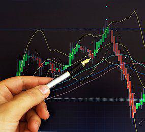

Financial trading is a complex and dynamic field where success is driven by a blend of skill, knowledge, and technology. Achieving the status of an elite trader requires more than just luck—it involves mastering a variety of competencies, understanding intricate market dynamics, and capitalizing on technological advancements to gain a competitive edge.

This article aims to define trading success and explore the path to becoming an elite trader through strategic planning, disciplined practices, and the integration of algorithmic trading. Critical characteristics of successful traders, such as consistency, risk management, and adaptability, will be emphasized. The discussion will include how various tools and methodologies can elevate a novice trader to a proficient one, underscoring the importance of a well-founded strategy and continual learning.



Whether one is beginning their trading journey or is a seasoned participant, the insights presented here are designed to significantly enhance trading performance. By focusing on sound strategies and the systematic application of advanced techniques, traders can navigate the complexities of modern financial markets effectively.

## Table of Contents

## Understanding the Trading Landscape

The financial markets are diverse ecosystems, including stocks, forex, commodities, and cryptocurrencies, each with unique characteristics and risk profiles. Understanding these markets is essential for any trader aiming for success. The stock market involves buying and selling shares of companies, where prices are influenced by various factors such as company performance, economic news, and global events. Forex, or foreign exchange, involves trading currency pairs, which are affected by interest rates, economic indicators, and geopolitical events. Commodities trading deals with raw materials like oil, gold, and agricultural products, often influenced by supply and demand dynamics, weather conditions, and geopolitical tensions. Cryptocurrencies represent a newer market, characterized by digital assets like Bitcoin and Ethereum, whose prices are driven by technological developments, regulatory news, and market sentiment.

Successful trading in these markets begins with understanding their behaviors and the fundamental and technical factors influencing them. Fundamental analysis involves evaluating economic indicators, company financials, and macroeconomic factors to gauge market conditions. Technical analysis examines historical price movements and chart patterns to predict future trends. Indicators such as moving averages, relative strength index (RSI), and Bollinger Bands can aid in this analysis, offering insights into trend direction, momentum, and volatility.

Leveraging market data and indicators is crucial for making informed trading decisions. Traders can harness advanced tools and platforms that offer real-time data and analytics. For instance, algorithmic trading systems can process vast amounts of data with speed and precision, helping traders execute strategies based on predefined criteria. Additionally, machine learning models can identify patterns within market data, allowing traders to anticipate price movements more accurately.

To illustrate, consider a simple moving average crossover strategy in Python, which involves buying when a short-term moving average crosses above a long-term moving average and selling when it crosses below:

```python
import pandas as pd
import numpy as np

# Sample market data
data = pd.DataFrame({'Close': [105, 107, 106, 108, 110, 111, 113, 115, 117, 116]})

# Calculating moving averages
data['Short_MA'] = data['Close'].rolling(window=3).mean()
data['Long_MA'] = data['Close'].rolling(window=5).mean()

# Generating trading signals
data['Signal'] = np.where(data['Short_MA'] > data['Long_MA'], 1, 0)
data['Position'] = data['Signal'].diff()

print(data)
```

This code generates buy and sell signals by comparing the short-term and long-term moving averages. It's a simple yet effective example of how traders can use data and indicators to make informed decisions.

In conclusion, understanding the trading landscape involves comprehending the diverse characteristics of financial markets and the myriad factors influencing them. By leveraging data, analysis, and technology, traders can navigate these markets more effectively, enhancing their ability to capitalize on opportunities while managing risks.

## What Sets Elite Traders Apart

Elite traders are distinguished from others in the financial markets by several characteristics that lead to their consistent profitability and success. At the forefront of these is their detailed approach to trading, encompassing meticulous record-keeping, disciplined strategies, and a business-oriented mindset. These traders systematically document every trade, which serves as both a comprehensive learning tool and a method for refining their techniques. This detailed record-keeping allows them to analyze past trades, identify patterns, and adjust strategies accordingly, reducing the likelihood of repeated mistakes and enhancing their decision-making process.

Discipline is another hallmark of elite traders. They craft and adhere to specific trading strategies, often developing personalized rules that govern their trading activities. Such strategies are informed by thorough analysis and an understanding of market conditions, helping to minimize emotional and impulsive decisions that can lead to significant losses. By establishing a set of guidelines, elite traders ensure they remain focused and consistent, executing trades that align with their overall risk management and profit objectives.

Continuous learning is integral to the success of elite traders, who view trading as a dynamic field requiring constant adaptation and growth. They stay informed about market developments, economic indicators, and technological advancements, ensuring they can adjust their strategies in response to changing conditions. This commitment to learning allows them to capitalize on new opportunities and mitigate risks associated with unforeseen market shifts.

Key traits such as resilience and adaptability are crucial in navigating the complexities of financial markets. Elite traders possess an acute understanding of market psychology, recognizing how fear, greed, and other emotions can influence trading behavior. They leverage this insight to anticipate market movements and manage their psychological responses to maintain composure during volatile periods. Resilience enables them to recover from losses without deviating from their strategic approach, while adaptability allows them to evolve their methods as markets change.

In summary, what sets elite traders apart is their methodical approach to trading, commitment to learning, and an acute understanding of market psychology, all of which contribute to their long-term success. These characteristics enable them to navigate the financial markets effectively, managing risks while consistently achieving profitability.

## The Role of Algorithmic Trading

Algorithmic trading has significantly transformed the landscape of financial trading, enabling traders to execute trades at high speed and with increased accuracy. It relies on complex algorithms, mathematical models, and computational power to make trading decisions. These algorithms process vast amounts of market data, identify trading opportunities, and execute trades automatically without human intervention. 

One of the primary advantages of [algorithmic trading](/wiki/algorithmic-trading) is its operational efficiency. Unlike manual trading, which is constrained by human capacity for processing information and executing trades, algorithmic trading can operate continuously and simultaneously across multiple markets and instruments. This ability leads to tighter spreads and lower transaction costs since trades can be executed at optimal prices with minimal delay.

The removal of emotion from trading decisions is another critical benefit of algorithmic trading. Human traders are susceptible to biases and emotional reactions, which can result in suboptimal decision-making. In contrast, algorithmic systems adhere strictly to predefined criteria, thus ensuring that trades are consistent with the intended strategy without succumbing to fear or greed.

Data analysis capabilities in algorithmic trading are unparalleled. Algorithms can quickly analyze historical and real-time data to detect patterns and predict future price movements. These predictive analytics are crucial for crafting trading strategies that capitalize on short-term fluctuations or long-term trends. Advanced [machine learning](/wiki/machine-learning) techniques, such as supervised learning and neural networks, often enhance these predictive capabilities.

To develop successful algorithmic strategies, traders must engage in several key activities. First is the formulation and [backtesting](/wiki/backtesting) of trading strategies. Backtesting involves simulating a strategy using historical data to evaluate its effectiveness. A successful strategy should demonstrate positive results not just in backtesting but also in live market conditions. This process often involves adjusting parameters and refining the algorithm to adapt to changing market conditions.

Here is an example of Python code for a simple moving average crossover strategy, a popular algorithmic trading strategy:

```python
import numpy as np
import pandas as pd
import matplotlib.pyplot as plt

# Assume data is loaded in a DataFrame 'data' with 'Close' as one of the columns
def moving_average_crossover_strategy(data, short_window=40, long_window=100):
    signals = pd.DataFrame(index=data.index)
    signals['signal'] = 0.0
    signals['short_mavg'] = data['Close'].rolling(window=short_window, min_periods=1).mean()
    signals['long_mavg'] = data['Close'].rolling(window=long_window, min_periods=1).mean()

    # Create signals
    signals['signal'][short_window:] = np.where(
        signals['short_mavg'][short_window:] > signals['long_mavg'][short_window:], 1.0, 0.0
    )

    # Generate trading orders
    signals['positions'] = signals['signal'].diff()

    return signals

# Example data loading and applying strategy
data = pd.read_csv('historical_stock_data.csv', index_col='Date', parse_dates=True)
signals = moving_average_crossover_strategy(data)

plt.figure(figsize=(10, 5))
plt.plot(data['Close'], label='Close Price')
plt.plot(signals['short_mavg'], label='40-Day Moving Average', color='green')
plt.plot(signals['long_mavg'], label='100-Day Moving Average', color='red')

# Plot buy signals
plt.plot(signals.loc[signals.positions == 1.0].index,
         signals.short_mavg[signals.positions == 1.0],
         '^', markersize=10, color='m', lw=0, label='Buy Signal')

# Plot sell signals
plt.plot(signals.loc[signals.positions == -1.0].index,
         signals.short_mavg[signals.positions == -1.0],
         'v', markersize=10, color='k', lw=0, label='Sell Signal')

plt.title('Moving Average Crossover Strategy')
plt.legend()
plt.show()
```

Implementation of robust risk management practices is essential to safeguard against potential market risks and technical failures. Risk limits, diversification across strategies, and continuous monitoring are vital components in ensuring the reliability and efficiency of algorithmic systems.

By effectively leveraging these advanced techniques and tools, traders can develop algorithmic strategies that enhance trading outcomes, leading to sustained success in competitive financial markets.

## Developing Your Trading Strategy

A robust trading strategy is crucial for achieving consistent success in the financial markets. The process of developing such a strategy involves setting clear objectives, understanding personal risk tolerance, and choosing an approach aligned with one's trading goals. The key to a sustainable strategy lies in its ability to withstand both time and market [volatility](/wiki/volatility-trading-strategies). 

### Creating and Testing a Trading Strategy

Creating an effective trading strategy begins with a comprehensive analysis of market conditions and individual financial objectives. Traders should define specific goals, such as desired return rates or risk levels, to tailor a strategy that meets these criteria. This groundwork sets the stage for choosing a trading approach, whether active or passive, short-term or long-term.

Once a strategy is conceptualized, rigorous testing using historical data (backtesting) and simulated trading (paper trading) is essential. This phase allows traders to validate their strategies under various market conditions without financial risk. Python, with its libraries such as `pandas` for data manipulation and `[backtrader](/wiki/backtrader)` for strategy testing, is an excellent tool for this purpose:

```python
import backtrader as bt

class MyStrategy(bt.Strategy):
    def __init__(self):
        self.sma = bt.indicators.SimpleMovingAverage(period=15)

    def next(self):
        if self.data.close > self.sma:
            self.buy(size=10)
        elif self.data.close < self.sma:
            self.sell(size=10)

cerebro = bt.Cerebro()
cerebro.addstrategy(MyStrategy)
cerebro.run()
```

This basic example demonstrates how to test a simple moving average crossover strategy, a common technical indicator in trading.

### Refining Your Strategy

After testing, refining the strategy involves analyzing performance metrics and adjusting parameters to enhance profitability and manage risk. Successful strategies often exhibit a combination of high reward potential and low-risk exposure. Performance metrics include win rate, average return, and maximum drawdown. Refinement can also involve incorporating additional indicators or modifying entry and [exit](/wiki/exit-strategy) rules.

### Popular Trading Strategies

Several well-established strategies provide a foundation for traders to build upon:

1. **Trend Following**: This strategy capitalizes on the momentum of assets in a consistent direction. Traders may use moving averages or technical indicators like the MACD to identify and follow these trends.

2. **Mean Reversion**: Mean reversion strategies are based on the premise that prices will revert to their mean over time. Traders look for price deviations from the average and place trades anticipating a return to this mean.

3. **Statistical Arbitrage**: This advanced strategy involves using mathematical models to detect pricing inefficiencies between related financial instruments. Pairs trading is a classic example, where two correlated stocks are simultaneously bought and sold to exploit price discrepancies.

In conclusion, developing a sound trading strategy is an iterative process requiring the establishment of clear objectives, comprehensive testing, and continuous refinement. By employing popular strategies like [trend following](/wiki/trend-following), mean reversion, and statistical [arbitrage](/wiki/arbitrage), traders can create resilient strategies adaptable to various market conditions. Structured and disciplined development of strategy is pivotal in navigating the complexities and uncertainties inherent in financial markets.

## Risk Management in Trading

Effective risk management is a critical component of successful trading, aimed at preserving capital and ensuring the longevity of a trader's career. Proper risk management helps traders mitigate losses, protect against adverse market movements, and ultimately achieve long-term profitability. This section explores key risk management strategies, including the implementation of stop-loss orders, understanding leverage, and diversifying trading strategies.

### Setting Stop-Loss Orders

Stop-loss orders are a fundamental risk management tool that allows traders to automatically exit a position at a predetermined price level, thereby limiting potential losses. By setting a stop-loss order, traders can ensure they do not hold onto losing positions in the hope of a market rebound. The effectiveness of stop-losses depends on their strategic placement, which should be based on technical analysis, market volatility, and individual risk tolerance. For instance, placing a stop-loss just below a support level or using a percentage of total capital as the limit can be effective approaches.

### Understanding Leverage

Leverage is a double-edged sword in trading, amplifying both potential gains and losses. It allows traders to control larger positions with a smaller amount of capital. However, excessive use of leverage can lead to significant losses, often exceeding the initial investment. Understanding the concept of leverage, such as the leverage ratio (e.g., 10:1), and its impact on trading outcomes is crucial. Traders should use leverage judiciously, aligning it with their risk tolerance and avoiding overexposure in volatile markets.

### Diversifying Trading Strategies

Diversification is a vital risk management strategy that involves spreading investments across various financial instruments, markets, or strategies to reduce exposure to any single asset or risk. By diversifying, traders can mitigate the impact of negative performance in one area with positive outcomes in others. This approach not only balances risk but also enhances the potential for consistent returns. Traders might diversify by trading different asset classes (e.g., stocks, currencies, commodities) or employing multiple trading strategies (e.g., trend following, range trading, and arbitrage).

### Maintaining Discipline

Discipline is essential in risk management, ensuring that traders stick to their predefined plans and strategies without succumbing to emotional decision-making. This involves adhering to established stop-loss levels, regularly reviewing and adjusting positions based on market conditions, and avoiding impulsive trades driven by market volatility or psychological factors such as fear and greed.

### Calculated Decision-Making

In trading, calculated decision-making involves a thorough analysis of market data, risk assessment, and probability estimation before executing trades. Traders should adopt a systematic approach, using tools like risk-to-reward ratios and probability models to evaluate potential trades. This analysis helps in choosing trades with the most favorable risk-return profile, thereby maximizing the likelihood of success while minimizing potential losses.

### Practical Example in Python

To illustrate a basic risk management tool, consider the following Python code snippet for calculating position size based on a percentage of capital at risk:

```python
def calculate_position_size(account_balance, risk_per_trade, stop_loss_distance):
    """
    Calculate the position size for a trade.

    :param account_balance: Total account balance available for trading.
    :param risk_per_trade: Percentage of account balance to risk on a trade.
    :param stop_loss_distance: Distance between entry price and stop-loss price.
    :return: Position size.
    """
    risk_amount = account_balance * risk_per_trade
    position_size = risk_amount / stop_loss_distance
    return position_size

# Example usage
account_balance = 10000  # $10,000
risk_per_trade = 0.02  # 2% risk
stop_loss_distance = 50  # $50 distance

position_size = calculate_position_size(account_balance, risk_per_trade, stop_loss_distance)
print(f"Recommended position size: {position_size} units")
```

Effective risk management is not merely about preventing losses but also about ensuring that traders remain viable participants in the market. By implementing strategies such as stop-loss orders, understanding leverage, diversifying approaches, maintaining discipline, and making calculated decisions, traders can better navigate the market dynamics and protect their capital over the long term.

## The Importance of Continuous Learning

In the fast-paced world of financial trading, the necessity for continuous learning cannot be overstated. Traders, irrespective of their experience levels, must keep abreast of the latest market dynamics, technological advancements, and strategic innovations to maintain a competitive edge. Continuous learning ensures traders not only survive but thrive amidst constantly evolving market environments.

### Resources for Expanding Knowledge

1. **Online Courses and Webinars**: The internet is replete with platforms offering courses that cover a breadth of topics from basic market terminologies to advanced trading strategies. Websites like Coursera, Udemy, and edX provide access to courses led by industry experts. Topics often include technical analysis, financial modeling, and algorithmic trading, equipping traders with valuable theoretical and practical insights.

2. **Trading Communities and Forums**: Engaging with fellow traders through communities such as TradingView or forums like Elite Trader can be highly beneficial. These platforms provide a space for traders to exchange ideas, discuss trends, and gain different perspectives. Interacting with a diverse group can also help in identifying common pitfalls and successful strategies.

3. **Seminars and Conferences**: Physical and virtual seminars offer opportunities to hear from trading professionals and thought leaders. These events can provide deep dives into specific aspects of trading and practical advice from seasoned experts. Conferences often focus on emerging trends such as machine learning applications in trading or the impact of global events on market behavior.

### Adapting to New Technologies and Trends

1. **Technological Innovations**: Staying current with technological advancements is critical. Technologies like artificial intelligence (AI) and machine learning are increasingly being integrated into trading systems. Understanding these tools can offer a distinct advantage. For example, implementing machine learning models to predict stock prices or integrating AI for analyzing large datasets can lead to more informed decision-making.

2. **Market Trends**: Continuously analyzing market trends is essential. This includes understanding macroeconomic indicators, geopolitical events, and sector-specific developments. Traders can use tools like Python libraries (e.g., Pandas, NumPy) for data analysis and backtesting strategies to assess their validity in current market conditions.

    ```python
    import pandas as pd
    import numpy as np

    # Example: simple moving average crossover strategy
    def sma_crossover_strategy(data, short_window=40, long_window=100):
        signals = pd.DataFrame(index=data.index)
        signals['price'] = data['price']
        signals['short_mavg'] = data['price'].rolling(window=short_window, min_periods=1).mean()
        signals['long_mavg'] = data['price'].rolling(window=long_window, min_periods=1).mean()
        signals['signal'] = 0.0
        signals['signal'][short_window:] = np.where(signals['short_mavg'][short_window:] > signals['long_mavg'][short_window:], 1.0, 0.0)
        signals['positions'] = signals['signal'].diff()
        return signals

    # Assuming 'data' is a DataFrame with a 'price' column representing historical prices
    signals = sma_crossover_strategy(data)
    ```

3. **Innovative Trading Strategies**: Continuous education also involves keeping up with innovative trading strategies such as quantitative and high-frequency trading. Traders may need to learn programming skills or enhance their data analytical capabilities to develop and optimize these complex strategies.

The commitment to continuous learning empowers traders to not only implement advanced strategies effectively but also adapt swiftly to the ever-evolving landscape of financial markets. By investing time in education and practical skill development, traders position themselves for sustained success, better equipped to navigate the uncertainties of the trading world.

## Conclusion: Achieving Trading Success

Becoming an elite trader is a journey that demands a blend of dedication, strategic planning, and the proficient use of technology, particularly algorithmic trading. The financial markets are inherently complex and ever-evolving, posing challenges that require a methodical and disciplined approach to overcome. A critical component of this journey is the commitment to continuous improvement. Successful traders consistently refine their strategies, learning from past experiences, and staying updated with market innovations. This adaptability allows them to effectively respond to market fluctuations and capitalize on emerging opportunities.

One of the fundamental elements in achieving trading success is the emphasis on a well-structured trading strategy. This involves setting clearly defined objectives and aligning these with personal risk tolerance levels. Employing algorithmic trading can significantly enhance a trader's ability to execute strategies with precision. Algorithmic systems, driven by predefined rules, enable traders to perform complex calculations rapidly and make data-driven decisions devoid of emotional biases. This technological edge can be pivotal in maintaining a competitive advantage in fast-paced market conditions.

Risk management is another pillar that underpins longevity in trading. Implementing measures such as stop-loss orders and diversifying trading strategies are essential to mitigate potential losses and preserve capital. Importantly, disciplined risk management practices also involve understanding and managing leverage effectively to avoid overexposure to any single market or asset class.

Furthermore, continuous learning remains indispensable for traders aiming for elite status. Engaging in educational resources, whether through online courses or community discussions, can significantly enrich a trader’s knowledge base. Staying informed about new technologies, market trends, and advances in trading strategies ensures traders remain competitive and well-prepared for unforeseen shifts in the market landscape.

In summary, the path to becoming an elite trader is marked by a commitment to strategic planning, disciplined practices, and leveraging algorithmic trading technology. By adhering to these principles and focusing on continuous learning and risk management, traders can adeptly navigate the intricacies of financial markets and strive to achieve long-term success. This article has outlined a roadmap for aspiring elite traders, highlighting the essential components necessary to reach their trading goals.

## References & Further Reading

[1]: Bergstra, J., Bardenet, R., Bengio, Y., & Kégl, B. (2011). ["Algorithms for Hyper-Parameter Optimization."](https://dl.acm.org/doi/10.5555/2986459.2986743) Advances in Neural Information Processing Systems 24.

[2]: ["Advances in Financial Machine Learning"](https://www.amazon.com/Advances-Financial-Machine-Learning-Marcos/dp/1119482089) by Marcos Lopez de Prado

[3]: ["Evidence-Based Technical Analysis: Applying the Scientific Method and Statistical Inference to Trading Signals"](https://www.amazon.com/Evidence-Based-Technical-Analysis-Scientific-Statistical/dp/0470008741) by David Aronson

[4]: ["Machine Learning for Algorithmic Trading"](https://github.com/stefan-jansen/machine-learning-for-trading) by Stefan Jansen

[5]: ["Quantitative Trading: How to Build Your Own Algorithmic Trading Business"](https://www.amazon.com/Quantitative-Trading-Build-Algorithmic-Business/dp/1119800064) by Ernest P. Chan