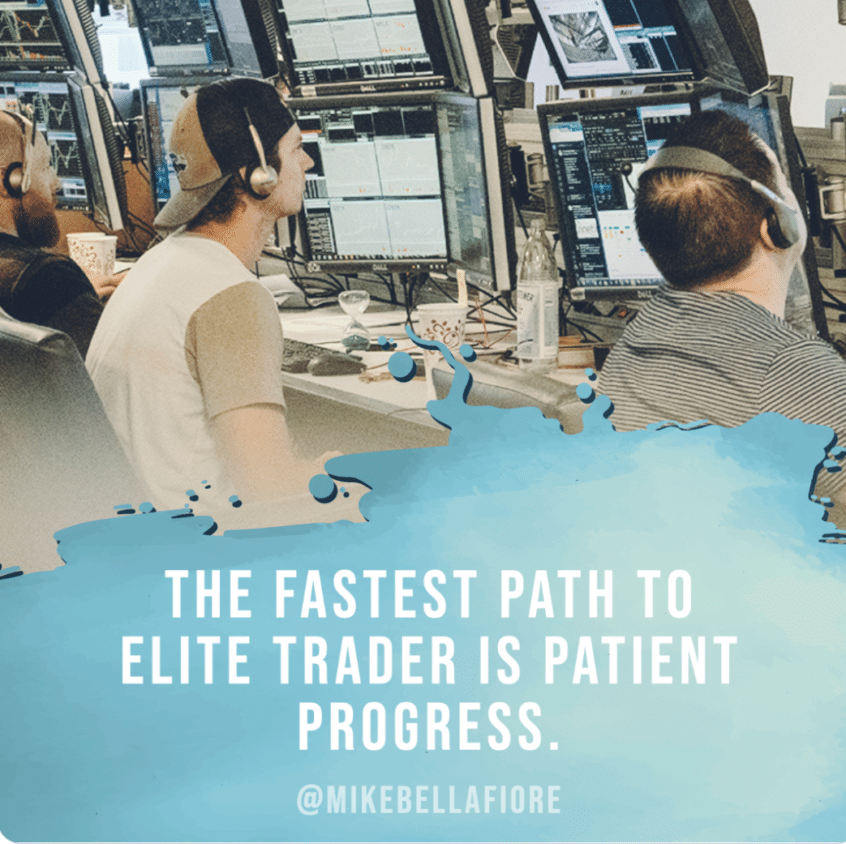

## Table of Contents

## What are the basic concepts of trading that a beginner should understand?

Trading is about buying and selling things like stocks, currencies, or commodities to make a profit. When you trade, you need to understand the market, which means knowing what people are buying and selling and why. You also need to know about supply and demand. When lots of people want something, the price goes up. When fewer people want it, the price goes down. Another important idea is risk. Trading can be risky because you might lose money, so it's important to only trade with money you can afford to lose and to have a plan for managing your risks.

Another key concept is technical analysis, which involves looking at charts and patterns to predict what might happen next in the market. Traders use tools like moving averages and trend lines to help them make decisions. On the other hand, fundamental analysis looks at the actual value of what you're trading, like a company's earnings or the economic conditions of a country. Both types of analysis can help you decide when to buy or sell. Lastly, understanding different types of orders, like market orders and limit orders, is crucial. A market order buys or sells immediately at the current price, while a limit order sets a specific price at which you want to buy or sell.

## How can a beginner start practicing trading without risking significant capital?

A beginner can start practicing trading without risking significant capital by using a demo account offered by many online trading platforms. These demo accounts provide virtual money that you can use to trade in real-time market conditions without any financial risk. This is a great way to get familiar with how trading works, practice using different tools and strategies, and understand how the market moves without worrying about losing real money.

Another option is to start with a small amount of real money. Many platforms allow you to open an account with a low minimum deposit, sometimes as little as $10 or $20. This way, you can trade with real money but keep your risk low. It's important to only use money you can afford to lose and to set strict limits on how much you're willing to risk on each trade. This approach helps you learn from real market experiences while keeping your financial risk minimal.

## What are the essential tools and resources needed for a beginner trader?

A beginner trader needs a reliable trading platform to start. This is a software or app where you can buy and sell things like stocks or currencies. Many platforms offer demo accounts, which let you practice trading without using real money. They also have educational resources like tutorials and webinars to help you learn. A good trading platform should be easy to use and have tools for analyzing the market, like charts and indicators.

Another important tool is a trading journal. This is where you write down your trades, what you were thinking, and what happened. Keeping a journal helps you learn from your mistakes and improve your trading strategy. You can use a simple notebook or a special app designed for trading journals. It's also helpful to have access to financial news and market analysis. Websites, apps, and newsletters can keep you updated on what's happening in the market, which can affect your trading decisions.

Lastly, consider using trading simulators and educational courses. Simulators let you practice trading in a safe environment, while courses can teach you the basics of trading and more advanced strategies. Many online platforms offer free or paid courses that cover everything from the fundamentals to technical analysis. These resources can help you build a strong foundation and gain confidence as a beginner trader.

## How important is developing a trading plan, and what should it include?

Developing a trading plan is very important for a beginner trader. It's like a roadmap that helps you stay on track and make smart decisions. Without a plan, you might make choices based on emotions like fear or excitement, which can lead to big losses. A good trading plan helps you set clear goals, manage your risks, and stick to a strategy that works for you. It's a way to keep your trading disciplined and organized, which is crucial for long-term success.

A trading plan should include a few key things. First, it should have your trading goals, like how much money you want to make and over what time. It's also important to include your risk management rules, like how much money you're willing to lose on each trade and how you'll protect your profits. Your plan should also describe your trading strategy, which means the rules you'll follow to decide when to buy and sell. This could be based on technical analysis, like looking at charts, or fundamental analysis, like studying a company's financial health. Finally, your plan should have a way to keep track of your trades and review your performance, so you can learn and improve over time.

## What psychological traits are crucial for a trader to develop as they progress?

Being a good trader is not just about knowing the market. It's also about having the right mindset. One important trait is discipline. This means sticking to your trading plan even when things get tough. It's easy to feel scared or excited and make quick decisions, but a disciplined trader follows their rules no matter what. Another key trait is patience. Trading can be slow sometimes, and you need to wait for the right moment to make a move. Being patient helps you avoid jumping into trades that might not be good for you.

Emotional control is also crucial. The market can go up and down, and it's normal to feel stressed or happy about it. But a good trader knows how to keep their emotions in check and not let them affect their decisions. This means staying calm when things don't go your way and not getting too excited when they do. Lastly, having a growth mindset is important. This means always being ready to learn and improve. The market changes all the time, and a trader who is open to learning new things and adapting will do better in the long run.

## How can an intermediate trader analyze market trends and make informed decisions?

For an intermediate trader, analyzing market trends involves using both technical and fundamental analysis. Technical analysis means looking at charts and patterns to see where the market might be heading. You can use tools like moving averages, which smooth out price data to show trends over time, and trend lines, which help you see if prices are going up or down. Another useful tool is the Relative Strength Index (RSI), which tells you if a market is overbought or oversold. By studying these indicators, you can spot patterns and make predictions about future price movements. It's important to practice using these tools on a demo account to get better at recognizing trends and making decisions based on them.

Fundamental analysis, on the other hand, involves looking at the actual value of what you're trading. For stocks, this means studying a company's financial health, like its earnings, debts, and growth potential. For currencies, you might look at a country's economic indicators, like inflation rates and employment numbers. By understanding these fundamentals, you can make more informed decisions about whether to buy or sell. Combining both technical and fundamental analysis gives you a fuller picture of the market. It's also helpful to stay updated with financial news and market reports, as they can provide insights into what might affect the market next. By using these methods, an intermediate trader can make smarter trading choices and improve their chances of success.

## What are advanced trading strategies that can help improve performance?

One advanced trading strategy is called scalping. This means making lots of small trades to take advantage of tiny price changes. Scalpers aim to make a little bit of money on each trade, but they do it many times a day. To be good at scalping, you need to be quick and pay close attention to the market. You also need to use tools like the order book, which shows all the buy and sell orders, to see where the market might be heading next. Scalping can be exciting, but it's also risky because you need to be right a lot to make money.

Another strategy is called swing trading. This is about holding onto trades for a few days or weeks to catch bigger price moves. Swing traders look for patterns in the market that suggest a price might go up or down over a short period. They use technical analysis to find these patterns and make their decisions. Swing trading can be less stressful than scalping because you don't need to watch the market all the time, but it still requires patience and a good understanding of market trends. Both scalping and swing trading can help improve your performance if you learn how to use them well.

A third strategy is algorithmic trading, which uses computer programs to make trades based on set rules. These programs can analyze lots of data very quickly and make trades faster than a human could. Algorithmic trading can help you take advantage of market opportunities that you might miss otherwise. However, it requires some knowledge of programming and a good understanding of the market. Using algorithms can be a powerful way to improve your trading performance, but it's important to test them thoroughly before using real money.

## How does risk management evolve as a trader moves from intermediate to advanced levels?

As a trader moves from intermediate to advanced levels, risk management becomes more sophisticated and tailored to their specific trading style and goals. At the intermediate stage, traders might use basic risk management techniques like setting stop-loss orders to limit losses on each trade and diversifying their portfolio to spread risk. They also start to pay more attention to position sizing, making sure they don't risk too much of their capital on any single trade. As they gain more experience, intermediate traders begin to understand the importance of adjusting their risk management strategies based on market conditions and their overall performance.

At the advanced level, risk management evolves into a more dynamic and proactive approach. Advanced traders use more complex tools like volatility-adjusted position sizing, where they adjust the size of their trades based on how much the market is moving. They also employ advanced stop-loss strategies, such as trailing stops, which move with the price to lock in profits while still protecting against big losses. Advanced traders also use risk-reward ratios to make sure the potential profit of a trade is worth the risk they're taking. They might also use hedging techniques, like options or futures, to protect their positions from unexpected market moves. This higher level of risk management helps advanced traders handle bigger trades and navigate more volatile markets with greater confidence.

## What role does continuous education and adaptation play in the journey to becoming an elite trader?

Continuous education and adaptation are key to becoming an elite trader. The market is always changing, and what worked yesterday might not work today. That's why elite traders never stop learning. They read books, take courses, and stay up to date with the latest news and trends. They also learn from other traders by joining communities and discussing strategies. This helps them stay ahead of the game and keep improving their skills.

Adapting to new situations is just as important as learning. Elite traders know that they need to change their strategies when the market changes. They use what they learn to make better decisions and adjust their trading plans. This might mean trying out new tools or techniques, or even changing their overall approach to trading. By staying flexible and always ready to learn, elite traders can handle whatever the market throws at them and keep getting better over time.

## How can an advanced trader leverage technology and data analytics to gain an edge?

Advanced traders can use technology and data analytics to get a big advantage in the market. They use special software and tools to look at lots of data quickly. This helps them find patterns and trends that other traders might miss. For example, they might use algorithms to make trades automatically based on certain rules. These algorithms can analyze the market faster than a human can, so they can take advantage of opportunities right away. Advanced traders also use data analytics to study past trades and see what worked and what didn't. This helps them make better decisions in the future.

Another way technology helps is through advanced charting and analysis tools. These tools let traders see the market in different ways and find hidden patterns. For example, they might use machine learning to predict how prices will move based on past data. This can give them a better idea of what might happen next. Advanced traders also use technology to keep track of many markets at once, so they can spot opportunities wherever they are. By using technology and data analytics, advanced traders can make smarter trades and stay ahead of the competition.

## What are the common pitfalls that even experienced traders face, and how can they be avoided?

Even experienced traders can fall into common pitfalls like overtrading, where they trade too often and take on too much risk. This can happen when traders get too confident or try to make up for losses quickly. To avoid overtrading, it's important to stick to a trading plan and only take trades that fit the plan. Another pitfall is emotional trading, where feelings like fear or greed make traders act without thinking. This can lead to bad decisions and big losses. Experienced traders can avoid this by keeping a clear head and following their rules, no matter what the market does.

Another common mistake is not managing risk properly. Even experienced traders can forget to set stop-loss orders or risk too much on one trade. To avoid this, traders should always use risk management tools and never risk more than they can afford to lose. Lastly, some traders stop learning and adapting, thinking they know everything. But the market is always changing, and what worked before might not work now. To avoid this pitfall, experienced traders should keep learning, stay open to new ideas, and be ready to change their strategies when needed.

## How can an elite trader mentor others and contribute to the trading community?

An elite trader can mentor others by sharing their knowledge and experience. They can do this by writing books or articles about trading, or by teaching courses and workshops. They might also create videos or podcasts to explain their strategies and what they've learned. By doing this, they help new traders learn the right way to trade and avoid common mistakes. Elite traders can also offer one-on-one mentoring, where they give personal advice and help people improve their trading skills. This kind of help can make a big difference for someone starting out.

Elite traders can also contribute to the trading community by joining online forums and social media groups. They can answer questions, share their insights, and help others understand the market better. By being active in these communities, they create a supportive environment where traders can learn from each other. Elite traders might also organize or participate in trading events and conferences. These events give traders a chance to meet, share ideas, and learn from experts. By giving back to the community, elite traders help everyone become better at trading.

## References & Further Reading

[1]: Bergstra, J., Bardenet, R., Bengio, Y., & Kégl, B. (2011). ["Algorithms for Hyper-Parameter Optimization."](https://dl.acm.org/doi/10.5555/2986459.2986743) Advances in Neural Information Processing Systems 24.

[2]: ["Advances in Financial Machine Learning"](https://www.amazon.com/Advances-Financial-Machine-Learning-Marcos/dp/1119482089) by Marcos Lopez de Prado

[3]: ["Evidence-Based Technical Analysis: Applying the Scientific Method and Statistical Inference to Trading Signals"](https://www.amazon.com/Evidence-Based-Technical-Analysis-Scientific-Statistical/dp/0470008741) by David Aronson

[4]: ["Machine Learning for Algorithmic Trading"](https://github.com/stefan-jansen/machine-learning-for-trading) by Stefan Jansen

[5]: ["Quantitative Trading: How to Build Your Own Algorithmic Trading Business"](https://www.amazon.com/Quantitative-Trading-Build-Algorithmic-Business/dp/1119800064) by Ernest P. Chan