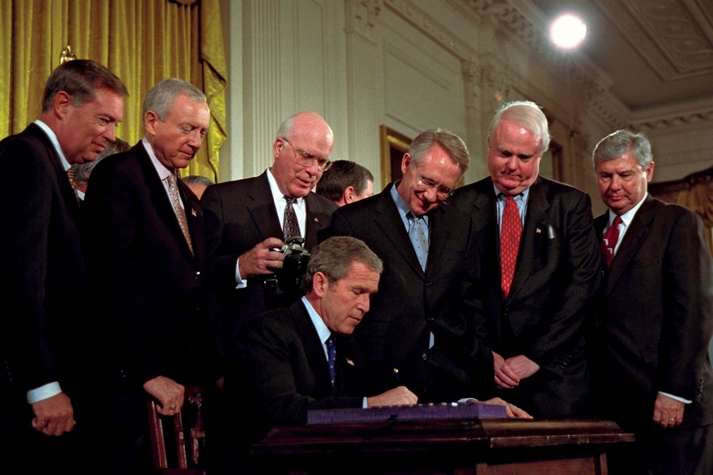

The nexus between national security and civil liberties emerged as a pivotal issue in policy debates following the enactment of the USA PATRIOT Act. This legislative measure was introduced by the U.S. government in the wake of the catastrophic attacks on September 11, 2001, aimed at augmenting the powers of law enforcement agencies in their fight against terrorism. The act significantly broadened the surveillance capabilities and investigative authorities of federal agencies, aiming to preempt potential threats and bolster national security.

However, while the primary objective of the USA PATRIOT Act was to safeguard the nation, it simultaneously sparked substantial concerns about its implications for civil liberties. Critics have argued that the expanded surveillance powers encroach upon constitutional rights, raising questions about the protection of privacy and individual freedoms. Concerns primarily revolve around the potential for government overreach and the diminishing checks that traditionally serve to limit such powers.



The financial and trading sectors likewise encountered considerable shifts due to these legislative developments. With heightened fears about money laundering and terrorism financing, the Patriot Act imposed rigorous regulations on financial institutions, mandating comprehensive compliance measures. This regulatory environment has not only transformed risk management strategies but also necessitated the integration of robust cybersecurity protocols to counteract illicit financial activities.

This article aims to scrutinize the broader implications of the Patriot Act on civil liberties and examine its intersections with algorithmic trading in financial markets. As the financial industry increasingly relies on sophisticated algorithms to automate trading processes, understanding the regulatory impact of the Patriot Act becomes crucial. By exploring these dynamics, we seek to comprehend the delicate balance between ensuring national security and preserving the sanctity of civil liberties.

## Table of Contents

## Overview of the USA PATRIOT Act

The USA PATRIOT Act, an acronym for "Uniting and Strengthening America by Providing Appropriate Tools Required to Intercept and Obstruct Terrorism," was enacted in response to the terrorist attacks on September 11, 2001. This legislation aimed to bolster national security by granting federal agencies enhanced powers for surveillance and investigation. Key provisions of the Act include the authorization of roving wiretaps, which allow law enforcement to monitor an individual's communications across various devices without needing to specify each device in the warrant. This addresses the challenge of criminals frequently changing phones or communication methods.

Another significant aspect of the USA PATRIOT Act is its provision for accessing business records. This involves the ability of federal agencies to obtain documents from businesses with a court order, as part of investigations related to terrorism. The Act also broadens the scope of investigative tools available to agencies, facilitating the use of devices like pen registers and trap and trace devices, which record dialing, routing, and addressing information.

Despite its focus on enhancing national security, the USA PATRIOT Act has faced criticism for its potential to infringe on civil liberties. Critics argue that some provisions, such as the broad surveillance capabilities and reduced barriers for government access to personal information, may lead to overreach and violations of constitutional rights. The concerns particularly focus on the First and Fourth Amendments, which safeguard freedoms of speech and protection against unreasonable searches and seizures, respectively. As such, the Act remains a subject of continuous debate regarding the balance between security and civil liberties.

## Civil Liberties Concerns

Critics of the USA PATRIOT Act have raised significant concerns regarding its potential to infringe upon constitutional rights, particularly those that are protected under the First and Fourth Amendments. The First Amendment guarantees freedoms concerning religion, expression, assembly, and the right to petition, while the Fourth Amendment safeguards citizens against unreasonable searches and seizures, requiring any warrant to be judicially sanctioned and supported by probable cause.

One of the primary concerns with the Patriot Act is its allowance for increased government surveillance with reduced oversight. This expansion of surveillance capabilities has raised substantial privacy concerns among civil liberties advocates. The Act enables federal agencies to conduct surveillance in ways that were previously limited, such as the use of roving wiretaps. These wiretaps do not require specifying the device or location to be monitored, thus allowing government agencies more flexibility, but also providing fewer checks on surveillance powers and creating potential overreach into personal freedoms.

A notable area of contention involves the use of National Security Letters (NSLs). NSLs are administrative subpoenas issued by the federal government to gather information about individuals from telephone companies, Internet service providers, and other organizations without a warrant. The issuance of NSLs has been controversial because they bypass the traditional judicial oversight associated with search warrants. This has led to debates about whether NSLs violate the Fourth Amendment's protection against unreasonable searches.

Additionally, the Patriot Act authorizes secret searches, or "sneak and peek" warrants, allowing law enforcement to search a home or business without immediately notifying the target of the investigation. Originally justified as a means to prevent the destruction of evidence or the compromise of investigations, these secret searches have been criticized for potentially violating the constitutional rights of individuals by delaying notice of the search.

These powers, designed to enhance national security, pose serious implications for individual privacy and civil liberties. Such measures reflect a significant shift in the balance between security requirements and personal freedoms, prompting ongoing debate and calls for reforms to ensure that constitutional rights are not unduly compromised. 

As legal frameworks continue to adapt to contemporary security needs, the dialogue around these issues underscores the importance of finding a sustainable balance between safeguarding national security and respecting civil liberties. Engaging in continual reassessment and dialogue is crucial to maintaining democratic principles in the face of evolving threats.

## Impact on Financial Sector

Title III of the USA PATRIOT Act, known as the International Money Laundering Abatement and Financial Anti-Terrorism Act of 2001, significantly extended regulatory measures aimed at fortifying the U.S. financial system against money laundering and terrorism financing. These measures imposed substantial responsibilities on financial institutions, mandating the adoption of comprehensive Anti-Money Laundering (AML) practices.

Financial institutions are required to create programs designed to detect and report suspicious activities. This involves verifying customer identities and maintaining records for regulatory review. One of the critical aspects of these AML programs is the requirement for Customer Identification Programs (CIP), which ensure that businesses establish and maintain accurate identification of individuals conducting transactions. This requirement fortifies the ability of regulatory bodies to trace and intercept illicit financial flows.

Moreover, these measures led to a paradigm shift in how financial institutions manage risks, necessitating strong cybersecurity protocols to protect against data breaches and unauthorized access to sensitive information. The emphasis on enhanced scrutiny of financial transactions obliged institutions to integrate technological solutions capable of processing large volumes of data to identify and mitigate risks efficiently.

The compliance requirements under the Patriot Act necessitated significant investment in technology. Financial firms increasingly turned towards [artificial intelligence](/wiki/ai-artificial-intelligence) and [machine learning](/wiki/machine-learning) solutions to handle big data analytics efficiently. Processes such as pattern recognition in transaction data aid in the identification of irregularities that could signify potential money laundering activities. 

For example, a typical anomaly detection model used in AML systems can be represented in Python as:

```python
import numpy as np
from sklearn.ensemble import IsolationForest

# Dummy transaction data
transactions = np.array([[100, 200, 150], [500, 600, 550], [9000, 2500, 3000], [999, 950, 980]])

# Isolation Forest model for anomaly detection
model = IsolationForest(contamination=0.1)
model.fit(transactions)

# Predict anomalies
anomalies = model.predict(transactions)
anomalies
```

This code snippet implements an Isolation Forest model to identify anomalies in transaction data, aiding financial institutions in quickly flagging suspicious activities.

Overall, the regulations enforced by Title III have significantly shaped the compliance landscape, pressing financial institutions to adopt rigorous AML protocols while simultaneously advancing their risk management strategies through enhanced technological solutions. These changes are imperative not only for legal compliance but also in maintaining the integrity of the global financial system amidst increasingly sophisticated illicit activities.

## Algorithmic Trading and Regulation

Algorithmic trading, which involves the use of computer algorithms to execute trading orders automatically, has revolutionized financial markets over the past few decades. This technology relies heavily on advanced algorithms and high-speed data processing to analyze market conditions and execute trades at speeds and frequencies that would be impossible for a human trader. Despite the efficiency and innovation brought by [algorithmic trading](/wiki/algorithmic-trading), its rapid proliferation has also ushered in new regulatory challenges, particularly in light of stringent compliance requirements laid out by legislation such as the USA PATRIOT Act.

The USA PATRIOT Act, originally enacted to strengthen national security measures, imposes strict anti-money laundering (AML) requirements on financial institutions. These regulations require firms to detect and report suspicious activities that might be linked to money laundering or terrorism financing. Algorithmic trading firms, like all financial entities, must adhere to these AML obligations to ensure that their systems are not exploited for illegal activities.

To comply with these regulations, algorithmic trading systems must incorporate robust compliance mechanisms. This involves implementing systematic checks within their trading algorithms to flag and freeze transactions that exhibit suspicious patterns. The use of machine learning and artificial intelligence can aid in these efforts by identifying anomalies in trading patterns that may suggest fraudulent activity. 

For example, the following is a simplified Python representation of how an algorithm might flag potentially suspicious transactions:

```python
def detect_suspicious_activity(transaction):
    # Define parameters for what constitutes suspicious behavior
    threshold_amount = 1000000  # Example threshold amount
    suspicious_patterns = ['pattern1', 'pattern2']  # Placeholder for complex patterns

    # Check if transaction amount exceeds threshold
    if transaction.amount > threshold_amount:
        return True

    # Check for suspicious patterns
    for pattern in suspicious_patterns:
        if pattern in transaction.details:
            return True

    return False

transactions = [...]  # Example list of transactions
suspicious_transactions = [t for t in transactions if detect_suspicious_activity(t)]
```

Furthermore, compliance obligations have encouraged financial institutions to enhance their cybersecurity protocols, ensuring the integrity and confidentiality of data processed during algorithmic trading operations. This involves safeguarding algorithms from being manipulated to bypass AML measures.

In summary, while algorithmic trading offers substantial benefits in terms of efficiency and market [liquidity](/wiki/liquidity-risk-premium), it necessitates rigorous compliance with regulatory demands. Firms must adapt continually, integrating advanced analytical tools and compliance frameworks in their trading infrastructure to preclude illicit financial activities and align with legislative expectations. This evolving landscape underscores the critical importance of embedding transparency and security within the architecture of algorithmic trading systems.

## Balancing Security with Liberty

Since its inception, finding a balance between national security and civil liberties under the USA PATRIOT Act has been challenging. The Act, designed to bolster national security by augmenting the capabilities of law enforcement and intelligence agencies, raised significant concerns over potential overreach and violation of constitutional rights. This tension was primarily due to its broader surveillance powers and the reduced checks on government authority, provoking a sustained public and legislative dialogue on safeguarding individual freedoms while ensuring national security.

In response to these concerns, legislative reforms have been introduced to strike a more balanced approach. Notably, the USA FREEDOM Act, enacted in 2015, represented a significant step towards addressing privacy issues that arose from the Patriot Act's implementation. This reform restricted bulk data collection by the National Security Agency (NSA), increasing transparency in the use of National Security Letters (NSLs) and enhancing judicial oversight for specific surveillance orders. The objective was to mitigate the invasive aspects of the Patriot Act while preserving essential tools for counterterrorism.

Balancing security requirements with civil liberties is an ongoing debate, reflecting the complexities of contemporary threats. The landscape of security issues has evolved significantly, fueled by technological advancements which both aid in prevention and pose new challenges. As national security measures must adapt to continuously evolving threats, so too must the legal frameworks that govern these measures. 

This dynamic nature of legislative needs is further emphasized by the increasing interconnectivity and digitalization of society, which render traditional approaches to national security and privacy protection insufficient. Innovations in technology, particularly in data collection and analysis, require corresponding developments in legal oversight to ensure that fundamental freedoms are not compromised in the state's pursuit of security.

In essence, the discourse on balancing security with liberty underscores the need for a continuously adaptive legal framework that respects both the imperative to protect the nation and the constitutional guarantees of individual rights. Progress in this area necessitates active engagement from legislators, civil society, and technology stakeholders to craft solutions that effectively address the dual demands of security and privacy.

## Conclusion

The USA PATRIOT Act, enacted as a robust response to the threats of terrorism, remains a critical component of national security strategy. Its comprehensive measures have undoubtedly enhanced the capabilities of law enforcement agencies. However, its expansive reach necessitates ongoing scrutiny, particularly regarding its impact on civil liberties and sensitive sectors like finance and trading. The balance between safeguarding the nation and respecting individual freedoms remains precarious, underscoring the need for continual evaluation and adaptation of the legislation.

The financial sector, particularly with the growth of algorithmic trading, illustrates the broader implications of the Act. Financial institutions face increased compliance burdens, requiring them to navigate complex regulatory landscapes while ensuring their operations remain unexploited by illicit activities. These challenges highlight the necessity of adaptive legal frameworks that both secure economic infrastructures and respect market neutrality.

Dialogue and reform are central to achieving this balance. Initiatives such as the USA Freedom Act represent efforts to address privacy concerns while maintaining the essential security functions granted by the USA PATRIOT Act. The ongoing discussion among lawmakers, civil liberty advocates, and industry stakeholders is crucial for refining these laws to meet modern needs without compromising fundamental freedoms.

In this dynamic environment, sustaining a cooperative discourse ensures that policies evolve constructively. As technology advances and threats diversify, legal instruments must also transform, preserving the foundational values of liberty that underpin democratic society while providing effective security measures.

## References & Further Reading

[1]: Swire, P. & Fogarty, K. A. (2003). ["Surveillance Under the USA/PATRIOT Act."](https://peterswire.net/wp-content/uploads/Swire-the-System-of-Foreign-Intelligence-Surveillance-Law.pdf) American Bar Association.

[2]: Dinh, T. Q., Sweeney, J., & Brill, J. A. (2015). ["Algorithmic Trading and Its Implications on Market Stability."](https://papers.ssrn.com/sol3/papers.cfm?abstract_id=2022034) Commodity Futures Trading Commission. 

[3]: House, F. N. (2009). ["Privacy Implication of the USA PATRIOT Act - A Legal Perspective."](https://ieeexplore.ieee.org/document/1405364) University of Richmond Law Review.

[4]: Posner, R. A. (2006). ["Not a Suicide Pact: The Constitution in a Time of National Emergency."](https://academic.oup.com/book/50515) Oxford University Press.

[5]: Jain, P., & Jain, A. (2019). ["Algorithmic Trading and the Updated Framework of Compliance."](https://pubmed.ncbi.nlm.nih.gov/30963600/) Journal of Financial Regulation and Compliance.