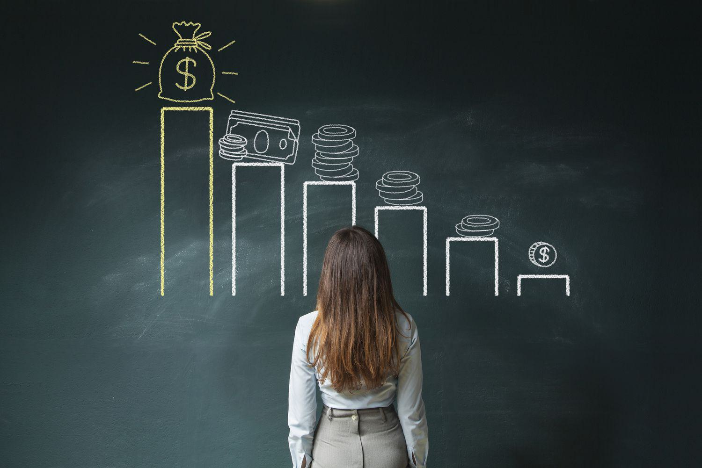

Patronage dividends serve as a distinct financial advantage exclusive to cooperative organizations, providing a mechanism through which cooperative profits are distributed back to the members based on their participation and usage of the cooperative's services. This setup is fundamentally different from traditional corporate frameworks, where dividends are distributed based on ownership of company shares. In cooperatives, these dividends are not just financial rewards but are closely tied to the cooperative values of equality and democracy, ensuring that members directly benefit from the cooperative's success in proportion to their contribution.

This article investigates the intersection of patronage dividends with concepts such as cooperative profits and member benefits, particularly examining the role that modern technology, including algorithmic trading, can play in this linkage. Algorithmic trading, which involves using computer algorithms to manage and execute trading decisions, stands to offer substantial value by enhancing the financial strategies of cooperatives. By optimizing investment decisions and managing risks effectively, algorithmic trading can improve the financial performance of a cooperative, thereby potentially increasing the patronage dividends distributed to members.

Understanding patronage dividends is crucial for gaining insight into cooperative financial structures. These dividends generate a mutual benefit that tie the financial health of the cooperative directly to its members' involvement, reinforcing the cooperative principle of mutual aid. This financial approach encourages members to engage more actively with their cooperative, fostering a community where economic success is a shared goal rather than an isolated pursuit.

Additionally, patronage dividends differ notably from traditional dividends as they reflect a return of excess charges or earnings, often allowing cooperatives to minimize tax liabilities. This tax efficiency is an attractive feature of the cooperative model, offering further economic benefits to members. Cooperative members thus benefit not only through these dividends but also through their ability to participate in decision-making processes that can enhance their financial well-being and the sustainability of the cooperative.

Therefore, embracing both cooperative financial strategies and modern technological innovations like algorithmic trading could significantly enhance member value. Recognizing the distinct characteristics of patronage dividends and their potential for modernization through algorithmic trading will be pivotal in maximizing the economic advantages for cooperative members.

## Table of Contents

## Understanding Patronage Dividends

Patronage dividends are a distinctive feature of cooperative businesses, serving as a mechanism to return profits to members based on their usage of the cooperative's services. Unlike traditional dividends distributed by corporations, which are typically based on the number of shares owned, patronage dividends align closely with the cooperative principle of equitable distribution and member participation.

At the core, patronage dividends are calculated proportionally, reflecting the degree to which each member has contributed to the cooperative's turnover. This means that members who utilize the services of the cooperative more significantly receive a proportional share of the profits. This approach reinforces the cooperative’s objectives of fairness and community benefit.

From a financial and tax perspective, patronage dividends are treated as a return of excess charges, providing dual benefits. First, they effectively reduce the cooperative's taxable income, since profits allocated as patronage dividends are not subjected to corporate income tax. Consequently, this allocation can potentially lower the overall tax burden of the cooperative, thereby increasing the net financial return to the members. Second, they provide members with a tangible return on their activity within the cooperative, reinforcing member loyalty and encouraging further engagement with the cooperative's offerings.

The organizational process typically involves the cooperative calculating its net profit at the end of a financial period. Upon determining the profit, the cooperative’s board of directors establishes the portion of profit that will be distributed as patronage dividends. This decision often considers both the financial health of the cooperative and strategic considerations for future investments.

Once the portion is allocated for distribution, it must be divided among members based on their respective "patronage," or how much they have utilized the cooperative’s services. The formula for distributing patronage dividends typically resembles:

$$
D_i = \frac{P \cdot U_i}{\sum U}
$$

where $D_i$ is the dividend for member $i$, $P$ is the total amount of profit allocated for distribution, $U_i$ is the usage or transaction amount of member $i$, and $\sum U$ is the total usage or transaction amount of all members.

This model not only incentivizes members to interact more with the cooperative but also aligns the financial success of the cooperative directly with the members' engagement levels, fostering a sense of ownership and community within the cooperative.

## Member Benefits and Cooperative Profits

Cooperatives traditionally offer a distinct benefit structure to their members through profit-sharing, primarily via patronage dividends. These dividends ensure that members receive a portion of the cooperative's profits proportional to their participation in its economic activities. This unique model aligns the cooperative's financial success directly with member engagement, fostering a sense of ownership and accountability among members. 

Members benefit not only financially but also through elevated participation in cooperative operations. This engagement manifests in the democratic governance model practiced by cooperatives, where decisions regarding profits and operations are made collectively by the membership. Such involvement ensures that individual members have a say in strategic decisions, enhancing their investment and loyalty to the cooperative. 

Economically, cooperative members enjoy financial dividends, which add a layer of income that can be particularly beneficial. The return on members’ investments or participation can often be more predictable compared to traditional investments, as it is directly related to the cooperative's overall performance and operations. Socially, the cooperative model promotes community-building and economic solidarity. By participating in a cooperative, members contribute to and benefit from a shared goal of mutual prosperity and sustainability. 

This integrated approach of distributing surplus also prompts higher member participation, as members directly influence the scale and success of their dividends by choosing to engage more with the cooperative's services or products. This creates a reciprocally beneficial cycle: increased member participation can lead to increased profits, which then lead to potentially larger patronage dividends, thus encouraging even more member participation.

## Integrating Algorithmic Trading for Increased Profitability

Algorithmic trading involves the use of computer algorithms to automate trading decisions. By leveraging quantitative models that analyze vast sets of trading data, these algorithms can execute trades at speeds and frequencies that are impossible for human traders. In the context of cooperatives, implementing [algorithmic trading](/wiki/algorithmic-trading) can significantly enhance their profitability by optimizing investment strategies, which directly contributes to increased patronage dividends for their members.

Algorithmic trading systems are designed to process complex and massive datasets, predicting market fluctuations, and executing trades based on pre-defined criteria. For cooperatives, adopting these data-driven strategies can transform financial decision-making processes. Through algorithmic trading, cooperatives can maximize returns on their investments, reduce transaction costs, and execute trades with precision that minimizes risks.

To illustrate, consider the example of a cooperative that decides to invest its surplus cash in the stock market. By employing algorithmic trading, the cooperative can utilize predictive analytics to forecast stock price trends and execute trades. The algorithm could decide on the amount to invest, select the best stocks, and the optimal timing for buying and selling, thereby increasing the cooperative's returns. These enhanced profits can then be distributed as patronage dividends, aligning further with the cooperative’s core mission of maximally benefiting its members.

There are cases where cooperatives have successfully implemented financial technologies to increase their patronage dividends. For instance, agricultural cooperatives have used algorithms to optimize commodity trading, thereby achieving better pricing and market access for their products. Through strategic partnerships with fintech companies, these cooperatives integrate algorithmic trading into their supply chain management, leading to more efficient operations and enhanced profitability.

However, integrating algorithmic trading within cooperatives requires a fundamental shift in their operational approach. Investment in technology infrastructure, training for analytical skills, and ensuring governance that aligns with cooperative principles are essential for successful implementation. Moreover, attention must be paid to the regulatory landscape and ethical standards that govern algorithmic trading practices, ensuring that they align with the values and goals of cooperative enterprises.

Algorithmic trading holds the potential to transform cooperatives’ financial strategies, rendering them more competitive and profitable. As cooperatives continue to explore these advanced technologies, they not only stand to increase their financial returns but also fortify their core mission of enhancing member benefits through higher patronage dividends.

## Challenges and Considerations

Implementing algorithmic trading within cooperatives presents a range of challenges that must be addressed to ensure successful integration. The first major challenge involves the technological and operational shifts required to implement algorithmic strategies. Algorithmic trading systems are complex and necessitate robust IT infrastructure, including advanced hardware and software systems capable of processing substantial amounts of data quickly and accurately. Cooperatives, which may not traditionally focus on such high-tech solutions, need to invest significantly in upgrading their technological capacities.

Moreover, implementing these systems also requires personnel with specific expertise in algorithmic trading and data analysis. This often involves hiring new staff or training existing members, which can be resource-intensive. The cooperative might need to develop partnerships with technology providers or financial institutions to bridge the knowledge gap and ensure effective implementation.

From an operational standpoint, cooperatives must adapt their decision-making processes to incorporate algorithm-driven insights. This requires a cultural shift towards embracing data-centric strategies, which could initially face resistance from members accustomed to conventional approaches. Ensuring that members understand and trust the algorithms is crucial, necessitating transparency in how these systems operate and make decisions.

Regulatory and ethical implications add another layer of complexity to the integration of algorithmic trading. Algorithmic trading is subject to strict financial regulations to prevent market manipulation and ensure transparency. Cooperatives must navigate these regulations to comply with legal standards, which may involve considerable legal counsel and adjustments to their operating procedures.

Ethically, there is a concern about the impact of algorithmic trading on cooperative principles. By nature, cooperatives prioritize member benefit and community focus over profit maximization. The adoption of profit-driven algorithms could potentially conflict with these values if not carefully managed. Therefore, cooperatives must balance the efficiency and profitability of algorithmic trading with their commitment to ethical practices and member-focused governance.

In conclusion, while algorithmic trading offers promising potential for enhancing cooperative profitability, its integration demands careful consideration of technological, operational, regulatory, and ethical factors. These must be addressed collaboratively by cooperative leadership and members to uphold the cooperative's core values while progressing towards increased financial sustainability.

## Maximizing Member Benefits through Strategic Dividend Distribution

Maximizing member benefits through strategic dividend distribution requires a deep understanding of cooperative governance and innovative approaches that can optimize the allocation of patronage dividends. Key strategies focus on equitable distribution while ensuring that cooperative policies align with members' best interests.

Cooperative governance plays a crucial role in setting distribution policies. The governing body is responsible for formulating rules and guidelines that ensure transparency and fairness in dividend distribution. This might involve using data analytics to assess member participation levels and correspondingly adjust the dividend distribution formula. For example, if a cooperative's profit, $P$, is to be distributed among members based on their participation level, $M_i$, a simplified formula might be:

$$
D_i = \left( \frac{M_i}{\sum_{j=1}^{n} M_j} \right) \times P
$$

where $D_i$ is the dividend allocated to member $i$, $n$ is the total number of members, and $M_j$ represents the participation of member $j$.

Best practices for maximizing dividends involve flexible strategies that adapt to changing economic circumstances. Some successful cooperatives employ hybrid distribution systems that combine direct financial returns with non-monetary benefits, such as member education programs or additional service offerings. Such approaches not only distribute profits but also enhance the overall value proposition for members, aligning financial incentives with personal and community development goals.

Innovative cooperatives also leverage technology to streamline and optimize dividend processes. For instance, employing blockchain technology can offer a transparent and immutable record of transactions, ensuring all members have equal access to accurate dividend information. Additionally, [machine learning](/wiki/machine-learning) algorithms can analyze co-op data to forecast member usage patterns, helping to predict future profit distributions more accurately.

Adopting these strategies requires cooperatives to stay abreast of technological advancements and regulatory changes. By prioritizing member engagement in decision-making processes and adopting a member-centric policy framework, cooperatives can create a resilient model that maximizes benefits and enhances member loyalty.

In summary, optimizing patronage dividends hinges on robust governance, innovative technological integration, and a keen focus on equitable benefit distribution. These strategies not only increase dividends but also reinforce the cooperative's commitment to its members' financial and social well-being.

## Conclusion

Combining algorithmic trading with cooperative principles holds significant promise for enhancing patronage dividends. By integrating advanced financial strategies, cooperatives can optimize their operational efficiencies and capture greater market opportunities. Algorithmic trading, with its capacity to process vast datasets and execute trades at high speed and precision, offers a strategic advantage. This technology-driven approach can lead to improved returns, thereby increasing the pool of profits available for distribution as patronage dividends.

Embracing modern financial strategies can fundamentally transform how cooperatives distribute returns to their members. By leveraging such tools, cooperatives can ensure a more responsive and dynamic adaptation to market conditions, maximizing member benefits not solely through profits but also by fostering a culture of transparency and engagement. Implementing algorithmic trading might also aid cooperatives in risk management, as sophisticated algorithms can monitor and adjust to financial risks in real-time, safeguarding member investments.

The evolving landscape of technology and finance presents a unique opportunity for cooperatives to revolutionize their financial practices. A call to action for cooperative entities is warranted: integrating algorithmic trading could offer sustainable financial growth and empower members through equitable and enhanced patronage dividends. By doing so, cooperatives not only ensure financial sustainability but also uplift their members' economic well-being, adhering firmly to cooperative principles of mutual benefit and shared prosperity.

## References & Further Reading

[1]: Bergstra, J., Bardenet, R., Bengio, Y., & Kégl, B. (2011). ["Algorithms for Hyper-Parameter Optimization."](https://dl.acm.org/doi/10.5555/2986459.2986743) Advances in Neural Information Processing Systems 24.

[2]: ["Advances in Financial Machine Learning"](https://www.amazon.com/Advances-Financial-Machine-Learning-Marcos/dp/1119482089) by Marcos Lopez de Prado

[3]: ["Evidence-Based Technical Analysis: Applying the Scientific Method and Statistical Inference to Trading Signals"](https://www.amazon.com/Evidence-Based-Technical-Analysis-Scientific-Statistical/dp/0470008741) by David Aronson

[4]: ["Machine Learning for Algorithmic Trading"](https://github.com/stefan-jansen/machine-learning-for-trading) by Stefan Jansen

[5]: ["Quantitative Trading: How to Build Your Own Algorithmic Trading Business"](https://www.amazon.com/Quantitative-Trading-Build-Algorithmic-Business/dp/1119800064) by Ernest P. Chan