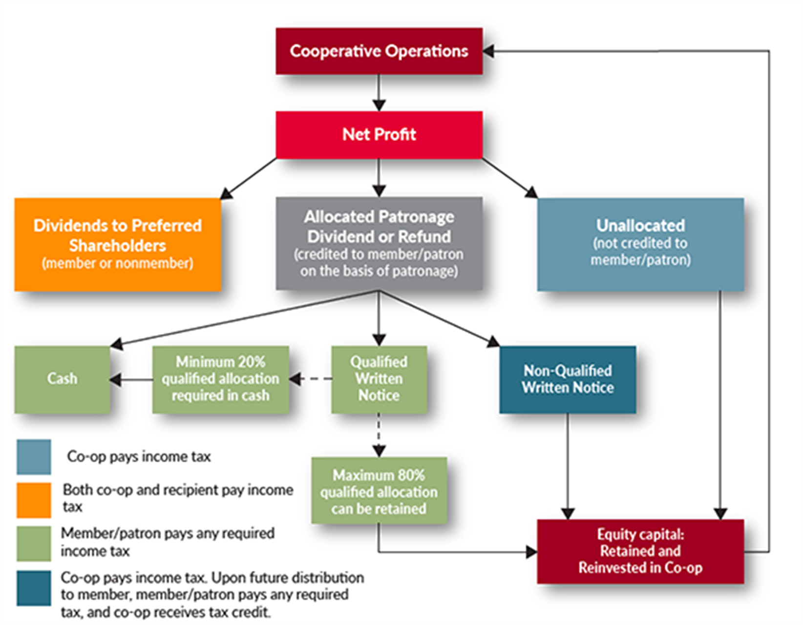

## Table of Contents

## What is a patronage dividend?

A patronage dividend is a type of payment that some businesses give back to their members or customers. These businesses are usually cooperatives, which are owned and run by the people who use their services. When a cooperative makes a profit, it can choose to share some of that profit with its members. This sharing is called a patronage dividend. The amount each member gets depends on how much they used the cooperative's services or bought from it during the year.

For example, if you are a member of a farmer's cooperative and you sold a lot of your crops through them, you might get a bigger patronage dividend than someone who sold less. This system helps to keep members loyal to the cooperative because they see direct benefits from their involvement. It's a way for the cooperative to say thank you to its members for their business and support.

## How does a patronage dividend differ from a regular dividend?

A patronage dividend is different from a regular dividend mainly because of who gets it and why. A regular dividend is money that a company pays to its shareholders just for owning stock in the company. It's like a reward for investing in the company, and you get it no matter how much you use the company's products or services. On the other hand, a patronage dividend is given by cooperatives to their members. It's based on how much a member used the cooperative's services or bought from them during the year. So, if you're more active with the cooperative, you get a bigger share of the profits.

Another key difference is the purpose behind the dividends. Regular dividends are a way for companies to share their profits with investors to keep them happy and encourage more investment. It's all about making shareholders feel good about their investment. Patronage dividends, however, are about rewarding loyalty and encouraging members to keep using the cooperative. They help build a strong community feeling among members because everyone benefits from the cooperative's success, not just those who own the most shares.

## Who typically receives patronage dividends?

Patronage dividends are typically received by members of cooperatives. A cooperative is a business owned and run by the people who use its services. These members can be farmers, consumers, workers, or anyone who joins the cooperative. The key thing is that they actively use the cooperative's services or buy its products. For example, if you're a farmer and you sell your crops through a farming cooperative, you might get a patronage dividend at the end of the year.

The amount of the patronage dividend each member gets depends on how much they used the cooperative during the year. If you used it a lot, you get a bigger share of the profits. This system encourages members to stay loyal to the cooperative because they see a direct benefit from their involvement. It's different from regular dividends, which are paid to shareholders just for owning stock in a company, no matter how much they use its services.

## What types of organizations commonly issue patronage dividends?

Patronage dividends are most often given by cooperatives. These are special kinds of businesses that are owned by the people who use their services. This can include farmers who sell their crops through a farming cooperative, or people who buy things from a consumer cooperative. The main idea is that the members of the cooperative get a share of the profits based on how much they used the cooperative's services during the year.

For example, a farming cooperative might give patronage dividends to its members at the end of the year. If a farmer sold a lot of crops through the cooperative, they would get a bigger dividend than someone who sold less. This encourages members to keep using the cooperative because they see a direct benefit from their involvement. It's a way to share the success of the business with those who help make it successful.

## How are patronage dividends calculated?

Patronage dividends are calculated based on how much a member used the services or bought products from a cooperative during a certain time, usually a year. Each member's dividend depends on their level of activity with the cooperative. For example, in a farming cooperative, if a farmer sold a lot of crops through the cooperative, they would get a bigger dividend than someone who sold less. The cooperative looks at all the business done with each member and then figures out what portion of the total profits should go to each one.

The cooperative first figures out its total profits for the year. Then, it decides how much of those profits to give back to the members as patronage dividends. The rest of the profits might be kept by the cooperative or used for other purposes. The key thing is that the more a member used the cooperative's services, the bigger their share of the profits will be. This system encourages members to stay active and loyal to the cooperative because they see a direct benefit from their involvement.

## What are the tax implications of receiving a patronage dividend?

When you get a patronage dividend, you might have to pay taxes on it. It depends on how the cooperative gives you the dividend. If you get it in cash, you usually have to pay taxes on it as regular income in the year you receive it. But if you get it as a written notice saying you'll get the money later, you don't have to pay taxes on it right away. You only pay taxes when you actually get the cash.

Sometimes, you can choose to have your patronage dividend put into more shares in the cooperative instead of getting cash. If you do this, you don't have to pay taxes on it right away. You only pay taxes when you sell those shares. It's a good idea to talk to a tax expert to understand how this works for your situation, because tax rules can be different depending on where you live and the type of cooperative you're part of.

## Can patronage dividends be reinvested, and if so, how?

Yes, patronage dividends can be reinvested. If you're part of a cooperative and you get a patronage dividend, you might have the choice to put that money back into the cooperative instead of taking it in cash. This means you can use your dividend to buy more shares or ownership in the cooperative. It's like planting your money back into the business to help it grow.

When you choose to reinvest your patronage dividend, you don't have to pay taxes on it right away. You only pay taxes when you sell those shares later on. This can be a smart move because it lets you grow your stake in the cooperative without losing money to taxes immediately. Just remember to check with a tax expert to make sure you understand how this works for your specific situation.

## What is the historical origin of patronage dividends?

Patronage dividends started a long time ago with cooperative businesses. A cooperative is a special kind of business that is owned by the people who use its services. These businesses began in the 19th century, especially in Europe. People wanted a fairer way to buy things or sell their goods, so they joined together to create cooperatives. One of the first big cooperatives was the Rochdale Society of Equitable Pioneers, which started in England in 1844. They came up with the idea of giving back some of the profits to members based on how much they used the cooperative. This was called a patronage dividend.

The idea of patronage dividends spread quickly because it helped cooperatives keep their members happy and loyal. Members liked getting a share of the profits, especially since it was based on how much they used the cooperative. This system made cooperatives different from regular businesses, where profits go to shareholders based on how many shares they own. Over time, cooperatives in many different fields, like farming, consumer goods, and even housing, started using patronage dividends. Today, they are a big part of how cooperatives work around the world.

## How do cooperative businesses use patronage dividends to benefit their members?

Cooperative businesses use patronage dividends to share their profits with members in a fair way. When a cooperative makes money, it decides how much to give back to its members. The amount each member gets depends on how much they used the cooperative's services or bought its products during the year. For example, if you're a farmer in a farming cooperative and you sold a lot of your crops through it, you'll get a bigger share of the profits than someone who sold less. This system makes members feel good about being part of the cooperative because they see a direct benefit from their involvement.

Patronage dividends also help keep members loyal to the cooperative. When members know they will get a share of the profits at the end of the year, they are more likely to keep using the cooperative's services. This loyalty helps the cooperative stay strong and successful. It's a way for the cooperative to say thank you to its members for their business and support. By sharing profits in this way, cooperatives build a strong sense of community and teamwork among their members.

## What are the legal and regulatory considerations for issuing patronage dividends?

When cooperatives want to give out patronage dividends, they need to follow certain laws and rules. These rules can be different depending on where the cooperative is located and what type of cooperative it is. In the United States, for example, cooperatives need to follow the rules set by the Internal Revenue Service (IRS). The IRS says that patronage dividends can be given out as long as they are based on how much members used the cooperative's services. The cooperative also needs to keep good records to show that the dividends are fair and follow the law.

Cooperatives also need to make sure they are following any state or local laws about giving out dividends. Some places might have extra rules about how much money can be given out or how it should be reported. It's important for cooperatives to work with lawyers and accountants to make sure they are doing everything right. This helps them avoid any legal problems and keeps their members happy and trusting in the cooperative's fairness.

## How do patronage dividends impact the financial statements of a cooperative?

Patronage dividends affect the financial statements of a cooperative in a big way. When a cooperative decides to give out patronage dividends, it means they are sharing their profits with their members. This sharing reduces the cooperative's net income for the year. On the income statement, you will see the total profits first, and then the amount given out as patronage dividends is subtracted. This makes the net income lower than it would have been if the cooperative kept all the profits.

On the balance sheet, the impact of patronage dividends can be seen in the equity section. When dividends are paid out in cash, the cooperative's cash goes down, and so does its retained earnings, which is part of the equity. If members choose to reinvest their dividends into more shares, the cash still goes down, but the equity stays the same because the money is just moved from one part of the cooperative's equity to another. This way, the financial statements show how the cooperative is sharing its success with its members, which is a key part of how cooperatives work.

## What are some case studies or examples of successful patronage dividend programs?

One successful example of a patronage dividend program is the CHS Inc., a farmer-owned cooperative in the United States. CHS gives its members patronage dividends based on how much they use the cooperative's services. For example, in a recent year, CHS returned over $1 billion in patronage dividends to its members. This helps farmers because they get a share of the profits, which can be a big help for their business. It also makes them want to keep using CHS because they see a direct benefit from being part of the cooperative.

Another good example is the National Co+op Grocers (NCG) in the United States. NCG is a cooperative of food co-ops that gives patronage dividends to its member co-ops. These dividends are based on how much each co-op buys from NCG. This helps the member co-ops because they get money back that they can use to keep their stores running or to give their own members a share of the profits. It's a way for NCG to support its members and help them stay strong and successful.

## What is Understanding Patronage Dividends?

Patronage dividends are a distinctive feature of cooperative businesses, serving as a mechanism to return profits to members based on their usage of the cooperative's services. Unlike traditional dividends distributed by corporations, which are typically based on the number of shares owned, patronage dividends align closely with the cooperative principle of equitable distribution and member participation.

At the core, patronage dividends are calculated proportionally, reflecting the degree to which each member has contributed to the cooperative's turnover. This means that members who utilize the services of the cooperative more significantly receive a proportional share of the profits. This approach reinforces the cooperative’s objectives of fairness and community benefit.

From a financial and tax perspective, patronage dividends are treated as a return of excess charges, providing dual benefits. First, they effectively reduce the cooperative's taxable income, since profits allocated as patronage dividends are not subjected to corporate income tax. Consequently, this allocation can potentially lower the overall tax burden of the cooperative, thereby increasing the net financial return to the members. Second, they provide members with a tangible return on their activity within the cooperative, reinforcing member loyalty and encouraging further engagement with the cooperative's offerings.

The organizational process typically involves the cooperative calculating its net profit at the end of a financial period. Upon determining the profit, the cooperative’s board of directors establishes the portion of profit that will be distributed as patronage dividends. This decision often considers both the financial health of the cooperative and strategic considerations for future investments.

Once the portion is allocated for distribution, it must be divided among members based on their respective "patronage," or how much they have utilized the cooperative’s services. The formula for distributing patronage dividends typically resembles:

$$
D_i = \frac{P \cdot U_i}{\sum U}
$$

where $D_i$ is the dividend for member $i$, $P$ is the total amount of profit allocated for distribution, $U_i$ is the usage or transaction amount of member $i$, and $\sum U$ is the total usage or transaction amount of all members.

This model not only incentivizes members to interact more with the cooperative but also aligns the financial success of the cooperative directly with the members' engagement levels, fostering a sense of ownership and community within the cooperative.

## How can member benefits be maximized through strategic dividend distribution?

Maximizing member benefits through strategic dividend distribution requires a deep understanding of cooperative governance and innovative approaches that can optimize the allocation of patronage dividends. Key strategies focus on equitable distribution while ensuring that cooperative policies align with members' best interests.

Cooperative governance plays a crucial role in setting distribution policies. The governing body is responsible for formulating rules and guidelines that ensure transparency and fairness in dividend distribution. This might involve using data analytics to assess member participation levels and correspondingly adjust the dividend distribution formula. For example, if a cooperative's profit, $P$, is to be distributed among members based on their participation level, $M_i$, a simplified formula might be:

$$
D_i = \left( \frac{M_i}{\sum_{j=1}^{n} M_j} \right) \times P
$$

where $D_i$ is the dividend allocated to member $i$, $n$ is the total number of members, and $M_j$ represents the participation of member $j$.

Best practices for maximizing dividends involve flexible strategies that adapt to changing economic circumstances. Some successful cooperatives employ hybrid distribution systems that combine direct financial returns with non-monetary benefits, such as member education programs or additional service offerings. Such approaches not only distribute profits but also enhance the overall value proposition for members, aligning financial incentives with personal and community development goals.

Innovative cooperatives also leverage technology to streamline and optimize dividend processes. For instance, employing blockchain technology can offer a transparent and immutable record of transactions, ensuring all members have equal access to accurate dividend information. Additionally, [machine learning](/wiki/machine-learning) algorithms can analyze co-op data to forecast member usage patterns, helping to predict future profit distributions more accurately.

Adopting these strategies requires cooperatives to stay abreast of technological advancements and regulatory changes. By prioritizing member engagement in decision-making processes and adopting a member-centric policy framework, cooperatives can create a resilient model that maximizes benefits and enhances member loyalty.

In summary, optimizing patronage dividends hinges on robust governance, innovative technological integration, and a keen focus on equitable benefit distribution. These strategies not only increase dividends but also reinforce the cooperative's commitment to its members' financial and social well-being.

## References & Further Reading

[1]: Bergstra, J., Bardenet, R., Bengio, Y., & Kégl, B. (2011). ["Algorithms for Hyper-Parameter Optimization."](https://dl.acm.org/doi/10.5555/2986459.2986743) Advances in Neural Information Processing Systems 24.

[2]: ["Advances in Financial Machine Learning"](https://www.amazon.com/Advances-Financial-Machine-Learning-Marcos/dp/1119482089) by Marcos Lopez de Prado

[3]: ["Evidence-Based Technical Analysis: Applying the Scientific Method and Statistical Inference to Trading Signals"](https://www.amazon.com/Evidence-Based-Technical-Analysis-Scientific-Statistical/dp/0470008741) by David Aronson

[4]: ["Machine Learning for Algorithmic Trading"](https://github.com/stefan-jansen/machine-learning-for-trading) by Stefan Jansen

[5]: ["Quantitative Trading: How to Build Your Own Algorithmic Trading Business"](https://www.amazon.com/Quantitative-Trading-Build-Algorithmic-Business/dp/1119800064) by Ernest P. Chan