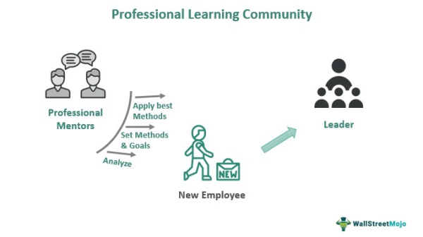

Patsystems Plc stands at the forefront of the trading solutions industry, renowned for its significant contributions to futures trading technology and financial software. Established in 1994, this innovative company is headquartered in London and extends its influence globally with offices in principal financial centers such as Chicago, New York, Singapore, Tokyo, Sydney, and Hong Kong. As a subsidiary of ION Trading, Patsystems has made a name for itself with its widely recognized trading platforms, J-Trader and Pro-Mark.

The company's offerings encompass more than just trading platforms; Patsystems provides comprehensive exchange connectivity that enables seamless interaction across various financial markets. Its suite of risk management solutions ensures that traders and institutions can operate within defined risk parameters, enhancing their ability to manage and mitigate potential financial exposures. Additionally, Patsystems equips its clients with a powerful API, facilitating efficient third-party integrations, thereby allowing users to customize and extend the functionalities to match specific trading needs.

This article aims to highlight the advanced technology suite provided by Patsystems, emphasizing its pivotal role in algorithmic trading and its ongoing contributions to financial software innovation. Through continuous improvement and dedication to client success, Patsystems remains a key player in delivering cutting-edge solutions that support the dynamic demands of the futures and derivatives trading landscape.

## Table of Contents

## Patsystems Trading Platforms

Patsystems Plc provides two main trading platforms designed to cater to a variety of trading requirements: J-Trader and Pro-Mark. J-Trader is recognized for its user-friendly interface, making it an ideal choice for traders engaged in futures trading. Its advanced functionalities include multi-exchange spreading, which allows traders to execute trades across different exchanges seamlessly, thereby optimizing trading opportunities. Moreover, J-Trader offers real-time profit and loss tracking, enabling traders to monitor and assess their financial positions instantaneously, thus facilitating more informed trading decisions.

Pro-Mark, on the other hand, is tailored for high-speed, high-[volume](/wiki/volume-trading-strategy) professional traders. This platform offers sophisticated features such as multi-leg auto spreading, which automates the simultaneous purchase and sale of different financial instruments, allowing traders to hedge positions or speculate on price movements efficiently. Pro-Mark also integrates with Excel, allowing traders to utilize spreadsheet capabilities for strategy development and real-time data analysis. This integration supports the creation of custom trading algorithms and options strategy development, enhancing the platform’s utility for professional traders. 

Both J-Trader and Pro-Mark platforms offer comprehensive data access and real-time updates, ensuring that traders receive the most current market information. They are also equipped with robust risk management protocols, providing mechanisms to manage and mitigate risk exposure effectively. This careful attention to data accuracy, real-time functionality, and risk management underscores Patsystems' commitment to offering reliable and efficient trading solutions to its users.

## Risk Management Innovations

Patsystems offers an array of risk management solutions that cater to both pre-trade and post-trade environments, a critical consideration for financial institutions striving to mitigate risk exposure and comply with regulatory standards. A key component of these offerings is the Patsystems Risk Informer, which provides real-time risk views across multiple asset classes, including but not limited to futures and options. This capability is essential for traders to make informed decisions based on current market conditions and their own risk exposure.

The Patsystems Risk Informer is designed to integrate seamlessly with trading activities, delivering precise and timely risk assessments that help traders manage their portfolios effectively. This tool enables institutions to monitor market movements and assess potential risks continuously, thereby enhancing decision-making accuracy and timeliness.

Central to Patsystems' risk management offerings is the System And Risk Administration (SARA) module. SARA empowers users with comprehensive oversight of pre-trade risk parameters, ensuring that trades adhere to predefined limits and other risk-related conditions. By enforcing these controls, SARA helps institutions manage their risk profiles proactively, thereby reducing the likelihood of breaches that could trigger significant financial penalties or losses.

Collectively, Patsystems’ risk management solutions address the complex challenges financial institutions face today, ensuring that both compliance and risk mitigation objectives are met efficiently. These systems provide a robust framework for maintaining the delicate balance between active trading and prudent risk management, fostering an environment where informed decision-making is supported by real-time data and rigorous oversight protocols.

## Algo Trading Capabilities

Patsystems' platforms are equipped to support [algorithmic trading](/wiki/algorithmic-trading), providing traders with advanced functionalities crucial for executing automated trading strategies. This includes the availability of synthetic order types, which allow traders to customize orders to balance execution needs across different trading conditions. The inclusion of the Financial Information eXchange (FIX) protocol further enhances the platforms' adaptability, facilitating efficient communication and connectivity with various financial institutions and exchanges.

Pro-Mark stands out as a versatile tool for those engaged in professional trading, owing to its Excel integration feature. This functionality empowers traders to create and execute custom algorithms directly from Excel, thus offering a familiar environment for developing trading strategies. The integration simplifies strategy development, allowing for real-time data analysis and strategy adjustments without the need for complex programming knowledge.

The architecture of Patsystems' platforms is optimized for high-frequency and low-latency trading, both of which are vital elements in the success of algorithmic trading. High-frequency trading ([HFT](/wiki/high-frequency-trading-strategies)) requires execution capabilities that can process a large number of orders in microseconds. Patsystems accommodates this demand by ensuring that its platforms are equipped to handle rapid transaction volumes with minimal delay.

The systems' low-latency design ensures that transaction times are minimized, reducing the risk of slippage and enhancing the precision of trade executions. Such optimization is crucial in markets where price movements occur in fractions of a second, requiring trading systems to react almost instantaneously to market signals.

In summary, Patsystems' platforms provide robust support for algorithmic trading through advanced order functionalities, seamless integration with Excel for custom algorithm development, and infrastructure optimized for high-speed trading environments. This combination of features ensures that traders can develop, test, and implement sophisticated trading strategies with efficiency and precision.

## Exchange Connectivity and Solutions

The Patsystems Matching Engine is an integral component facilitating connectivity for traders seeking access to global exchanges. Known for its reliable and rapid execution capabilities, the Patsystems Matching Engine ensures that trades are processed efficiently, which is crucial for high-frequency trading environments. With a broad infrastructure supporting numerous derivatives markets across Asia and Europe, Patsystems enables seamless interactions between traders and various exchanges, ensuring comprehensive exchange solutions.

One of the distinguishing features of Patsystems' solutions is their ability to execute member clearing and real-time order matching. This capability provides traders with the confidence that they can access and respond to market movements as they happen, thus enhancing trading efficacy and strategy execution. The system's design incorporates scalability and robustness, essential for handling large volumes of trades and diverse instrument types, ensuring that it can meet the varied needs of trading institutions.

Patsystems Exchange Solutions offer a complete, end-to-end technology package tailored for exchanges looking to modernize or expand their trading capabilities. These solutions encompass everything from order routing and trading engine capabilities to risk management and compliance features. The modular architecture of these solutions allows for easy integration into existing systems, offering a flexible approach to adopting new technologies without disrupting ongoing operations.

The integration of the Patsystems Matching Engine with a variety of financial instruments highlights its versatility. By facilitating connection with multiple asset classes, including futures and options, Patsystems provides a unified platform that supports complex, multi-leg trading strategies. This capability is especially beneficial for institutions engaging in algorithmic trading, which relies on the ability to execute trades with minimal latency.

In conclusion, Patsystems Exchange Connectivity and Solutions serve as a crucial infrastructure for traders requiring instantaneous access to global derivatives markets. By providing a scalable and robust exchange technology package, Patsystems not only supports current trading needs but also prepares financial institutions to adapt to future market demands.

## Conclusion

Patsystems continues to be a transformative force in futures trading technology by equipping financial institutions with advanced tools for efficient trading and robust risk management. Known for its pioneering trading platforms, Patsystems exemplifies innovation through the introduction and support of algorithmic trading capabilities. These advancements empower traders to execute sophisticated strategies, thus enhancing their operational effectiveness and market responsiveness.

Moreover, Patsystems' commitment to exchange solutions underscores its focus on ensuring seamless connectivity and execution across global trading venues. This support for diverse derivatives markets facilitates a comprehensive trading experience for institutions, reinforcing the company's role as a leader in trade technology solutions.

Continuous updates and system improvements are integral to Patsystems' strategy, ensuring that their platforms remain competitive and aligned with evolving industry standards and client expectations. By maintaining a steadfast commitment to innovation and excellence, Patsystems sustains its position at the forefront of trading technology, enabling its clients to achieve consistent success in complex financial environments.

## References & Further Reading

[1]: Bergstra, J., Bardenet, R., Bengio, Y., & Kégl, B. (2011). ["Algorithms for Hyper-Parameter Optimization."](https://dl.acm.org/doi/10.5555/2986459.2986743) Advances in Neural Information Processing Systems 24.

[2]: ["Advances in Financial Machine Learning"](https://www.amazon.com/Advances-Financial-Machine-Learning-Marcos/dp/1119482089) by Marcos Lopez de Prado

[3]: ["Evidence-Based Technical Analysis: Applying the Scientific Method and Statistical Inference to Trading Signals"](https://www.amazon.com/Evidence-Based-Technical-Analysis-Scientific-Statistical/dp/0470008741) by David Aronson

[4]: ["Machine Learning for Algorithmic Trading"](https://github.com/stefan-jansen/machine-learning-for-trading) by Stefan Jansen

[5]: ["Quantitative Trading: How to Build Your Own Algorithmic Trading Business"](https://www.amazon.com/Quantitative-Trading-Build-Algorithmic-Business/dp/1119800064) by Ernest P. Chan