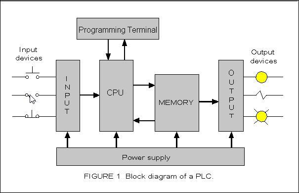

## Table of Contents

## What is Patsystems PLC?

Patsystems PLC is a company that used to make software for trading. The software helped people buy and sell things like stocks and futures on electronic markets. The company started in 1994 and was based in London, England. It grew over the years and became well-known in the trading world.

In 2012, Patsystems PLC was bought by another company called ION Trading. After the buyout, Patsystems stopped being its own company and became part of ION Trading. This meant that the Patsystems brand and its software continued to be used, but it was now under the control of ION Trading.

## When was Patsystems PLC founded?

Patsystems PLC was founded in 1994. It was a company that made software to help people trade things like stocks and futures on electronic markets. The company was based in London, England.

Over the years, Patsystems grew and became well-known in the trading world. In 2012, another company called ION Trading bought Patsystems. After the buyout, Patsystems stopped being its own company and became part of ION Trading. The Patsystems brand and its software continued to be used, but it was now under the control of ION Trading.

## What are the main products and services offered by Patsystems PLC?

Patsystems PLC made software that helped people trade things like stocks and futures on electronic markets. Their main product was called the Patsystems trading platform. This platform let traders connect to different markets around the world. It was easy to use and had tools that helped traders make quick decisions. The software was popular because it worked well and was reliable.

Besides the trading platform, Patsystems also offered services to help traders. They provided support and training so that people could learn how to use their software better. They also made sure the software was always up to date with the latest technology. This helped traders stay ahead in the fast-moving world of electronic trading.

## Who are the primary customers of Patsystems PLC?

The main customers of Patsystems PLC were traders and trading firms. These were people and companies that bought and sold things like stocks and futures on electronic markets. They used Patsystems' software to help them trade quickly and easily. The software was popular among professional traders who needed reliable tools to do their jobs well.

Patsystems also served financial institutions like banks and brokerages. These big companies used Patsystems' trading platform to connect to different markets around the world. The software helped them manage their trading activities and make sure they could trade efficiently. Patsystems' customers valued the software because it was easy to use and always up to date with the latest technology.

## How does Patsystems PLC's technology work?

Patsystems PLC's technology is all about helping people trade things like stocks and futures on electronic markets. Their main product is a trading platform that lets traders connect to different markets around the world. When a trader uses the platform, they can see prices and make trades quickly. The software is designed to be easy to use, so traders can focus on making good decisions without getting confused by complicated tools.

The technology works by sending and receiving information very fast. When a trader wants to buy or sell something, the platform sends that order to the market right away. It also gets back information about prices and trades in real time. This helps traders stay up to date with what's happening in the market. Patsystems made sure their software was always reliable and up to date with the latest technology, so traders could trust it to work well every time they used it.

## What is the market position of Patsystems PLC in the financial technology sector?

Patsystems PLC held a strong position in the financial technology sector before it was bought by ION Trading in 2012. The company was well-known for its trading platform, which was used by traders and financial institutions around the world. Patsystems' software was popular because it was easy to use, reliable, and always up to date with the latest technology. This made it a go-to choice for people who needed a dependable tool for trading on electronic markets.

After the acquisition by ION Trading, Patsystems' technology continued to be used, but under the ION Trading brand. This meant that Patsystems no longer existed as a separate company, but its market position was still important. The technology it developed continued to serve a large customer base, including professional traders and big financial institutions. Even though Patsystems PLC is no longer a standalone entity, its contributions to the financial technology sector are still felt through the ongoing use of its software.

## What are the recent financial performance highlights of Patsystems PLC?

Patsystems PLC was bought by ION Trading in 2012, so it doesn't have recent financial performance as a separate company anymore. Before the buyout, Patsystems was doing well. It was making money and growing. The company was known for its trading software, which was used by many traders and financial institutions around the world. This helped Patsystems have a strong position in the financial technology sector.

After the acquisition, Patsystems' financial performance became part of ION Trading's overall results. ION Trading is a big company that owns many different businesses, so it's hard to know exactly how well Patsystems' technology is doing on its own. But since ION Trading kept using Patsystems' software, it shows that the technology was still valuable and important to their business.

## Who are the key competitors of Patsystems PLC?

Before Patsystems PLC was bought by ION Trading in 2012, it had several key competitors in the financial technology sector. One of the main competitors was Trading Technologies International, Inc. (TT), which also provided trading software for electronic markets. TT was known for its user-friendly interface and advanced trading tools, making it a strong rival to Patsystems. Another competitor was CQG, which offered a comprehensive trading platform that was popular among professional traders and financial institutions. CQG's software was valued for its reliability and the wide range of markets it covered.

In addition to TT and CQG, Patsystems also faced competition from companies like Bloomberg LP and Reuters (now part of Refinitiv). Bloomberg LP was a big player in the financial industry, offering not just trading software but also news and data services. This made Bloomberg a one-stop shop for many traders. Reuters, on the other hand, was known for its strong data feeds and trading tools, which were used by many financial institutions. These competitors all offered similar services to Patsystems, trying to attract the same customers with their own unique features and strengths.

## What are the major challenges faced by Patsystems PLC in the industry?

Patsystems PLC faced a lot of challenges in the financial technology industry. One big challenge was keeping up with fast-changing technology. The world of electronic trading was always getting new tools and better ways to trade. Patsystems had to keep updating their software to stay ahead. If they didn't, traders might choose to use software from other companies that had the latest features.

Another challenge was competition. There were many other companies making trading software, like Trading Technologies and CQG. These companies were always trying to make their software better and more appealing to traders. Patsystems had to work hard to make sure their software was the best choice for traders. They needed to offer good customer service and keep their prices fair to stay competitive.

## How has Patsystems PLC adapted to regulatory changes in the financial markets?

Patsystems PLC had to deal with a lot of rules and regulations in the financial markets. These rules were made to keep trading fair and safe for everyone. Patsystems worked hard to make sure their software followed all these rules. They updated their software to meet new regulations and made sure traders could use it without breaking any laws. This was important because if they didn't follow the rules, they could get in trouble and lose customers.

To adapt to these changes, Patsystems also talked a lot with regulators and other people in the industry. They wanted to understand the new rules well so they could change their software the right way. By doing this, Patsystems showed that they cared about doing things the right way and keeping their customers happy. Even after ION Trading bought Patsystems, the focus on following regulations continued, making sure the software stayed useful and legal for traders.

## What are the future growth strategies of Patsystems PLC?

Patsystems PLC was bought by ION Trading in 2012, so it doesn't have its own future growth strategies anymore. Before the buyout, Patsystems was focused on growing by making their trading software even better. They wanted to add new features that would help traders make quick decisions and trade more easily. They also planned to reach more customers around the world by connecting to more markets and offering their software in different languages.

After the acquisition, Patsystems' technology became part of ION Trading's bigger plan. ION Trading is a big company that owns many different businesses, so their growth strategies are much larger. They focus on using technology to make trading easier and more efficient for everyone. This means they keep updating and improving the software that came from Patsystems, along with other tools they own. By doing this, ION Trading hopes to keep growing and helping more traders around the world.

## What technological innovations is Patsystems PLC currently developing?

Patsystems PLC was bought by ION Trading in 2012, so it's not working on new things on its own anymore. Before the buyout, Patsystems was always trying to make their trading software better. They wanted to add new tools that would help traders make quick decisions and trade more easily. They were also looking at ways to connect to more markets around the world and make their software work in different languages.

After the acquisition, the focus on improving the software continued, but it's now part of ION Trading's bigger plan. ION Trading is a big company that owns many different businesses, so they work on a lot of different technologies. They keep updating and improving the software that came from Patsystems, along with other tools they own. This helps them make trading easier and more efficient for everyone who uses their products.

## References & Further Reading

[1]: Bergstra, J., Bardenet, R., Bengio, Y., & Kégl, B. (2011). ["Algorithms for Hyper-Parameter Optimization."](https://dl.acm.org/doi/10.5555/2986459.2986743) Advances in Neural Information Processing Systems 24.

[2]: ["Advances in Financial Machine Learning"](https://www.amazon.com/Advances-Financial-Machine-Learning-Marcos/dp/1119482089) by Marcos Lopez de Prado

[3]: ["Evidence-Based Technical Analysis: Applying the Scientific Method and Statistical Inference to Trading Signals"](https://www.amazon.com/Evidence-Based-Technical-Analysis-Scientific-Statistical/dp/0470008741) by David Aronson

[4]: ["Machine Learning for Algorithmic Trading"](https://github.com/stefan-jansen/machine-learning-for-trading) by Stefan Jansen

[5]: ["Quantitative Trading: How to Build Your Own Algorithmic Trading Business"](https://www.amazon.com/Quantitative-Trading-Build-Algorithmic-Business/dp/1119800064) by Ernest P. Chan