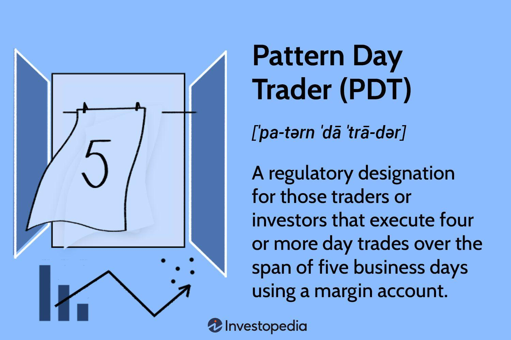

## Table of Contents

## What is a Pattern Day Trader?

A Pattern Day Trader is someone who buys and sells stocks a lot in a short time. The U.S. government says you are a Pattern Day Trader if you do this four or more times in five business days. This rule is from the Financial Industry Regulatory Authority, or FINRA.

If you are a Pattern Day Trader, you need to have at least $25,000 in your trading account. This money must stay in your account all the time. If your account goes below $25,000, you won't be able to trade until you put more money in. This rule helps make sure traders can handle the risks of trading a lot.

## What is the Pattern Day Trader Rule?

The Pattern Day Trader Rule is a regulation set by the Financial Industry Regulatory Authority (FINRA) in the United States. It says that if you buy and sell stocks a lot in a short time, you might be called a Pattern Day Trader. Specifically, if you do this four or more times in any five business days, you fall under this rule. The rule is there to make sure that people who trade a lot can handle the risks that come with it.

If you are labeled as a Pattern Day Trader, you need to have at least $25,000 in your trading account at all times. This money is called the minimum equity requirement. If your account balance drops below $25,000, you won't be able to trade until you add more money to bring it back up. This rule helps protect traders from losing too much money too quickly by making sure they have enough money to cover their trades.

## Why was the Pattern Day Trader Rule established?

The Pattern Day Trader Rule was established to protect people who trade stocks a lot from losing too much money too quickly. The rule was made by the Financial Industry Regulatory Authority (FINRA) in the United States. They noticed that some people were trading stocks many times in a short period, which can be risky. By setting up this rule, FINRA wanted to make sure that these frequent traders have enough money in their accounts to cover their trades and handle the risks that come with trading often.

The rule requires that if you are a Pattern Day Trader, you must have at least $25,000 in your trading account all the time. This money is called the minimum equity requirement. If your account balance goes below $25,000, you won't be able to trade until you add more money to bring it back up. This helps to make sure that traders can afford to keep trading even if they lose money on some trades. The rule aims to keep the stock market stable and protect traders from big losses.

## Who does the Pattern Day Trader Rule apply to?

The Pattern Day Trader Rule applies to people who trade stocks a lot in a short time. If you buy and sell stocks four or more times in any five business days, you might be called a Pattern Day Trader. This rule is from the Financial Industry Regulatory Authority (FINRA) in the United States. It's meant for people who trade often, not for people who just buy and hold stocks for a long time.

If you are a Pattern Day Trader, you need to have at least $25,000 in your trading account all the time. This money is called the minimum equity requirement. If your account goes below $25,000, you won't be able to trade until you add more money. This rule is to make sure that people who trade a lot can handle the risks and don't lose too much money too quickly.

## What are the requirements to be considered a Pattern Day Trader?

To be considered a Pattern Day Trader, you need to trade stocks a lot in a short time. The rule says you are a Pattern Day Trader if you buy and sell stocks four or more times in any five business days. This rule comes from the Financial Industry Regulatory Authority, or FINRA, in the United States. It's meant for people who trade often, not for those who just buy and hold stocks for a long time.

If you are labeled as a Pattern Day Trader, you must have at least $25,000 in your trading account all the time. This money is called the minimum equity requirement. If your account balance drops below $25,000, you won't be able to trade until you add more money to bring it back up. This rule helps make sure that people who trade a lot can handle the risks and don't lose too much money too quickly.

## How does the Pattern Day Trader Rule affect trading accounts?

The Pattern Day Trader Rule changes how you can use your trading account if you trade a lot. If you buy and sell stocks four or more times in any five business days, you become a Pattern Day Trader. This rule is from FINRA, which is a group that helps keep the stock market safe. When you are a Pattern Day Trader, you need to have at least $25,000 in your account all the time. This money is called the minimum equity requirement. If your account has less than $25,000, you can't trade until you put more money in.

This rule can make a big difference in how you trade. It's there to make sure you don't lose too much money too fast. If you're a Pattern Day Trader and your account goes below $25,000, you have to stop trading until you add more money. This can be hard if you're used to trading a lot. But it's a rule that helps keep the stock market stable and protects traders from big losses.

## What is the minimum equity requirement for Pattern Day Traders?

The minimum equity requirement for Pattern Day Traders is $25,000. This means if you are a Pattern Day Trader, you need to have at least this amount of money in your trading account all the time. This rule is set by FINRA, which is a group that helps make sure the stock market is safe and fair.

If your account balance drops below $25,000, you won't be able to trade until you add more money to bring it back up. This rule is there to make sure that people who trade a lot can handle the risks and don't lose too much money too quickly. It helps keep the stock market stable and protects traders from big losses.

## What happens if a Pattern Day Trader falls below the minimum equity requirement?

If a Pattern Day Trader's account falls below the $25,000 minimum equity requirement, they won't be able to trade until they add more money to their account. This rule is set by FINRA to make sure that people who trade a lot can handle the risks and don't lose too much money too quickly.

When a Pattern Day Trader's account goes below $25,000, they are put on a restriction. They can't make any new trades until they put enough money back into their account to meet the $25,000 requirement. This helps keep the stock market stable and protects traders from big losses.

## How can one avoid being classified as a Pattern Day Trader?

To avoid being classified as a Pattern Day Trader, you need to limit how often you trade. The rule says you are a Pattern Day Trader if you buy and sell stocks four or more times in any five business days. So, if you want to stay under the radar, try to keep your trades to three or fewer in any five-day period. This means you might have to plan your trades more carefully and not trade every day if you're close to hitting the limit.

Another way to avoid this classification is to keep your trading account balance below $25,000. If your account never goes above this amount, you won't be subject to the Pattern Day Trader Rule even if you trade a lot. But be careful, because trading with less money can be riskier. If you do decide to keep your account balance low, make sure you're comfortable with the risks and have a good trading plan.

If you find yourself close to being classified as a Pattern Day Trader, you might want to switch to trading different types of securities that aren't covered by the rule. For example, trading options or futures might not count towards the Pattern Day Trader status. Just make sure you understand the rules and risks of these other types of investments before you start trading them.

## What are the benefits and drawbacks of being a Pattern Day Trader?

Being a Pattern Day Trader can have some good things about it. One big benefit is that you can trade a lot. If you like to buy and sell stocks many times in a day, being a Pattern Day Trader lets you do that. You can try to make money from small changes in stock prices. Also, having at least $25,000 in your account can give you more chances to trade. With more money, you can buy more stocks or make bigger trades. This might help you make more money if you know what you're doing.

But there are also some hard parts about being a Pattern Day Trader. The biggest problem is the $25,000 rule. If your account goes below this amount, you can't trade until you put more money in. This can be stressful if you're losing money and need to keep trading to try to get it back. Also, trading a lot can be risky. The stock market can go up and down a lot in a short time, and you might lose money quickly. You need to be good at understanding the market and making quick decisions. If you're not ready for these risks, being a Pattern Day Trader might not be good for you.

## How does the Pattern Day Trader Rule vary internationally?

The Pattern Day Trader Rule is a rule from the United States, made by FINRA. It says that if you trade stocks a lot in a short time, you need to have at least $25,000 in your account. This rule is not the same in other countries. Some countries have their own rules about trading, but they might not have a rule like the Pattern Day Trader Rule. For example, in Canada, there's no such rule, so you can trade as much as you want without needing a certain amount of money in your account.

In Europe, the rules can be different from one country to another. Some countries might have rules to protect traders, but they might not be about how much money you need to have in your account. Instead, they might focus on other things like how much risk you can take or how much you can lose in a day. So, if you're thinking about trading in different countries, it's important to learn about the rules there. They can be very different from the rules in the United States.

## What are some strategies to manage a trading account under the Pattern Day Trader Rule?

To manage a trading account under the Pattern Day Trader Rule, you need to keep at least $25,000 in your account all the time. If your account balance drops below this amount, you won't be able to trade until you add more money. So, one good strategy is to be careful with how much you're risking on each trade. Don't put all your money into one trade because if you lose, you might not have enough left to keep trading. Instead, spread out your money across different trades. This can help you keep your account balance above $25,000 even if you lose on some trades.

Another strategy is to keep track of how many times you're trading. The rule says you're a Pattern Day Trader if you buy and sell stocks four or more times in any five business days. So, if you want to stay under the rule, try to limit your trades to three or fewer in any five-day period. This might mean you have to plan your trades more carefully and not trade every day if you're close to hitting the limit. By managing how often you trade, you can avoid being classified as a Pattern Day Trader and the $25,000 rule won't apply to you.

## References & Further Reading

[1]: FINRA. ["Day Trading Margin Requirements: Know the Rules"](https://www.finra.org/investors/investing/investment-products/stocks/day-trading)

[2]: Securities and Exchange Commission (SEC). ["Investor Bulletin: Margin Rules for Day Trading"](https://www.investor.gov/introduction-investing/general-resources/news-alerts/alerts-bulletins/investor-bulletins/margin)

[3]: Elder, A. (2014). ["The New Trading for a Living: Psychology, Discipline, Trading Tools and Systems, Risk Control, Trade Management"](https://www.amazon.com/New-Trading-Living-Psychology-Discipline/dp/1118443926) Wiley Trading

[4]: Battalio, R., & Schultz, P. (2006). ["Regulatory Effects on the Trading Environment: The Uptick Rule"](https://onlinelibrary.wiley.com/doi/full/10.1111/j.1540-6261.2006.01051.x) Journal of Finance

[5]: Hasbrouck, J., & Saar, G. (2009). ["Technology and Liquidity Provision: The Blurring of Traditional Definitions"](https://www.sciencedirect.com/science/article/pii/S1386418108000220) Journal of Financial and Quantitative Analysis