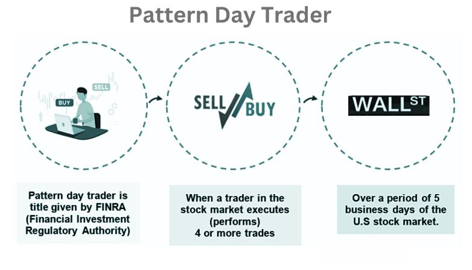

The world of stock trading is governed by numerous rules and regulations aimed at managing risk and ensuring fair practices. Among these regulations, the Pattern Day Trader (PDT) rule stands out as a critical designation impacting day traders who use margin accounts. This rule, implemented by the Financial Industry Regulatory Authority (FINRA), requires traders classified as pattern day traders to adhere to specific guidelines, including maintaining a minimum account balance. By understanding the requirements and limitations associated with the PDT rule, traders can better navigate the complexities of day trading and ensure compliance with industry standards. This article will explain what constitutes a pattern day trader, the relevant regulations, and how these intersect with the increasingly popular practice of algorithmic trading. Mastery of these concepts is essential for traders aiming to succeed in the fast-paced and dynamic landscape of the stock market.

## Table of Contents



## Understanding the Pattern Day Trader (PDT) Rule

A pattern day trader (PDT) is identified as an individual who executes four or more day trades within five business days. This classification is significant in distinguishing active traders who frequently buy and sell securities within a single trading day. The PDT rule mandates that a person engaging in such activity must maintain a minimum balance of $25,000 in their margin account at all times. This requirement ensures that traders have a sufficient cushion to cover potential losses and reduces the risk associated with rapid buying and selling of stocks.

The rule was established by the Financial Industry Regulatory Authority (FINRA) to address the heightened risks linked to day trading. The necessity for a minimum equity balance is designed to ensure that traders can absorb possible financial losses without threatening their capital base. This regulation also aims to foster greater accountability among traders, ensuring they are financially prepared to handle the unpredictability and volatility often present in the stock markets.

Understanding the PDT rule is crucial for traders, as non-compliance can lead to restrictions on their trading activities. For instance, if an account is identified as a pattern day trading account and falls below the $25,000 minimum balance, the account may be frozen until adequate funds are deposited, thus preventing further day trades. This stipulation underscores the importance for traders to diligently monitor their account balances and adjust their trading strategies accordingly.

Moreover, traders should be aware that the $25,000 minimum requirement applies only to margin accounts. A margin account allows traders to borrow funds from their brokerage to purchase securities, amplifying both potential gains and losses. The leverage provided by margin accounts explains the enhanced risk profile, which the PDT rule seeks to mitigate. As such, only those prepared to meet the regulatory demands and inherent risks should consider engaging in pattern day trading.

## Regulations Governing Pattern Day Traders

The Financial Industry Regulatory Authority (FINRA) regulates pattern day traders to promote fair and stable trading environments. A pattern day trader is identified when an investor initiates four or more day trades within five business days in the same account, provided that the number of day trades represents over six percent of their total trades in that period. Once a brokerage account meets these criteria and is flagged as a pattern day trader account, it is subject to specific restrictions, primarily concerning the account's equity requirements.

A notable regulation is that pattern day traders must maintain a minimum equity of $25,000 in their margin accounts on any day that new day trades are made. This equity can be a combination of cash and eligible securities. This threshold aims to ensure that traders have enough capital to cover potential losses resulting from their aggressive trading strategies.

If an account falls below this minimum equity requirement, the trader will face immediate trading restrictions until the account is replenished to meet the regulatory standards. This limitation includes prohibiting the user from engaging in further [day trading](/wiki/day-trading-spy) activities until the shortfall is resolved, emphasizing the necessity of swift account funding in such scenarios.

The governing rules for pattern day traders illustrate the significant emphasis placed on maintaining adequate equity to support continued trading activities. These regulations are designed to mitigate the risks tied with frequent trading and prevent excessive speculation, which can be detrimental to both individual traders and the overall market stability. The enforcement of these rules by FINRA underlines the need for trader diligence and financial preparedness to comply with these standardized requirements.

## Day Trading and Margin Accounts

Day trading refers to the strategy of buying and selling the same security within a single trading day, capitalizing on small price movements. This approach demands quick decision-making and an understanding of market trends, often leading to significant financial rewards or losses. The use of margin accounts is common among day traders to enhance their buying power. Margin accounts enable traders to borrow funds from their broker, allowing them to control larger positions with a relatively small amount of actual capital. 

The leverage provided by margin accounts can amplify gains, but it equally magnifies losses, introducing a heightened level of risk. Regulatory bodies, therefore, impose strict rules on their use, particularly for pattern day traders. The Pattern Day Trader (PDT) rule, enforced by the Financial Industry Regulatory Authority (FINRA), mandates that traders identified as pattern day traders maintain a minimum equity balance of $25,000 in their margin accounts. Falling below this threshold results in immediate trading restrictions, preventing further day trades until the account meets the minimum requirement.

The application of the PDT rule on margin accounts emphasizes the need for traders to manage their capital wisely. To effectively navigate these regulations, traders must strategically allocate their resources to ensure they maintain the necessary account balance. This not only protects traders from the potential repercussions of regulatory non-compliance but also reinforces disciplined trading practices.

Understanding the interplay between day trading, margin accounts, and PDT rules is critical for traders looking to maximize their financial strategies while adhering to regulatory standards. Maintaining a comprehensive knowledge of these elements empowers traders to leverage the benefits of margin accounts safely and effectively, thereby optimizing their trading endeavors in the stock market.

## Algorithmic Trading: Implications of PDT Rule

Algorithmic trading, often termed algo trading, refers to the use of automated software to execute trades based on predefined criteria. This technology-driven method enables trades to be carried out with speed and precision, leveraging mathematical models and algorithms to determine the timing, pricing, and quantity of trades. As efficient as it is, [algorithmic trading](/wiki/algorithmic-trading) is not exempt from regulatory frameworks, including the Pattern Day Trader (PDT) rule.

The PDT rule, enforced by the Financial Industry Regulatory Authority (FINRA), affects traders who execute four or more day trades within five business days, classifying them as pattern day traders. This designation requires maintaining a minimum balance of $25,000 in a margin account. When algorithmic trading strategies involve such frequent trading, compliance with PDT regulations becomes imperative.

While algorithmic trading offers enhanced efficiency, traders must ensure their systems align with PDT requirements. This involves programming the algorithms to account for the number of trades executed within the specified timeframe. For instance, suppose a trading algorithm executes trades every time a particular stock's moving average crossover indicates a favorable condition. In that case, it should also be coded to monitor the number of trades processed daily to avoid breaching PDT limits inadvertently.

Python, a popular language for algorithmic trading due to its robust libraries and easy syntax, can be instrumental in such regulatory adherence. Using a library like `pandas`, traders might track and count trades to ensure compliance:

```python
import pandas as pd

# Simulated trades data
trades_data = {'date': ['2023-10-01', '2023-10-02', '2023-10-02', '2023-10-03', '2023-10-04'],
               'trade_type': ['buy', 'sell', 'buy', 'buy', 'sell']}

# Create DataFrame
df_trades = pd.DataFrame(trades_data)

# Function to count day trades within a 5-day window
def count_day_trades(df):
    day_trades = (df['trade_type'] == 'sell')
    return day_trades.sum() >= 4

# Check if the trades count as a pattern day trade
pdt_violation = count_day_trades(df_trades)
print("Pattern Day Trader Violation:", pdt_violation)
```

In this example, the script determines the number of day trades executed and checks for potential PDT violations. As algorithmic trading continues to evolve, integrating compliance checks within trading algorithms will remain a critical aspect of risk management. Ensuring adherence to PDT regulations not only avoids legal complications but also enhances the robustness of trading strategies in dynamic markets.

## Strategies to Navigate PDT Restrictions

To effectively navigate Pattern Day Trader (PDT) restrictions, traders can employ a variety of strategies aimed at maintaining compliance while optimizing trading opportunities.

One primary approach is to maintain an account balance above the minimum threshold of $25,000 required for day trading in a margin account. By ensuring this balance, traders can avoid the restrictions imposed on accounts that fall below this level. Practically, this involves rigorous financial planning and regularly monitoring account balances to account for any market fluctuations that might impact equity.

Another viable strategy is utilizing cash accounts for intraday trades. Unlike margin accounts, cash accounts are not subject to the same PDT constraints, allowing traders to execute trades without adhering to the minimum balance requirement. However, it is important to remember that the settled cash in these accounts limits the frequency of trades, as funds need time to settle post-transaction before they can be reused.

Engaging with brokerage firms that offer more flexible interpretations of PDT rules can provide additional leverage. Some firms may offer 'overnight leverage,' mitigating some aspects of the PDT rule by allowing certain privileges that can ease day trading constraints without exceeding the regulatory boundaries.

Advanced planning and strategically managing trades are crucial for traders to remain compliant. Consideration of factors such as trade frequency, leveraging settled funds, and aligning trades with personal financial situations can aid traders in maximizing their strategies. Employing a well-thought-out plan not only helps in adhering to PDT restrictions but also enhances overall trading efficiency.

For those incorporating algorithmic strategies, ensuring their algorithms are designed to work within the regulatory framework is essential. Algorithms should be programmed to monitor account balances and adjust trade activity accordingly, avoiding any risk of a PDT designation.

In conclusion, understanding and implementing these strategies can assist traders in successfully navigating PDT restrictions, enhancing their trading activities while ensuring compliance with regulatory requirements.

## Conclusion

Navigating the complexities of the Pattern Day Trader (PDT) rule is crucial for active traders aiming to optimize their strategies in the stock market. The PDT rule imposes specific constraints on frequent traders, requiring them to maintain a minimum balance of $25,000 in their margin accounts. By adhering to these regulations, traders can minimize the risks commonly associated with day trading. This includes the potential pitfalls of overleveraging and the psychological toll of rapid decision-making under financial pressure.

Moreover, as algorithmic trading continues to gain prominence, the applicability of PDT regulations to automated systems has become increasingly relevant. Algorithmic trading systems, designed to execute trades based on predefined conditions, must be configured to ensure compliance with PDT requirements. This compliance involves monitoring trade frequencies, account balances, and adjusting algorithm parameters when necessary.

Successfully integrating an understanding of PDT rules into trading strategies can provide a substantial advantage in maintaining a competitive edge. Traders can achieve this by employing strategic account management and leveraging tools that enable them to adhere to regulatory stipulations while optimizing trade executions. Additionally, staying informed about regulatory changes and advancements in trading technologies can further enhance a trader’s capability to maneuver in evolving financial markets.

Ultimately, the confluence of regulatory knowledge, strategic account management, and technological adaptation is key to thriving as an active trader within the modern-day financial ecosystem.

## References & Further Reading

[1]: FINRA. ["Day Trading Margin Requirements: Know the Rules"](https://www.finra.org/investors/investing/investment-products/stocks/day-trading)

[2]: Securities and Exchange Commission (SEC). ["Investor Bulletin: Margin Rules for Day Trading"](https://www.investor.gov/introduction-investing/general-resources/news-alerts/alerts-bulletins/investor-bulletins/margin)

[3]: Elder, A. (2014). ["The New Trading for a Living: Psychology, Discipline, Trading Tools and Systems, Risk Control, Trade Management"](https://www.amazon.com/New-Trading-Living-Psychology-Discipline/dp/1118443926) Wiley Trading

[4]: Battalio, R., & Schultz, P. (2006). ["Regulatory Effects on the Trading Environment: The Uptick Rule"](https://onlinelibrary.wiley.com/doi/full/10.1111/j.1540-6261.2006.01051.x) Journal of Finance

[5]: Hasbrouck, J., & Saar, G. (2009). ["Technology and Liquidity Provision: The Blurring of Traditional Definitions"](https://www.sciencedirect.com/science/article/pii/S1386418108000220) Journal of Financial and Quantitative Analysis