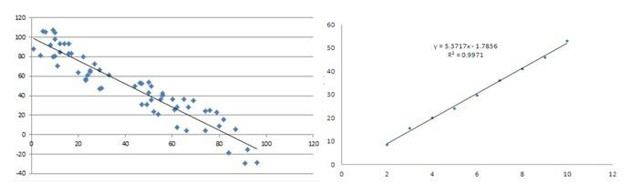

Algorithmic trading, often abbreviated as algo trading, is an advanced trading strategy that employs computer algorithms to execute trades based on predefined criteria. It significantly relies on patterns and trends observed in the financial markets. Patterns in trading are distinct formations generated by price movements on charts, providing traders with a visual representation of market activity over time. Recognizing and interpreting these patterns are integral to technical analysis—a vital element of algo trading.

Technical analysis involves examining past market data, primarily price and volume, to predict future market behavior. Patterns serve as critical components in this analysis by signaling potential trends, such as continuations, reversals, or indecisive movements. These formations allow traders to anticipate market behavior, often leading to more informed and timely trading decisions. 



This article aims to explore the various patterns and trends central to algorithmic trading. The importance of understanding these patterns lies in their predictive capabilities, helping traders automate decision-making processes effectively. With various types of patterns that algo traders must be familiar with, grasping these concepts enhances the accuracy and success rate of their trading strategies.

## Table of Contents

## What are Trading Patterns?

Trading patterns are essential formations that arise from the price movements of securities. These formations are particularly valuable in technical analysis, serving as a tool for traders to anticipate future price behaviors. By connecting common price points, such as highs and lows, traders can distinguish various patterns that emerge over time.

The identification of these patterns is a process of observing historical price data and charting behaviors to predict potential future movements. For instance, connecting consecutive peaks (highs) and troughs (lows) on a price chart can reveal distinct shapes or patterns. These patterns are frequently categorized into different types depending on the market conditions and the anticipated movements they suggest.

Understanding how these patterns function is fundamental in technical analysis, a methodology utilized to forecast the direction of prices through the examination of historical market data. The effectiveness of trading patterns lies in their ability to enable traders to make informed decisions based on the likely direction of price trends. The reliability of these patterns can vary based on market conditions and external factors influencing the securities in question, but they remain a cornerstone of technical analysis in trading.

## Importance of Patterns in Algorithmic Trading

Patterns play a crucial role in [algorithmic trading](/wiki/algorithmic-trading) by enabling traders to make informed decisions about potential future price movements. The ability to recognize and interpret these patterns allows algorithmic systems to automate decision-making processes, enhancing trading efficiency and accuracy. Through pattern recognition, these systems can anticipate trends or reversals, providing a predictive edge that is vital in the fast-paced trading environment.

Algorithmic trading systems often utilize pattern recognition as a fundamental component to execute trades automatically. By identifying specific formations in price data, such as continuation or reversal patterns, these systems can determine optimal entry and [exit](/wiki/exit-strategy) points without the need for manual intervention. This automation not only increases trading precision but also allows traders to capitalize on market opportunities that might be missed through manual analysis.

Patterns possess predictive value by signaling potential market trends or reversals. For example, a head and shoulders pattern, widely regarded as a reversal indicator, suggests that the current trend is likely to change direction. Similarly, continuation patterns such as flags or triangles indicate the persistence of an ongoing trend. Incorporating these insights into algorithmic strategies allows traders to exploit market inefficiencies and achieve superior trading outcomes.

The recognition of trading patterns can be implemented programmatically using algorithms capable of processing large volumes of historical data. For instance, a Python-based algorithm might be used to detect complex chart patterns using libraries such as NumPy for numerical analysis and Matplotlib for data visualization. Here's a simple illustration of how pattern recognition might be coded:

```python
import numpy as np
import matplotlib.pyplot as plt

# Simulated price data
prices = np.random.normal(100, 10, 100)  # Example data

# Simple moving average to identify trends
moving_avg_short = np.convolve(prices, np.ones(5)/5, mode='valid')
moving_avg_long = np.convolve(prices, np.ones(20)/20, mode='valid')

# Plotting
plt.plot(prices, label='Price')
plt.plot(np.arange(4, 104), moving_avg_short, label='5-Period MA')
plt.plot(np.arange(19, 99), moving_avg_long, label='20-Period MA')
plt.legend()
plt.title('Price and Moving Averages')
plt.show()
```

In this example, simple moving averages are used to identify short and long-term trends within price data, which can be further analyzed to detect specific patterns. 

Overall, understanding and utilizing patterns in algorithmic trading enables traders to develop sophisticated strategies that anticipate market movements. However, traders must remain cautious, as patterns are not infallible and should be used in conjunction with other analytical tools and indicators.

## Popular Types of Trading Patterns

Trading patterns are generally categorized into three main types: continuation, reversal, and bilateral patterns. Each type serves a distinct purpose in analyzing price movements and making trading decisions. Understanding these patterns is essential for algorithmic trading, as they provide insights into potential future price actions.

Continuation patterns are indicators that the current trend is likely to continue once the pattern is completed. Common examples of continuation patterns include triangles and flags.

1. **Triangles**: Triangles are chart patterns characterized by converging trendlines, which indicate a consolidation period before the price breaks out in the direction of the ongoing trend. There are three types of triangles:
   - **Ascending Triangle**: Formed by a flat upper trendline and a rising lower trendline, suggesting a bullish continuation.
   - **Descending Triangle**: Characterized by a flat lower trendline and a declining upper trendline, indicating a bearish continuation.
   - **Symmetrical Triangle**: Formed by converging upper and lower trendlines, without a flat side, signaling a potential breakout in either direction.

2. **Flags**: Flags are short-term continuation patterns that form after a strong price movement, represented by a small rectangular consolidation counter to the primary trend. The pattern resembles a flag on a pole, with the pole being the preceding price movement.

Reversal patterns indicate a potential change in the direction of the current trend. Examples of reversal patterns are the head and shoulders pattern.

1. **Head and Shoulders**: This pattern predicts a reversal from a bullish to a bearish trend. It consists of three peaks: a higher peak (head) between two lower peaks (shoulders). The inverse head and shoulders pattern signals a reversal from bearish to bullish.

2. **Double Top and Double Bottom**: These are among the most common reversal patterns. A double top occurs after an uptrend and consists of two peaks at roughly the same price level, signaling a potential reversal to a downtrend. Conversely, a double bottom forms after a downtrend, comprising two troughs at a similar price level, indicating a possible upward reversal.

Bilateral patterns suggest that the price may move in either direction and often require additional confirmation before making trading decisions.

1. **Symmetrical Triangles**: As previously noted under continuation patterns, symmetrical triangles can also serve as bilateral patterns. The convergence of trendlines suggests that a breakout can occur in either direction, and traders often wait for a confirmed breakout before acting. 

In algorithmic trading, recognizing and utilizing these patterns can enhance decision-making by providing insights into potential price movements. Nonetheless, it's important to use patterns along with other analytical tools to corroborate the indicated price direction and manage risks effectively.

## Examples of Common Patterns in Algo Trading

Head and Shoulders: This pattern is one of the most well-known reversal formations used in trading. It typically signals a reversal from an upward to a downward trend. The head and shoulders pattern consists of three peaks: a higher peak (head) flanked by two lower peaks (shoulders). The neckline, drawn at the base of the two shoulders, acts as a support level. Once the price breaks below the neckline, it suggests a potential decline in price, confirming the reversal. This pattern is widely used due to its relatively high reliability and clear visual structure on the chart, making it a favorite among algorithmic trading systems for automatic detection.

Double Top and Double Bottom: These are reversal patterns indicating a shift in trend direction. A double top consists of two peaks at approximately the same price level, suggesting that the upward trend is weakening and a downward reversal may occur. Conversely, a double bottom features two troughs at similar price levels, indicating a possible upward trend reversal. Detection of these patterns involves identifying the two peaks or troughs and the horizontal line acting as support or resistance. Their formation is typically seen as a precursor to significant price movement, and algo trading strategies utilize algorithms to detect these formations automatically.

Triangles: Triangular patterns are versatile, encompassing continuation and bilateral pattern types. They are primarily divided into symmetrical, ascending, and descending triangles. Symmetrical triangles indicate potential price movement in either direction, whereas ascending triangles are bullish, suggesting upward continuation. Descending triangles, on the other hand, are bearish and hint at downward continuation. Traders use triangles to predict [breakout](/wiki/breakout-trading) points, with algorithms tuned to detect narrowing price ranges characteristic of triangles, indicating an imminent breakout. Python scripts can be implemented to scan historical data for these distinct patterns, enhancing predictive capabilities in trading systems.

Cup and Handle: The cup and handle is a bullish continuation pattern resembling the shape of a tea cup. The "cup" part is a U-shape, reflecting a consolidation period with a rounded bottom, while the "handle" is a shorter consolidation period resembling a flag or pennant. This pattern suggests that the security will continue its previous uptrend following the breakout from the handle's downward-sloping resistance line. The cup and handle pattern is favored for its potential to indicate strong upward movements post-breakout. Algorithms are developed to identify this formation and execute trades based on predefined conditions once the breakout is detected, capitalizing on the bullish signal suggested by this pattern.

In algo trading, the accurate recognition and interpretation of these patterns can greatly assist in automating decision-making processes. Incorporating these patterns into trading algorithms enhances the predictive capabilities, allowing for more precise execution of trades.

## Using Patterns Effectively in Algo Trading

Combining pattern recognition with other technical indicators can significantly improve the accuracy of algorithmic trading. This integrated approach allows traders to confirm patterns and enhance their predictive capabilities, reducing false signals and improving decision-making. Algorithms can be programmed to recognize various technical indicators, such as moving averages, relative strength index (RSI), and [volume](/wiki/volume-trading-strategy) analysis, which when used alongside pattern recognition, provide a more comprehensive view of market conditions.

For instance, when a pattern like a head and shoulders is identified, confirming this pattern with a declining volume or a bearish divergence in RSI may increase the reliability of the signal. The following Python code snippet demonstrates how to integrate moving averages with pattern recognition for enhanced trading accuracy:

```python
import pandas as pd
import talib

# Assuming 'data' is a DataFrame with open, high, low, close, and volume columns
close_prices = data['close']

# Calculate 50-day and 200-day moving averages
short_term_ma = talib.SMA(close_prices, timeperiod=50)
long_term_ma = talib.SMA(close_prices, timeperiod=200)

# Example pattern recognition function for finding head and shoulders
def identify_head_and_shoulders(data):
    # Custom logic to identify head and shoulders pattern
    return pattern_signal

# Check for pattern and confirm using moving averages
pattern_signal = identify_head_and_shoulders(data)
if pattern_signal and short_term_ma[-1] < long_term_ma[-1]:
    print("Signal confirmed by moving averages")
```

Patterns also play a critical role in setting entry and exit points. Algorithms can be configured to recognize pattern breakouts or reversals to time trades effectively. For example, entering a trade when a price breaks out of a triangle pattern can be a strategy, while setting stop-loss levels based on key support and resistance levels derived from patterns aids in risk management. Understanding these levels helps in minimizing potential losses and optimizing gains.

Support and resistance levels identified through patterns such as double tops or bottoms are invaluable for managing risk. Traders can use these levels to set stop-loss orders or to determine areas where the market might reverse. By programming algorithms to respect these levels, traders can reduce risk exposure and enhance the robustness of their trading strategies. Thus, mastering the use of patterns in conjunction with other indicators is paramount for achieving success in algorithmic trading.

## Challenges and Limitations

Identifying patterns reliably in real-time can be challenging due to the inherent market noise, which may obscure clear formations and lead to misinterpretation. Market noise refers to the random price movements and fluctuations that do not reflect the underlying market conditions or trends, making it difficult for traders and algorithms to discern genuine patterns from erratic data. This noise complicates the detection and utilization of patterns, necessitating sophisticated filtering techniques and algorithms to achieve reliable pattern recognition.

Patterns, despite their utility, can occasionally produce false signals, leading to incorrect trading decisions if interpreted without caution. False signals occur when a pattern suggests an impending price movement that does not materialize, often caused by the transient nature of price movements in volatile markets. For instance, a head and shoulders pattern may indicate a trend reversal, but if market conditions rapidly change, the anticipated reversal may not occur. Traders and algorithmic systems must be equipped to manage such eventualities, often by incorporating confirmation indicators and enhancing pattern validation processes to mitigate the risk of acting on misleading information.

Another significant limitation is the potential over-reliance on patterns without considering fundamental factors, which can be detrimental to trading outcomes. While technical analysis and pattern recognition provide valuable insights, they do not account for external factors such as economic indicators, geopolitical events, or company-specific news that can drastically influence market dynamics. Fundamental analysis complements pattern recognition by providing a broader context, enabling traders to make more informed decisions. Balancing technical patterns with [fundamental analysis](/wiki/fundamental-analysis) enhances the robustness of trading strategies and reduces the risk associated with relying solely on historical price formations. 

To address these challenges, traders and developers of algorithmic trading systems often employ [machine learning](/wiki/machine-learning) techniques and advanced statistical models that adapt to changing market conditions and improve pattern recognition accuracy. Additionally, incorporating a mix of indicators and maintaining an ongoing assessment of market conditions can further enhance decision-making processes, reducing the likelihood of errors stemming from pattern misinterpretation.

## Conclusion

Understanding patterns and trends is essential for achieving success in algorithmic trading. Patterns, serving as the backbone of technical analysis, offer predictive insights that guide traders in making informed decisions. However, it is vital to acknowledge that no single pattern guarantees success in every scenario. The dynamic nature of financial markets means that patterns alone may sometimes provide false signals, potentially leading to suboptimal trading outcomes. To mitigate these risks, traders should consider a holistic approach, integrating pattern recognition with other analytical tools such as moving averages, volume indicators, and [momentum](/wiki/momentum) oscillators.

The synergy of multiple analytical techniques enhances the robustness of trading strategies, enabling traders to better navigate market complexities. Using a combination of these tools, traders can establish more reliable entry and exit points, improving their chances of capitalizing on profitable trades. For instance, aligning pattern signals with a momentum indicator such as the Relative Strength Index (RSI) can provide additional confirmation, reducing the likelihood of erroneous trades.

Moreover, the landscape of trading is ever-evolving, necessitating continuous learning and adaptation. Aspiring algo traders must remain abreast of market developments, emerging technologies, and evolving analytical methodologies. Constantly refining one's skill set ensures that traders can respond effectively to new patterns and market trends, thereby maintaining their competitive edge. Ultimately, the pursuit of knowledge, coupled with a diversified and adaptive approach, forms the cornerstone of successful algorithmic trading.

## References & Further Reading

[1]: Bergstra, J., Bardenet, R., Bengio, Y., & Kégl, B. (2011). ["Algorithms for Hyper-Parameter Optimization."](https://dl.acm.org/doi/10.5555/2986459.2986743) Advances in Neural Information Processing Systems 24.

[2]: ["Advances in Financial Machine Learning"](https://www.amazon.com/Advances-Financial-Machine-Learning-Marcos/dp/1119482089) by Marcos Lopez de Prado

[3]: ["Evidence-Based Technical Analysis: Applying the Scientific Method and Statistical Inference to Trading Signals"](https://www.amazon.com/Evidence-Based-Technical-Analysis-Scientific-Statistical/dp/0470008741) by David Aronson

[4]: ["Machine Learning for Algorithmic Trading"](https://github.com/stefan-jansen/machine-learning-for-trading) by Stefan Jansen

[5]: ["Quantitative Trading: How to Build Your Own Algorithmic Trading Business"](https://github.com/LucindaYa/quant-resources/blob/master/Quantitative%20Trading%20How%20to%20Build%20Your%20Own%20Algorithmic%20Trading%20Business.pdf) by Ernest P. Chan