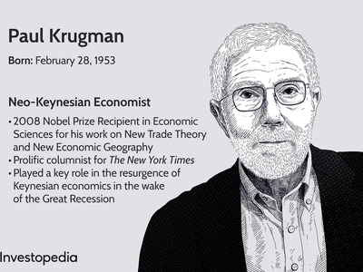

Paul Krugman, a Nobel laureate in Economics, is widely recognized for his significant contributions to economic theory and his insightful commentary on financial markets. Over the years, Krugman has been an outspoken critic of Bitcoin and cryptocurrencies, fundamentally questioning their place and utility within the economic framework. His skepticism is primarily anchored in the belief that these digital assets lack intrinsic economic value and utility. 

Krugman's views extend beyond mere skepticism of cryptocurrencies as investment vehicles; he challenges their purported transformative potential in the global financial system. He argues that the valuations of cryptocurrencies like Bitcoin are excessively speculative, akin to bubbles that can lead to financial instability. This perspective aligns with his broader concerns about the rapid evolution of financial products and technologies, which he argues often outpace the adequate regulatory and institutional frameworks needed to ensure stability and security.

In examining Krugman's criticisms, this article will also consider his views on algorithmic trading and how these intersect with his thoughts on digital currencies and financial markets. The broader implications of his critique highlight essential discussions on the future of finance, particularly in balancing the allure of innovation with the imperative for regulation and stability.

## Table of Contents

## Krugman's Position on Bitcoin

Paul Krugman, a prominent economist and Nobel laureate, has consistently expressed skepticism about Bitcoin and other cryptocurrencies, arguing that they hold no substantive economic function or utility. He perceives these digital assets primarily as instruments of speculation, whose valuations are often not anchored in intrinsic value. Krugman observes that the value attributed to Bitcoin and similar cryptocurrencies is driven more by market sentiment and speculative demand than by any tangible or inherent utility. This phenomenon, he suggests, results in extreme volatility and unpredictability, raising concerns about the stability of these digital currencies as investment vehicles or financial tools.

Krugman is particularly critical of the lack of regulatory oversight in the cryptocurrency market. The decentralized nature of cryptocurrencies, while touted as a feature that promotes financial independence and freedom, presents significant regulatory challenges and risks. Krugman argues that this absence of regulation can lead to economic instability and may allow for financial activities that would traditionally be deemed risky or illegal in regulated markets. Furthermore, he warns about the potential for cryptocurrencies to disrupt existing financial systems, possibly leading to adverse economic consequences if adequate regulatory measures are not implemented.

The economist's critique extends to the broader financial implications of widespread cryptocurrency adoption. He questions the feasibility and desirability of integrating these digital currencies into the mainstream financial system. In Krugman's view, the speculative nature and regulatory challenges associated with cryptocurrencies outweigh any proposed benefits, casting doubt on their viability as sustainable economic instruments. His arguments reflect a cautious approach to the integration of novel financial technologies, underscoring the importance of regulation and stability within financial markets.

## Economic Justification and Critique

Paul Krugman's criticism of Bitcoin extends to its apparent regression of the monetary system, comparing it to an era when gold was the primary medium of exchange. He argues that cryptocurrencies, like Bitcoin, have not innovated but instead have taken a step back by attempting to replicate the historical gold standard, which most economists agree is inefficient due to its limitations on monetary policy flexibility and economic growth management. 

One of Krugman's core arguments against Bitcoin is its significant energy consumption, which arises from the computational effort required for mining and transaction verification. Bitcoin mining relies on a proof-of-work (PoW) protocol, which demands vast amounts of electricity. According to a study by the University of Cambridge, the annual energy consumption of Bitcoin mining exceeds that of entire countries, highlighting a notable environmental challenge (Cambridge Centre for Alternative Finance, 2021).

Krugman's skepticism extends to Bitcoin's potential to claim a substantial role within the economy. He contends that Bitcoin lacks intrinsic value and operational efficiency compared to established fiat currencies and financial systems. Cryptocurrencies, in his view, do not currently offer sufficient advantages over existing monetary systems to justify their widespread adoption. The [volatility](/wiki/volatility-trading-strategies) of Bitcoin's value further undermines its credibility as a stable store of value or a medium of exchange. The lack of a consistent pricing mechanism and the speculative nature of its value lead to considerable risks for investors and undermine the currency's long-term economic viability.

In conclusion, Krugman maintains that Bitcoin and similar cryptocurrencies have yet to illustrate any meaningful economic utility that would substantiate their existence over established financial systems. His critiques underline the technological and economic challenges that such digital assets face in achieving broader acceptance and sustainability.

## Algorithmic Trading and its Impact

Algorithmic trading has significantly changed the dynamics of financial markets by employing sophisticated computer algorithms to execute trades with remarkable speed and at an unprecedented scale. This modern trading tactic has become a central component of market operations, enhancing the capacity for efficient trade execution by minimizing human intervention. By analyzing large data sets and executing trades on slight market discrepancies, [algorithmic trading](/wiki/algorithmic-trading) contributes to increased [liquidity](/wiki/liquidity-risk-premium) and tighter spreads. These algorithms exploit market inefficiencies, making markets more efficient overall.

However, algorithmic trading is not without its critics, and concerns about its implications remain prevalent. Although Paul Krugman does not extensively critique algorithmic trading in his discussions, the use of technology-driven strategies in trading intersects with broader debates on financial innovation. One of the substantial concerns is the risk it poses in terms of market stability. The high-speed nature of algorithmic trading means that errors or unforeseen circumstances can lead to abrupt market disruptions, such as the well-documented flash crashes. A notable instance occurred on May 6, 2010, when the U.S. stock market experienced a rapid decline and recovery within minutes due to algorithmic trading activities. 

Market volatility is another area of concern as significant volumes of trades executed in fractions of a second can amplify price swings. While algorithmic trading can make markets more efficient in normal conditions, in periods of stress, the same algorithms might react to market signals in a way that exacerbates instability. Therefore, the technology requires robust risk management frameworks to prevent such episodes.

In essence, algorithmic trading exemplifies the dual nature of technological progress in financial markets: offering greater efficiency and operational capacity but also introducing new challenges and risks that need to be managed carefully. As such, the role of algorithmic trading in finance is emblematic of the ongoing dialogue about the balance between innovation and market stability.

## The Bubble Hypothesis

Paul Krugman, a noted economist, perceives Bitcoin as akin to a speculative bubble, a concept where asset prices significantly exceed their intrinsic value due to excessive market enthusiasm. This analogy stems from Bitcoin's rapid price surges, driven largely by speculative demand rather than tangible economic fundamentals. Such dynamics can lead to significant price volatility, as investor optimism can escalate prices swiftly, creating the illusion of sustained growth.

Krugman's bubble hypothesis implies that Bitcoin's market behavior is reminiscent of historical financial bubbles, such as the Dutch Tulip Mania of the 17th century or the more recent Dot-com bubble. In these scenarios, prices soared due to speculative fervor, only to crash dramatically once market sentiment shifted. Krugman warns that Bitcoin could follow a similar trajectory, wherein the exuberant valuations could eventually collapse, resulting in substantial financial losses for investors.

This viewpoint, however, is not universally accepted. Some economists and market participants argue that cryptocurrencies, including Bitcoin, represent a paradigm shift in finance, with the potential to redefine money and financial systems. Proponents highlight features such as decentralization, security, and the potential for increased financial inclusion, considering these as indicators of intrinsic value not captured by traditional financial metrics.

Despite the optimistic projections of [cryptocurrency](/wiki/cryptocurrency) advocates, Krugman's cautionary perspective serves as a reminder of the risks inherent in speculative markets. The debate between those who view cryptocurrencies as bubbles and those who see them as promising financial innovations continues, underscoring the complex and evolving nature of digital assets.

## Regulation and Financial Stability

Paul Krugman places significant emphasis on the necessity of regulation in the cryptocurrency market, contending that the lack of regulatory oversight heightens both risk and instability. This perspective is rooted in the fundamental differences between cryptocurrencies and traditional financial systems. In conventional systems, government institutions provide various guarantees and protections, such as deposit insurance and a regulatory framework designed to safeguard investors and maintain system stability. Cryptocurrencies, however, operate largely outside these traditional structures, which Krugman argues increases systemic risk.

He points to recent failures within the stablecoin market as a concrete example of the perils associated with inadequate regulatory oversight. Stablecoins are a type of cryptocurrency designed to maintain a stable value by pegging themselves to a reserve of assets, such as fiat currency. Despite their promises of stability, several prominent stablecoins have experienced significant volatility and, in some cases, have failed to maintain their pegs. These incidents underscore Krugman's concerns, illustrating how the absence of robust regulatory frameworks can lead to market instability and investor losses.

Krugman's arguments often intersect with broader discussions about the role of regulation in fostering financial stability, especially as financial technologies evolve. He views cryptocurrencies' high levels of speculative trading and price volatility as symptoms of a market that lacks the regulatory mechanisms to ensure participant protection and overall systemic stability. This calls for an urgent need to implement comprehensive regulations that could mitigate the risks associated with cryptocurrencies, enhance transparency, and safeguard investors. Such regulations could potentially prevent situations where significant market players collapse, causing widespread financial disruption and affecting broader economic stability.

## Critics and Advocates

While Paul Krugman's viewpoints on Bitcoin and cryptocurrencies have raised concerns and stirred debate, many individuals and organizations within the technology and finance sectors do not concur with his assessments. These proponents contend that cryptocurrencies hold substantial promise for transforming numerous aspects of the global financial landscape.

One of the primary arguments in favor of cryptocurrencies is their capacity to promote decentralization. Traditional financial systems often concentrate power within central banks and financial institutions, leaving consumers and smaller entities with limited influence. Cryptocurrencies, by design, offer a decentralized alternative where transactions are not mediated by central authorities but are instead governed by decentralized networks of computers. This decentralized nature challenges the conventional power dynamics and can lead to more distributed control over financial instruments.

In addition, advocates highlight the potential for cryptocurrencies to enhance financial inclusion. A significant portion of the world's population remains unbanked or underbanked, particularly in developing regions where access to traditional banking infrastructure is limited. Cryptocurrencies offer a means of bypassing these barriers, enabling individuals with internet access to participate in global financial markets. This could lead to more inclusive economic opportunities and the democratization of finance.

Despite these potential advantages, the debate persists on whether these benefits outweigh the risks that critics like Krugman have articulated. Skeptics point to the volatility of cryptocurrencies, which can lead to profound financial instability, as evidenced by severe market fluctuations. There are also concerns about the susceptibility of cryptocurrencies to fraud, cybercrime, and their use in illegal activities due to their pseudonymous nature.

Ultimately, the discourse surrounding cryptocurrencies involves a complex evaluation of risks and benefits. While Krugman emphasizes the necessity of regulation and caution, advocates for cryptocurrencies argue for a future of finance that embraces innovation and inclusivity. This ongoing dialogue reflects the rapid evolution of financial technologies and the need for thoughtful integration into existing systems.

## Conclusion

Paul Krugman's critical stance on Bitcoin and cryptocurrencies invites an ongoing, robust debate about the future of finance. His skepticism emphasizes the need for a comprehensive evaluation of the risks associated with emerging technologies in the financial sector. Krugman’s perspective urges stakeholders to carefully weigh the speculative nature and regulatory challenges that cryptocurrencies present. As financial markets continue to evolve, it is essential to balance innovation with stability, ensuring that technological advancements do not undermine financial security and economic function. This cautious approach promotes sustainable growth and mitigates potential threats posed by volatile digital assets. The dialogue fostered by Krugman’s critiques serves as a reminder of the complex interplay between technological innovation and traditional economic principles, underscoring the crucial role of informed decision-making in shaping the future of global finance.

## References & Further Reading

[1]: Cambridge Centre for Alternative Finance. (2021). ["Cambridge Bitcoin Electricity Consumption Index (CBECI)."](https://www.jbs.cam.ac.uk/2023/bitcoin-electricity-consumption/)

[2]: Krugman, P. (2013). ["Bitcoin Is Evil."](https://archive.nytimes.com/krugman.blogs.nytimes.com/2013/12/28/bitcoin-is-evil/) The New York Times.

[3]: O'Sullivan, D. (2019). ["Paul Krugman: The Nobel Economist Who Hates Bitcoin."](https://scholar.google.com/citations?user=D_Rebd0AAAAJ&hl=en) Decrypt.

[4]: Gandal, N., Hamrick, J. T., Moore, T., & Oberman, T. (2018). ["Price Manipulation in the Bitcoin Ecosystem."](https://www.sciencedirect.com/science/article/pii/S0304393217301666) The Quarterly Journal of Economics, 133(1), 151-211.

[5]: Shiller, R. J. (2015). ["Irrational Exuberance."](https://press.princeton.edu/books/paperback/9780691173122/irrational-exuberance) Princeton University Press.

[6]: Lewis, S. (2010). ["Flash Crash: The Impact of High Frequency Trading on an Electronic Market."](https://www.cftc.gov/sites/default/files/idc/groups/public/@economicanalysis/documents/file/oce_flashcrash0314.pdf) Wharton Research Scholars. 

[7]: Biais, B., Foucault, T., & Moinas, S. (2015). ["Equilibrium Bitcoin Pricing."](https://www.sciencedirect.com/science/article/abs/pii/S0304405X15000288) National Bureau of Economic Research.