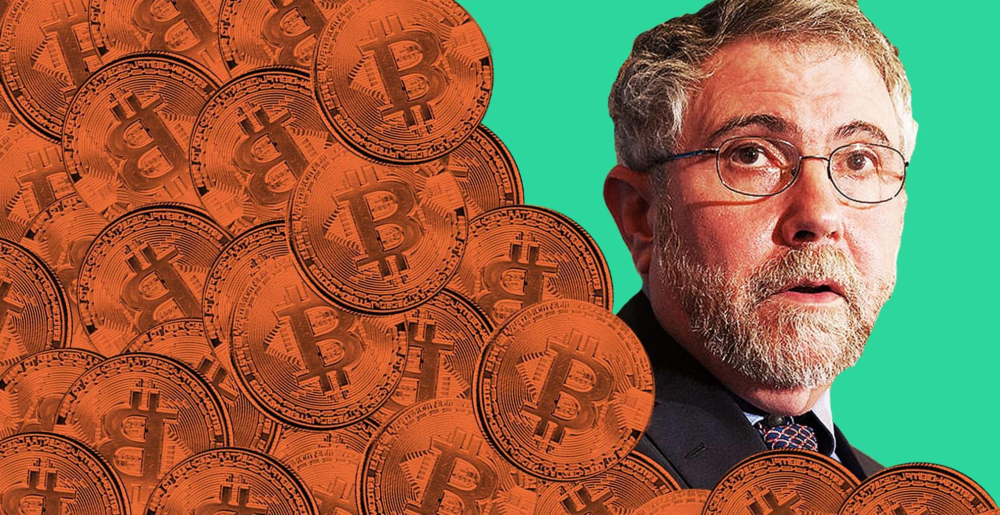

## Table of Contents

## Who is Paul Krugman?

Paul Krugman is an economist from the United States. He was born on February 28, 1953. He is famous for his work in international trade and economic geography. Krugman won the Nobel Prize in Economics in 2008 for his research on trade patterns and the location of economic activity. He has written many books and articles that help people understand economics better.

Besides being a researcher, Krugman is also a writer for The New York Times. He writes about economics and politics in his column. Many people read his articles because he explains complex ideas in a way that is easy to understand. Krugman often talks about important issues like unemployment, taxes, and government spending. He is known for his strong opinions and for challenging other economists' ideas.

## What is Bitcoin?

Bitcoin is a type of digital money that people can use to buy things online. It was created in 2009 by someone using the name Satoshi Nakamoto. Unlike regular money, Bitcoin is not controlled by a government or a bank. Instead, it uses a technology called blockchain, which is like a big, public record book that keeps track of all Bitcoin transactions. People can send and receive Bitcoins using special computer programs called wallets.

People often use Bitcoin to buy things on the internet, like games or gift cards. Some people also buy Bitcoin hoping its value will go up so they can sell it later for a profit. However, Bitcoin can be risky because its value can change a lot very quickly. It's important for people to be careful and learn about it before using it.

## What are Paul Krugman's main criticisms of Bitcoin?

Paul Krugman has been critical of Bitcoin for several reasons. He thinks Bitcoin is not a good way to store value because its price can change a lot very quickly. He says that Bitcoin is more like a speculative bubble than real money. This means people buy it hoping to sell it for more later, but it might not be worth anything in the end. Krugman also worries that Bitcoin can be used for illegal activities because it's hard to trace who is sending and receiving it.

Another point Krugman makes is that Bitcoin doesn't work well as a regular currency. He says it's not easy to use Bitcoin to buy things every day because not many places accept it. Also, the system that keeps Bitcoin running uses a lot of energy, which he thinks is bad for the environment. Krugman believes that instead of using Bitcoin, it's better to stick with regular money that governments and banks control because it's safer and more reliable.

## How does Krugman view Bitcoin's volatility?

Paul Krugman thinks Bitcoin is too risky because its price can go up and down a lot. He says this makes it a bad choice for keeping your money safe. If you save your money in Bitcoin, you might wake up one day and find out it's worth a lot less. This is why Krugman calls Bitcoin a speculative bubble. People buy it hoping to sell it later for more money, but it's not a safe way to store value.

Krugman also believes that Bitcoin's big price swings make it hard to use as regular money. If you want to buy something with Bitcoin, you might not know how much it will cost by the time you finish the transaction. This makes it difficult for people to use Bitcoin for everyday purchases. Krugman thinks that regular money, which is controlled by governments and banks, is a better choice because it's more stable and reliable.

## What does Krugman say about Bitcoin's use as a currency?

Paul Krugman thinks Bitcoin is not good to use as regular money. He says it's hard to use Bitcoin to buy things every day because not many places accept it. If you want to use Bitcoin to buy a coffee, you might find that the coffee shop doesn't take it. Also, if you try to buy something, the price in Bitcoin can change before you finish the transaction. This makes it confusing and hard to use Bitcoin for everyday purchases.

Krugman also believes that Bitcoin's big price changes make it even worse as a currency. If you save your money in Bitcoin, its value can go up and down a lot. This means you might not know how much your money is worth from one day to the next. Krugman thinks regular money, which is controlled by governments and banks, is better because it's more stable and reliable. He says Bitcoin is more like a risky bet than real money you can use every day.

## How does Krugman critique Bitcoin's energy consumption?

Paul Krugman thinks Bitcoin uses too much energy. He says the system that keeps Bitcoin running, called blockchain, needs a lot of computers working all the time. These computers use a lot of electricity, which is bad for the environment. Krugman believes that using so much energy just to keep Bitcoin going is not worth it.

Krugman also worries that the energy used for Bitcoin could be better spent on other things. He thinks it's a waste to use so much power on something that he sees as not very useful. Instead of spending energy on Bitcoin, Krugman believes we should use it for things that help people and the planet more.

## What is Krugman's opinion on Bitcoin's role in illegal activities?

Paul Krugman thinks Bitcoin can be used for illegal things because it's hard to track who is sending and receiving it. He says that because Bitcoin transactions are not easy to follow, people might use it to do things they shouldn't, like buying illegal stuff or hiding money. This makes him worried about Bitcoin being used for bad purposes.

Krugman believes that the anonymity of Bitcoin is a big problem. He thinks that if money is too hard to trace, it can help criminals. He feels that regular money, which is controlled by banks and governments, is better because it's easier to keep an eye on and stop illegal activities.

## How does Krugman compare Bitcoin to traditional financial systems?

Paul Krugman thinks Bitcoin is not as good as traditional financial systems. He says regular money, which is controlled by banks and governments, is safer and more reliable. With traditional money, you know how much your money is worth and it doesn't change a lot from day to day. This makes it easy to use for buying things and saving. Krugman believes that traditional financial systems are better because they are more stable and easier to keep track of.

Krugman also worries about Bitcoin's energy use and its role in illegal activities. He says the system that keeps Bitcoin running uses a lot of energy, which is bad for the environment. He thinks this energy could be used for better things. Also, because Bitcoin is hard to trace, Krugman believes it can be used for illegal stuff. He feels that traditional financial systems are better because they help stop illegal activities by making it easier to see where money is going.

## What are Krugman's thoughts on Bitcoin's scalability issues?

Paul Krugman thinks Bitcoin has big problems with growing bigger. He says the system that keeps Bitcoin running can't handle a lot of people using it at the same time. If too many people try to use Bitcoin, it can get slow and expensive. This makes it hard for Bitcoin to be used by everyone, like regular money.

Krugman believes that because of these problems, Bitcoin can't be a good choice for everyday money. He thinks regular money, which is controlled by banks and governments, works better because it can handle a lot of people using it without slowing down. Krugman feels that Bitcoin's issues with growing bigger are another reason why it's not as good as traditional financial systems.

## How has Krugman's stance on Bitcoin evolved over time?

Paul Krugman has been critical of Bitcoin for a long time. When Bitcoin first came out, Krugman thought it was a bad idea. He said it was too risky because its price could change a lot very quickly. He also worried that Bitcoin could be used for illegal things because it's hard to trace. Krugman thought Bitcoin was more like a gamble than real money you could use every day.

Over the years, Krugman's views on Bitcoin have stayed mostly the same. He still thinks Bitcoin uses too much energy and is not good for the environment. He also believes that Bitcoin's big price swings make it hard to use as regular money. Even though more people started using Bitcoin, Krugman still thinks it's not as good as traditional money controlled by banks and governments. He feels that Bitcoin's problems with growing bigger and being used for illegal activities are still big issues.

## What counterarguments have been made against Krugman's criticisms of Bitcoin?

Some people disagree with Paul Krugman's criticisms of Bitcoin. They say that Bitcoin's price changes a lot, but so do other things like stocks and gold. They believe that Bitcoin can be a good way to store value if you hold onto it for a long time. Also, some people think that Bitcoin can be used for regular money if more places start accepting it. They say that new technology like the Lightning Network can make Bitcoin faster and cheaper to use.

Others argue that Bitcoin's energy use is not as bad as Krugman thinks. They say that the energy used for Bitcoin can come from renewable sources like wind and solar power. They also believe that Bitcoin can help make the world's money system better by giving people more control over their money. Some people think that Bitcoin's privacy is good because it helps protect people's freedom. They say that while some might use Bitcoin for bad things, most people use it for good reasons like sending money to family or buying things online.

## How do Krugman's economic theories influence his views on Bitcoin?

Paul Krugman's economic theories focus a lot on how governments and big systems work. He believes that money should be stable and controlled by banks and governments. This is why he doesn't like Bitcoin. He thinks Bitcoin is too risky because its price can change a lot very quickly. Krugman also worries that Bitcoin can be used for illegal things because it's hard to trace. He believes that traditional money is better because it's safer and more reliable.

Krugman's ideas about how economies should work also make him think Bitcoin uses too much energy. He says the system that keeps Bitcoin running needs a lot of computers, which use a lot of electricity. This is bad for the environment, according to Krugman. He thinks the energy could be used for better things. Overall, Krugman's focus on stability, safety, and big systems makes him very critical of Bitcoin.

## References & Further Reading

[1]: Cambridge Centre for Alternative Finance. (2021). ["Cambridge Bitcoin Electricity Consumption Index (CBECI)."](https://www.jbs.cam.ac.uk/2023/bitcoin-electricity-consumption/)

[2]: Krugman, P. (2013). ["Bitcoin Is Evil."](https://archive.nytimes.com/krugman.blogs.nytimes.com/2013/12/28/bitcoin-is-evil/) The New York Times.

[3]: O'Sullivan, D. (2019). ["Paul Krugman: The Nobel Economist Who Hates Bitcoin."](https://scholar.google.com/citations?user=D_Rebd0AAAAJ&hl=en) Decrypt.

[4]: Gandal, N., Hamrick, J. T., Moore, T., & Oberman, T. (2018). ["Price Manipulation in the Bitcoin Ecosystem."](https://www.sciencedirect.com/science/article/pii/S0304393217301666) The Quarterly Journal of Economics, 133(1), 151-211.

[5]: Shiller, R. J. (2015). ["Irrational Exuberance."](https://press.princeton.edu/books/paperback/9780691173122/irrational-exuberance) Princeton University Press.

[6]: Lewis, S. (2010). ["Flash Crash: The Impact of High Frequency Trading on an Electronic Market."](https://www.cftc.gov/sites/default/files/idc/groups/public/@economicanalysis/documents/file/oce_flashcrash0314.pdf) Wharton Research Scholars. 

[7]: Biais, B., Foucault, T., & Moinas, S. (2015). ["Equilibrium Bitcoin Pricing."](https://www.sciencedirect.com/science/article/abs/pii/S0304405X15000288) National Bureau of Economic Research.