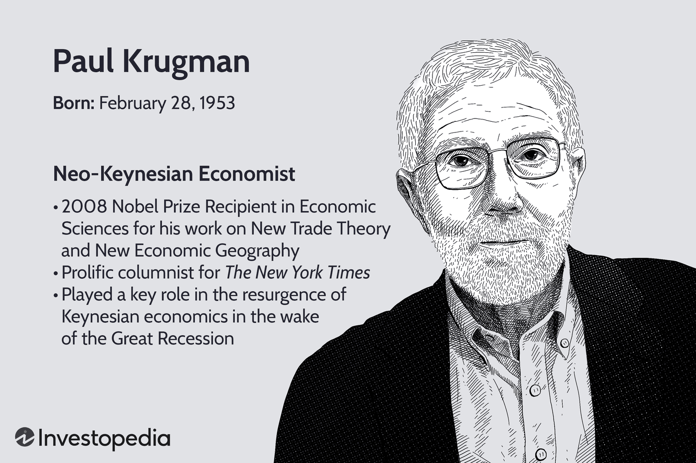

## Table of Contents

## Who is Paul Krugman?

Paul Krugman is an economist from the United States. He was born on February 28, 1953. He is famous for his work in international trade and economic geography. Krugman won the Nobel Prize in Economics in 2008 for his research on trade patterns and the location of economic activity. He has written many books and articles that help people understand economics better.

Besides being a researcher, Krugman is also a writer for The New York Times. He writes about economics and politics in his column. Many people read his articles because he explains complex ideas in a way that is easy to understand. Krugman often talks about important issues like unemployment, taxes, and government spending. He is known for his strong opinions and for challenging other economists' ideas.

## What is Paul Krugman's educational background?

Paul Krugman went to school at Yale University. He studied history there and got his bachelor's degree in 1974. After that, he decided to learn more about economics. He went to the Massachusetts Institute of Technology (MIT) for graduate school. At MIT, he worked hard and got his PhD in economics in 1977.

After finishing his PhD, Krugman kept learning and teaching. He became a professor at several big universities. He taught at Yale, MIT, and Princeton. At Princeton, he was a professor for a long time and helped many students learn about economics. He also worked at the London School of Economics for a while. All these places helped him grow as an economist and a teacher.

## What are some of Paul Krugman's most notable books?

Paul Krugman has written many [books](/wiki/algo-trading-books) that help people understand economics better. One of his most famous books is "The Return of Depression Economics and the Crisis of 2008." In this book, Krugman explains why the economy can sometimes get into big trouble, like during the Great Depression or the 2008 financial crisis. He uses simple words to talk about these big problems and what governments can do to fix them. Another important book by Krugman is "End This Depression Now!" Here, he talks about the economic problems after the 2008 crisis and what the government should do to help the economy recover faster.

Another well-known book by Krugman is "Peddling Prosperity: Economic Sense and Nonsense in an Age of Diminished Expectations." In this book, he looks at different economic ideas and explains which ones make sense and which ones do not. He also talks about how politicians sometimes use bad economic ideas to make promises they can't keep. Krugman's book "The Conscience of a Liberal" is also very popular. In it, he talks about how inequality in America grew over time and what can be done to make things fairer for everyone. These books show how Krugman uses his knowledge to help people understand big economic issues.

## What is Paul Krugman's role at The New York Times?

Paul Krugman writes a column for The New York Times. He started writing for them in 1999. His column is about economics and politics. He writes about big issues like unemployment, taxes, and government spending. Many people read his column because he explains hard ideas in a way that is easy to understand.

Krugman is known for his strong opinions. He often challenges other economists' ideas. He uses his column to talk about what he thinks the government should do to help the economy. His writing helps people think about important economic problems and what can be done to solve them.

## What economic theories is Paul Krugman known for?

Paul Krugman is well-known for his work on international trade and economic geography. One of his big ideas is the "New Trade Theory." This theory says that countries can benefit from trading even if they are not the best at making everything. It's because of things like economies of scale, where it's cheaper to make a lot of one thing. Krugman showed that this can lead to more trade and help countries grow their economies.

Another important idea from Krugman is about economic geography. He explained why businesses and people often group together in certain places. This is called "agglomeration." Krugman said that when businesses are close to each other, they can share resources and ideas, which helps them do better. This can make some places richer and more developed than others. His work on this helped people understand why cities and regions grow the way they do.

Krugman also talks a lot about how governments can help the economy. He believes that during tough times, like a recession, the government should spend more money to help people and businesses. This is called "fiscal policy." He thinks this can help the economy recover faster. Krugman often writes about these ideas in his columns and books, making them easier for everyone to understand.

## How has Paul Krugman contributed to the field of international trade?

Paul Krugman has made big contributions to international trade with his "New Trade Theory." This theory says that countries can benefit from trading even if they are not the best at making everything. Krugman showed that economies of scale, where it's cheaper to make a lot of one thing, can lead to more trade. This helps countries grow their economies. Before Krugman's work, people thought that trade was mostly about countries being good at different things. But Krugman's ideas changed how economists think about trade. His work helped explain why countries trade and how they can benefit from it, even if they are similar.

Krugman's work on international trade also helped explain why some countries have big trade imbalances. He showed that these imbalances can happen because of things like economies of scale and the way businesses group together. His ideas helped economists understand that trade is not just about what countries are good at, but also about how businesses work and where they are located. Krugman's research has been very important for understanding global trade and how it affects economies around the world.

## What are Paul Krugman's views on economic policy?

Paul Krugman believes that during tough economic times, like a recession, the government should spend more money to help people and businesses. He thinks this can help the economy recover faster. This idea is called "fiscal policy." Krugman often says that the government should not cut spending when the economy is weak because it can make things worse. Instead, he believes the government should use its money to create jobs and help people who are struggling.

Krugman also talks a lot about how the government should help reduce inequality. He thinks that rich people should pay more taxes so that the government can help everyone have a better life. He believes that too much inequality can hurt the economy and make it harder for people to get ahead. Krugman often writes about these ideas in his columns and books, trying to explain them in a way that everyone can understand.

## How has Paul Krugman influenced public policy?

Paul Krugman has influenced public policy a lot through his writing and research. He often writes about what the government should do to help the economy, especially during tough times like a recession. Krugman believes that the government should spend more money to create jobs and help people who are struggling. He has written many articles and books explaining these ideas in a way that is easy to understand. Because of this, many people, including politicians and policymakers, read his work and think about his ideas when making decisions.

Krugman's ideas about international trade have also affected public policy. His "New Trade Theory" helped people understand that countries can benefit from trading even if they are not the best at making everything. This has changed how governments think about trade agreements and policies. Krugman's work on economic geography has also influenced how cities and regions plan their development. His ideas about reducing inequality and using taxes to help everyone have a better life have been part of many policy discussions. Overall, Krugman's work has helped shape how governments around the world think about and make economic policies.

## What awards and recognitions has Paul Krugman received?

Paul Krugman has won many important awards for his work in economics. One of the biggest awards he got is the Nobel Prize in Economics in 2008. He won this prize for his research on trade patterns and where economic activity happens. This work helped people understand how countries trade and why some places grow faster than others. Krugman also won the John Bates Clark Medal in 1991. This award is given to economists under 40 who have made big contributions to the field. It shows how important his early work was.

Besides these big awards, Krugman has been recognized in other ways too. He has received many honorary degrees from different universities. These degrees show that other schools think his work is very important. Krugman has also been named one of the world's most influential people by Time magazine. This shows that his ideas about economics and public policy are important to many people around the world. His writing in The New York Times has also won him several awards for journalism, showing that he is good at explaining hard ideas in a way that everyone can understand.

## What controversies or criticisms has Paul Krugman faced?

Paul Krugman has faced some criticism for his strong opinions and the way he writes about economics. Some people think he is too political in his writing and that he does not always give a fair view of other economists' ideas. For example, some critics say Krugman can be too harsh when he disagrees with other economists. They think he should be more open to different ideas. Krugman's views on things like government spending and taxes also make some people upset. They argue that his ideas might not always be the best way to help the economy.

Another big controversy is about Krugman's predictions. Sometimes, his guesses about what will happen in the economy do not come true. For example, he once said the internet would not be a big deal for the economy, but it turned out to be very important. Critics use these mistakes to say that Krugman's ideas are not always right. Despite these criticisms, Krugman still has many people who like his work and think his ideas are helpful.

## How does Paul Krugman's work impact current economic debates?

Paul Krugman's work has a big impact on current economic debates because he talks about important issues in a way that many people can understand. He often writes about how the government should help the economy during tough times, like a recession. Krugman believes the government should spend more money to create jobs and help people who are struggling. This idea is called "fiscal policy." Many people, including politicians and policymakers, read his work and think about his ideas when making decisions. His views on government spending and taxes are often part of big debates about how to help the economy grow and make life better for everyone.

Krugman's ideas about international trade also affect current economic debates. His "New Trade Theory" helps people understand that countries can benefit from trading even if they are not the best at making everything. This has changed how governments think about trade agreements and policies. Krugman's work on economic geography also influences how cities and regions plan their development. His ideas about reducing inequality and using taxes to help everyone have a better life are often discussed in policy debates. Overall, Krugman's work helps shape how people think about and talk about economic issues today.

## What are some of the latest research topics Paul Krugman is exploring?

Paul Krugman is always working on new ideas in economics. One of the latest things he is looking at is how the economy is doing after the big changes caused by the COVID-19 pandemic. He is trying to understand how the government's actions, like spending a lot of money to help people and businesses, have affected the economy. Krugman is also thinking about how these changes might lead to more inflation, which is when prices go up a lot. He writes about these topics in his columns and talks about them in interviews, helping people understand what is happening and what might happen next.

Another topic Krugman is exploring is how technology and trade are changing the world. He is looking at how new technologies, like [artificial intelligence](/wiki/ai-artificial-intelligence) and automation, might change jobs and the economy. Krugman is also thinking about how trade between countries is changing and what this means for workers and businesses. He believes that understanding these changes can help governments make better policies to help everyone. Krugman's work on these topics helps people see the big picture and think about how to make the economy work better for everyone.

## References & Further Reading

[1]: Krugman, P. R. (1979). "Increasing Returns, Monopolistic Competition, and International Trade." Journal of International Economics, 9(4), 469-479.

[2]: Krugman, P. R. (1991). "Geography and Trade." MIT Press.

[3]: Lopez de Prado, M. (2018). ["Advances in Financial Machine Learning"](https://www.amazon.com/Advances-Financial-Machine-Learning-Marcos/dp/1119482089). Wiley.

[4]: Jansen, S. (2020). ["Machine Learning for Algorithmic Trading"](https://github.com/stefan-jansen/machine-learning-for-trading). Packt Publishing.

[5]: Dixit, A. K., & Stiglitz, J. E. (1977). "Monopolistic Competition and Optimum Product Diversity." The American Economic Review, 67(3), 297-308.

[6]: Chan, E. P. (2008). ["Quantitative Trading: How to Build Your Own Algorithmic Trading Business"](https://github.com/ftvision/quant_trading_echan_book). Wiley.