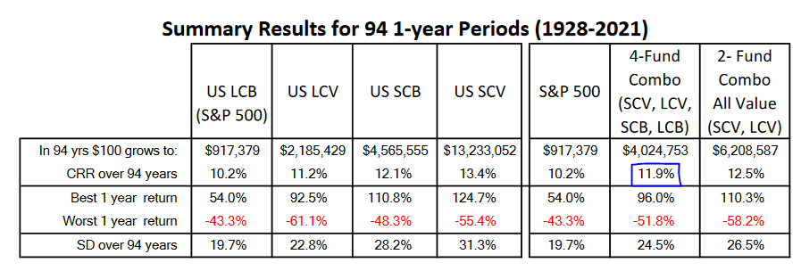

## Table of Contents

## What is the Paul Merriman 4-Fund Portfolio?

The Paul Merriman 4-Fund Portfolio is a simple investment strategy designed by Paul Merriman, a well-known financial educator. The portfolio is made up of four different types of low-cost index funds. These funds are chosen to provide a good balance between risk and reward. The idea is to spread your money across different kinds of investments to lower the risk of losing money.

The four funds in the portfolio are: a U.S. Total Stock Market fund, a U.S. Small Cap Value fund, an International Large Cap Value fund, and an International Small Cap Value fund. Each fund focuses on a different part of the market, which helps to diversify your investments. By investing in these four funds, you can aim for good long-term growth while keeping your risk at a reasonable level. This approach is great for people who want a simple way to invest without spending a lot of time managing their money.

## Who is Paul Merriman and why is his portfolio strategy significant?

Paul Merriman is a well-known financial expert and educator who has spent many years helping people learn how to invest their money wisely. He started a company called Merriman Financial Education, where he shares his knowledge through books, podcasts, and online resources. Paul believes in using simple and effective strategies to help people grow their wealth without taking on too much risk.

The Paul Merriman 4-Fund Portfolio is significant because it offers a straightforward way for people to invest in the stock market. By using just four low-cost index funds, this strategy helps spread the risk across different types of investments, which can lead to more stable and potentially higher returns over the long term. It's especially helpful for people who want to invest but don't want to spend a lot of time or have a lot of expertise in managing their money. This approach has made investing more accessible and less intimidating for many people.

## What are the four funds included in the Paul Merriman 4-Fund Portfolio?

The Paul Merriman 4-Fund Portfolio includes four different types of index funds. The first fund is a U.S. Total Stock Market fund, which invests in a broad range of stocks from big and small companies all over the United States. The second fund is a U.S. Small Cap Value fund, which focuses on smaller U.S. companies that are considered undervalued and have the potential for growth.

The third fund in the portfolio is an International Large Cap Value fund, which invests in big companies from countries outside the U.S. that are also seen as undervalued. The fourth and final fund is an International Small Cap Value fund, which targets smaller companies in other countries that are believed to be good investment opportunities. By combining these four funds, the portfolio aims to provide a balanced and diversified approach to investing.

## How does the Paul Merriman 4-Fund Portfolio aim to achieve diversification?

The Paul Merriman 4-Fund Portfolio aims to achieve diversification by spreading investments across different types of assets and markets. It includes a mix of U.S. and international stocks, as well as large and small companies. This helps to reduce the risk that comes from having all your money in just one kind of investment. If one part of the market does poorly, the other parts might do better, which can help balance out your overall returns.

By using four different index funds, the portfolio covers a wide range of the stock market. The U.S. Total Stock Market fund and the U.S. Small Cap Value fund focus on American companies, while the International Large Cap Value fund and the International Small Cap Value fund invest in companies from other countries. This global approach means that your investments are not just tied to how the U.S. economy is doing. Instead, you have a chance to benefit from growth in different parts of the world, making your investment strategy more robust and less likely to be hurt by problems in any one area.

## What are the benefits of using the Paul Merriman 4-Fund Portfolio for a beginner investor?

The Paul Merriman 4-Fund Portfolio is great for beginner investors because it's easy to understand and set up. You only need to pick four low-cost index funds, which means you don't have to spend a lot of time [picking](/wiki/asset-class-picking) individual stocks or worrying about high fees. This makes investing less scary and more manageable for someone just starting out. Plus, since the funds are spread across different parts of the market, it helps you not put all your eggs in one basket, which can make your investments safer.

Another benefit is that this portfolio can help you grow your money over the long term. By investing in a mix of U.S. and international stocks, and both big and small companies, you have a good chance of seeing your money grow steadily. The focus on value stocks, which are companies that might be undervalued, can also lead to higher returns. So, even if you're new to investing, the Paul Merriman 4-Fund Portfolio gives you a solid plan to build your wealth without needing to be an expert.

## How should one allocate their investments among the four funds in the portfolio?

To use the Paul Merriman 4-Fund Portfolio, you need to decide how much money to put into each of the four funds. A common way to do this is to split your money evenly between the four funds. So, if you have $10,000 to invest, you would put $2,500 into each fund. This equal split helps make sure your money is spread out across different types of investments, which can help reduce risk.

You don't have to stick to an equal split, though. You might decide to put a bit more money into one or two of the funds if you think they might do better in the future. But remember, trying to guess which funds will do the best can be tricky. Most people find it easier and safer to keep things simple by splitting their money evenly. This way, you don't have to worry about making the wrong guess, and you can still benefit from the growth of the whole market.

## What are the long-term performance expectations of the Paul Merriman 4-Fund Portfolio?

The Paul Merriman 4-Fund Portfolio aims to offer good long-term growth for investors. By spreading your money across four different types of low-cost index funds, it tries to balance risk and reward. Over many years, this portfolio is expected to grow steadily, though it won't be the fastest way to make money. It's designed to give you a chance to earn more than you would from just saving your money in a bank, but it's not about getting rich quickly. Instead, it's about growing your wealth over time in a safe and steady way.

The long-term performance of the portfolio depends a lot on how well the overall stock market does. Since it includes a mix of U.S. and international stocks, as well as big and small companies, it's meant to do well even if some parts of the market don't. Historically, this kind of diversified approach has helped investors see their money grow over the long term, even with ups and downs along the way. The key is to stick with it for many years, because the stock market can be unpredictable in the short term but tends to go up over longer periods.

## How does the Paul Merriman 4-Fund Portfolio compare to other investment strategies like the three-fund portfolio?

The Paul Merriman 4-Fund Portfolio and the three-fund portfolio are both simple ways to invest money, but they have some differences. The three-fund portfolio usually includes a total U.S. stock market fund, a total international stock market fund, and a total bond market fund. This approach spreads your money across the whole stock market and also adds some bonds for safety. The Paul Merriman 4-Fund Portfolio, on the other hand, focuses only on stocks and uses four specific funds: a U.S. Total Stock Market fund, a U.S. Small Cap Value fund, an International Large Cap Value fund, and an International Small Cap Value fund. This means the Merriman portfolio aims for more growth by focusing on value stocks, which are companies that might be undervalued and have a good chance to grow.

Both strategies aim to help you grow your money over time, but they do it in slightly different ways. The three-fund portfolio is simpler because it uses fewer funds and includes bonds, which can make it a bit safer. It's great for someone who wants a straightforward way to invest with a little less risk. The Paul Merriman 4-Fund Portfolio, however, might be better if you're okay with a bit more risk and are looking for potentially higher returns over the long term. By focusing on value stocks and not including bonds, it tries to beat the market's average performance. So, your choice between these two might depend on how much risk you're willing to take and what you hope to achieve with your investments.

## What are the tax implications of investing in the Paul Merriman 4-Fund Portfolio?

Investing in the Paul Merriman 4-Fund Portfolio can have tax implications that you should know about. When you invest in stocks through these funds, you might have to pay taxes on any profits you make. If you sell your shares in the funds for more than you paid for them, you'll have capital gains. These gains are taxed, and the tax rate depends on how long you held the shares. If you held them for less than a year, you'll pay a higher short-term capital gains tax. If you held them for more than a year, you'll pay a lower long-term capital gains tax.

Another thing to think about is that the funds themselves might pay out dividends, which are also taxable. These dividends can come from the earnings of the companies the funds invest in. You'll need to report these dividends on your tax return and pay taxes on them. If you're investing in a regular taxable account, these tax rules apply. But if you're using a tax-advantaged account like an IRA or a 401(k), you might not have to worry about these taxes right away, since those accounts have different rules about when you pay taxes on your investments.

## How often should an investor rebalance their holdings in the Paul Merriman 4-Fund Portfolio?

Rebalancing your investments in the Paul Merriman 4-Fund Portfolio means checking and adjusting them to make sure you still have the right amount of money in each fund. You might want to do this once a year. This helps keep your investments spread out the way you want them to be. Over time, some funds might grow faster than others, so rebalancing once a year can help you keep everything balanced.

It's not a big deal if you miss a year or decide to rebalance every six months instead. The important thing is to not let too much time go by without checking. If one fund gets way bigger than the others, it might be time to move some money around to get back to your original plan. Just remember, rebalancing is about keeping your investments in line with your goals, not about trying to guess which fund will do better next.

## What are the potential risks and drawbacks of the Paul Merriman 4-Fund Portfolio?

The Paul Merriman 4-Fund Portfolio, like any investment strategy, comes with some risks and drawbacks. One big risk is that it's all about stocks, which means it can go up and down a lot. If the stock market has a bad year, your portfolio might lose money. This can be tough if you need to take money out of your investments when the market is down. Also, since the portfolio doesn't include bonds or other safer investments, it might be riskier than other strategies that mix stocks with bonds.

Another drawback is that the portfolio needs you to stick with it for a long time. If you need your money soon, this might not be the best choice because the stock market can be unpredictable in the short term. Also, even though the portfolio uses low-cost index funds, you'll still have to pay some fees. These fees might seem small, but over many years, they can add up and eat into your returns. It's important to think about these things before you decide if this portfolio is right for you.

## How can an investor adjust the Paul Merriman 4-Fund Portfolio to suit their specific financial goals and risk tolerance?

If you want to adjust the Paul Merriman 4-Fund Portfolio to fit your own financial goals and how much risk you're okay with, you can change how much money you put into each of the four funds. For example, if you want to be a bit safer, you might decide to put more money into the U.S. Total Stock Market fund because it's less risky than the other funds. Or if you're looking for more growth and are willing to take more risk, you could put more money into the U.S. Small Cap Value fund or the International Small Cap Value fund. These funds focus on smaller companies that might grow a lot but are also riskier.

Another way to adjust the portfolio is to think about adding other types of investments, like bonds. Bonds can make your portfolio safer because they usually don't go up and down as much as stocks. You could take some money out of the stock funds and put it into a bond fund. This would make your overall investments less risky but might also mean your money grows a bit slower. It's all about finding the right balance that works for you. Talking to a financial advisor can also help you figure out the best way to adjust the portfolio to meet your specific needs.

## What is the Paul Merriman 4 Fund Portfolio and how does it work?

The Paul Merriman 4 Fund Portfolio is a structured investment model designed to simplify decision-making while seeking robust returns through diversified exposure to various market segments. This portfolio is characterized by equal allocations across four asset classes: S&P 500, Large Cap Value, Small Cap Blend, and Small Cap Value. Each component is carefully selected to capture distinct risk premiums, thereby enhancing overall portfolio diversification and potential return. 

Historically, small cap and value stocks have exhibited a propensity for delivering superior returns compared to their large cap and growth stock counterparts. This historical performance underscores the portfolio's strategic bias towards small cap and value equities. The inclusion of the S&P 500 ensures exposure to broad market trends and stability, while Large Cap Value targets established companies trading at lower valuations, aiming to exploit potential undervaluation.

The portfolio is often categorized as a 'lazy portfolio'. This classification reflects its design for minimal intervention and long-term holding, thereby reducing the need for frequent trading and alignment with a buy-and-hold investment philosophy. Such an approach focuses on maintaining fixed allocations, which aligns well with the principles of passive investing.

Merriman constructed this portfolio to leverage well-documented size and value factors for potential market outperformance. The size [factor](/wiki/factor-investing) refers to the historical tendency for small cap stocks to outperform large cap stocks, albeit with higher [volatility](/wiki/volatility-trading-strategies). Value factor investing typically involves selecting stocks with lower price-to-earnings or price-to-book ratios, often resulting in better performance over the long term. These factors are central to the Fama-French Three-Factor Model, which enhances the Capital Asset Pricing Model (CAPM) by incorporating size and value factors alongside market risk to explain stock returns better. 

The formula representing the expected return for a portfolio in the Fama-French Three-Factor Model is:

$$
E(R_i) = R_f + \beta_i (E(R_m) - R_f) + s_i \times SMB + h_i \times HML
$$

Where:
- $E(R_i)$ is the expected return of the portfolio.
- $R_f$ is the risk-free rate.
- $\beta_i$ is the portfolio's beta, representing its sensitivity to market movements.
- $E(R_m)$ is the expected market return.
- $SMB$ (Small Minus Big) represents the size premium.
- $HML$ (High Minus Low) represents the value premium.
- $s_i$ and $h_i$ are the factor loadings for size and value, respectively.

By integrating these factors, the Paul Merriman 4 Fund Portfolio seeks consistent market outperformance over time. However, investors must be aware that its effectiveness can vary depending on market conditions, particularly during periods unfavorable to small cap or value strategies. Nonetheless, the 4 Fund Portfolio remains a compelling choice for investors seeking systematic exposure to proven investment factors and long-term financial growth.

## References & Further Reading

[1]: Fama, E. F., & French, K. R. (1993). ["Common risk factors in the returns on stocks and bonds."](https://people.hec.edu/rosu/wp-content/uploads/sites/43/2023/09/Fama-French-Common-risk-factors-1993.pdf) Journal of Financial Economics, 33(1), 3-56.

[2]: Pardo, R. (2008). ["The Evaluation and Optimization of Trading Strategies."](https://onlinelibrary.wiley.com/doi/book/10.1002/9781119196969) Wiley.

[3]: Merriman, P. ["Ultimate Buy and Hold Strategy."](https://www.paulmerriman.com/ultimate-buy-and-hold-strategy) Paul Merriman Finance.

[4]: Narang, R. K. (2013). ["Inside the Black Box: A Simple Guide to Quantitative and High Frequency Trading."](https://onlinelibrary.wiley.com/doi/book/10.1002/9781118662717) Wiley.

[5]: Lo, A. W. (2014). ["Adaptive Markets: Financial Evolution at the Speed of Thought."](https://www.jstor.org/stable/j.ctvc77k3n) Princeton University Press.