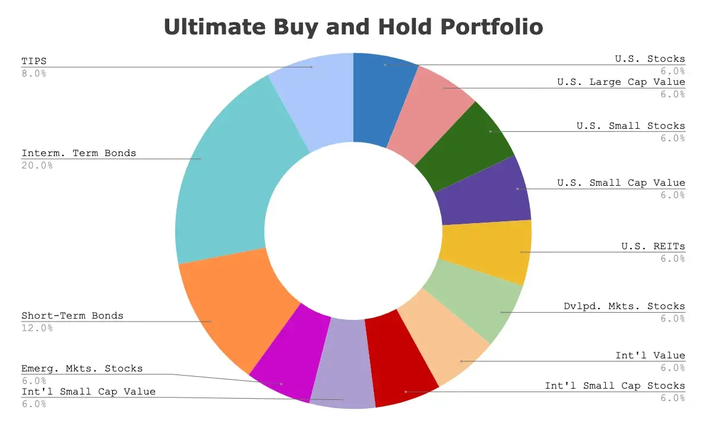

## Table of Contents

## What is the Paul Merriman Ultimate Buy-and-Hold Portfolio?

The Paul Merriman Ultimate Buy-and-Hold Portfolio is an investment strategy designed by Paul Merriman, a well-known financial advisor. The portfolio aims to provide long-term growth with a diversified mix of assets. It includes a combination of stock and bond funds, spread across different asset classes and geographic regions. The idea is to buy these funds and hold them for a long time, without trying to time the market or make frequent changes.

This portfolio is meant to be simple and easy to manage. It's designed for investors who want a set-it-and-forget-it approach. The portfolio typically includes a mix of U.S. and international stocks, as well as bonds, to spread out risk. By holding a wide range of assets, the portfolio aims to capture growth from different parts of the market while reducing the impact of any single investment's poor performance.

## Who is Paul Merriman and why is his portfolio strategy significant?

Paul Merriman is a financial advisor who has helped many people with their investments. He started a company called Merriman Financial Education to teach people about money and investing. He is known for making investing easy to understand and for creating investment strategies that work well over a long time.

His Ultimate Buy-and-Hold Portfolio is significant because it helps people invest without having to watch the market all the time. This portfolio is made up of different types of investments, like stocks and bonds from the U.S. and other countries. By spreading out the investments, it reduces the risk and can help people's money grow over many years. This strategy is important because it shows that you don't need to be an expert to invest wisely; you just need a good plan and patience.

## What are the key components of the Ultimate Buy-and-Hold Portfolio?

The Ultimate Buy-and-Hold Portfolio by Paul Merriman is made up of a mix of different investments. It includes stocks from the U.S. and other countries, as well as bonds. The idea is to spread out the money across many different types of investments so that if one does badly, the others can help balance it out. This way, the portfolio is less risky because it's not all in one place.

The portfolio is designed to be easy to manage. You buy the investments and then hold onto them for a long time, without trying to guess when to buy or sell. This makes it a good choice for people who don't want to spend a lot of time watching the market. By keeping things simple and holding onto a diverse set of investments, the portfolio aims to grow steadily over many years.

## How does the portfolio allocate assets among different asset classes?

The Ultimate Buy-and-Hold Portfolio by Paul Merriman spreads your money across different types of investments. It includes stocks from the U.S. and other countries, as well as bonds. The idea is to have a mix of these investments so that if one type does not do well, the others can help balance it out. This way, the portfolio is less risky because it's not all in one place.

The portfolio is split into equal parts among different asset classes. For example, it might have an equal amount in U.S. stocks, international stocks, and bonds. This equal split helps make sure that the portfolio is well-rounded and can grow steadily over time. By keeping things simple and holding onto a diverse set of investments, the portfolio aims to grow steadily over many years without needing a lot of changes.

## What is the rationale behind the specific asset allocation in Merriman's portfolio?

The specific asset allocation in Paul Merriman's Ultimate Buy-and-Hold Portfolio is designed to spread out risk and capture growth from different parts of the market. By splitting the portfolio equally among U.S. stocks, international stocks, and bonds, it aims to balance the potential for high returns with the safety of more stable investments. This equal split means that no single type of investment can hurt the portfolio too much if it does badly. Instead, the other parts of the portfolio can help keep things steady.

The reason for choosing this mix is to make investing simple and effective for people who don't want to watch the market all the time. By holding a diverse set of investments, the portfolio can grow over many years without needing a lot of changes. This approach helps people who want to invest without becoming experts in the market. It's all about having a plan that works well over the long term and doesn't need constant attention.

## How does the Ultimate Buy-and-Hold Portfolio perform compared to traditional investment strategies?

The Ultimate Buy-and-Hold Portfolio by Paul Merriman often performs well compared to traditional investment strategies because it's designed to be simple and effective over the long term. Traditional strategies might involve trying to time the market or picking individual stocks, which can be risky and require a lot of attention. In contrast, Merriman's portfolio spreads investments across different types of assets, like U.S. stocks, international stocks, and bonds. This diversification helps reduce risk and can lead to steady growth over many years without needing constant adjustments.

Studies and historical data have shown that the Ultimate Buy-and-Hold Portfolio can match or even beat many traditional strategies over long periods. For example, it might not have the highest returns in a single year, but over 10 or 20 years, it often does better than strategies that try to beat the market. This is because it's less affected by short-term market ups and downs. By sticking to a simple, diversified plan, investors can see their money grow steadily without the stress of trying to predict market movements.

## What are the potential risks and benefits of using the Ultimate Buy-and-Hold Portfolio?

The Ultimate Buy-and-Hold Portfolio by Paul Merriman has several benefits. It's easy to understand and manage because you buy a mix of investments and then hold onto them for a long time. This means you don't need to watch the market every day or try to guess when to buy or sell. By spreading your money across different types of investments like U.S. stocks, international stocks, and bonds, the portfolio can grow steadily over many years. This approach helps reduce the risk because if one type of investment does badly, the others can help balance it out. Over the long term, this portfolio can match or even beat many other investment strategies.

However, there are also some risks to consider. Even though the portfolio is diversified, the value of your investments can still go up and down. If the market has a big drop, it could take a while for your portfolio to recover. Also, because you're holding onto your investments for a long time, you might miss out on short-term opportunities to make more money. Another risk is that the equal split among different asset classes might not always be the best choice, depending on how the market is doing. But for people who want a simple and effective way to invest without a lot of hassle, the benefits of the Ultimate Buy-and-Hold Portfolio often outweigh these risks.

## How can someone start implementing the Ultimate Buy-and-Hold Portfolio?

To start implementing the Ultimate Buy-and-Hold Portfolio, you first need to decide how much money you want to invest. Once you have that figured out, you can split your money equally into three parts: U.S. stocks, international stocks, and bonds. You can do this by buying low-cost index funds or ETFs that track these different types of investments. For U.S. stocks, you might choose an S&P 500 index fund. For international stocks, you could pick a fund that covers stocks from around the world. And for bonds, a total bond market fund would work well. Once you've bought these funds, you just hold onto them for a long time without making many changes.

After you've set up your portfolio, it's important to check it once in a while to make sure it's still split evenly among the three types of investments. If one part has grown more than the others, you might need to sell some of it and buy more of the other parts to keep things balanced. This is called rebalancing, and it helps keep your portfolio working the way it should. Remember, the key to this strategy is to be patient and not worry too much about short-term changes in the market. Over many years, this simple approach can help your money grow steadily.

## What are the long-term considerations for maintaining the Ultimate Buy-and-Hold Portfolio?

The long-term considerations for maintaining the Ultimate Buy-and-Hold Portfolio are all about sticking to the plan and keeping things balanced. You need to be patient because this portfolio is meant to grow over many years, not just a few months. It's important not to get worried if the market goes up and down because the goal is to do well over the long term. Every now and then, you should check to make sure your money is still split evenly between U.S. stocks, international stocks, and bonds. If one part has grown more than the others, you might need to sell some of it and buy more of the other parts to keep things balanced. This is called rebalancing, and it helps keep your portfolio working the way it should.

Another thing to think about is how your needs might change over time. As you get closer to needing the money, like for retirement, you might want to shift some of your investments from stocks to bonds because bonds are usually safer. But even then, you should still keep some money in stocks to help your portfolio grow. It's also a good idea to keep learning about investing and the economy so you can make smart choices if you need to make any changes to your portfolio. The key is to keep things simple and stick to the plan, and over the long term, the Ultimate Buy-and-Hold Portfolio can help your money grow steadily.

## How should one rebalance the portfolio, and what are the best practices for doing so?

Rebalancing the Ultimate Buy-and-Hold Portfolio means making sure your money is still split evenly between U.S. stocks, international stocks, and bonds. Over time, some parts of your portfolio might grow more than others. For example, if your U.S. stocks have done really well, they might now be a bigger part of your portfolio than you want. To fix this, you would sell some of your U.S. stocks and use that money to buy more international stocks and bonds. This helps keep your portfolio balanced and working the way it should.

The best way to rebalance is to do it once a year or whenever your portfolio gets too far out of balance. A good rule is to rebalance if any part of your portfolio is more than 5% away from where it should be. For example, if U.S. stocks are supposed to be 33% of your portfolio but they're now 38%, it's time to rebalance. When you rebalance, try to keep things simple and don't make too many changes at once. Stick to the plan and remember that the goal is to keep your portfolio growing steadily over the long term.

## Can the Ultimate Buy-and-Hold Portfolio be customized for different investor profiles?

Yes, the Ultimate Buy-and-Hold Portfolio can be customized to fit different investor profiles. If you're someone who likes to take more risks for the chance of higher returns, you might want to put more money into stocks, both U.S. and international, and less into bonds. On the other hand, if you're more cautious and want to keep your money safer, you might choose to have a bigger part of your portfolio in bonds. You can also change the mix based on how close you are to needing the money. If you're many years away from retirement, you might keep more in stocks, but if you're getting close, you might shift more to bonds.

Customizing the portfolio also means thinking about your own goals and how much time you want to spend on managing your investments. If you don't want to spend a lot of time watching the market, you can stick to the simple equal split that Paul Merriman suggests. But if you're willing to do a bit more work, you can tweak the percentages to better fit your needs. For example, if you believe international markets will do better than U.S. markets in the future, you could put a bit more into international stocks. The key is to make sure any changes you make still keep your portfolio diverse and balanced, so it can grow steadily over time.

## What advanced strategies can be applied to enhance the performance of the Ultimate Buy-and-Hold Portfolio?

To enhance the performance of the Ultimate Buy-and-Hold Portfolio, you can use a strategy called tax-loss harvesting. This means selling investments that have lost value to get a tax break, and then buying similar investments to keep your portfolio balanced. This can help you save money on taxes and make your portfolio grow faster. Another advanced strategy is to use dollar-cost averaging, where you invest a fixed amount of money at regular times, like every month. This helps you buy more shares when prices are low and fewer when prices are high, which can lead to better long-term results.

You can also consider adding more types of investments to your portfolio, like real estate investment trusts (REITs) or commodities. These can help spread out your risk even more and might give you higher returns. Another idea is to use a strategy called tilting, where you put a bit more money into certain types of stocks, like small-cap or value stocks, which have been shown to do better over time. By using these advanced strategies, you can make your Ultimate Buy-and-Hold Portfolio work even better for you, but remember to keep things simple and stick to your long-term plan.

## References & Further Reading

[1]: Ferri, R. A. (2010). ["All About Asset Allocation."](https://rickferri.com/books/all-about-asset-allocation/) McGraw-Hill Education.

[2]: Swensen, D. F. (2009). ["Pioneering Portfolio Management: An Unconventional Approach to Institutional Investment."](https://books.google.com/books/about/Pioneering_Portfolio_Management.html?id=SbIz2gRbrF4C) Free Press.

[3]: Bogle, J. C. (2017). ["The Little Book of Common Sense Investing: The Only Way to Guarantee Your Fair Share of Stock Market Returns."](https://www.amazon.com/Little-Book-Common-Sense-Investing/dp/1119404509) Wiley.

[4]: Merriman, P. (2006). ["Live It Up Without Outliving Your Money!: Getting the Most From Your Investments in Retirement."](https://www.wiley.com/en-us/Live+It+Up+Without+Outliving+Your+Money%21%3A+Getting+the+Most+From+Your+Investments+in+Retirement%2C+Revised+and+Updated+Edition-p-9780470226506) Wiley.

[5]: ["Paul Merriman’s Ultimate Buy and Hold Portfolio Explained."](https://www.optimizedportfolio.com/ultimate-buy-and-hold-portfolio/) Paul Merriman's Official Website.

[6]: Zweig, J. (2003). ["Your Money and Your Brain: How the New Science of Neuroeconomics Can Help Make You Rich."](https://www.amazon.com/Your-Money-Brain-Science-Neuroeconomics/dp/0743276698) Simon & Schuster.

[7]: Bodie, Z., Kane, A., & Marcus, A. J. (2014). ["Investments."](https://www.mheducation.com/highered/product/investments-bodie-kane/M9781264412662.html) McGraw-Hill Education.

[8]: ["Algorithmic Trading and DMA: An Introduction to Direct Access Trading Strategies"](https://www.amazon.com/Algorithmic-Trading-DMA-introduction-strategies/dp/0956399207) by Barry Johnson