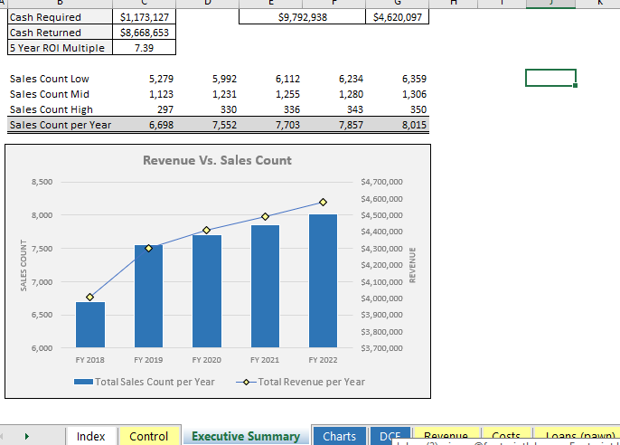

## Table of Contents

## What is a pawnshop and how does it operate?

A pawnshop is a store where people can get quick cash by giving the shop something valuable, like jewelry or electronics, as a promise to pay back the money later. This thing they give is called collateral. If the person pays back the money plus some extra called interest, they get their item back. If they don't pay back the money, the pawnshop can sell the item to someone else.

Pawnshops make money in two ways. First, they charge interest on the loans they give out. This means if you borrow $100, you might have to pay back $110 or more. Second, if people don't come back to pay their loans, the pawnshop can sell the items they left behind. This way, the pawnshop can still make money even if the original borrower doesn't return.

## What are the basic revenue streams for a pawnshop?

Pawnshops make money in two main ways. The first way is by charging interest on the loans they give out. When someone comes to a pawnshop and leaves something valuable as collateral, the pawnshop gives them a loan. In return, the person has to pay back the loan plus interest. This interest is like a fee for borrowing the money, and it's how pawnshops earn money from loans.

The second way pawnshops make money is by selling items that people don't come back to claim. If someone takes a loan and doesn't pay it back, the pawnshop keeps the item they left as collateral. Then, the pawnshop can sell this item to someone else. This way, even if the original borrower doesn't return, the pawnshop can still make money by selling the items they have.

## How does interest on loans contribute to a pawnshop's revenue?

When someone goes to a pawnshop and wants to borrow money, they leave something valuable, like a watch or a guitar, with the pawnshop. The pawnshop then gives them a loan, but they have to pay back more money than they borrowed. This extra money is called interest. The interest is like a fee for borrowing the money. Every time someone takes a loan and pays it back with interest, the pawnshop makes money. This is one of the main ways pawnshops earn their revenue.

For example, if someone borrows $100 from a pawnshop, they might have to pay back $110 or more. The extra $10 is the interest. The amount of interest can change depending on the pawnshop and how long it takes to pay back the loan. By charging interest on every loan, pawnshops can make a steady stream of income. This helps them keep their business running and profitable.

## What role do pawn fees play in a pawnshop's income?

Pawn fees are another way pawnshops make money. When someone wants to borrow money from a pawnshop, they might have to pay a fee just to get the loan. This fee is different from the interest they pay later. It's like a one-time charge for setting up the loan. This fee helps the pawnshop make money right away, even before the person starts paying back the loan with interest.

These fees can add up over time. If lots of people come to the pawnshop and take out loans, the pawnshop can make a good amount of money just from these fees. It's another way pawnshops can earn income besides the interest on loans and selling items that people don't come back to claim. By charging these fees, pawnshops can keep their business going and make sure they have enough money to operate.

## How can pawnshops generate revenue from selling unclaimed items?

When people don't come back to pay their loans, pawnshops keep the items they left behind. These items, like jewelry or electronics, become the pawnshop's property. The pawnshop can then sell these unclaimed items to other customers. This is a big way pawnshops make money. If a lot of people don't pay back their loans, the pawnshop can have many items to sell, which can bring in a lot of money.

Selling unclaimed items helps pawnshops in two ways. First, it gives them a way to make money even if the original borrower doesn't return. Second, it helps them keep their store stocked with new things to sell. People like to see new items in the store, so this can attract more customers. By selling these items, pawnshops can keep their business running smoothly and make a good profit.

## What are the typical profit margins on items sold in a pawnshop?

Profit margins in pawnshops can vary a lot depending on what they're selling and how much they paid for it. If a pawnshop gets an item as collateral and the original owner doesn't come back to claim it, the pawnshop can sell it for more than they would have gotten from the loan. For example, if they gave a $100 loan for a guitar and the owner didn't come back, they might sell the guitar for $200. That's a $100 profit, which is a 100% profit margin on the loan amount. But if they bought the guitar outright from someone, their profit margin might be less because they had to pay for it upfront.

On average, pawnshops might aim for a profit margin of around 30% to 50% on the items they sell. This means if they sell something for $100, they might have paid between $50 and $70 for it. The exact margin can change based on how much demand there is for the item, how much they paid for it, and how quickly they need to sell it. Sometimes, they might have to lower their prices to sell items faster, which can affect their profit margins.

## How do pawnshops assess the value of items to maximize revenue?

Pawnshops look at many things to figure out how much an item is worth. They check how much people want the item, how new it is, and if it's in good shape. They also look at what similar items are selling for in other places, like online or in other stores. This helps them decide how much to loan someone or how much to sell the item for if it's not claimed. By knowing the value, pawnshops can make sure they don't give too much money for an item that's not worth it, and they can also set a good price to sell it later.

To make more money, pawnshops try to buy items at a low price and sell them at a higher price. They might offer a lower loan amount for an item than what they think they can sell it for later. This way, if the person doesn't come back to get their item, the pawnshop can still make a good profit. They also keep an eye on what's popular and what's not, so they can adjust their prices to match what people are willing to pay. By doing this, pawnshops can make the most money from the items they have.

## What strategies can pawnshops use to attract more customers and increase revenue?

Pawnshops can attract more customers by making their stores look nice and welcoming. They can put up signs that are easy to see and make sure the inside of the store is clean and organized. It's also a good idea to have friendly staff who can help customers find what they need. By doing these things, people will feel more comfortable coming into the pawnshop and might be more likely to do business there. Another way to bring in more customers is by advertising. Pawnshops can use social media, local newspapers, or even radio ads to let people know about special deals or new items they have in the store.

To increase revenue, pawnshops can offer more services than just loans and selling items. For example, they could start repairing jewelry or electronics, which can bring in extra money. They can also buy items directly from people, not just take them as collateral for loans. This can help them get more items to sell and make more money. Another strategy is to keep a good mix of items in the store, so there's something for everyone. By having a variety of things like tools, musical instruments, and jewelry, pawnshops can attract different kinds of customers and sell more items.

Pawnshops can also use technology to help them make more money. They can set up a website where people can see what's in the store without coming in. This can attract customers who like to shop online. They can also use software to keep track of what items are selling well and what prices are working best. By using this information, pawnshops can make smart choices about what to buy and how much to charge, which can help them make more money.

## How does the location of a pawnshop affect its revenue potential?

The location of a pawnshop can really change how much money it makes. If a pawnshop is in a busy area where lots of people walk by, it can get more customers. Being close to places where people live or work can also help because it's easy for them to stop by. If the pawnshop is in a safe area, people might feel more comfortable coming in. All these things can make the pawnshop more popular and bring in more money.

On the other hand, if a pawnshop is in a quiet or hard-to-reach place, it might not get as many customers. If it's far away from where people live or work, they might not want to go there. Being in an area that's not safe can also scare people away. So, choosing the right spot is really important for a pawnshop to make a lot of money.

## What are the regulatory considerations that impact a pawnshop's revenue model?

Pawnshops have to follow rules set by the government, and these rules can change how much money they make. One big rule is about how much interest they can charge on loans. If the government says they can't charge too much interest, pawnshops might make less money from loans. They also have to keep good records of all the items they take in and sell. This can cost them time and money, which can affect their profits.

Another rule that impacts pawnshops is about how long they have to keep items before they can sell them. If they have to wait a long time, they might not be able to sell the items as quickly, which can hurt their income. Also, some places have rules about what kinds of items pawnshops can take in or sell. If they can't deal in certain popular items, like guns or high-end jewelry, it can limit how much money they can make. By understanding and following these rules, pawnshops can still find ways to make money, but they have to be careful and plan well.

## How can pawnshops leverage online platforms to enhance their revenue streams?

Pawnshops can use the internet to make more money by setting up a website where people can see what items they have for sale. This way, people who don't live close to the pawnshop can still buy things from them. They can also use social media to show off new items and special deals, which can attract more customers. By selling things online, pawnshops can reach more people and sell more items, which can help them make more money.

Another way pawnshops can use online platforms is by offering online loans. People can send pictures of their items and get a loan without coming into the store. This can bring in more customers who might not have time to visit the pawnshop in person. Pawnshops can also use online tools to keep track of what items are selling well and what prices work best. By using this information, they can make smart choices about what to buy and how much to charge, which can help them make more money.

## What advanced financial management techniques can pawnshops use to optimize their revenue models?

Pawnshops can use advanced financial management techniques to make more money by keeping a close eye on their cash flow. This means they need to know how much money is coming in from loans, interest, and selling items, and how much money is going out for things like rent, staff salaries, and buying new items. By using software to track all this, pawnshops can see where they might be losing money and make changes to save more. For example, if they see that they're spending too much on buying items that don't sell well, they can start buying different things that people want more.

Another way pawnshops can optimize their revenue is by using data analysis to understand their customers better. They can look at information about what kinds of items are popular, how much people are willing to pay for them, and when people are most likely to come into the store. With this information, pawnshops can set prices that make sense and offer special deals at the right times to attract more customers. By using these advanced techniques, pawnshops can make smarter decisions and increase their profits.

## References & Further Reading

[1]: Bergstra, J., Bardenet, R., Bengio, Y., & Kégl, B. (2011). ["Algorithms for Hyper-Parameter Optimization."](https://papers.nips.cc/paper/4443-algorithms-for-hyper-parameter-optimization) Advances in Neural Information Processing Systems 24.

[2]: ["Advances in Financial Machine Learning"](https://www.amazon.com/Advances-Financial-Machine-Learning-Marcos/dp/1119482089) by Marcos Lopez de Prado

[3]: ["Evidence-Based Technical Analysis: Applying the Scientific Method and Statistical Inference to Trading Signals"](https://www.amazon.com/Evidence-Based-Technical-Analysis-Scientific-Statistical/dp/0470008741) by David Aronson

[4]: ["Machine Learning for Algorithmic Trading"](https://github.com/stefan-jansen/machine-learning-for-trading) by Stefan Jansen

[5]: ["Quantitative Trading: How to Build Your Own Algorithmic Trading Business"](https://www.amazon.com/Quantitative-Trading-Build-Algorithmic-Business/dp/1119800064) by Ernest P. Chan