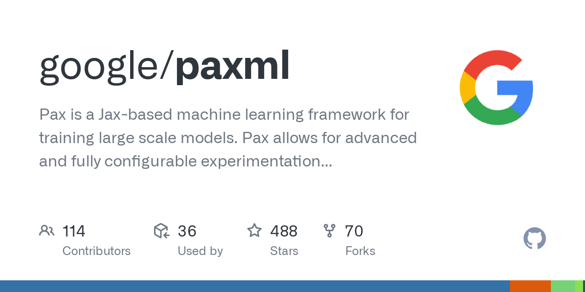

## Table of Contents

## What is Pax machine learning?

Pax is a machine learning framework developed by Google. It is designed to make it easier for researchers and engineers to build and experiment with different machine learning models. Pax is especially good at handling large and complex models, which are often used in areas like natural language processing and computer vision. It helps users to manage the training process and experiment with different model architectures more efficiently.

One key feature of Pax is its ability to scale across multiple machines and devices. This means that it can handle big data sets and perform computations quickly, which is important for training large models. Pax also supports a variety of model types and allows for easy customization, so users can tailor their models to specific tasks. Overall, Pax is a powerful tool that helps to speed up the development and deployment of machine learning solutions.

## Who developed Pax and why was it created?

Pax was developed by Google. The team at Google created Pax to help researchers and engineers build and test machine learning models more easily. Machine learning models can be very complex, especially when they are used for things like understanding language or recognizing images. Pax makes it simpler to manage these big models and run experiments to see how well they work.

One of the main reasons Pax was created is to handle large and complex models better. These models need a lot of data and computing power to train. Pax can use many computers at the same time to speed up this process. This is important because it helps researchers try out different ideas quickly and find the best model for their needs. By making it easier to work with big models, Pax helps Google and others develop new technologies faster.

## How does Pax differ from other machine learning frameworks?

Pax stands out from other [machine learning](/wiki/machine-learning) frameworks because it is specifically designed to handle very large and complex models. Many other frameworks can work with big models, but Pax makes it easier and faster. It does this by allowing the model training to be spread across many computers at the same time. This means that Pax can use a lot of computing power to train models quickly, which is important for tasks like understanding language or recognizing images. Other frameworks might not be as good at this, so researchers can experiment and find the best model faster with Pax.

Another way Pax differs is in its flexibility and ease of use. Pax allows users to easily change and customize their models. This means researchers can try out different ideas without having to start from scratch each time. Other frameworks might be more rigid and harder to change. Pax also supports a wide variety of model types, so it can be used for many different tasks. This makes it a versatile tool that can help speed up the development of new machine learning solutions.

## What are the key features of Pax that make it suitable for large-scale machine learning?

Pax is great for large-scale machine learning because it can spread the work across many computers at the same time. This means it can handle big models that need a lot of data and computing power to train. When you have a lot of computers working together, you can train these big models much faster. This is really important for tasks like understanding language or recognizing images, where the models can be very complex. Pax helps researchers try out different ideas quickly and find the best model for their needs.

Another key feature of Pax is that it's easy to use and flexible. You can change and customize your models easily without starting over. This means you can experiment a lot and try out different ideas without too much trouble. Pax also supports many different types of models, so you can use it for lots of different tasks. This makes it a very versatile tool that can help speed up the development of new machine learning solutions.

## Can you explain the architecture of Pax?

Pax's architecture is designed to handle large and complex machine learning models by spreading the workload across many computers. At its core, Pax uses a distributed training system, which means it can split the training process into smaller parts and run them on different machines at the same time. This makes training big models much faster because it can use a lot of computing power all at once. Pax also includes tools to manage these distributed systems, making sure everything works together smoothly and efficiently.

Another important part of Pax's architecture is its flexibility. It allows users to easily change and customize their models. This means you can experiment with different ideas without having to start from scratch each time. Pax supports a wide variety of model types, so you can use it for many different tasks. It also has a simple interface that makes it easy to set up and run experiments, even if you're working with very complex models. This combination of distributed computing power and flexibility makes Pax a powerful tool for large-scale machine learning.

## What types of models can be built using Pax?

Pax can be used to build many different types of machine learning models. It is especially good for big models that need a lot of data and computing power to train. You can use Pax to make models for understanding language, like those that can translate text from one language to another or answer questions. It is also great for models that recognize images, like those that can identify objects in pictures or videos. These models are often very complex, but Pax makes it easier to handle them.

Pax also supports models for other tasks, like predicting future events or making decisions. For example, you can use it to build models that predict how much a stock price will change or suggest the best next move in a game. These models can be customized to fit your specific needs, so you can try out different ideas and see what works best. With Pax, you can experiment with all these different types of models and find the one that works best for your project.

## How does Pax handle data processing and model training?

Pax handles data processing and model training by spreading the work across many computers. This means it can handle big models that need a lot of data and computing power. When you train a model, Pax splits the data into smaller parts and sends each part to a different computer. All these computers work together to train the model at the same time. This makes the training process much faster because it uses a lot of computing power all at once. Pax also has tools to make sure all these computers work together smoothly, so the training goes well.

Pax also makes it easy to process data and train models because it is flexible. You can change and customize your models easily without starting over. This means you can try out different ideas and see what works best. Pax supports many different types of models, so you can use it for lots of different tasks. Whether you're working with language, images, or other kinds of data, Pax can help you process it and train your models efficiently.

## What are the scalability features of Pax for distributed computing?

Pax is designed to handle big machine learning models by using many computers at the same time. This is called distributed computing. When you train a model with Pax, it splits the work into smaller parts and sends each part to a different computer. This way, all the computers can work together to train the model much faster. Pax has special tools that make sure all these computers work well together. This helps to make the training process smooth and efficient, even when you are working with a lot of data.

Pax also makes it easy to scale up your work. If you need to use more computers to train a bigger model or handle more data, Pax can do that without a lot of trouble. You can start with a few computers and then add more as you need them. This flexibility means you can keep working on your models and experiments without having to start over. Pax helps you use as much computing power as you need, making it a great tool for big machine learning projects.

## How can Pax be integrated with other tools and platforms?

Pax can be integrated with many other tools and platforms to help you build and train machine learning models. For example, you can use Pax with TensorFlow, another popular machine learning framework from Google. This lets you use TensorFlow's tools and libraries while taking advantage of Pax's ability to handle large models and spread the work across many computers. Pax also works well with data processing tools like Apache Beam, which helps you prepare and clean your data before feeding it into your models. By connecting Pax with these tools, you can create a powerful system for developing and testing your machine learning projects.

Another way to integrate Pax is with cloud platforms like Google Cloud or Amazon Web Services. These platforms provide a lot of computing power that you can use to train big models quickly. With Pax, you can easily set up your training jobs on these platforms and manage them without a lot of trouble. This makes it easier to scale your work up or down depending on what you need. By combining Pax with these platforms, you can take your machine learning projects to the next level and make them even more efficient.

## What are some real-world applications of Pax in industry?

Pax is used in many real-world industries to help with big machine learning projects. For example, in the tech industry, companies like Google use Pax to build and train models that can understand human language. These models help with things like translating languages or answering questions in search engines. Pax makes it easier to handle these big models because it can use many computers at the same time. This means the models can be trained faster and work better.

In the healthcare industry, Pax is used to create models that can look at medical images and help doctors find problems like cancer or other diseases. These models need a lot of data and computing power to train, and Pax helps by spreading the work across many computers. This makes it faster to train the models and get them ready to use in hospitals and clinics. By using Pax, healthcare workers can get help from machine learning to make better decisions about patient care.

## How can one optimize performance when using Pax for machine learning tasks?

To optimize performance when using Pax for machine learning tasks, you should first focus on how you use the computers. Pax can spread the work across many computers at the same time, so make sure you use as many computers as you need. If you have a big model or a lot of data, use more computers to train it faster. Also, make sure the computers are working well together. Pax has tools to help with this, so use them to keep the training process smooth and efficient.

Another way to optimize performance is to think about your model and data. Make sure your model is the right size for your task. If it's too big, it might take too long to train. If it's too small, it might not work well. You can use Pax's flexibility to try out different sizes and see what works best. Also, make sure your data is ready to use. Clean your data and organize it well before you start training. This can help the training go faster and make your model work better.

## What are the future developments and research directions for Pax?

The future of Pax looks bright with many exciting developments on the horizon. One of the main areas of focus is making Pax even easier to use. Researchers and engineers want to make it simpler for people to set up and run their experiments, so they can try out new ideas faster. They are also working on making Pax work better with other tools and platforms. This means you might see Pax being used more with things like cloud services, so you can use even more computing power to train your big models.

Another important direction for Pax is improving how it handles very big and complex models. Researchers are looking at ways to make training these models even faster and more efficient. They are also thinking about how to make Pax work well with new types of machine learning models that are being developed. This could mean using Pax for new tasks and solving new problems in areas like understanding language or recognizing images. By keeping up with these new developments, Pax can stay at the forefront of machine learning research and help people build even better models.

## References & Further Reading

[1]: Vaswani, A., Shazeer, N., Parmar, N., Uszkoreit, J., Jones, L., Gomez, A. N., Kaiser, Ł., & Polosukhin, I. (2017). ["Attention Is All You Need."](https://arxiv.org/abs/1706.03762) Advances in Neural Information Processing Systems, 30.

[2]: Abadi, M., Barham, P., Chen, J., Chen, Z., Davis, A., Dean, J., ... & Zheng, X. (2016). ["TensorFlow: A System for Large-Scale Machine Learning."](https://arxiv.org/abs/1603.04467) In 12th {USENIX} Symposium on Operating Systems Design and Implementation ({OSDI} 16).

[3]: Dean, J., Corrado, G., Monga, R., Chen, K., Devin, M., Le, Q. V., ... & Ng, A. Y. (2012). ["Large Scale Distributed Deep Networks."](https://dl.acm.org/doi/10.5555/2999134.2999271) Advances in Neural Information Processing Systems, 25.

[4]: Barham, P., Dragovic, B., Fraser, K., Hand, S., Harris, T., Ho, A., ... & Warfield, A. (2003). ["Xen and the Art of Virtualization."](https://www.cl.cam.ac.uk/research/srg/netos/papers/2003-xensosp.pdf) In ACM SIGOPS Operating Systems Review (Vol. 37, No. 5, pp. 164-177).

[5]: Zaharia, M., Chowdhury, M., Franklin, M. J., Shenker, S., & Stoica, I. (2010). ["Spark: Cluster Computing with Working Sets."](https://people.csail.mit.edu/matei/papers/2010/hotcloud_spark.pdf) HotCloud, 10(10-10), 95.

[6]: Chandramouli, B., Goldstein, J., Duan, S., Barga, R., Fiorino, D., Harper, R., ... & Huth, A. (2012). ["Trill: A High-Performance Incremental Query Processor for Diverse Analytics."](https://www.semanticscholar.org/paper/Scalable-Progressive-Analytics-on-Big-Data-in-the-Chandramouli-Goldstein/8c2b3407ee562315710847c6e603527aa91f8946) Proceedings of the VLDB Endowment, 8(4), 401-412.