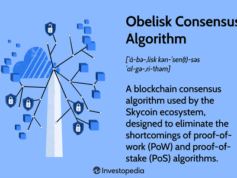

## Table of Contents

## What is the Paxos Consensus Algorithm?

The Paxos Consensus Algorithm is a way for computers in a network to agree on a single value or decision, even if some of the computers fail or send wrong information. It was invented by a man named Leslie Lamport in the late 1980s. Imagine you and your friends are trying to decide where to eat, but some of your friends might not show up or might suggest different places. Paxos helps everyone agree on one place, even with these challenges.

In Paxos, there are different roles for the computers, like proposers and acceptors. Proposers suggest values, and acceptors vote on these suggestions. If most acceptors agree on a value, that value is chosen. The process can be tricky because computers might fail or be slow, but Paxos has rules to handle these problems. For example, if a proposer doesn't hear back from enough acceptors, it might try again with a new proposal. This way, the system keeps trying until it reaches a consensus.

## Who developed the Paxos Consensus Algorithm and when?

The Paxos Consensus Algorithm was developed by Leslie Lamport. He came up with the idea in the late 1980s. Leslie Lamport is a computer scientist who has worked on many important ideas in computer science, and Paxos is one of his most famous inventions.

Paxos is a way for computers to agree on something, even if some computers fail or give wrong information. It's like a group of friends trying to decide where to eat, but some friends might not show up or might suggest different places. Paxos helps everyone agree on one place, even with these challenges.

## What problem does the Paxos algorithm aim to solve?

The Paxos algorithm aims to solve the problem of achieving consensus in a network of computers where some might fail or behave incorrectly. Imagine a group of friends trying to decide where to eat, but some friends might not show up or suggest different places. In a computer network, this is like trying to get all the computers to agree on one piece of information, but some computers might crash or send wrong messages. Paxos helps all the computers agree on a single value or decision, even with these challenges.

Paxos works by having different roles for the computers, like proposers and acceptors. Proposers suggest values, and acceptors vote on these suggestions. If most acceptors agree on a value, that value is chosen. The process can be tricky because computers might fail or be slow, but Paxos has rules to handle these problems. For example, if a proposer doesn't hear back from enough acceptors, it might try again with a new proposal. This way, the system keeps trying until it reaches a consensus.

## Can you explain the basic components of the Paxos algorithm?

The Paxos algorithm has a few basic parts that help computers in a network agree on something. There are proposers and acceptors. Proposers are like the ones who suggest ideas. They send out proposals to the acceptors. Acceptors are like voters. They get the proposals and vote on them. If most acceptors agree on a proposal, that proposal becomes the chosen value. This is how the computers reach a decision together.

Sometimes, things can go wrong. Computers might fail or be slow to respond. Paxos has rules to deal with these problems. If a proposer doesn't hear back from enough acceptors, it might try again with a new proposal. This keeps happening until enough acceptors agree on a value. This way, even if some computers are not working right, the network can still make a decision.

## How does the Paxos algorithm achieve consensus in a distributed system?

The Paxos algorithm helps computers in a network agree on a single value or decision, even if some computers fail or send wrong information. It does this by having different roles for the computers: proposers and acceptors. Proposers suggest values, and acceptors vote on these suggestions. If most acceptors agree on a value, that value is chosen. This process is like a group of friends trying to decide where to eat, but some friends might not show up or suggest different places. Paxos helps everyone agree on one place, even with these challenges.

In Paxos, if a proposer sends out a proposal and doesn't hear back from enough acceptors, it might try again with a new proposal. This keeps happening until enough acceptors agree on a value. This way, the system keeps trying until it reaches a consensus. Even if some computers are slow or fail, the network can still make a decision because Paxos has rules to handle these problems. It's all about making sure that, in the end, everyone agrees on the same thing.

## What are the different roles in the Paxos algorithm and their responsibilities?

In the Paxos algorithm, there are two main roles: proposers and acceptors. Proposers are like the ones who suggest ideas. They send out proposals to the acceptors. Their job is to keep trying until a proposal gets accepted. If they don't hear back from enough acceptors, they might try again with a new proposal. This keeps happening until enough acceptors agree on a value.

Acceptors are like voters. They get the proposals from the proposers and vote on them. If most acceptors agree on a proposal, that proposal becomes the chosen value. Their job is to make sure that the network reaches a decision. Even if some computers fail or are slow, acceptors help the system keep trying until it reaches a consensus. This way, everyone in the network agrees on the same thing.

## What is the difference between the Prepare and Accept phases in Paxos?

In the Paxos algorithm, the Prepare phase is like when a proposer wants to suggest a new idea but first checks if anyone else is already working on something. The proposer sends a "prepare" message to the acceptors, asking if they have promised to accept any other proposals yet. If the acceptors haven't promised anything, they tell the proposer they're ready to listen to new proposals. But if they have already promised to accept another proposal, they tell the proposer about that proposal. This helps the proposer know if it's safe to go ahead with its own suggestion.

The Accept phase comes after the Prepare phase. In this phase, the proposer sends an "accept" message to the acceptors with its proposed value. The acceptors then decide whether to accept this proposal. If most of the acceptors agree to accept the proposal, it becomes the chosen value. If not enough acceptors agree, or if they've already promised to accept a different proposal, the proposer might have to start over with a new proposal in the Prepare phase. This back-and-forth continues until a proposal gets enough votes to be accepted by the majority of the acceptors.

## How does Paxos handle failures and network partitions?

Paxos is designed to handle failures and network partitions in a smart way. When computers in a network fail or can't talk to each other because of a network split, Paxos keeps working. If a proposer doesn't hear back from enough acceptors, it knows something might be wrong. Instead of giving up, the proposer will try again with a new proposal. This means that even if some computers are down or not responding, the system keeps trying until it can get enough acceptors to agree on a value.

In a network partition, where the network splits into two or more groups that can't communicate, Paxos can still make progress. Each group of computers might try to reach a decision on their own. But, Paxos has rules to make sure that once the network comes back together, everyone agrees on the same value. If one group decided on a value before the other, the other group will learn about it and agree to that value. This way, even if the network splits and comes back together, Paxos ensures that all computers end up with the same decision.

## What are the common variations of the Paxos algorithm?

There are a few common variations of the Paxos algorithm that people use to make it work better for different situations. One variation is called Multi-Paxos. In Multi-Paxos, instead of choosing a new leader for each decision, one leader stays in charge for a bunch of decisions. This makes things faster because the leader doesn't have to be chosen again and again. Another variation is called Fast Paxos. In Fast Paxos, the system tries to make decisions faster by letting acceptors vote on proposals without waiting for a leader to tell them what to do. This can speed things up, but it's a bit more complicated to make sure everyone agrees on the same thing.

Another variation is called Cheap Paxos. In Cheap Paxos, the system tries to use fewer messages to reach a decision. This can save on network traffic and make the system more efficient. There's also a variation called Vertical Paxos. In Vertical Paxos, the system not only decides on a value but also decides on what actions to take based on that value. This makes it useful for systems where you need to decide and then do something about it right away. Each of these variations tries to make Paxos work better for different needs, like speed, efficiency, or handling specific tasks.

## Can you describe the Multi-Paxos optimization and its benefits?

Multi-Paxos is a way to make the Paxos algorithm faster and more efficient. In regular Paxos, every time you want to decide on something, you have to choose a new leader to suggest values. But in Multi-Paxos, once you pick a leader, that leader stays in charge for many decisions. This means you don't have to keep choosing new leaders, which saves time and makes the whole process quicker.

The main benefit of Multi-Paxos is that it speeds up the decision-making process. Because the same leader keeps suggesting values, the system can skip the part where it has to find a new leader for each decision. This makes Multi-Paxos great for situations where you need to make a lot of decisions quickly. It's like having one person in charge of a group project instead of picking a new leader for every task, which makes everything run smoother and faster.

## What are the limitations and challenges of implementing the Paxos algorithm?

Implementing the Paxos algorithm can be tricky because it's hard to understand and explain. Even though it helps computers agree on things, the rules can be confusing. Leslie Lamport, who invented Paxos, used a story about an imaginary Greek island to explain it, but many people still find it hard to get. This complexity can make it tough for programmers to write the code correctly, and small mistakes can cause big problems. Also, because Paxos needs a lot of back-and-forth between computers, it can slow down if the network is busy or if computers are slow to respond.

Another challenge is that Paxos can be slow in some situations. If computers fail or the network splits into parts that can't talk to each other, Paxos has to keep trying until it gets enough votes. This can take a long time, especially if the system is big or if failures happen a lot. Plus, Paxos assumes that most of the computers are working right, but if too many fail, it might not be able to reach a decision at all. So, while Paxos is good at handling some problems, it can struggle with others, and finding the right balance between speed and reliability can be tough.

## How does Paxos compare to other consensus algorithms like Raft?

Paxos and Raft are both ways to help computers in a network agree on things, but they do it a bit differently. Paxos is older and can be hard to understand because it has a lot of steps and rules. It's like trying to figure out a puzzle with many pieces. Raft, on the other hand, was made to be easier to understand and explain. It breaks down the process into simpler parts, like choosing a leader and then letting that leader decide things. This makes Raft easier for programmers to work with and less likely to have mistakes.

Both algorithms have their strengths and weaknesses. Paxos is good at handling failures and can keep working even if some computers stop responding. But it can be slow because it needs a lot of back-and-forth between computers. Raft is faster because it uses a leader to make decisions, but if the leader fails, it has to choose a new one, which can take time. Also, Raft might not handle some types of failures as well as Paxos. In the end, the choice between Paxos and Raft depends on what you need your system to do and how easy you want it to be to use and understand.

## References & Further Reading

[1]: Lamport, L. (1998). ["The Part-Time Parliament."](https://dl.acm.org/doi/10.1145/279227.279229) ACM Transactions on Computer Systems, 16(2), 133-169.

[2]: Chandra, T. D., Griesemer, R., & Redstone, J. (2007). ["Paxos Made Live - An Engineering Perspective."](https://read.seas.harvard.edu/~kohler/class/08w-dsi/chandra07paxos.pdf) Proceedings of the Twenty-Sixth Annual ACM Symposium on Principles of Distributed Computing.

[3]: Oki, B. M., & Liskov, B. H. (1988). ["Viewstamped Replication: A New Primary Copy Method to Support Highly-Available Distributed Systems."](https://www.semanticscholar.org/paper/Viewstamped-Replication%3A-A-New-Primary-Copy-Method-Oki-Liskov/6816c447cc4d3d945e0452564ff5d3220e1fdcab) MIT/LCS/TM-266.

[4]: Ongaro, D., & Ousterhout, J. (2014). ["In Search of an Understandable Consensus Algorithm (Extended Version)."](https://www.usenix.org/system/files/conference/atc14/atc14-paper-ongaro.pdf) USENIX Annual Technical Conference.

[5]: Castro, M., & Liskov, B. (1999). ["Practical Byzantine Fault Tolerance."](https://dl.acm.org/doi/10.5555/296806.296824) Proceedings of the Third Symposium on Operating Systems Design and Implementation (OSDI).